# Inspect the single-lineage model run on the liver data (007)

 Model attributes:

- sgRNA | gene varying intercept
- RNA and CN varying effects per gene
- correlation between gene varying effects modeled using the multivariate normal and Cholesky decomposition (non-centered parameterization)
- target gene mutation variable and cancer gene comutation variable.
- varying effect for cell line and varying copy number effect for cell line


```python
%load_ext autoreload
%autoreload 2
```


```python
from time import time

import arviz as az
import matplotlib.pyplot as plt
import numpy as np
import pandas as pd
import seaborn as sns
from IPython.display import Markdown, display
```


```python
from speclet.analysis.arviz_analysis import extract_coords_param_names
from speclet.bayesian_models.lineage_hierarchical_nb import LineageHierNegBinomModel
from speclet.data_processing.common import head_tail
from speclet.io import modeling_data_dir, models_dir
from speclet.managers.data_managers import CrisprScreenDataManager, broad_only
from speclet.plot import set_speclet_theme
from speclet.project_configuration import arviz_config
```


```python
# Notebook execution timer.
notebook_tic = time()

# Plotting setup.
set_speclet_theme()
%config InlineBackend.figure_format = "retina"
arviz_config()
```

## Data


```python
saved_model_dir = models_dir() / "hnb-single-lineage-liver-007_PYMC_NUMPYRO"
```


```python
with open(saved_model_dir / "description.txt") as f:
    model_description = "".join(list(f))

print(model_description)
```

    name: 'hnb-single-lineage-liver-007'
    fit method: 'PYMC_NUMPYRO'

    --------------------------------------------------------------------------------

    CONFIGURATION

    {
        "name": "hnb-single-lineage-liver-007",
        "description": " Single lineage hierarchical negative binomial model for liver data from the Broad. Varying effect for cell line and varying effect for copy number per cell line. This model also uses a different transformation for the copy number data. The `max_tree_depth` is also increased with the intention to give the tuning process a little more room to experiment with, but it should not be used as the tree depth for the final draws. ",
        "active": true,
        "model": "LINEAGE_HIERARCHICAL_NB",
        "data_file": "modeling_data/lineage-modeling-data/depmap-modeling-data_liver.csv",
        "model_kwargs": {
            "lineage": "liver",
            "min_frac_cancer_genes": 0.2
        },
        "sampling_kwargs": {
            "pymc_mcmc": null,
            "pymc_advi": null,
            "pymc_numpyro": {
                "draws": 1000,
                "tune": 1000,
                "chains": 4,
                "target_accept": 0.98,
                "progress_bar": true,
                "chain_method": "parallel",
                "postprocessing_backend": "cpu",
                "idata_kwargs": {
                    "log_likelihood": false
                },
                "nuts_kwargs": {
                    "step_size": 0.01,
                    "max_tree_depth": 12
                }
            }
        }
    }

    --------------------------------------------------------------------------------

    POSTERIOR

    <xarray.Dataset>
    Dimensions:                    (chain: 4, draw: 1000, delta_genes_dim_0: 5,
                                    delta_genes_dim_1: 18119, sgrna: 71062,
                                    delta_cells_dim_0: 2, delta_cells_dim_1: 22,
                                    genes_chol_cov_dim_0: 15,
                                    cells_chol_cov_dim_0: 3,
                                    genes_chol_cov_corr_dim_0: 5,
                                    genes_chol_cov_corr_dim_1: 5,
                                    genes_chol_cov_stds_dim_0: 5, cancer_gene: 1,
                                    gene: 18119, cells_chol_cov_corr_dim_0: 2,
                                    cells_chol_cov_corr_dim_1: 2,
                                    cells_chol_cov_stds_dim_0: 2, cell_line: 22)
    Coordinates: (12/18)
      * chain                      (chain) int64 0 1 2 3
      * draw                       (draw) int64 0 1 2 3 4 5 ... 995 996 997 998 999
      * delta_genes_dim_0          (delta_genes_dim_0) int64 0 1 2 3 4
      * delta_genes_dim_1          (delta_genes_dim_1) int64 0 1 2 ... 18117 18118
      * sgrna                      (sgrna) object 'AAAAAAATCCAGCAATGCAG' ... 'TTT...
      * delta_cells_dim_0          (delta_cells_dim_0) int64 0 1
        ...                         ...
      * cancer_gene                (cancer_gene) object 'AXIN1'
      * gene                       (gene) object 'A1BG' 'A1CF' ... 'ZZEF1' 'ZZZ3'
      * cells_chol_cov_corr_dim_0  (cells_chol_cov_corr_dim_0) int64 0 1
      * cells_chol_cov_corr_dim_1  (cells_chol_cov_corr_dim_1) int64 0 1
      * cells_chol_cov_stds_dim_0  (cells_chol_cov_stds_dim_0) int64 0 1
      * cell_line                  (cell_line) object 'ACH-000217' ... 'ACH-001318'
    Data variables: (12/29)
        mu_mu_a                    (chain, draw) float64 ...
        mu_b                       (chain, draw) float64 ...
        delta_genes                (chain, draw, delta_genes_dim_0, delta_genes_dim_1) float64 ...
        delta_a                    (chain, draw, sgrna) float64 ...
        mu_m                       (chain, draw) float64 ...
        delta_cells                (chain, draw, delta_cells_dim_0, delta_cells_dim_1) float64 ...
        ...                         ...
        cells_chol_cov_corr        (chain, draw, cells_chol_cov_corr_dim_0, cells_chol_cov_corr_dim_1) float64 ...
        cells_chol_cov_stds        (chain, draw, cells_chol_cov_stds_dim_0) float64 ...
        sigma_k                    (chain, draw) float64 ...
        sigma_m                    (chain, draw) float64 ...
        k                          (chain, draw, cell_line) float64 ...
        m                          (chain, draw, cell_line) float64 ...
    Attributes:
        created_at:           2022-08-04 19:19:46.290327
        arviz_version:        0.12.1
        previous_created_at:  ['2022-08-04 19:19:46.290327', '2022-08-04T16:55:58...

    --------------------------------------------------------------------------------

    SAMPLE STATS

    <xarray.Dataset>
    Dimensions:          (chain: 4, draw: 1000)
    Coordinates:
      * chain            (chain) int64 0 1 2 3
      * draw             (draw) int64 0 1 2 3 4 5 6 ... 993 994 995 996 997 998 999
    Data variables:
        acceptance_rate  (chain, draw) float64 ...
        step_size        (chain, draw) float64 ...
        diverging        (chain, draw) bool ...
        energy           (chain, draw) float64 ...
        n_steps          (chain, draw) int64 ...
        tree_depth       (chain, draw) int64 ...
        lp               (chain, draw) float64 ...
    Attributes:
        created_at:           2022-08-04 19:19:46.290327
        arviz_version:        0.12.1
        previous_created_at:  ['2022-08-04 19:19:46.290327', '2022-08-04T16:55:58...

    --------------------------------------------------------------------------------

    MCMC DESCRIPTION

    sampled 4 chains with (unknown) tuning steps and 1,000 draws
    num. divergences: 0, 0, 0, 0
    percent divergences: 0.0, 0.0, 0.0, 0.0
    BFMI: 0.657, 0.628, 0.721, 0.592
    avg. step size: 0.014, 0.012, 0.012, 0.013


### Load posterior summary


```python
liver_post_summary = pd.read_csv(saved_model_dir / "posterior-summary.csv").assign(
    var_name=lambda d: [x.split("[")[0] for x in d["parameter"]]
)
liver_post_summary.head()
```


<div>
<style scoped>
    .dataframe tbody tr th:only-of-type {
        vertical-align: middle;
    }

    .dataframe tbody tr th {
        vertical-align: top;
    }

    .dataframe thead th {
        text-align: right;
    }
</style>
<table border="1" class="dataframe">
  <thead>
    <tr style="text-align: right;">
      <th></th>
      <th>parameter</th>
      <th>mean</th>
      <th>sd</th>
      <th>hdi_5.5%</th>
      <th>hdi_94.5%</th>
      <th>mcse_mean</th>
      <th>mcse_sd</th>
      <th>ess_bulk</th>
      <th>ess_tail</th>
      <th>r_hat</th>
      <th>var_name</th>
    </tr>
  </thead>
  <tbody>
    <tr>
      <th>0</th>
      <td>mu_mu_a</td>
      <td>0.075</td>
      <td>0.008</td>
      <td>0.062</td>
      <td>0.088</td>
      <td>0.000</td>
      <td>0.000</td>
      <td>414.0</td>
      <td>730.0</td>
      <td>1.0</td>
      <td>mu_mu_a</td>
    </tr>
    <tr>
      <th>1</th>
      <td>mu_b</td>
      <td>0.001</td>
      <td>0.000</td>
      <td>0.001</td>
      <td>0.002</td>
      <td>0.000</td>
      <td>0.000</td>
      <td>3573.0</td>
      <td>3346.0</td>
      <td>1.0</td>
      <td>mu_b</td>
    </tr>
    <tr>
      <th>2</th>
      <td>mu_m</td>
      <td>-0.115</td>
      <td>0.027</td>
      <td>-0.158</td>
      <td>-0.072</td>
      <td>0.001</td>
      <td>0.001</td>
      <td>703.0</td>
      <td>1552.0</td>
      <td>1.0</td>
      <td>mu_m</td>
    </tr>
    <tr>
      <th>3</th>
      <td>sigma_a</td>
      <td>0.200</td>
      <td>0.001</td>
      <td>0.199</td>
      <td>0.201</td>
      <td>0.000</td>
      <td>0.000</td>
      <td>1351.0</td>
      <td>2085.0</td>
      <td>1.0</td>
      <td>sigma_a</td>
    </tr>
    <tr>
      <th>4</th>
      <td>alpha</td>
      <td>10.088</td>
      <td>0.013</td>
      <td>10.067</td>
      <td>10.107</td>
      <td>0.000</td>
      <td>0.000</td>
      <td>3889.0</td>
      <td>2661.0</td>
      <td>1.0</td>
      <td>alpha</td>
    </tr>
  </tbody>
</table>
</div>


### Load trace object


```python
trace_file = saved_model_dir / "posterior.netcdf"
assert trace_file.exists()
trace = az.from_netcdf(trace_file)
```

### liver data


```python
liver_dm = CrisprScreenDataManager(
    modeling_data_dir() / "lineage-modeling-data" / "depmap-modeling-data_liver.csv",
    transformations=[broad_only],
)
```


```python
liver_data = liver_dm.get_data(read_kwargs={"low_memory": False})
liver_data.head()
```


<div>
<style scoped>
    .dataframe tbody tr th:only-of-type {
        vertical-align: middle;
    }

    .dataframe tbody tr th {
        vertical-align: top;
    }

    .dataframe thead th {
        text-align: right;
    }
</style>
<table border="1" class="dataframe">
  <thead>
    <tr style="text-align: right;">
      <th></th>
      <th>sgrna</th>
      <th>replicate_id</th>
      <th>lfc</th>
      <th>p_dna_batch</th>
      <th>genome_alignment</th>
      <th>hugo_symbol</th>
      <th>screen</th>
      <th>multiple_hits_on_gene</th>
      <th>sgrna_target_chr</th>
      <th>sgrna_target_pos</th>
      <th>...</th>
      <th>any_deleterious</th>
      <th>any_tcga_hotspot</th>
      <th>any_cosmic_hotspot</th>
      <th>is_mutated</th>
      <th>copy_number</th>
      <th>lineage</th>
      <th>lineage_subtype</th>
      <th>primary_or_metastasis</th>
      <th>is_male</th>
      <th>age</th>
    </tr>
  </thead>
  <tbody>
    <tr>
      <th>0</th>
      <td>AAAGCCCAGGAGTATGGGAG</td>
      <td>JHH-6-311Cas9_RepA_p6_batch3</td>
      <td>0.561251</td>
      <td>3</td>
      <td>chr2_130522105_-</td>
      <td>CFC1B</td>
      <td>broad</td>
      <td>True</td>
      <td>2</td>
      <td>130522105</td>
      <td>...</td>
      <td>NaN</td>
      <td>NaN</td>
      <td>NaN</td>
      <td>False</td>
      <td>0.963953</td>
      <td>liver</td>
      <td>hepatocellular_carcinoma</td>
      <td>primary</td>
      <td>False</td>
      <td>57.0</td>
    </tr>
    <tr>
      <th>1</th>
      <td>AAATCAGAGAAACCTGAACG</td>
      <td>JHH-6-311Cas9_RepA_p6_batch3</td>
      <td>-0.407068</td>
      <td>3</td>
      <td>chr11_89916950_-</td>
      <td>TRIM49D1</td>
      <td>broad</td>
      <td>True</td>
      <td>11</td>
      <td>89916950</td>
      <td>...</td>
      <td>NaN</td>
      <td>NaN</td>
      <td>NaN</td>
      <td>False</td>
      <td>1.300097</td>
      <td>liver</td>
      <td>hepatocellular_carcinoma</td>
      <td>primary</td>
      <td>False</td>
      <td>57.0</td>
    </tr>
    <tr>
      <th>2</th>
      <td>AACGTCTTTGAAGAAAGCTG</td>
      <td>JHH-6-311Cas9_RepA_p6_batch3</td>
      <td>0.074256</td>
      <td>3</td>
      <td>chr5_71055421_-</td>
      <td>GTF2H2</td>
      <td>broad</td>
      <td>True</td>
      <td>5</td>
      <td>71055421</td>
      <td>...</td>
      <td>NaN</td>
      <td>NaN</td>
      <td>NaN</td>
      <td>False</td>
      <td>0.718530</td>
      <td>liver</td>
      <td>hepatocellular_carcinoma</td>
      <td>primary</td>
      <td>False</td>
      <td>57.0</td>
    </tr>
    <tr>
      <th>3</th>
      <td>AACGTCTTTGAAGGAAGCTG</td>
      <td>JHH-6-311Cas9_RepA_p6_batch3</td>
      <td>0.196487</td>
      <td>3</td>
      <td>chr5_69572480_+</td>
      <td>GTF2H2C</td>
      <td>broad</td>
      <td>True</td>
      <td>5</td>
      <td>69572480</td>
      <td>...</td>
      <td>NaN</td>
      <td>NaN</td>
      <td>NaN</td>
      <td>False</td>
      <td>0.718530</td>
      <td>liver</td>
      <td>hepatocellular_carcinoma</td>
      <td>primary</td>
      <td>False</td>
      <td>57.0</td>
    </tr>
    <tr>
      <th>4</th>
      <td>AAGAGGTTCCAGACTACTTA</td>
      <td>JHH-6-311Cas9_RepA_p6_batch3</td>
      <td>-0.018563</td>
      <td>3</td>
      <td>chrX_155898173_+</td>
      <td>VAMP7</td>
      <td>broad</td>
      <td>True</td>
      <td>X</td>
      <td>155898173</td>
      <td>...</td>
      <td>NaN</td>
      <td>NaN</td>
      <td>NaN</td>
      <td>False</td>
      <td>0.623693</td>
      <td>liver</td>
      <td>hepatocellular_carcinoma</td>
      <td>primary</td>
      <td>False</td>
      <td>57.0</td>
    </tr>
  </tbody>
</table>
<p>5 rows × 25 columns</p>
</div>


### Single lineage model


```python
liver_model = LineageHierNegBinomModel(lineage="liver", min_frac_cancer_genes=0.2)
```


```python
valid_liver_data = liver_model.data_processing_pipeline(liver_data.copy())
liver_mdl_data = liver_model.make_data_structure(valid_liver_data)
```

    [INFO] 2022-08-05 06:55:29 [(lineage_hierarchical_nb.py:data_processing_pipeline:274] Processing data for modeling.
    [INFO] 2022-08-05 06:55:29 [(lineage_hierarchical_nb.py:data_processing_pipeline:275] LFC limits: (-5.0, 5.0)
    [WARNING] 2022-08-05 06:57:10 [(lineage_hierarchical_nb.py:data_processing_pipeline:326] number of data points dropped: 58
    [INFO] 2022-08-05 06:57:11 [(lineage_hierarchical_nb.py:target_gene_is_mutated_vector:523] number of genes mutated in all cells lines: 0
    [DEBUG] 2022-08-05 06:57:11 [(lineage_hierarchical_nb.py:target_gene_is_mutated_vector:526] Genes always mutated:
    [INFO] 2022-08-05 06:57:12 [(lineage_hierarchical_nb.py:_trim_cancer_genes:579] Dropping 9 cancer genes.
    [DEBUG] 2022-08-05 06:57:12 [(lineage_hierarchical_nb.py:_trim_cancer_genes:580] Dropped cancer genes: ['APC', 'ARID1B', 'ARID2', 'AXIN2', 'CASP8', 'FAT4', 'HNF1A', 'IL6ST', 'SMAD2']


```python
liver_mdl_data.coords["cancer_gene"]
```


    ['AXIN1']


## Analysis


```python
sns.histplot(x=liver_post_summary["r_hat"], binwidth=0.01, stat="proportion");
```


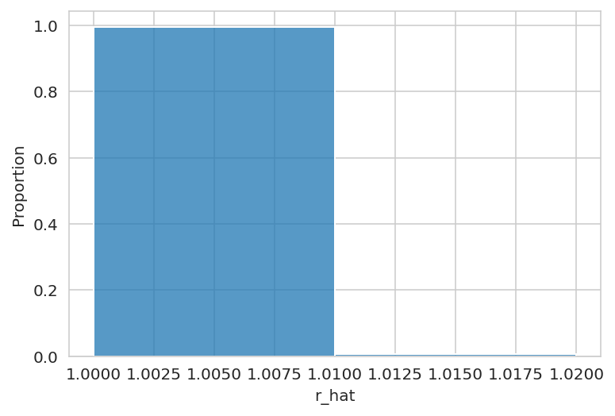


```python
fig, ax = plt.subplots(figsize=(8, 5))
sns.boxplot(data=liver_post_summary, x="var_name", y="r_hat", ax=ax)
ax.tick_params(rotation=90)
plt.show()
```


```python
az.plot_energy(trace);
```


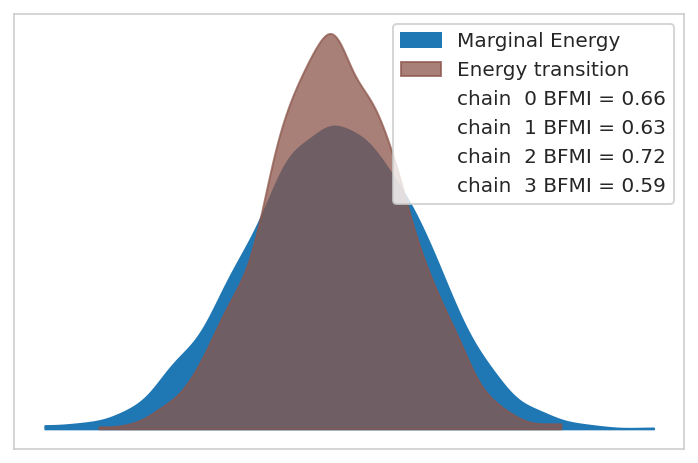


```python
energy = trace.sample_stats.energy.values
marginal_e = pd.DataFrame((energy - energy.mean(axis=1)[:, None]).T).assign(
    energy="marginal"
)
transition_e = pd.DataFrame((energy[:, :-1] - energy[:, 1:]).T).assign(
    energy="transition"
)
energy_df = pd.concat([marginal_e, transition_e]).reset_index(drop=True)
bfmi = az.bfmi(trace)

fig, axes = plt.subplots(2, 2, figsize=(8, 6))
for i, ax in enumerate(axes.flatten()):
    sns.kdeplot(data=energy_df, x=i, hue="energy", ax=ax)
    ax.set_title(f"chain {i} – BFMI: {bfmi[i]:0.2f}")
    ax.set_xlabel(None)
    xmin, _ = ax.get_xlim()
    _, ymax = ax.get_ylim()
    ax.get_legend().set_frame_on(False)

fig.tight_layout()
plt.show()
```


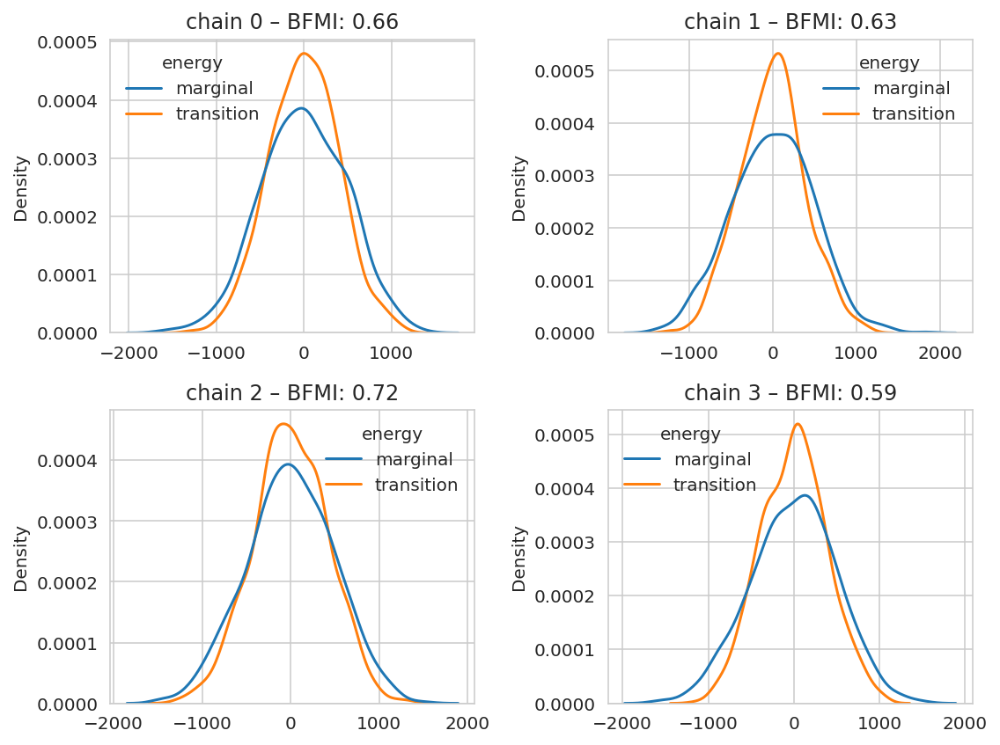


```python
stats = ["step_size", "n_steps", "tree_depth", "acceptance_rate", "energy"]
trace.sample_stats.get(stats).to_dataframe().groupby("chain").mean()
```


<div>
<style scoped>
    .dataframe tbody tr th:only-of-type {
        vertical-align: middle;
    }

    .dataframe tbody tr th {
        vertical-align: top;
    }

    .dataframe thead th {
        text-align: right;
    }
</style>
<table border="1" class="dataframe">
  <thead>
    <tr style="text-align: right;">
      <th></th>
      <th>step_size</th>
      <th>n_steps</th>
      <th>tree_depth</th>
      <th>acceptance_rate</th>
      <th>energy</th>
    </tr>
    <tr>
      <th>chain</th>
      <th></th>
      <th></th>
      <th></th>
      <th></th>
      <th></th>
    </tr>
  </thead>
  <tbody>
    <tr>
      <th>0</th>
      <td>0.013858</td>
      <td>255.000</td>
      <td>8.000</td>
      <td>0.968338</td>
      <td>1.028328e+07</td>
    </tr>
    <tr>
      <th>1</th>
      <td>0.011998</td>
      <td>511.000</td>
      <td>9.000</td>
      <td>0.977313</td>
      <td>1.028330e+07</td>
    </tr>
    <tr>
      <th>2</th>
      <td>0.012291</td>
      <td>511.000</td>
      <td>9.000</td>
      <td>0.975199</td>
      <td>1.028331e+07</td>
    </tr>
    <tr>
      <th>3</th>
      <td>0.012576</td>
      <td>510.232</td>
      <td>8.997</td>
      <td>0.972944</td>
      <td>1.028327e+07</td>
    </tr>
  </tbody>
</table>
</div>


```python
az.plot_trace(trace, var_names=["mu_mu_a", "mu_b", "mu_m"], compact=False)
plt.tight_layout()
```


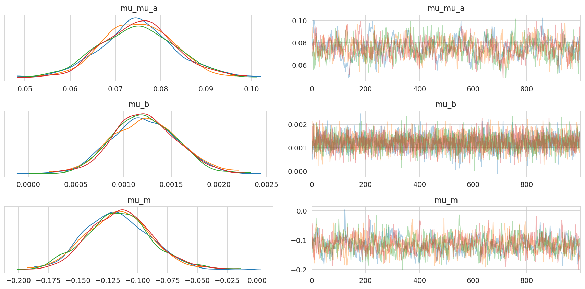


```python
az.plot_trace(trace, var_names=["^sigma_*"], filter_vars="regex", compact=False)
plt.tight_layout()
```


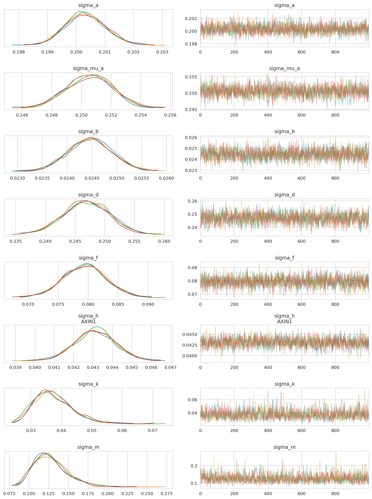


```python
az.summary(trace, var_names=["^sigma_.*$"], filter_vars="regex")
```


<div>
<style scoped>
    .dataframe tbody tr th:only-of-type {
        vertical-align: middle;
    }

    .dataframe tbody tr th {
        vertical-align: top;
    }

    .dataframe thead th {
        text-align: right;
    }
</style>
<table border="1" class="dataframe">
  <thead>
    <tr style="text-align: right;">
      <th></th>
      <th>mean</th>
      <th>sd</th>
      <th>hdi_5.5%</th>
      <th>hdi_94.5%</th>
      <th>mcse_mean</th>
      <th>mcse_sd</th>
      <th>ess_bulk</th>
      <th>ess_tail</th>
      <th>r_hat</th>
    </tr>
  </thead>
  <tbody>
    <tr>
      <th>sigma_a</th>
      <td>0.200</td>
      <td>0.001</td>
      <td>0.199</td>
      <td>0.201</td>
      <td>0.000</td>
      <td>0.0</td>
      <td>1351.0</td>
      <td>2085.0</td>
      <td>1.0</td>
    </tr>
    <tr>
      <th>sigma_mu_a</th>
      <td>0.251</td>
      <td>0.002</td>
      <td>0.248</td>
      <td>0.253</td>
      <td>0.000</td>
      <td>0.0</td>
      <td>1496.0</td>
      <td>1761.0</td>
      <td>1.0</td>
    </tr>
    <tr>
      <th>sigma_b</th>
      <td>0.024</td>
      <td>0.000</td>
      <td>0.024</td>
      <td>0.025</td>
      <td>0.000</td>
      <td>0.0</td>
      <td>1559.0</td>
      <td>2580.0</td>
      <td>1.0</td>
    </tr>
    <tr>
      <th>sigma_d</th>
      <td>0.247</td>
      <td>0.004</td>
      <td>0.241</td>
      <td>0.253</td>
      <td>0.000</td>
      <td>0.0</td>
      <td>1316.0</td>
      <td>2110.0</td>
      <td>1.0</td>
    </tr>
    <tr>
      <th>sigma_f</th>
      <td>0.079</td>
      <td>0.004</td>
      <td>0.074</td>
      <td>0.085</td>
      <td>0.000</td>
      <td>0.0</td>
      <td>1748.0</td>
      <td>2365.0</td>
      <td>1.0</td>
    </tr>
    <tr>
      <th>sigma_h[AXIN1]</th>
      <td>0.043</td>
      <td>0.001</td>
      <td>0.041</td>
      <td>0.045</td>
      <td>0.000</td>
      <td>0.0</td>
      <td>1429.0</td>
      <td>2244.0</td>
      <td>1.0</td>
    </tr>
    <tr>
      <th>sigma_k</th>
      <td>0.037</td>
      <td>0.006</td>
      <td>0.027</td>
      <td>0.047</td>
      <td>0.000</td>
      <td>0.0</td>
      <td>1060.0</td>
      <td>2203.0</td>
      <td>1.0</td>
    </tr>
    <tr>
      <th>sigma_m</th>
      <td>0.128</td>
      <td>0.022</td>
      <td>0.093</td>
      <td>0.159</td>
      <td>0.001</td>
      <td>0.0</td>
      <td>1280.0</td>
      <td>1863.0</td>
      <td>1.0</td>
    </tr>
  </tbody>
</table>
</div>


```python
sigmas = ["sigma_mu_a", "sigma_b", "sigma_d", "sigma_f", "sigma_k"]
trace.posterior.get(sigmas).mean(dim="draw").to_dataframe()
```


<div>
<style scoped>
    .dataframe tbody tr th:only-of-type {
        vertical-align: middle;
    }

    .dataframe tbody tr th {
        vertical-align: top;
    }

    .dataframe thead th {
        text-align: right;
    }
</style>
<table border="1" class="dataframe">
  <thead>
    <tr style="text-align: right;">
      <th></th>
      <th>sigma_mu_a</th>
      <th>sigma_b</th>
      <th>sigma_d</th>
      <th>sigma_f</th>
      <th>sigma_k</th>
    </tr>
    <tr>
      <th>chain</th>
      <th></th>
      <th></th>
      <th></th>
      <th></th>
      <th></th>
    </tr>
  </thead>
  <tbody>
    <tr>
      <th>0</th>
      <td>0.250388</td>
      <td>0.024486</td>
      <td>0.247099</td>
      <td>0.079376</td>
      <td>0.037614</td>
    </tr>
    <tr>
      <th>1</th>
      <td>0.250589</td>
      <td>0.024462</td>
      <td>0.246935</td>
      <td>0.079434</td>
      <td>0.037399</td>
    </tr>
    <tr>
      <th>2</th>
      <td>0.250645</td>
      <td>0.024438</td>
      <td>0.247067</td>
      <td>0.079448</td>
      <td>0.036982</td>
    </tr>
    <tr>
      <th>3</th>
      <td>0.250606</td>
      <td>0.024468</td>
      <td>0.246565</td>
      <td>0.079338</td>
      <td>0.037708</td>
    </tr>
  </tbody>
</table>
</div>


```python
az.plot_trace(trace, var_names=["alpha"], compact=False)
plt.tight_layout()
```


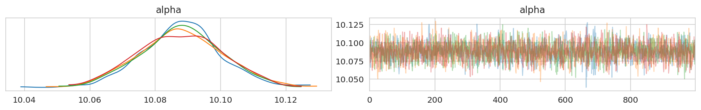


```python
az.plot_forest(
    trace, var_names=["^sigma_*"], filter_vars="regex", combined=False, figsize=(5, 5)
)
plt.tight_layout()
```


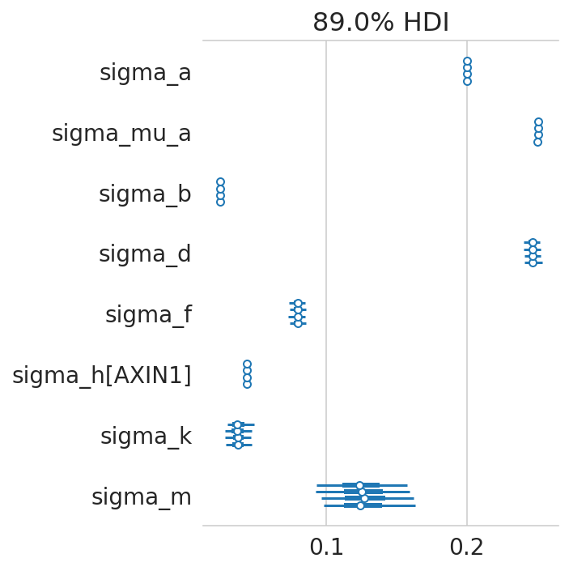


```python
var_names = ["a", "mu_a", "b", "d", "f", "h"]
_, axes = plt.subplots(2, 3, figsize=(8, 6), sharex=True)
for ax, var_name in zip(axes.flatten(), var_names):
    x = liver_post_summary.query(f"var_name == '{var_name}'")["mean"]
    sns.kdeplot(x=x, ax=ax)
    ax.set_title(var_name)
    ax.set_xlim(-2, 1)

plt.tight_layout()
plt.show()
```


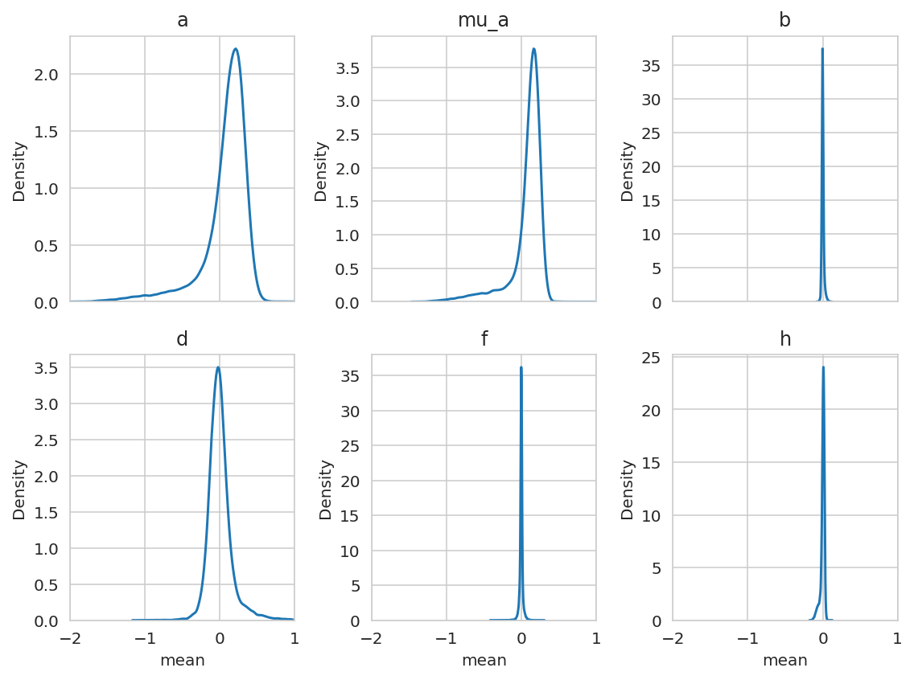


```python
sgrna_to_gene_map = (
    liver_data.copy()[["hugo_symbol", "sgrna"]].drop_duplicates().reset_index(drop=True)
)
```


```python
for v in ["mu_a", "b", "d", "f", "h", "k", "m"]:
    display(Markdown(f"variable: **{v}**"))
    top = (
        liver_post_summary.query(f"var_name == '{v}'")
        .sort_values("mean")
        .pipe(head_tail, 5)
    )
    display(top)
```


variable: **mu_a**


<div>
<style scoped>
    .dataframe tbody tr th:only-of-type {
        vertical-align: middle;
    }

    .dataframe tbody tr th {
        vertical-align: top;
    }

    .dataframe thead th {
        text-align: right;
    }
</style>
<table border="1" class="dataframe">
  <thead>
    <tr style="text-align: right;">
      <th></th>
      <th>parameter</th>
      <th>mean</th>
      <th>sd</th>
      <th>hdi_5.5%</th>
      <th>hdi_94.5%</th>
      <th>mcse_mean</th>
      <th>mcse_sd</th>
      <th>ess_bulk</th>
      <th>ess_tail</th>
      <th>r_hat</th>
      <th>var_name</th>
    </tr>
  </thead>
  <tbody>
    <tr>
      <th>2613</th>
      <td>mu_a[CDC45]</td>
      <td>-1.373</td>
      <td>0.097</td>
      <td>-1.522</td>
      <td>-1.213</td>
      <td>0.002</td>
      <td>0.001</td>
      <td>2116.0</td>
      <td>1970.0</td>
      <td>1.0</td>
      <td>mu_a</td>
    </tr>
    <tr>
      <th>16654</th>
      <td>mu_a[TXNL4A]</td>
      <td>-1.348</td>
      <td>0.095</td>
      <td>-1.497</td>
      <td>-1.192</td>
      <td>0.002</td>
      <td>0.001</td>
      <td>2659.0</td>
      <td>2882.0</td>
      <td>1.0</td>
      <td>mu_a</td>
    </tr>
    <tr>
      <th>13297</th>
      <td>mu_a[RPS3A]</td>
      <td>-1.329</td>
      <td>0.096</td>
      <td>-1.476</td>
      <td>-1.175</td>
      <td>0.002</td>
      <td>0.001</td>
      <td>2928.0</td>
      <td>2933.0</td>
      <td>1.0</td>
      <td>mu_a</td>
    </tr>
    <tr>
      <th>13209</th>
      <td>mu_a[RPL12]</td>
      <td>-1.311</td>
      <td>0.096</td>
      <td>-1.474</td>
      <td>-1.165</td>
      <td>0.002</td>
      <td>0.001</td>
      <td>2590.0</td>
      <td>2789.0</td>
      <td>1.0</td>
      <td>mu_a</td>
    </tr>
    <tr>
      <th>13314</th>
      <td>mu_a[RPSA]</td>
      <td>-1.270</td>
      <td>0.096</td>
      <td>-1.417</td>
      <td>-1.110</td>
      <td>0.002</td>
      <td>0.001</td>
      <td>2307.0</td>
      <td>2599.0</td>
      <td>1.0</td>
      <td>mu_a</td>
    </tr>
    <tr>
      <th>9963</th>
      <td>mu_a[NF2]</td>
      <td>0.481</td>
      <td>0.093</td>
      <td>0.331</td>
      <td>0.624</td>
      <td>0.002</td>
      <td>0.001</td>
      <td>2883.0</td>
      <td>2997.0</td>
      <td>1.0</td>
      <td>mu_a</td>
    </tr>
    <tr>
      <th>16213</th>
      <td>mu_a[TP53]</td>
      <td>0.485</td>
      <td>0.103</td>
      <td>0.312</td>
      <td>0.641</td>
      <td>0.002</td>
      <td>0.001</td>
      <td>2493.0</td>
      <td>2694.0</td>
      <td>1.0</td>
      <td>mu_a</td>
    </tr>
    <tr>
      <th>17897</th>
      <td>mu_a[ZNF611]</td>
      <td>0.505</td>
      <td>0.098</td>
      <td>0.352</td>
      <td>0.661</td>
      <td>0.002</td>
      <td>0.001</td>
      <td>2225.0</td>
      <td>2481.0</td>
      <td>1.0</td>
      <td>mu_a</td>
    </tr>
    <tr>
      <th>7729</th>
      <td>mu_a[KEAP1]</td>
      <td>0.543</td>
      <td>0.095</td>
      <td>0.385</td>
      <td>0.687</td>
      <td>0.002</td>
      <td>0.001</td>
      <td>2251.0</td>
      <td>2661.0</td>
      <td>1.0</td>
      <td>mu_a</td>
    </tr>
    <tr>
      <th>12361</th>
      <td>mu_a[PTEN]</td>
      <td>0.880</td>
      <td>0.096</td>
      <td>0.730</td>
      <td>1.039</td>
      <td>0.002</td>
      <td>0.001</td>
      <td>2355.0</td>
      <td>2933.0</td>
      <td>1.0</td>
      <td>mu_a</td>
    </tr>
  </tbody>
</table>
</div>


variable: **b**


<div>
<style scoped>
    .dataframe tbody tr th:only-of-type {
        vertical-align: middle;
    }

    .dataframe tbody tr th {
        vertical-align: top;
    }

    .dataframe thead th {
        text-align: right;
    }
</style>
<table border="1" class="dataframe">
  <thead>
    <tr style="text-align: right;">
      <th></th>
      <th>parameter</th>
      <th>mean</th>
      <th>sd</th>
      <th>hdi_5.5%</th>
      <th>hdi_94.5%</th>
      <th>mcse_mean</th>
      <th>mcse_sd</th>
      <th>ess_bulk</th>
      <th>ess_tail</th>
      <th>r_hat</th>
      <th>var_name</th>
    </tr>
  </thead>
  <tbody>
    <tr>
      <th>25817</th>
      <td>b[KCTD5]</td>
      <td>-0.078</td>
      <td>0.018</td>
      <td>-0.108</td>
      <td>-0.050</td>
      <td>0.0</td>
      <td>0.0</td>
      <td>7382.0</td>
      <td>3302.0</td>
      <td>1.0</td>
      <td>b</td>
    </tr>
    <tr>
      <th>24926</th>
      <td>b[HNF1B]</td>
      <td>-0.076</td>
      <td>0.020</td>
      <td>-0.105</td>
      <td>-0.042</td>
      <td>0.0</td>
      <td>0.0</td>
      <td>7304.0</td>
      <td>2929.0</td>
      <td>1.0</td>
      <td>b</td>
    </tr>
    <tr>
      <th>26589</th>
      <td>b[LRPPRC]</td>
      <td>-0.072</td>
      <td>0.020</td>
      <td>-0.106</td>
      <td>-0.041</td>
      <td>0.0</td>
      <td>0.0</td>
      <td>7722.0</td>
      <td>3234.0</td>
      <td>1.0</td>
      <td>b</td>
    </tr>
    <tr>
      <th>35633</th>
      <td>b[ZFP36L1]</td>
      <td>-0.071</td>
      <td>0.020</td>
      <td>-0.103</td>
      <td>-0.040</td>
      <td>0.0</td>
      <td>0.0</td>
      <td>6594.0</td>
      <td>3362.0</td>
      <td>1.0</td>
      <td>b</td>
    </tr>
    <tr>
      <th>23554</th>
      <td>b[FGF4]</td>
      <td>-0.069</td>
      <td>0.021</td>
      <td>-0.103</td>
      <td>-0.035</td>
      <td>0.0</td>
      <td>0.0</td>
      <td>6982.0</td>
      <td>3175.0</td>
      <td>1.0</td>
      <td>b</td>
    </tr>
    <tr>
      <th>24087</th>
      <td>b[GINS2]</td>
      <td>0.108</td>
      <td>0.019</td>
      <td>0.077</td>
      <td>0.138</td>
      <td>0.0</td>
      <td>0.0</td>
      <td>7162.0</td>
      <td>2867.0</td>
      <td>1.0</td>
      <td>b</td>
    </tr>
    <tr>
      <th>34773</th>
      <td>b[TXNL4A]</td>
      <td>0.110</td>
      <td>0.021</td>
      <td>0.080</td>
      <td>0.145</td>
      <td>0.0</td>
      <td>0.0</td>
      <td>5950.0</td>
      <td>2953.0</td>
      <td>1.0</td>
      <td>b</td>
    </tr>
    <tr>
      <th>30443</th>
      <td>b[PSMD7]</td>
      <td>0.112</td>
      <td>0.020</td>
      <td>0.082</td>
      <td>0.144</td>
      <td>0.0</td>
      <td>0.0</td>
      <td>7100.0</td>
      <td>2665.0</td>
      <td>1.0</td>
      <td>b</td>
    </tr>
    <tr>
      <th>35479</th>
      <td>b[YRDC]</td>
      <td>0.115</td>
      <td>0.020</td>
      <td>0.083</td>
      <td>0.147</td>
      <td>0.0</td>
      <td>0.0</td>
      <td>7142.0</td>
      <td>2538.0</td>
      <td>1.0</td>
      <td>b</td>
    </tr>
    <tr>
      <th>27482</th>
      <td>b[MRPL33]</td>
      <td>0.121</td>
      <td>0.020</td>
      <td>0.089</td>
      <td>0.153</td>
      <td>0.0</td>
      <td>0.0</td>
      <td>6734.0</td>
      <td>2917.0</td>
      <td>1.0</td>
      <td>b</td>
    </tr>
  </tbody>
</table>
</div>


variable: **d**


<div>
<style scoped>
    .dataframe tbody tr th:only-of-type {
        vertical-align: middle;
    }

    .dataframe tbody tr th {
        vertical-align: top;
    }

    .dataframe thead th {
        text-align: right;
    }
</style>
<table border="1" class="dataframe">
  <thead>
    <tr style="text-align: right;">
      <th></th>
      <th>parameter</th>
      <th>mean</th>
      <th>sd</th>
      <th>hdi_5.5%</th>
      <th>hdi_94.5%</th>
      <th>mcse_mean</th>
      <th>mcse_sd</th>
      <th>ess_bulk</th>
      <th>ess_tail</th>
      <th>r_hat</th>
      <th>var_name</th>
    </tr>
  </thead>
  <tbody>
    <tr>
      <th>38686</th>
      <td>d[CCND1]</td>
      <td>-1.101</td>
      <td>0.091</td>
      <td>-1.244</td>
      <td>-0.953</td>
      <td>0.001</td>
      <td>0.001</td>
      <td>5893.0</td>
      <td>3024.0</td>
      <td>1.0</td>
      <td>d</td>
    </tr>
    <tr>
      <th>53569</th>
      <td>d[YARS2]</td>
      <td>-0.950</td>
      <td>0.180</td>
      <td>-1.238</td>
      <td>-0.663</td>
      <td>0.002</td>
      <td>0.002</td>
      <td>6548.0</td>
      <td>3008.0</td>
      <td>1.0</td>
      <td>d</td>
    </tr>
    <tr>
      <th>43045</th>
      <td>d[HNF1B]</td>
      <td>-0.865</td>
      <td>0.176</td>
      <td>-1.146</td>
      <td>-0.580</td>
      <td>0.002</td>
      <td>0.002</td>
      <td>6196.0</td>
      <td>3076.0</td>
      <td>1.0</td>
      <td>d</td>
    </tr>
    <tr>
      <th>43936</th>
      <td>d[KCTD5]</td>
      <td>-0.857</td>
      <td>0.188</td>
      <td>-1.148</td>
      <td>-0.545</td>
      <td>0.002</td>
      <td>0.002</td>
      <td>6992.0</td>
      <td>3331.0</td>
      <td>1.0</td>
      <td>d</td>
    </tr>
    <tr>
      <th>41666</th>
      <td>d[FGF19]</td>
      <td>-0.847</td>
      <td>0.080</td>
      <td>-0.975</td>
      <td>-0.722</td>
      <td>0.001</td>
      <td>0.001</td>
      <td>5349.0</td>
      <td>3537.0</td>
      <td>1.0</td>
      <td>d</td>
    </tr>
    <tr>
      <th>44022</th>
      <td>d[KIF11]</td>
      <td>1.154</td>
      <td>0.201</td>
      <td>0.843</td>
      <td>1.490</td>
      <td>0.002</td>
      <td>0.002</td>
      <td>6534.0</td>
      <td>2987.0</td>
      <td>1.0</td>
      <td>d</td>
    </tr>
    <tr>
      <th>38894</th>
      <td>d[CDIPT]</td>
      <td>1.167</td>
      <td>0.190</td>
      <td>0.861</td>
      <td>1.466</td>
      <td>0.002</td>
      <td>0.002</td>
      <td>6682.0</td>
      <td>3097.0</td>
      <td>1.0</td>
      <td>d</td>
    </tr>
    <tr>
      <th>48704</th>
      <td>d[PWP2]</td>
      <td>1.225</td>
      <td>0.169</td>
      <td>0.959</td>
      <td>1.495</td>
      <td>0.002</td>
      <td>0.002</td>
      <td>5925.0</td>
      <td>2836.0</td>
      <td>1.0</td>
      <td>d</td>
    </tr>
    <tr>
      <th>50860</th>
      <td>d[SOD1]</td>
      <td>1.241</td>
      <td>0.189</td>
      <td>0.952</td>
      <td>1.553</td>
      <td>0.002</td>
      <td>0.002</td>
      <td>7776.0</td>
      <td>3333.0</td>
      <td>1.0</td>
      <td>d</td>
    </tr>
    <tr>
      <th>50709</th>
      <td>d[SMG1]</td>
      <td>1.241</td>
      <td>0.172</td>
      <td>0.965</td>
      <td>1.505</td>
      <td>0.002</td>
      <td>0.001</td>
      <td>6896.0</td>
      <td>2933.0</td>
      <td>1.0</td>
      <td>d</td>
    </tr>
  </tbody>
</table>
</div>


variable: **f**


<div>
<style scoped>
    .dataframe tbody tr th:only-of-type {
        vertical-align: middle;
    }

    .dataframe tbody tr th {
        vertical-align: top;
    }

    .dataframe thead th {
        text-align: right;
    }
</style>
<table border="1" class="dataframe">
  <thead>
    <tr style="text-align: right;">
      <th></th>
      <th>parameter</th>
      <th>mean</th>
      <th>sd</th>
      <th>hdi_5.5%</th>
      <th>hdi_94.5%</th>
      <th>mcse_mean</th>
      <th>mcse_sd</th>
      <th>ess_bulk</th>
      <th>ess_tail</th>
      <th>r_hat</th>
      <th>var_name</th>
    </tr>
  </thead>
  <tbody>
    <tr>
      <th>70570</th>
      <td>f[TP53]</td>
      <td>-0.407</td>
      <td>0.058</td>
      <td>-0.493</td>
      <td>-0.312</td>
      <td>0.001</td>
      <td>0.001</td>
      <td>5594.0</td>
      <td>3391.0</td>
      <td>1.0</td>
      <td>f</td>
    </tr>
    <tr>
      <th>57994</th>
      <td>f[CTNNB1]</td>
      <td>-0.268</td>
      <td>0.080</td>
      <td>-0.381</td>
      <td>-0.127</td>
      <td>0.001</td>
      <td>0.001</td>
      <td>6077.0</td>
      <td>2912.0</td>
      <td>1.0</td>
      <td>f</td>
    </tr>
    <tr>
      <th>55931</th>
      <td>f[BOP1]</td>
      <td>-0.213</td>
      <td>0.067</td>
      <td>-0.325</td>
      <td>-0.112</td>
      <td>0.001</td>
      <td>0.001</td>
      <td>6630.0</td>
      <td>2832.0</td>
      <td>1.0</td>
      <td>f</td>
    </tr>
    <tr>
      <th>66210</th>
      <td>f[POLRMT]</td>
      <td>-0.207</td>
      <td>0.061</td>
      <td>-0.303</td>
      <td>-0.106</td>
      <td>0.001</td>
      <td>0.001</td>
      <td>6542.0</td>
      <td>2989.0</td>
      <td>1.0</td>
      <td>f</td>
    </tr>
    <tr>
      <th>70549</th>
      <td>f[TONSL]</td>
      <td>-0.201</td>
      <td>0.079</td>
      <td>-0.338</td>
      <td>-0.087</td>
      <td>0.001</td>
      <td>0.001</td>
      <td>6871.0</td>
      <td>2998.0</td>
      <td>1.0</td>
      <td>f</td>
    </tr>
    <tr>
      <th>59220</th>
      <td>f[ERH]</td>
      <td>0.145</td>
      <td>0.070</td>
      <td>0.034</td>
      <td>0.258</td>
      <td>0.001</td>
      <td>0.001</td>
      <td>5758.0</td>
      <td>3017.0</td>
      <td>1.0</td>
      <td>f</td>
    </tr>
    <tr>
      <th>61092</th>
      <td>f[HIST2H3D]</td>
      <td>0.152</td>
      <td>0.071</td>
      <td>0.034</td>
      <td>0.264</td>
      <td>0.001</td>
      <td>0.001</td>
      <td>6810.0</td>
      <td>2951.0</td>
      <td>1.0</td>
      <td>f</td>
    </tr>
    <tr>
      <th>60905</th>
      <td>f[HCFC1]</td>
      <td>0.174</td>
      <td>0.069</td>
      <td>0.067</td>
      <td>0.286</td>
      <td>0.001</td>
      <td>0.001</td>
      <td>7233.0</td>
      <td>3060.0</td>
      <td>1.0</td>
      <td>f</td>
    </tr>
    <tr>
      <th>64287</th>
      <td>f[NELFB]</td>
      <td>0.217</td>
      <td>0.069</td>
      <td>0.105</td>
      <td>0.324</td>
      <td>0.001</td>
      <td>0.001</td>
      <td>6301.0</td>
      <td>2830.0</td>
      <td>1.0</td>
      <td>f</td>
    </tr>
    <tr>
      <th>54966</th>
      <td>f[AMBRA1]</td>
      <td>0.300</td>
      <td>0.068</td>
      <td>0.194</td>
      <td>0.411</td>
      <td>0.001</td>
      <td>0.001</td>
      <td>5164.0</td>
      <td>2648.0</td>
      <td>1.0</td>
      <td>f</td>
    </tr>
  </tbody>
</table>
</div>


variable: **h**


<div>
<style scoped>
    .dataframe tbody tr th:only-of-type {
        vertical-align: middle;
    }

    .dataframe tbody tr th {
        vertical-align: top;
    }

    .dataframe thead th {
        text-align: right;
    }
</style>
<table border="1" class="dataframe">
  <thead>
    <tr style="text-align: right;">
      <th></th>
      <th>parameter</th>
      <th>mean</th>
      <th>sd</th>
      <th>hdi_5.5%</th>
      <th>hdi_94.5%</th>
      <th>mcse_mean</th>
      <th>mcse_sd</th>
      <th>ess_bulk</th>
      <th>ess_tail</th>
      <th>r_hat</th>
      <th>var_name</th>
    </tr>
  </thead>
  <tbody>
    <tr>
      <th>151499</th>
      <td>h[KPNB1, AXIN1]</td>
      <td>-0.165</td>
      <td>0.033</td>
      <td>-0.215</td>
      <td>-0.111</td>
      <td>0.000</td>
      <td>0.0</td>
      <td>6690.0</td>
      <td>2977.0</td>
      <td>1.0</td>
      <td>h</td>
    </tr>
    <tr>
      <th>158396</th>
      <td>h[SRBD1, AXIN1]</td>
      <td>-0.152</td>
      <td>0.034</td>
      <td>-0.204</td>
      <td>-0.097</td>
      <td>0.000</td>
      <td>0.0</td>
      <td>6853.0</td>
      <td>3355.0</td>
      <td>1.0</td>
      <td>h</td>
    </tr>
    <tr>
      <th>146429</th>
      <td>h[CHAF1B, AXIN1]</td>
      <td>-0.151</td>
      <td>0.033</td>
      <td>-0.206</td>
      <td>-0.098</td>
      <td>0.000</td>
      <td>0.0</td>
      <td>6138.0</td>
      <td>2814.0</td>
      <td>1.0</td>
      <td>h</td>
    </tr>
    <tr>
      <th>146151</th>
      <td>h[CDC45, AXIN1]</td>
      <td>-0.150</td>
      <td>0.034</td>
      <td>-0.202</td>
      <td>-0.094</td>
      <td>0.000</td>
      <td>0.0</td>
      <td>6419.0</td>
      <td>2535.0</td>
      <td>1.0</td>
      <td>h</td>
    </tr>
    <tr>
      <th>160136</th>
      <td>h[TUBB, AXIN1]</td>
      <td>-0.144</td>
      <td>0.034</td>
      <td>-0.198</td>
      <td>-0.090</td>
      <td>0.000</td>
      <td>0.0</td>
      <td>6585.0</td>
      <td>2861.0</td>
      <td>1.0</td>
      <td>h</td>
    </tr>
    <tr>
      <th>150352</th>
      <td>h[HNRNPA2B1, AXIN1]</td>
      <td>0.062</td>
      <td>0.033</td>
      <td>0.008</td>
      <td>0.111</td>
      <td>0.000</td>
      <td>0.0</td>
      <td>6572.0</td>
      <td>2813.0</td>
      <td>1.0</td>
      <td>h</td>
    </tr>
    <tr>
      <th>147501</th>
      <td>h[DDX3X, AXIN1]</td>
      <td>0.062</td>
      <td>0.033</td>
      <td>0.011</td>
      <td>0.115</td>
      <td>0.000</td>
      <td>0.0</td>
      <td>6517.0</td>
      <td>2622.0</td>
      <td>1.0</td>
      <td>h</td>
    </tr>
    <tr>
      <th>149125</th>
      <td>h[FOXK1, AXIN1]</td>
      <td>0.064</td>
      <td>0.032</td>
      <td>0.015</td>
      <td>0.119</td>
      <td>0.000</td>
      <td>0.0</td>
      <td>6035.0</td>
      <td>2857.0</td>
      <td>1.0</td>
      <td>h</td>
    </tr>
    <tr>
      <th>144147</th>
      <td>h[AMBRA1, AXIN1]</td>
      <td>0.091</td>
      <td>0.034</td>
      <td>0.037</td>
      <td>0.146</td>
      <td>0.001</td>
      <td>0.0</td>
      <td>3670.0</td>
      <td>3082.0</td>
      <td>1.0</td>
      <td>h</td>
    </tr>
    <tr>
      <th>159994</th>
      <td>h[TSC2, AXIN1]</td>
      <td>0.118</td>
      <td>0.034</td>
      <td>0.062</td>
      <td>0.171</td>
      <td>0.000</td>
      <td>0.0</td>
      <td>7160.0</td>
      <td>3011.0</td>
      <td>1.0</td>
      <td>h</td>
    </tr>
  </tbody>
</table>
</div>


variable: **k**


<div>
<style scoped>
    .dataframe tbody tr th:only-of-type {
        vertical-align: middle;
    }

    .dataframe tbody tr th {
        vertical-align: top;
    }

    .dataframe thead th {
        text-align: right;
    }
</style>
<table border="1" class="dataframe">
  <thead>
    <tr style="text-align: right;">
      <th></th>
      <th>parameter</th>
      <th>mean</th>
      <th>sd</th>
      <th>hdi_5.5%</th>
      <th>hdi_94.5%</th>
      <th>mcse_mean</th>
      <th>mcse_sd</th>
      <th>ess_bulk</th>
      <th>ess_tail</th>
      <th>r_hat</th>
      <th>var_name</th>
    </tr>
  </thead>
  <tbody>
    <tr>
      <th>161676</th>
      <td>k[ACH-000471]</td>
      <td>-0.119</td>
      <td>0.008</td>
      <td>-0.132</td>
      <td>-0.106</td>
      <td>0.0</td>
      <td>0.0</td>
      <td>430.0</td>
      <td>835.0</td>
      <td>1.0</td>
      <td>k</td>
    </tr>
    <tr>
      <th>161677</th>
      <td>k[ACH-000475]</td>
      <td>-0.041</td>
      <td>0.008</td>
      <td>-0.054</td>
      <td>-0.029</td>
      <td>0.0</td>
      <td>0.0</td>
      <td>430.0</td>
      <td>797.0</td>
      <td>1.0</td>
      <td>k</td>
    </tr>
    <tr>
      <th>161687</th>
      <td>k[ACH-000734]</td>
      <td>-0.031</td>
      <td>0.008</td>
      <td>-0.044</td>
      <td>-0.018</td>
      <td>0.0</td>
      <td>0.0</td>
      <td>429.0</td>
      <td>844.0</td>
      <td>1.0</td>
      <td>k</td>
    </tr>
    <tr>
      <th>161685</th>
      <td>k[ACH-000620]</td>
      <td>-0.020</td>
      <td>0.008</td>
      <td>-0.034</td>
      <td>-0.008</td>
      <td>0.0</td>
      <td>0.0</td>
      <td>428.0</td>
      <td>802.0</td>
      <td>1.0</td>
      <td>k</td>
    </tr>
    <tr>
      <th>161675</th>
      <td>k[ACH-000422]</td>
      <td>-0.014</td>
      <td>0.008</td>
      <td>-0.028</td>
      <td>-0.003</td>
      <td>0.0</td>
      <td>0.0</td>
      <td>429.0</td>
      <td>859.0</td>
      <td>1.0</td>
      <td>k</td>
    </tr>
    <tr>
      <th>161680</th>
      <td>k[ACH-000480]</td>
      <td>0.025</td>
      <td>0.008</td>
      <td>0.012</td>
      <td>0.038</td>
      <td>0.0</td>
      <td>0.0</td>
      <td>427.0</td>
      <td>780.0</td>
      <td>1.0</td>
      <td>k</td>
    </tr>
    <tr>
      <th>161688</th>
      <td>k[ACH-000739]</td>
      <td>0.030</td>
      <td>0.008</td>
      <td>0.017</td>
      <td>0.042</td>
      <td>0.0</td>
      <td>0.0</td>
      <td>433.0</td>
      <td>840.0</td>
      <td>1.0</td>
      <td>k</td>
    </tr>
    <tr>
      <th>161681</th>
      <td>k[ACH-000483]</td>
      <td>0.034</td>
      <td>0.008</td>
      <td>0.021</td>
      <td>0.046</td>
      <td>0.0</td>
      <td>0.0</td>
      <td>422.0</td>
      <td>772.0</td>
      <td>1.0</td>
      <td>k</td>
    </tr>
    <tr>
      <th>161674</th>
      <td>k[ACH-000420]</td>
      <td>0.039</td>
      <td>0.008</td>
      <td>0.026</td>
      <td>0.052</td>
      <td>0.0</td>
      <td>0.0</td>
      <td>437.0</td>
      <td>847.0</td>
      <td>1.0</td>
      <td>k</td>
    </tr>
    <tr>
      <th>161684</th>
      <td>k[ACH-000577]</td>
      <td>0.048</td>
      <td>0.008</td>
      <td>0.035</td>
      <td>0.061</td>
      <td>0.0</td>
      <td>0.0</td>
      <td>434.0</td>
      <td>835.0</td>
      <td>1.0</td>
      <td>k</td>
    </tr>
  </tbody>
</table>
</div>


variable: **m**


<div>
<style scoped>
    .dataframe tbody tr th:only-of-type {
        vertical-align: middle;
    }

    .dataframe tbody tr th {
        vertical-align: top;
    }

    .dataframe thead th {
        text-align: right;
    }
</style>
<table border="1" class="dataframe">
  <thead>
    <tr style="text-align: right;">
      <th></th>
      <th>parameter</th>
      <th>mean</th>
      <th>sd</th>
      <th>hdi_5.5%</th>
      <th>hdi_94.5%</th>
      <th>mcse_mean</th>
      <th>mcse_sd</th>
      <th>ess_bulk</th>
      <th>ess_tail</th>
      <th>r_hat</th>
      <th>var_name</th>
    </tr>
  </thead>
  <tbody>
    <tr>
      <th>161694</th>
      <td>m[ACH-000361]</td>
      <td>-0.404</td>
      <td>0.011</td>
      <td>-0.420</td>
      <td>-0.384</td>
      <td>0.0</td>
      <td>0.0</td>
      <td>4437.0</td>
      <td>3438.0</td>
      <td>1.0</td>
      <td>m</td>
    </tr>
    <tr>
      <th>161709</th>
      <td>m[ACH-000734]</td>
      <td>-0.303</td>
      <td>0.009</td>
      <td>-0.318</td>
      <td>-0.289</td>
      <td>0.0</td>
      <td>0.0</td>
      <td>4085.0</td>
      <td>3735.0</td>
      <td>1.0</td>
      <td>m</td>
    </tr>
    <tr>
      <th>161710</th>
      <td>m[ACH-000739]</td>
      <td>-0.281</td>
      <td>0.010</td>
      <td>-0.296</td>
      <td>-0.265</td>
      <td>0.0</td>
      <td>0.0</td>
      <td>4120.0</td>
      <td>4057.0</td>
      <td>1.0</td>
      <td>m</td>
    </tr>
    <tr>
      <th>161699</th>
      <td>m[ACH-000475]</td>
      <td>-0.271</td>
      <td>0.008</td>
      <td>-0.283</td>
      <td>-0.257</td>
      <td>0.0</td>
      <td>0.0</td>
      <td>4311.0</td>
      <td>3682.0</td>
      <td>1.0</td>
      <td>m</td>
    </tr>
    <tr>
      <th>161707</th>
      <td>m[ACH-000620]</td>
      <td>-0.203</td>
      <td>0.009</td>
      <td>-0.217</td>
      <td>-0.188</td>
      <td>0.0</td>
      <td>0.0</td>
      <td>4421.0</td>
      <td>3246.0</td>
      <td>1.0</td>
      <td>m</td>
    </tr>
    <tr>
      <th>161712</th>
      <td>m[ACH-001318]</td>
      <td>-0.047</td>
      <td>0.011</td>
      <td>-0.065</td>
      <td>-0.030</td>
      <td>0.0</td>
      <td>0.0</td>
      <td>4355.0</td>
      <td>3190.0</td>
      <td>1.0</td>
      <td>m</td>
    </tr>
    <tr>
      <th>161703</th>
      <td>m[ACH-000483]</td>
      <td>-0.004</td>
      <td>0.008</td>
      <td>-0.017</td>
      <td>0.009</td>
      <td>0.0</td>
      <td>0.0</td>
      <td>4095.0</td>
      <td>3589.0</td>
      <td>1.0</td>
      <td>m</td>
    </tr>
    <tr>
      <th>161691</th>
      <td>m[ACH-000217]</td>
      <td>0.012</td>
      <td>0.009</td>
      <td>-0.001</td>
      <td>0.028</td>
      <td>0.0</td>
      <td>0.0</td>
      <td>4249.0</td>
      <td>3487.0</td>
      <td>1.0</td>
      <td>m</td>
    </tr>
    <tr>
      <th>161697</th>
      <td>m[ACH-000422]</td>
      <td>0.022</td>
      <td>0.009</td>
      <td>0.008</td>
      <td>0.037</td>
      <td>0.0</td>
      <td>0.0</td>
      <td>4230.0</td>
      <td>3517.0</td>
      <td>1.0</td>
      <td>m</td>
    </tr>
    <tr>
      <th>161693</th>
      <td>m[ACH-000316]</td>
      <td>0.081</td>
      <td>0.011</td>
      <td>0.064</td>
      <td>0.098</td>
      <td>0.0</td>
      <td>0.0</td>
      <td>3728.0</td>
      <td>3356.0</td>
      <td>1.0</td>
      <td>m</td>
    </tr>
  </tbody>
</table>
</div>


```python
example_genes = ["AXIN1", "CTNNB1", "TP53", "PTEN"]
az.plot_trace(
    trace,
    var_names=["mu_a", "b", "d", "f", "h"],
    coords={"gene": example_genes},
    compact=True,
    legend=True,
)
plt.tight_layout()
plt.show()
```


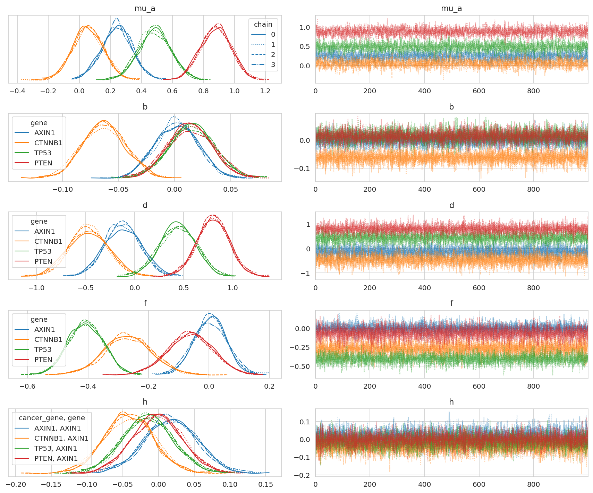


```python
sgrnas_sample = trace.posterior.coords["sgrna"].values[:5]

az.plot_trace(trace, var_names="a", coords={"sgrna": sgrnas_sample}, compact=False)
plt.tight_layout()
plt.show()
```


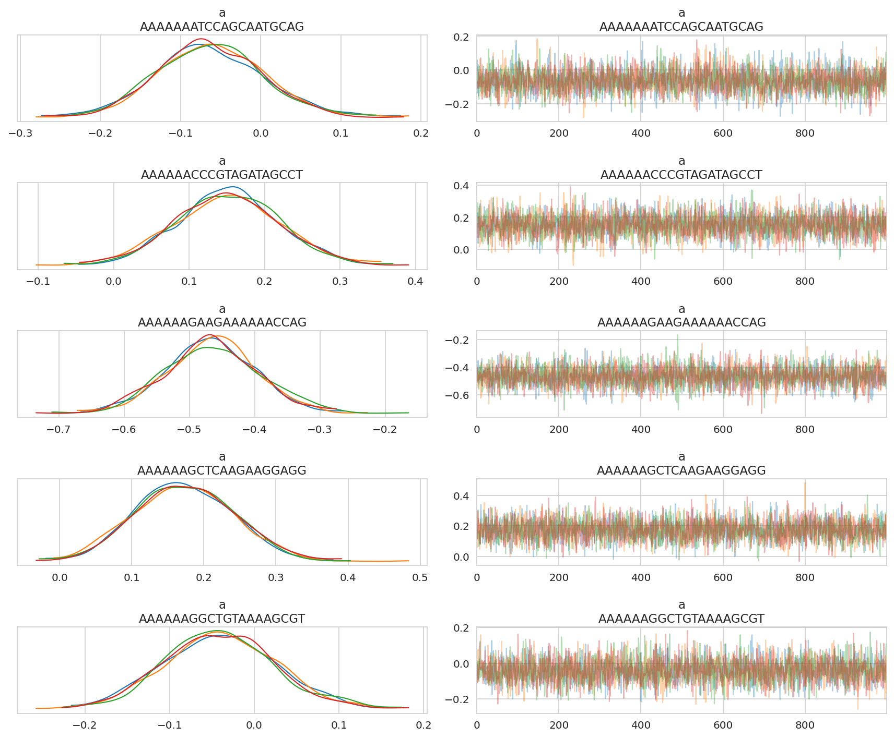


```python
example_genes = ["AXIN1", "CTNNB1", "TP53", "PTEN"]
for example_gene in example_genes:
    display(Markdown(f"🧬 target gene: *{example_gene}*"))
    example_gene_sgrna = sgrna_to_gene_map.query(f"hugo_symbol == '{example_gene}'")[
        "sgrna"
    ].tolist()
    axes = az.plot_forest(
        trace,
        var_names=[
            "mu_mu_a",
            "mu_a",
            "a",
            "mu_b",
            "b",
            "d",
            "f",
            "h",
        ],
        coords={"gene": [example_gene], "sgrna": example_gene_sgrna},
        combined=True,
        figsize=(6, 5),
    )
    axes[0].axvline(0, color="k", lw=0.8, zorder=1)
    plt.show()
```


🧬 target gene: *AXIN1*


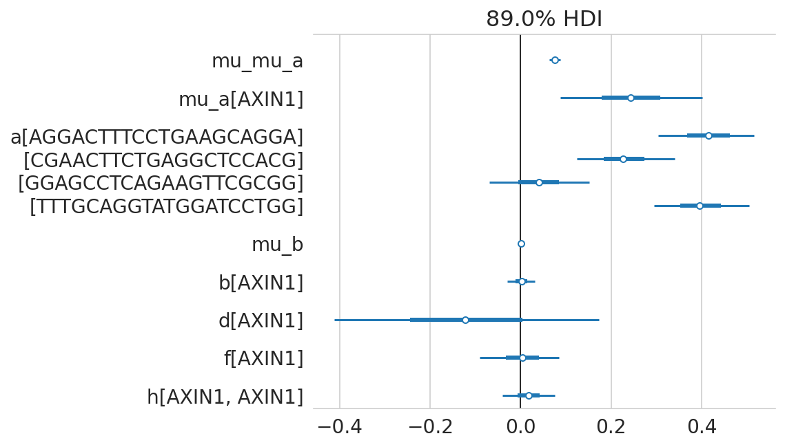


🧬 target gene: *CTNNB1*


🧬 target gene: *TP53*


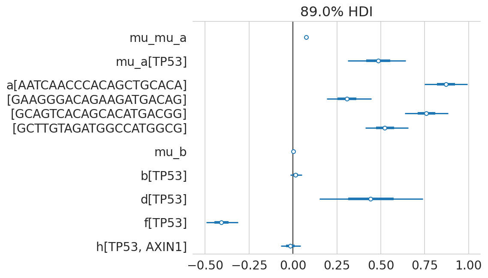


🧬 target gene: *PTEN*


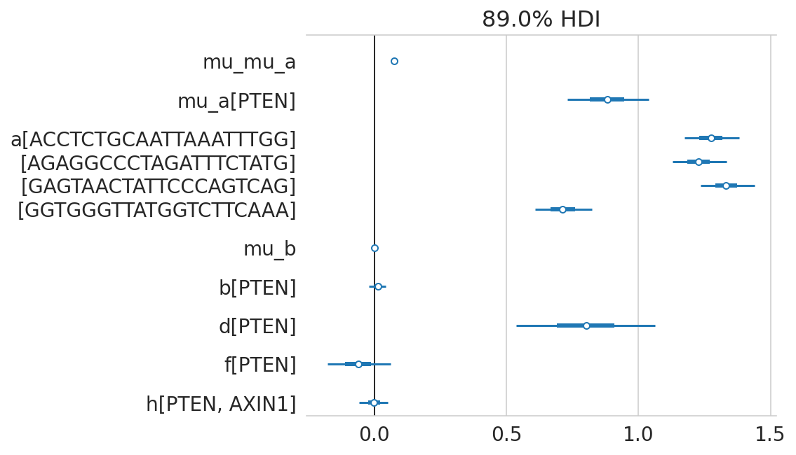


```python
for gene in ["KIF11", "GINS2"]:
    axes = az.plot_pair(
        trace,
        var_names=["mu_a", "b", "d", "f", "h"],
        coords={"gene": [gene]},
        figsize=(7, 7),
        scatter_kwargs={"alpha": 0.1, "markersize": 2},
    )
    for ax in axes.flatten():
        ax.axhline(0, color="k")
        ax.axvline(0, color="k")
    plt.tight_layout()
    plt.show()
```


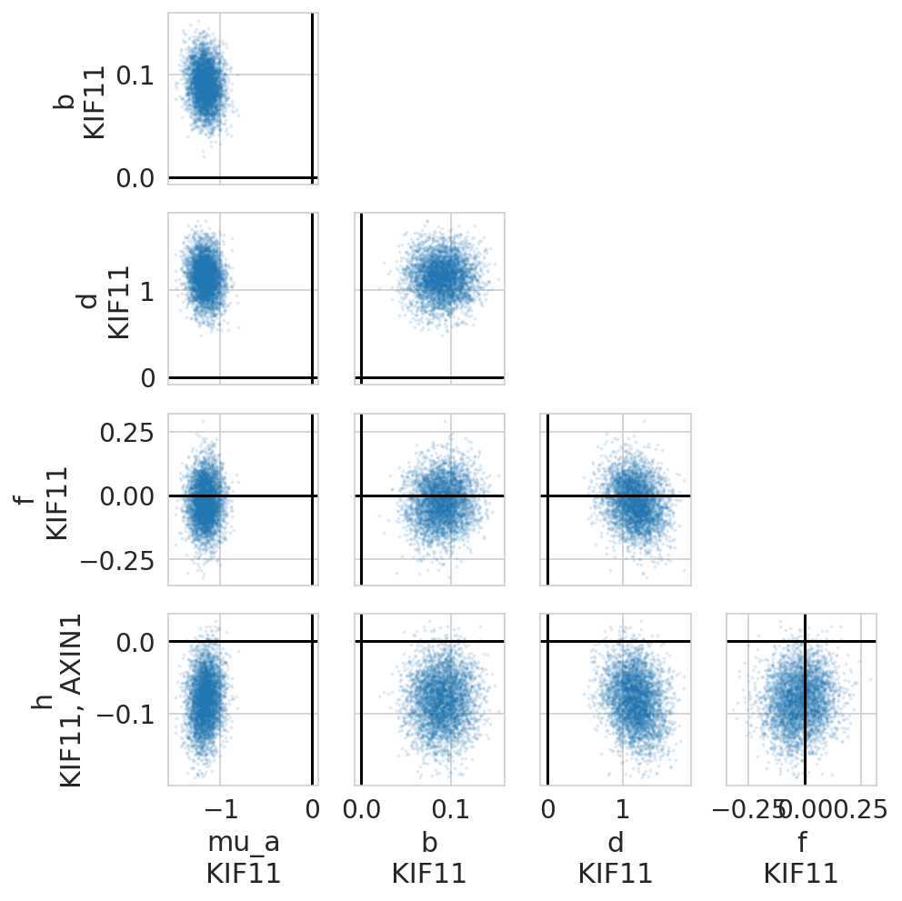


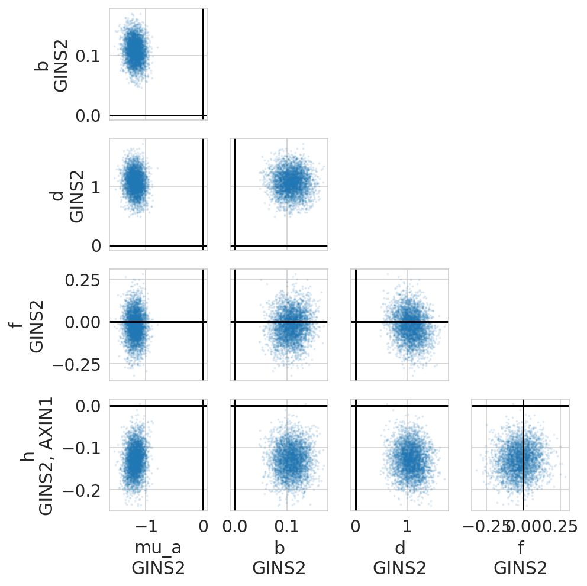


```python
def _get_average_per_chain(trace: az.InferenceData, var_name: str) -> pd.DataFrame:
    return (
        trace.posterior[var_name]
        .mean(axis=(1))
        .to_dataframe()
        .reset_index()
        .astype({"chain": str})
    )


mu_a_post_avg = _get_average_per_chain(trace, "mu_a")
b_post_avg = _get_average_per_chain(trace, "b")
d_post_avg = _get_average_per_chain(trace, "d")

gene_post_avg = mu_a_post_avg.merge(b_post_avg, on=["chain", "gene"]).merge(
    d_post_avg, on=["chain", "gene"]
)


fig, axes = plt.subplots(1, 2, squeeze=True, figsize=(7, 3.5))

ax = axes[0]
sns.scatterplot(
    data=gene_post_avg,
    x="mu_a",
    y="b",
    hue="chain",
    palette="Set1",
    alpha=0.1,
    edgecolor=None,
    s=5,
    ax=ax,
)
ax.set_xlabel(r"$\mu_a$")
ax.set_ylabel(r"$b$")


ax = axes[1]
sns.scatterplot(
    data=gene_post_avg,
    x="b",
    y="d",
    hue="chain",
    palette="Set1",
    alpha=0.1,
    edgecolor=None,
    s=5,
    ax=ax,
)
ax.set_xlabel(r"$b$")
ax.set_ylabel(r"$d$")

for ax in axes.flatten():
    ax.axhline(color="k")
    ax.axvline(color="k")
    ax.get_legend().remove()


fig.tight_layout()
fig.suptitle("Joint posterior distribution", va="bottom")

plt.show()
```


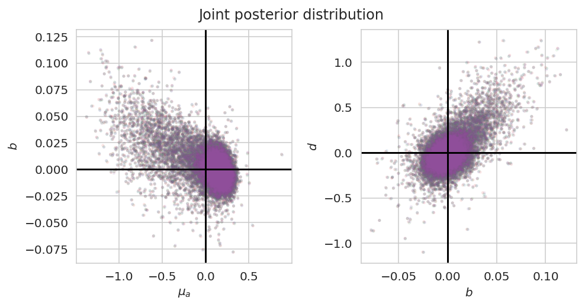


```python
axes = az.plot_forest(trace, var_names=["k", "m"], combined=True, figsize=(5, 10))
axes[0].axvline(0, color="k", lw=0.8, zorder=1)
plt.tight_layout()
plt.show()
```


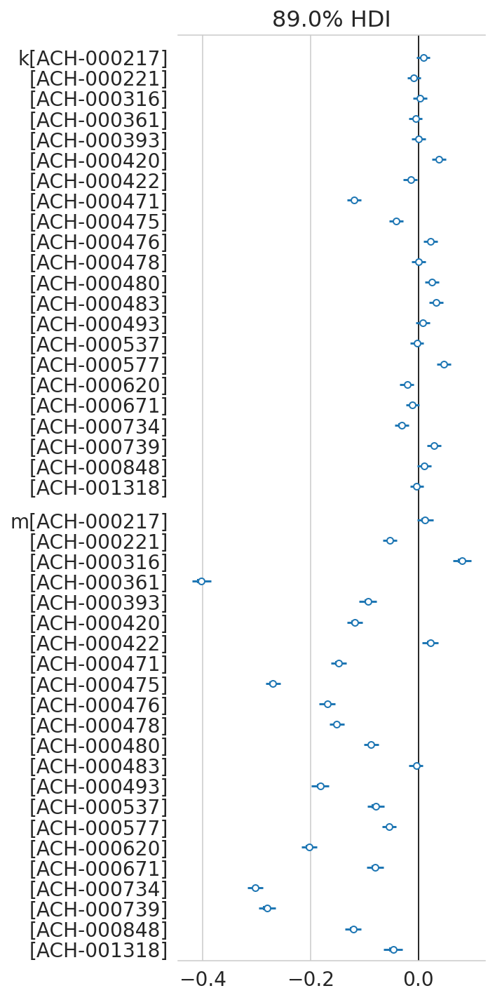


```python
genes_var_names = ["mu_a", "b", "d", "f"]
genes_var_names += [f"h[{g}]" for g in trace.posterior.coords["cancer_gene"].values]
gene_corr_post = (
    az.summary(trace, "genes_chol_cov_corr", kind="stats")
    .pipe(extract_coords_param_names, names=["d1", "d2"])
    .astype({"d1": int, "d2": int})
    .assign(
        p1=lambda d: [genes_var_names[i] for i in d["d1"]],
        p2=lambda d: [genes_var_names[i] for i in d["d2"]],
    )
    .assign(
        p1=lambda d: pd.Categorical(d["p1"], categories=d["p1"].unique(), ordered=True)
    )
    .assign(
        p2=lambda d: pd.Categorical(
            d["p2"], categories=d["p1"].cat.categories, ordered=True
        )
    )
)
```


```python
plot_df = gene_corr_post.pivot_wider("p1", "p2", "mean").set_index("p1")
ax = sns.heatmap(
    plot_df,
    cmap="coolwarm",
    vmin=-1,
    vmax=1,
)
ax.set_ylabel(None)
plt.show()
```


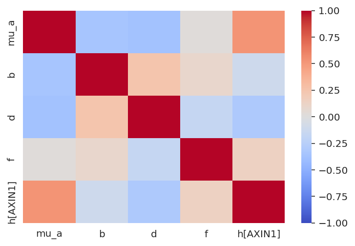


```python
cells_var_names = ["k", "m"]
cells_corr_post = (
    az.summary(trace, "cells_chol_cov_corr", kind="stats")
    .pipe(extract_coords_param_names, names=["d1", "d2"])
    .astype({"d1": int, "d2": int})
    .assign(
        p1=lambda d: [cells_var_names[i] for i in d["d1"]],
        p2=lambda d: [cells_var_names[i] for i in d["d2"]],
    )
    .assign(
        p1=lambda d: pd.Categorical(d["p1"], categories=d["p1"].unique(), ordered=True)
    )
    .assign(
        p2=lambda d: pd.Categorical(
            d["p2"], categories=d["p1"].cat.categories, ordered=True
        )
    )
)
```


```python
_, ax = plt.subplots(figsize=(2, 2))
plot_df = cells_corr_post.pivot_wider("p1", "p2", "mean").set_index("p1")
sns.heatmap(plot_df, cmap="coolwarm", vmin=-1, vmax=1, ax=ax)
ax.set_ylabel(None)
plt.show()
```


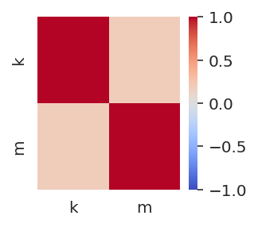


```python
cancer_genes = trace.posterior.coords["cancer_gene"].values.tolist()
cancer_gene_mutants = (
    valid_liver_data.filter_column_isin("hugo_symbol", cancer_genes)[
        ["hugo_symbol", "depmap_id", "is_mutated"]
    ]
    .drop_duplicates()
    .assign(is_mutated=lambda d: d["is_mutated"].map({True: "X", False: ""}))
    .pivot_wider("depmap_id", names_from="hugo_symbol", values_from="is_mutated")
    .set_index("depmap_id")
)
cancer_gene_mutants
```


<div>
<style scoped>
    .dataframe tbody tr th:only-of-type {
        vertical-align: middle;
    }

    .dataframe tbody tr th {
        vertical-align: top;
    }

    .dataframe thead th {
        text-align: right;
    }
</style>
<table border="1" class="dataframe">
  <thead>
    <tr style="text-align: right;">
      <th></th>
      <th>AXIN1</th>
    </tr>
    <tr>
      <th>depmap_id</th>
      <th></th>
    </tr>
  </thead>
  <tbody>
    <tr>
      <th>ACH-000217</th>
      <td>X</td>
    </tr>
    <tr>
      <th>ACH-000221</th>
      <td></td>
    </tr>
    <tr>
      <th>ACH-000316</th>
      <td></td>
    </tr>
    <tr>
      <th>ACH-000361</th>
      <td></td>
    </tr>
    <tr>
      <th>ACH-000393</th>
      <td></td>
    </tr>
    <tr>
      <th>ACH-000420</th>
      <td>X</td>
    </tr>
    <tr>
      <th>ACH-000422</th>
      <td></td>
    </tr>
    <tr>
      <th>ACH-000471</th>
      <td></td>
    </tr>
    <tr>
      <th>ACH-000475</th>
      <td>X</td>
    </tr>
    <tr>
      <th>ACH-000476</th>
      <td></td>
    </tr>
    <tr>
      <th>ACH-000478</th>
      <td></td>
    </tr>
    <tr>
      <th>ACH-000480</th>
      <td></td>
    </tr>
    <tr>
      <th>ACH-000483</th>
      <td></td>
    </tr>
    <tr>
      <th>ACH-000493</th>
      <td>X</td>
    </tr>
    <tr>
      <th>ACH-000537</th>
      <td></td>
    </tr>
    <tr>
      <th>ACH-000577</th>
      <td></td>
    </tr>
    <tr>
      <th>ACH-000620</th>
      <td></td>
    </tr>
    <tr>
      <th>ACH-000671</th>
      <td></td>
    </tr>
    <tr>
      <th>ACH-000734</th>
      <td>X</td>
    </tr>
    <tr>
      <th>ACH-000739</th>
      <td></td>
    </tr>
    <tr>
      <th>ACH-000848</th>
      <td>X</td>
    </tr>
    <tr>
      <th>ACH-001318</th>
      <td></td>
    </tr>
  </tbody>
</table>
</div>


```python
az.plot_trace(trace, var_names=["sigma_h"], compact=False)
plt.tight_layout()
plt.show()
```


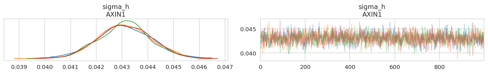


```python
h_post_summary = (
    liver_post_summary.query("var_name == 'h'")
    .reset_index(drop=True)
    .pipe(
        extract_coords_param_names,
        names=["hugo_symbol", "cancer_gene"],
        col="parameter",
    )
)

ax = sns.kdeplot(data=h_post_summary, x="mean", hue="cancer_gene")
ax.set_xlabel(r"$\bar{h}_g$ posterior")
ax.set_ylabel("density")
ax.get_legend().set_title("cancer gene\ncomut.")
plt.show()
```


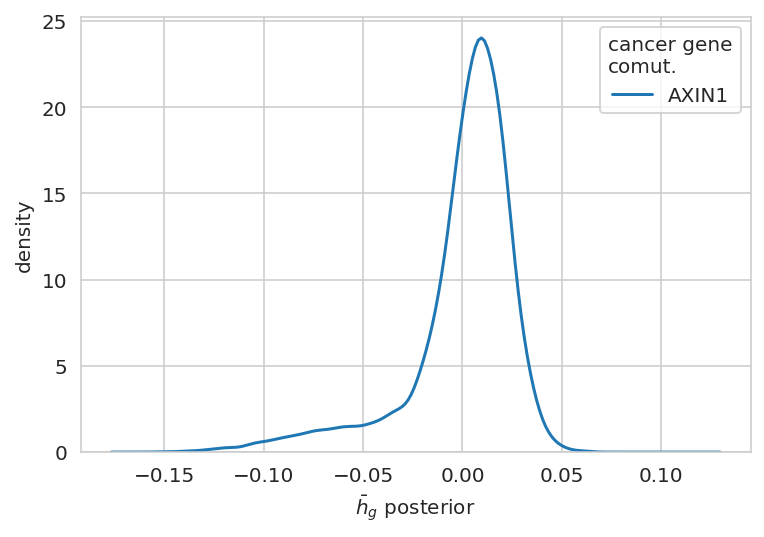


```python
fig, axes = plt.subplots(
    len(cancer_genes), 1, squeeze=False, figsize=(10, len(cancer_genes) * 4)
)
for ax, cg in zip(axes.flatten(), cancer_genes):
    h_hits = (
        h_post_summary.filter_column_isin("cancer_gene", [cg])
        .sort_values("mean")
        .pipe(head_tail, n=5)["hugo_symbol"]
        .tolist()
    )

    h_hits_data = (
        valid_liver_data.filter_column_isin("hugo_symbol", h_hits)
        .merge(cancer_gene_mutants.reset_index(), on="depmap_id")
        .reset_index()
        .astype({"hugo_symbol": str})
        .assign(
            hugo_symbol=lambda d: pd.Categorical(d["hugo_symbol"], categories=h_hits),
            _cg_mut=lambda d: d[cg].map({"X": "mut.", "": "WT"}),
        )
    )
    ax.axhline(0, color="k", lw=0.8)
    mut_pal = {"mut.": "tab:red", "WT": "gray"}
    boxes = sns.boxplot(
        data=h_hits_data,
        x="hugo_symbol",
        y="lfc",
        hue="_cg_mut",
        palette=mut_pal,
        ax=ax,
        showfliers=False,
        boxprops={"alpha": 0.5},
    )
    points = sns.stripplot(
        data=h_hits_data,
        x="hugo_symbol",
        y="lfc",
        hue="_cg_mut",
        dodge=True,
        palette=mut_pal,
        s=4,
        alpha=0.7,
        ax=ax,
    )
    sns.move_legend(ax, loc="upper left", bbox_to_anchor=(1, 1), title=cg)
    ax.set_xlabel(None)
    ax.set_ylabel("log-fold change")

axes[-1, 0].set_xlabel("target gene")
plt.tight_layout()
plt.show()
```


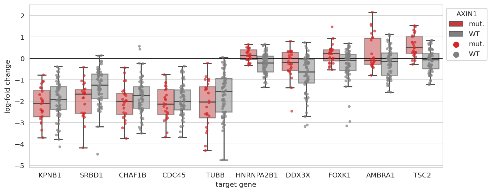


```python
top_n = 5
top_b_hits = (
    liver_post_summary.query("var_name == 'b'")
    .sort_values("mean")
    .reset_index(drop=True)
    .pipe(extract_coords_param_names, names=["hugo_symbol"], col="parameter")
    .pipe(head_tail, n=top_n)
)

negative_b = top_b_hits["hugo_symbol"][:top_n].values
positive_b = top_b_hits["hugo_symbol"][top_n:].values


fig, axes = plt.subplots(2, top_n, figsize=(12, 6))

for i, genes in enumerate([positive_b, negative_b]):
    for j, gene in enumerate(genes):
        ax = axes[i, j]
        ax.set_title(gene)
        obs_data = valid_liver_data.query(f"hugo_symbol == '{gene}'")
        sns.scatterplot(
            data=obs_data, x="m_rna_gene", y="lfc", ax=ax, edgecolor=None, s=20
        )
        ax.set_xlabel(None)
        ax.set_ylabel(None)


fig.supxlabel("log RNA expression")
fig.supylabel("log-fold change")

fig.tight_layout()
plt.show()
```


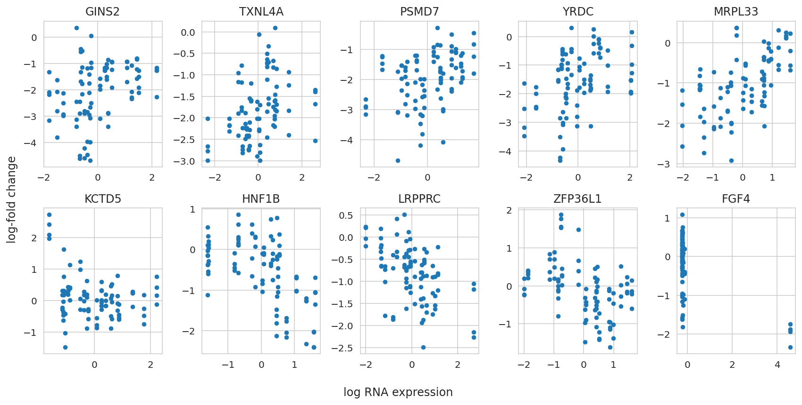


```python
top_n = 5
top_d_hits = (
    liver_post_summary.query("var_name == 'd'")
    .sort_values("mean")
    .reset_index(drop=True)
    .pipe(extract_coords_param_names, names=["hugo_symbol"], col="parameter")
    .pipe(head_tail, n=top_n)
)

negative_d = top_d_hits["hugo_symbol"][:top_n].values
positive_d = top_d_hits["hugo_symbol"][top_n:].values


fig, axes = plt.subplots(2, top_n, figsize=(12, 6))

for i, genes in enumerate([positive_d, negative_d]):
    for j, gene in enumerate(genes):
        ax = axes[i, j]
        ax.set_title(gene)
        obs_data = valid_liver_data.query(f"hugo_symbol == '{gene}'")
        sns.scatterplot(data=obs_data, x="cn_gene", y="lfc", ax=ax)
        ax.set_xlabel(None)
        ax.set_ylabel(None)


fig.supxlabel("copy number")
fig.supylabel("log-fold change")
fig.tight_layout()
plt.show()
```


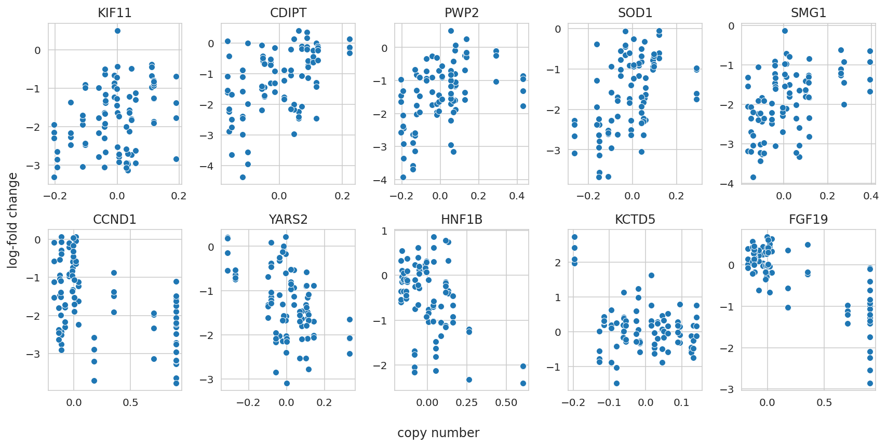


## PPC


```python
n_examples = 40
n_chains, n_draws, n_data = trace.posterior_predictive["ct_final"].shape
ex_draws_idx = np.random.choice(
    np.arange(n_draws), size=n_examples // n_chains, replace=False
)
example_ppc_draws = trace.posterior_predictive["ct_final"][
    :, ex_draws_idx, :
].values.reshape(-1, n_data)
example_ppc_draws.shape
```


    (40, 1563306)


```python
fig, axes = plt.subplots(ncols=2, figsize=(9, 4), sharex=False, sharey=False)
ax1 = axes[0]
ax2 = axes[1]

pp_avg = trace.posterior_predictive["ct_final"].mean(axis=(0, 1))

for i in range(example_ppc_draws.shape[0]):
    sns.kdeplot(
        x=np.log10(example_ppc_draws[i, :] + 1), alpha=0.2, color="tab:blue", ax=ax1
    )

sns.kdeplot(x=np.log10(pp_avg + 1), color="tab:orange", ax=ax1)
sns.kdeplot(x=np.log10(valid_liver_data["counts_final"] + 1), color="k", ax=ax1)
ax1.set_xlabel("log10(counts final + 1)")
ax1.set_ylabel("density")

x_max = 1000
x_cut = x_max * 5
for i in range(example_ppc_draws.shape[0]):
    x = example_ppc_draws[i, :]
    x = x[x < x_cut]
    sns.kdeplot(x=x, alpha=0.2, color="tab:blue", ax=ax2)

sns.kdeplot(x=pp_avg[pp_avg < x_cut], color="tab:orange", ax=ax2)
_obs = valid_liver_data["counts_final"].values
_obs = _obs[_obs < x_cut]
sns.kdeplot(x=_obs, color="k", ax=ax2)
ax2.set_xlabel("counts final")
ax2.set_ylabel("density")
ax2.set_xlim(0, x_max)

fig.suptitle("PPC")
fig.tight_layout()
plt.show()
```


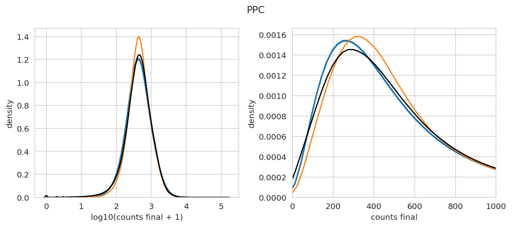


---

## Session info


```python
notebook_toc = time()
print(f"execution time: {(notebook_toc - notebook_tic) / 60:.2f} minutes")
```

    execution time: 21.89 minutes


```python
%load_ext watermark
%watermark -d -u -v -iv -b -h -m
```

    Last updated: 2022-08-05

    Python implementation: CPython
    Python version       : 3.10.5
    IPython version      : 8.4.0

    Compiler    : GCC 10.3.0
    OS          : Linux
    Release     : 3.10.0-1160.45.1.el7.x86_64
    Machine     : x86_64
    Processor   : x86_64
    CPU cores   : 28
    Architecture: 64bit

    Hostname: compute-e-16-229.o2.rc.hms.harvard.edu

    Git branch: simplify

    arviz     : 0.12.1
    matplotlib: 3.5.2
    pandas    : 1.4.3
    numpy     : 1.23.1
    seaborn   : 0.11.2


```python

```
