# Inspect the single-lineage model run on the prostate data (008)

 Model attributes:

- sgRNA | gene varying intercept
- RNA and CN varying effects per gene
- correlation between gene varying effects modeled using the multivariate normal and Cholesky decomposition (non-centered parameterization)
- target gene mutation variable and cancer gene comutation variable.
- varying intercept and slope for copy number for chromosome nested with in cell line


```python
%load_ext autoreload
%autoreload 2
```


```python
from math import ceil
from time import time

import arviz as az
import matplotlib.pyplot as plt
import numpy as np
import pandas as pd
import seaborn as sns
from IPython.display import Markdown, display
```


```python
from speclet.analysis.arviz_analysis import extract_coords_param_names
from speclet.bayesian_models.lineage_hierarchical_nb import LineageHierNegBinomModel
from speclet.data_processing.common import head_tail
from speclet.io import modeling_data_dir, models_dir
from speclet.managers.data_managers import CrisprScreenDataManager, broad_only
from speclet.plot import set_speclet_theme
from speclet.project_configuration import arviz_config
```


```python
# Notebook execution timer.
notebook_tic = time()

# Plotting setup.
set_speclet_theme()
%config InlineBackend.figure_format = "retina"
arviz_config()
```

## Data


```python
saved_model_dir = models_dir() / "hnb-single-lineage-prostate-008_PYMC_NUMPYRO"
```


```python
with open(saved_model_dir / "description.txt") as f:
    model_description = "".join(list(f))

print(model_description)
```

    config. name: 'hnb-single-lineage-prostate-008'
    model name: 'LineageHierNegBinomModel'
    model version: '0.0.3'
    model description: A hierarchical negative binomial generalized linear model fora single lineage.fit method: 'PYMC_NUMPYRO'

    --------------------------------------------------------------------------------

    CONFIGURATION

    {
        "name": "hnb-single-lineage-prostate-008",
        "description": " Single lineage hierarchical negative binomial model for prostate data from the Broad.\nVarying effects for each chromosome of each cell line has been nested under the existing varying effects for cell line. ",
        "active": true,
        "model": "LINEAGE_HIERARCHICAL_NB",
        "data_file": "modeling_data/lineage-modeling-data/depmap-modeling-data_prostate.csv",
        "model_kwargs": {
            "lineage": "prostate"
        },
        "sampling_kwargs": {
            "pymc_mcmc": null,
            "pymc_advi": null,
            "pymc_numpyro": {
                "draws": 1000,
                "tune": 1500,
                "chains": 4,
                "target_accept": 0.98,
                "progress_bar": true,
                "chain_method": "parallel",
                "postprocessing_backend": "cpu",
                "idata_kwargs": {
                    "log_likelihood": false
                },
                "nuts_kwargs": {
                    "step_size": 0.01,
                    "max_tree_depth": 11
                }
            }
        }
    }

    --------------------------------------------------------------------------------

    POSTERIOR

    <xarray.Dataset>
    Dimensions:                    (chain: 4, draw: 1000, delta_genes_dim_0: 5,
                                    delta_genes_dim_1: 18119, sgrna: 71062,
                                    delta_cells_dim_0: 2, delta_cells_dim_1: 5,
                                    cell_chrom: 115, genes_chol_cov_dim_0: 15,
                                    cells_chol_cov_dim_0: 3,
                                    genes_chol_cov_corr_dim_0: 5,
                                    genes_chol_cov_corr_dim_1: 5,
                                    genes_chol_cov_stds_dim_0: 5, cancer_gene: 1,
                                    gene: 18119, cells_chol_cov_corr_dim_0: 2,
                                    cells_chol_cov_corr_dim_1: 2,
                                    cells_chol_cov_stds_dim_0: 2, cell_line: 5)
    Coordinates: (12/19)
      * chain                      (chain) int64 0 1 2 3
      * draw                       (draw) int64 0 1 2 3 4 5 ... 995 996 997 998 999
      * delta_genes_dim_0          (delta_genes_dim_0) int64 0 1 2 3 4
      * delta_genes_dim_1          (delta_genes_dim_1) int64 0 1 2 ... 18117 18118
      * sgrna                      (sgrna) object 'AAAAAAATCCAGCAATGCAG' ... 'TTT...
      * delta_cells_dim_0          (delta_cells_dim_0) int64 0 1
        ...                         ...
      * cancer_gene                (cancer_gene) object 'ZFHX3'
      * gene                       (gene) object 'A1BG' 'A1CF' ... 'ZZEF1' 'ZZZ3'
      * cells_chol_cov_corr_dim_0  (cells_chol_cov_corr_dim_0) int64 0 1
      * cells_chol_cov_corr_dim_1  (cells_chol_cov_corr_dim_1) int64 0 1
      * cells_chol_cov_stds_dim_0  (cells_chol_cov_stds_dim_0) int64 0 1
      * cell_line                  (cell_line) object 'ACH-000115' ... 'ACH-001648'
    Data variables: (12/35)
        mu_mu_a                    (chain, draw) float64 ...
        mu_b                       (chain, draw) float64 ...
        delta_genes                (chain, draw, delta_genes_dim_0, delta_genes_dim_1) float64 ...
        delta_a                    (chain, draw, sgrna) float64 ...
        mu_mu_m                    (chain, draw) float64 ...
        delta_cells                (chain, draw, delta_cells_dim_0, delta_cells_dim_1) float64 ...
        ...                         ...
        sigma_mu_k                 (chain, draw) float64 ...
        sigma_mu_m                 (chain, draw) float64 ...
        mu_k                       (chain, draw, cell_line) float64 ...
        mu_m                       (chain, draw, cell_line) float64 ...
        k                          (chain, draw, cell_chrom) float64 ...
        m                          (chain, draw, cell_chrom) float64 ...
    Attributes:
        created_at:           2022-08-07 22:52:41.742053
        arviz_version:        0.12.1
        model_name:           LineageHierNegBinomModel
        model_version:        0.0.3
        model_doc:            A hierarchical negative binomial generalized linear...
        previous_created_at:  ['2022-08-07 22:52:41.742053', '2022-08-08T02:36:24...

    --------------------------------------------------------------------------------

    SAMPLE STATS

    <xarray.Dataset>
    Dimensions:          (chain: 4, draw: 1000)
    Coordinates:
      * chain            (chain) int64 0 1 2 3
      * draw             (draw) int64 0 1 2 3 4 5 6 ... 993 994 995 996 997 998 999
    Data variables:
        acceptance_rate  (chain, draw) float64 ...
        step_size        (chain, draw) float64 ...
        diverging        (chain, draw) bool ...
        energy           (chain, draw) float64 ...
        n_steps          (chain, draw) int64 ...
        tree_depth       (chain, draw) int64 ...
        lp               (chain, draw) float64 ...
    Attributes:
        created_at:           2022-08-07 22:52:41.742053
        arviz_version:        0.12.1
        previous_created_at:  ['2022-08-07 22:52:41.742053', '2022-08-08T02:36:24...

    --------------------------------------------------------------------------------

    MCMC DESCRIPTION

    date created: 2022-08-07 22:52
    sampled 4 chains with (unknown) tuning steps and 1,000 draws
    num. divergences: 0, 0, 0, 0
    percent divergences: 0.0, 0.0, 0.0, 0.0
    BFMI: 2.001, 1.995, 0.588, 1.9
    avg. step size: 0.0, 0.0, 0.003, 0.0
    avg. accept prob.: 0.981, 0.987, 0.987, 0.974
    avg. tree depth: 11.0, 11.0, 11.0, 11.0


### Load posterior summary


```python
prostate_post_summary = pd.read_csv(saved_model_dir / "posterior-summary.csv").assign(
    var_name=lambda d: [x.split("[")[0] for x in d["parameter"]]
)
prostate_post_summary.head()
```


<div>
<style scoped>
    .dataframe tbody tr th:only-of-type {
        vertical-align: middle;
    }

    .dataframe tbody tr th {
        vertical-align: top;
    }

    .dataframe thead th {
        text-align: right;
    }
</style>
<table border="1" class="dataframe">
  <thead>
    <tr style="text-align: right;">
      <th></th>
      <th>parameter</th>
      <th>mean</th>
      <th>sd</th>
      <th>hdi_5.5%</th>
      <th>hdi_94.5%</th>
      <th>mcse_mean</th>
      <th>mcse_sd</th>
      <th>ess_bulk</th>
      <th>ess_tail</th>
      <th>r_hat</th>
      <th>var_name</th>
    </tr>
  </thead>
  <tbody>
    <tr>
      <th>0</th>
      <td>mu_mu_a</td>
      <td>0.102</td>
      <td>0.023</td>
      <td>0.066</td>
      <td>0.119</td>
      <td>0.009</td>
      <td>0.007</td>
      <td>6.0</td>
      <td>34.0</td>
      <td>2.55</td>
      <td>mu_mu_a</td>
    </tr>
    <tr>
      <th>1</th>
      <td>mu_b</td>
      <td>0.006</td>
      <td>0.006</td>
      <td>0.001</td>
      <td>0.016</td>
      <td>0.003</td>
      <td>0.002</td>
      <td>5.0</td>
      <td>11.0</td>
      <td>3.15</td>
      <td>mu_b</td>
    </tr>
    <tr>
      <th>2</th>
      <td>mu_mu_m</td>
      <td>-0.275</td>
      <td>0.084</td>
      <td>-0.326</td>
      <td>-0.145</td>
      <td>0.037</td>
      <td>0.030</td>
      <td>5.0</td>
      <td>12.0</td>
      <td>3.26</td>
      <td>mu_mu_m</td>
    </tr>
    <tr>
      <th>3</th>
      <td>sigma_a</td>
      <td>0.053</td>
      <td>0.092</td>
      <td>0.000</td>
      <td>0.212</td>
      <td>0.046</td>
      <td>0.035</td>
      <td>4.0</td>
      <td>4.0</td>
      <td>3.55</td>
      <td>sigma_a</td>
    </tr>
    <tr>
      <th>4</th>
      <td>sigma_k</td>
      <td>0.009</td>
      <td>0.014</td>
      <td>0.000</td>
      <td>0.033</td>
      <td>0.007</td>
      <td>0.005</td>
      <td>4.0</td>
      <td>4.0</td>
      <td>3.60</td>
      <td>sigma_k</td>
    </tr>
  </tbody>
</table>
</div>


### Load trace object


```python
trace_file = saved_model_dir / "posterior.netcdf"
assert trace_file.exists()
trace = az.from_netcdf(trace_file)
```

### Prostate data


```python
prostate_dm = CrisprScreenDataManager(
    modeling_data_dir() / "lineage-modeling-data" / "depmap-modeling-data_prostate.csv",
    transformations=[broad_only],
)
```


```python
prostate_data = prostate_dm.get_data(read_kwargs={"low_memory": False})
prostate_data.head()
```


<div>
<style scoped>
    .dataframe tbody tr th:only-of-type {
        vertical-align: middle;
    }

    .dataframe tbody tr th {
        vertical-align: top;
    }

    .dataframe thead th {
        text-align: right;
    }
</style>
<table border="1" class="dataframe">
  <thead>
    <tr style="text-align: right;">
      <th></th>
      <th>sgrna</th>
      <th>replicate_id</th>
      <th>lfc</th>
      <th>p_dna_batch</th>
      <th>genome_alignment</th>
      <th>hugo_symbol</th>
      <th>screen</th>
      <th>multiple_hits_on_gene</th>
      <th>sgrna_target_chr</th>
      <th>sgrna_target_pos</th>
      <th>...</th>
      <th>any_deleterious</th>
      <th>any_tcga_hotspot</th>
      <th>any_cosmic_hotspot</th>
      <th>is_mutated</th>
      <th>copy_number</th>
      <th>lineage</th>
      <th>lineage_subtype</th>
      <th>primary_or_metastasis</th>
      <th>is_male</th>
      <th>age</th>
    </tr>
  </thead>
  <tbody>
    <tr>
      <th>0</th>
      <td>AAAGCCCAGGAGTATGGGAG</td>
      <td>Vcap-304Cas9_RepA_p4_batch3</td>
      <td>0.246450</td>
      <td>3</td>
      <td>chr2_130522105_-</td>
      <td>CFC1B</td>
      <td>broad</td>
      <td>True</td>
      <td>2</td>
      <td>130522105</td>
      <td>...</td>
      <td>NaN</td>
      <td>NaN</td>
      <td>NaN</td>
      <td>False</td>
      <td>0.999455</td>
      <td>prostate</td>
      <td>prostate_adenocarcinoma</td>
      <td>metastasis</td>
      <td>True</td>
      <td>59.0</td>
    </tr>
    <tr>
      <th>1</th>
      <td>AAATCAGAGAAACCTGAACG</td>
      <td>Vcap-304Cas9_RepA_p4_batch3</td>
      <td>0.626518</td>
      <td>3</td>
      <td>chr11_89916950_-</td>
      <td>TRIM49D1</td>
      <td>broad</td>
      <td>True</td>
      <td>11</td>
      <td>89916950</td>
      <td>...</td>
      <td>NaN</td>
      <td>NaN</td>
      <td>NaN</td>
      <td>False</td>
      <td>1.281907</td>
      <td>prostate</td>
      <td>prostate_adenocarcinoma</td>
      <td>metastasis</td>
      <td>True</td>
      <td>59.0</td>
    </tr>
    <tr>
      <th>2</th>
      <td>AACGTCTTTGAAGAAAGCTG</td>
      <td>Vcap-304Cas9_RepA_p4_batch3</td>
      <td>0.165114</td>
      <td>3</td>
      <td>chr5_71055421_-</td>
      <td>GTF2H2</td>
      <td>broad</td>
      <td>True</td>
      <td>5</td>
      <td>71055421</td>
      <td>...</td>
      <td>NaN</td>
      <td>NaN</td>
      <td>NaN</td>
      <td>False</td>
      <td>0.616885</td>
      <td>prostate</td>
      <td>prostate_adenocarcinoma</td>
      <td>metastasis</td>
      <td>True</td>
      <td>59.0</td>
    </tr>
    <tr>
      <th>3</th>
      <td>AACGTCTTTGAAGGAAGCTG</td>
      <td>Vcap-304Cas9_RepA_p4_batch3</td>
      <td>-0.094688</td>
      <td>3</td>
      <td>chr5_69572480_+</td>
      <td>GTF2H2C</td>
      <td>broad</td>
      <td>True</td>
      <td>5</td>
      <td>69572480</td>
      <td>...</td>
      <td>NaN</td>
      <td>NaN</td>
      <td>NaN</td>
      <td>False</td>
      <td>0.616885</td>
      <td>prostate</td>
      <td>prostate_adenocarcinoma</td>
      <td>metastasis</td>
      <td>True</td>
      <td>59.0</td>
    </tr>
    <tr>
      <th>4</th>
      <td>AAGAGGTTCCAGACTACTTA</td>
      <td>Vcap-304Cas9_RepA_p4_batch3</td>
      <td>0.294496</td>
      <td>3</td>
      <td>chrX_155898173_+</td>
      <td>VAMP7</td>
      <td>broad</td>
      <td>True</td>
      <td>X</td>
      <td>155898173</td>
      <td>...</td>
      <td>NaN</td>
      <td>NaN</td>
      <td>NaN</td>
      <td>False</td>
      <td>0.615935</td>
      <td>prostate</td>
      <td>prostate_adenocarcinoma</td>
      <td>metastasis</td>
      <td>True</td>
      <td>59.0</td>
    </tr>
  </tbody>
</table>
<p>5 rows × 25 columns</p>
</div>


### Single lineage model


```python
prostate_model = LineageHierNegBinomModel(lineage="prostate")
```


```python
valid_prostate_data = prostate_model.data_processing_pipeline(prostate_data.copy())
prostate_mdl_data = prostate_model.make_data_structure(valid_prostate_data)
```

    [INFO] 2022-08-08 09:02:37 [(lineage_hierarchical_nb.py:data_processing_pipeline:317] Processing data for modeling.
    [INFO] 2022-08-08 09:02:37 [(lineage_hierarchical_nb.py:data_processing_pipeline:318] LFC limits: (-5.0, 5.0)
    [WARNING] 2022-08-08 09:03:57 [(lineage_hierarchical_nb.py:data_processing_pipeline:376] number of data points dropped: 2
    [INFO] 2022-08-08 09:03:57 [(lineage_hierarchical_nb.py:target_gene_is_mutated_vector:587] number of genes mutated in all cells lines: 0
    [DEBUG] 2022-08-08 09:03:57 [(lineage_hierarchical_nb.py:target_gene_is_mutated_vector:590] Genes always mutated:
    [DEBUG] 2022-08-08 09:03:57 [(cancer_gene_mutation_matrix.py:_trim_cancer_genes:68] all_mut: {}
    [INFO] 2022-08-08 09:03:57 [(cancer_gene_mutation_matrix.py:_trim_cancer_genes:77] Dropping 8 cancer genes.
    [DEBUG] 2022-08-08 09:03:57 [(cancer_gene_mutation_matrix.py:_trim_cancer_genes:79] Dropped cancer genes: ['AR', 'AXIN1', 'FOXA1', 'KLF6', 'NCOR2', 'PTEN', 'SALL4', 'SPOP']


## Analysis


```python
sns.histplot(x=prostate_post_summary["r_hat"], binwidth=0.01, stat="proportion");
```


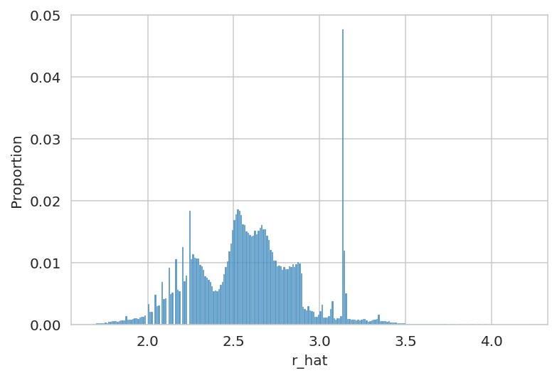


```python
fig, ax = plt.subplots(figsize=(8, 5))
sns.boxplot(data=prostate_post_summary, x="var_name", y="r_hat", ax=ax)
ax.tick_params(rotation=90)
plt.show()
```


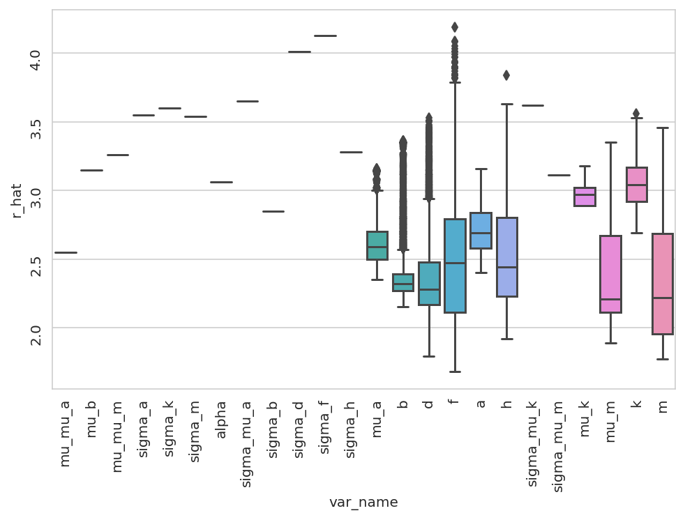


```python
az.plot_energy(trace);
```


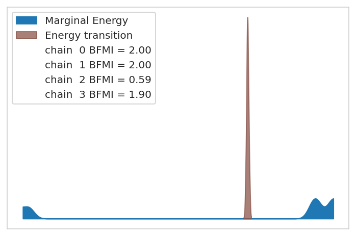


```python
energy = trace.sample_stats.energy.values
marginal_e = pd.DataFrame((energy - energy.mean(axis=1)[:, None]).T).assign(
    energy="marginal"
)
transition_e = pd.DataFrame((energy[:, :-1] - energy[:, 1:]).T).assign(
    energy="transition"
)
energy_df = pd.concat([marginal_e, transition_e]).reset_index(drop=True)
bfmi = az.bfmi(trace)

fig, axes = plt.subplots(2, 2, figsize=(8, 6))
for i, ax in enumerate(axes.flatten()):
    sns.kdeplot(data=energy_df, x=i, hue="energy", ax=ax)
    ax.set_title(f"chain {i} – BFMI: {bfmi[i]:0.2f}")
    ax.set_xlabel(None)
    xmin, _ = ax.get_xlim()
    _, ymax = ax.get_ylim()
    ax.get_legend().set_frame_on(False)

fig.tight_layout()
plt.show()
```


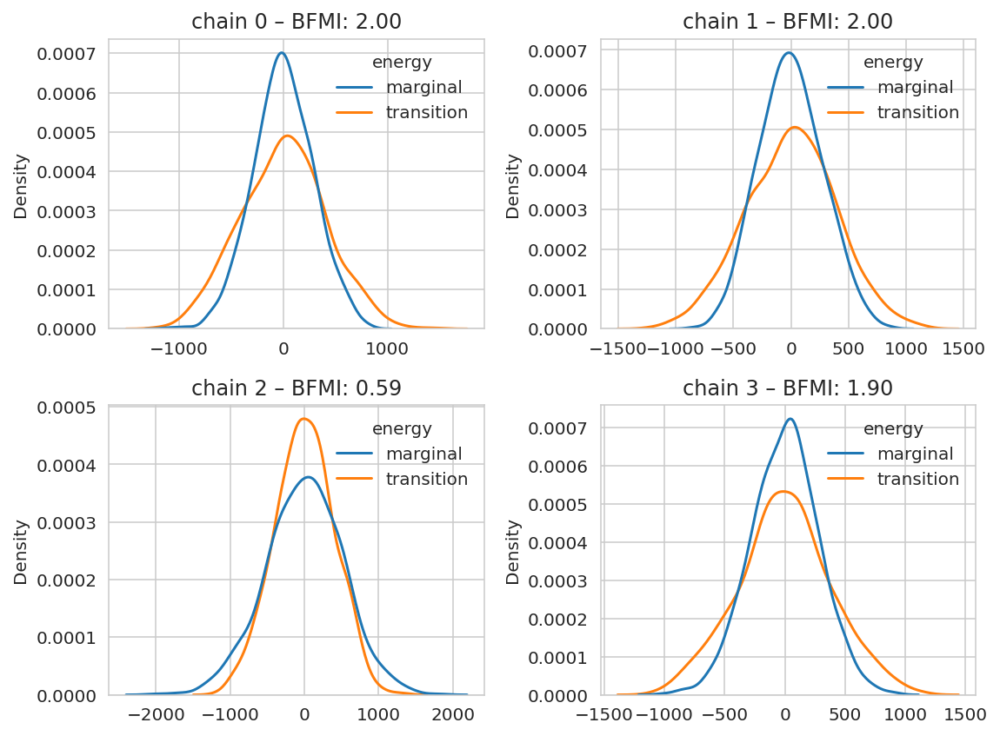


```python
hmc_energy = (
    trace.sample_stats.get("energy")
    .to_dataframe()
    .reset_index(drop=False)
    .astype({"chain": "category"})
)
ax = sns.lineplot(data=hmc_energy, x="draw", y="energy", hue="chain", palette="Set1")
ax.set_xlim(0, hmc_energy["draw"].max())
plt.show()
```


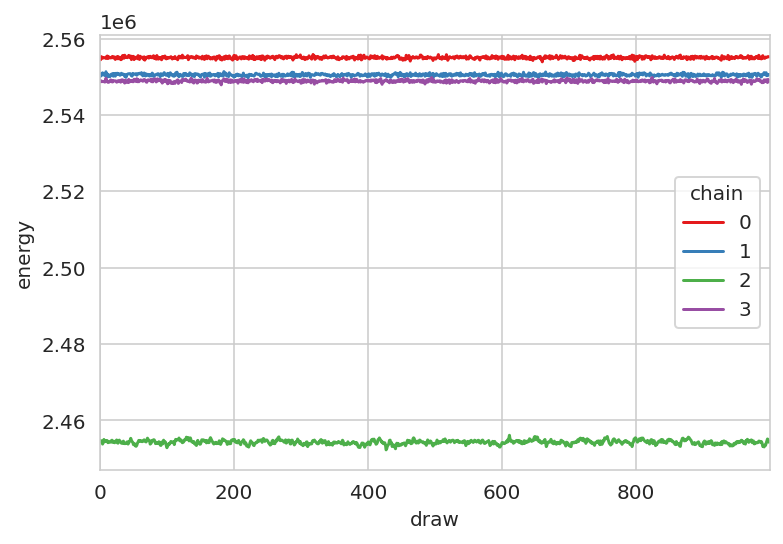


```python
stats = ["step_size", "n_steps", "tree_depth", "acceptance_rate", "energy"]
trace.sample_stats.get(stats).to_dataframe().groupby("chain").mean()
```


<div>
<style scoped>
    .dataframe tbody tr th:only-of-type {
        vertical-align: middle;
    }

    .dataframe tbody tr th {
        vertical-align: top;
    }

    .dataframe thead th {
        text-align: right;
    }
</style>
<table border="1" class="dataframe">
  <thead>
    <tr style="text-align: right;">
      <th></th>
      <th>step_size</th>
      <th>n_steps</th>
      <th>tree_depth</th>
      <th>acceptance_rate</th>
      <th>energy</th>
    </tr>
    <tr>
      <th>chain</th>
      <th></th>
      <th></th>
      <th></th>
      <th></th>
      <th></th>
    </tr>
  </thead>
  <tbody>
    <tr>
      <th>0</th>
      <td>1.599252e-10</td>
      <td>2047.0</td>
      <td>11.0</td>
      <td>0.980880</td>
      <td>2.555008e+06</td>
    </tr>
    <tr>
      <th>1</th>
      <td>2.494715e-14</td>
      <td>2047.0</td>
      <td>11.0</td>
      <td>0.987095</td>
      <td>2.550493e+06</td>
    </tr>
    <tr>
      <th>2</th>
      <td>2.656016e-03</td>
      <td>2047.0</td>
      <td>11.0</td>
      <td>0.987374</td>
      <td>2.454301e+06</td>
    </tr>
    <tr>
      <th>3</th>
      <td>1.294592e-08</td>
      <td>2047.0</td>
      <td>11.0</td>
      <td>0.974076</td>
      <td>2.548882e+06</td>
    </tr>
  </tbody>
</table>
</div>


```python
HAPPY_CHAINS = [2]
```


```python
az.plot_trace(trace, var_names=["mu_mu_a", "mu_b", "mu_m"], compact=False)
plt.tight_layout()
plt.show()
```


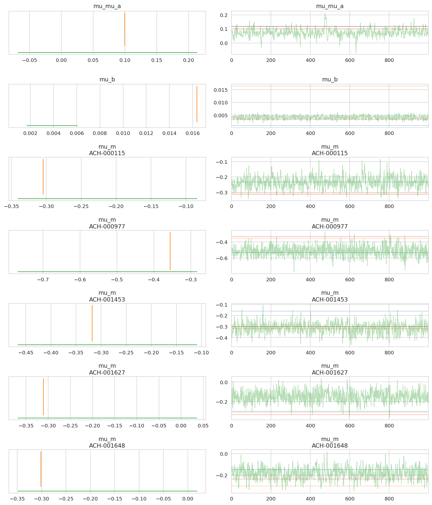


```python
az.plot_trace(trace, var_names=["^sigma_*"], filter_vars="regex", compact=False)
plt.tight_layout()
```

    /home/jc604/.conda/envs/speclet/lib/python3.10/site-packages/arviz/stats/density_utils.py:491: UserWarning: Your data appears to have a single value or no finite values
      warnings.warn("Your data appears to have a single value or no finite values")
    /home/jc604/.conda/envs/speclet/lib/python3.10/site-packages/arviz/stats/density_utils.py:491: UserWarning: Your data appears to have a single value or no finite values
      warnings.warn("Your data appears to have a single value or no finite values")
    /home/jc604/.conda/envs/speclet/lib/python3.10/site-packages/arviz/stats/density_utils.py:491: UserWarning: Your data appears to have a single value or no finite values
      warnings.warn("Your data appears to have a single value or no finite values")
    /home/jc604/.conda/envs/speclet/lib/python3.10/site-packages/arviz/stats/density_utils.py:491: UserWarning: Your data appears to have a single value or no finite values
      warnings.warn("Your data appears to have a single value or no finite values")
    /home/jc604/.conda/envs/speclet/lib/python3.10/site-packages/arviz/stats/density_utils.py:491: UserWarning: Your data appears to have a single value or no finite values
      warnings.warn("Your data appears to have a single value or no finite values")


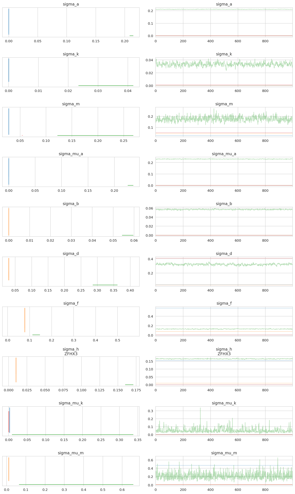


```python
sigmas = ["sigma_mu_a", "sigma_b", "sigma_d", "sigma_f", "sigma_k"]
trace.posterior.get(sigmas).mean(dim="draw").to_dataframe()
```


<div>
<style scoped>
    .dataframe tbody tr th:only-of-type {
        vertical-align: middle;
    }

    .dataframe tbody tr th {
        vertical-align: top;
    }

    .dataframe thead th {
        text-align: right;
    }
</style>
<table border="1" class="dataframe">
  <thead>
    <tr style="text-align: right;">
      <th></th>
      <th>sigma_mu_a</th>
      <th>sigma_b</th>
      <th>sigma_d</th>
      <th>sigma_f</th>
      <th>sigma_k</th>
    </tr>
    <tr>
      <th>chain</th>
      <th></th>
      <th></th>
      <th></th>
      <th></th>
      <th></th>
    </tr>
  </thead>
  <tbody>
    <tr>
      <th>0</th>
      <td>3.350969e-14</td>
      <td>1.602743e-12</td>
      <td>0.033105</td>
      <td>0.570832</td>
      <td>1.047392e-05</td>
    </tr>
    <tr>
      <th>1</th>
      <td>1.621624e-12</td>
      <td>2.806242e-16</td>
      <td>0.030183</td>
      <td>0.078072</td>
      <td>2.914971e-11</td>
    </tr>
    <tr>
      <th>2</th>
      <td>2.303786e-01</td>
      <td>5.700978e-02</td>
      <td>0.321644</td>
      <td>0.129522</td>
      <td>3.312310e-02</td>
    </tr>
    <tr>
      <th>3</th>
      <td>7.609938e-09</td>
      <td>1.138677e-10</td>
      <td>0.408969</td>
      <td>0.004811</td>
      <td>1.384195e-03</td>
    </tr>
  </tbody>
</table>
</div>


```python
az.plot_trace(trace, var_names=["alpha"], compact=False)
plt.tight_layout()
```


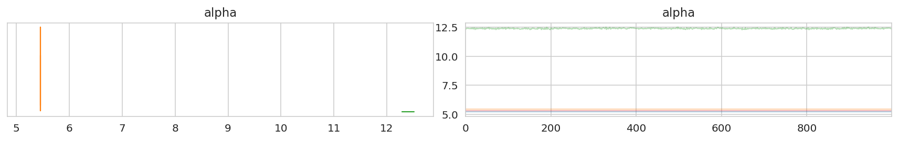


```python
az.plot_forest(
    trace, var_names=["^sigma_*"], filter_vars="regex", combined=False, figsize=(5, 5)
)
plt.tight_layout()
```


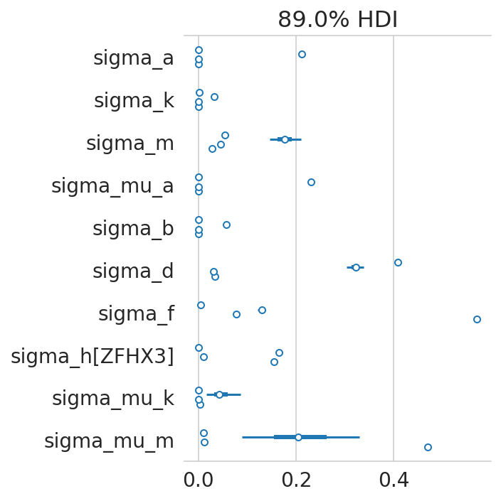


```python
trace.posterior = trace.posterior.sel(chain=HAPPY_CHAINS)
```


```python
az.plot_trace(
    trace, var_names=["mu_mu_a", "mu_b", "mu_k", "mu_mu_m", "mu_m"], compact=True
)
plt.tight_layout()
plt.show()
```


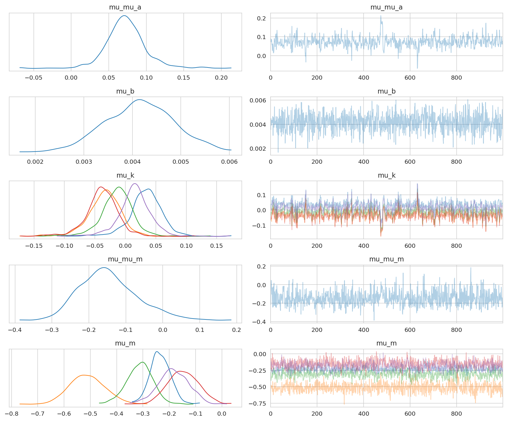


```python
az.plot_trace(trace, var_names=["^sigma_*"], filter_vars="regex", compact=True)
plt.tight_layout()
plt.show()
```


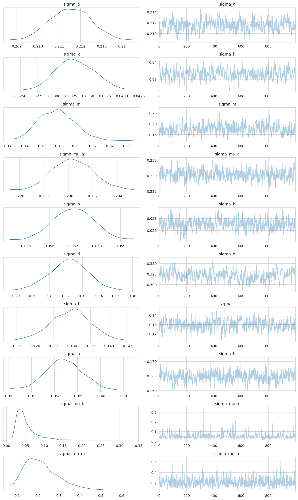


```python
az.plot_forest(
    trace,
    var_names=["sigma_mu_a", "sigma_b", "sigma_d", "sigma_f", "sigma_h"],
    figsize=(5, 3),
    combined=True,
);
```


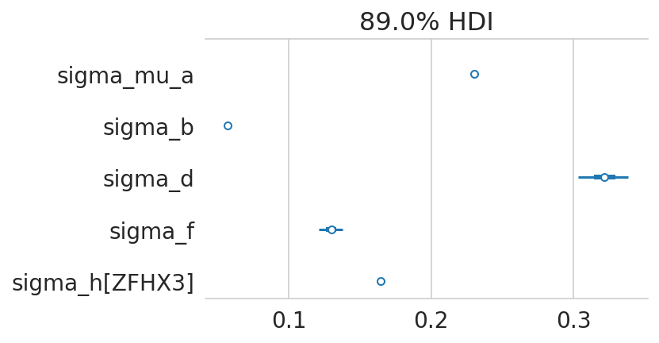


```python
az.plot_forest(
    trace,
    var_names=["sigma_mu_k", "mu_k", "sigma_k", "mu_mu_m", "sigma_mu_m", "mu_m"],
    figsize=(5, 6),
    combined=True,
);
```


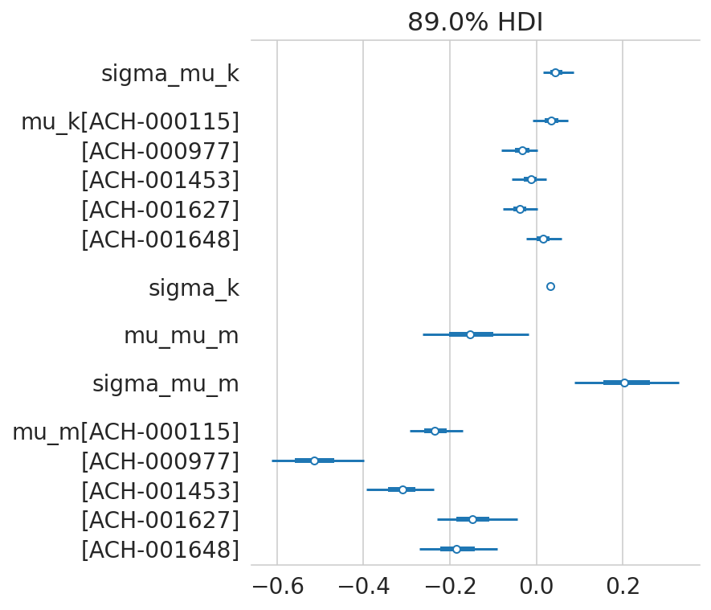


```python
var_names = ["a", "mu_a", "b", "d", "f", "h"]
_, axes = plt.subplots(2, 3, figsize=(8, 6), sharex=True)
for ax, var_name in zip(axes.flatten(), var_names):
    x = prostate_post_summary.query(f"var_name == '{var_name}'")["mean"]
    sns.kdeplot(x=x, ax=ax)
    ax.set_title(var_name)
    ax.set_xlim(-2, 1)

plt.tight_layout()
plt.show()
```


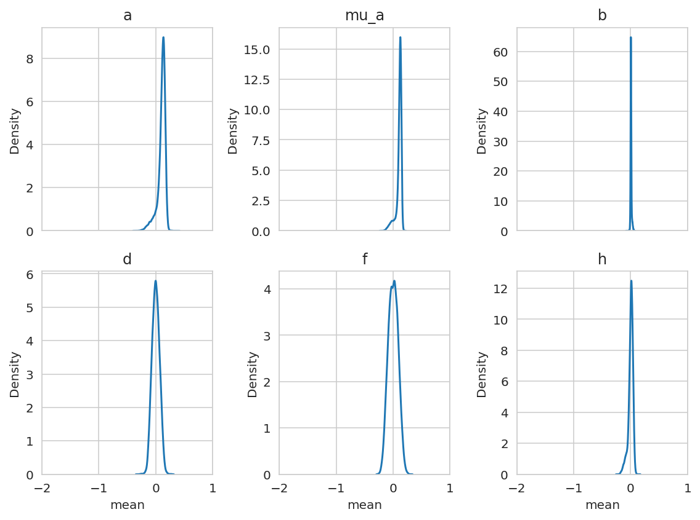


```python
sgrna_to_gene_map = (
    prostate_data.copy()[["hugo_symbol", "sgrna"]]
    .drop_duplicates()
    .reset_index(drop=True)
)
```


```python
for v in ["mu_a", "b", "d", "f", "h", "k", "m"]:
    display(Markdown(f"variable: **{v}**"))
    top = (
        prostate_post_summary.query(f"var_name == '{v}'")
        .sort_values("mean")
        .pipe(head_tail, 5)
    )
    display(top)
```


variable: **mu_a**


<div>
<style scoped>
    .dataframe tbody tr th:only-of-type {
        vertical-align: middle;
    }

    .dataframe tbody tr th {
        vertical-align: top;
    }

    .dataframe thead th {
        text-align: right;
    }
</style>
<table border="1" class="dataframe">
  <thead>
    <tr style="text-align: right;">
      <th></th>
      <th>parameter</th>
      <th>mean</th>
      <th>sd</th>
      <th>hdi_5.5%</th>
      <th>hdi_94.5%</th>
      <th>mcse_mean</th>
      <th>mcse_sd</th>
      <th>ess_bulk</th>
      <th>ess_tail</th>
      <th>r_hat</th>
      <th>var_name</th>
    </tr>
  </thead>
  <tbody>
    <tr>
      <th>7786</th>
      <td>mu_a[KIF11]</td>
      <td>-0.218</td>
      <td>0.573</td>
      <td>-1.221</td>
      <td>0.119</td>
      <td>0.284</td>
      <td>0.218</td>
      <td>5.0</td>
      <td>17.0</td>
      <td>3.14</td>
      <td>mu_a</td>
    </tr>
    <tr>
      <th>6988</th>
      <td>mu_a[HSPE1]</td>
      <td>-0.173</td>
      <td>0.496</td>
      <td>-1.044</td>
      <td>0.119</td>
      <td>0.246</td>
      <td>0.188</td>
      <td>5.0</td>
      <td>17.0</td>
      <td>3.15</td>
      <td>mu_a</td>
    </tr>
    <tr>
      <th>14745</th>
      <td>mu_a[SPC24]</td>
      <td>-0.169</td>
      <td>0.490</td>
      <td>-1.025</td>
      <td>0.119</td>
      <td>0.243</td>
      <td>0.186</td>
      <td>5.0</td>
      <td>17.0</td>
      <td>3.15</td>
      <td>mu_a</td>
    </tr>
    <tr>
      <th>4440</th>
      <td>mu_a[DUX4]</td>
      <td>-0.165</td>
      <td>0.481</td>
      <td>-1.005</td>
      <td>0.119</td>
      <td>0.239</td>
      <td>0.182</td>
      <td>5.0</td>
      <td>17.0</td>
      <td>3.14</td>
      <td>mu_a</td>
    </tr>
    <tr>
      <th>12654</th>
      <td>mu_a[RAN]</td>
      <td>-0.165</td>
      <td>0.481</td>
      <td>-1.016</td>
      <td>0.119</td>
      <td>0.238</td>
      <td>0.182</td>
      <td>5.0</td>
      <td>17.0</td>
      <td>3.14</td>
      <td>mu_a</td>
    </tr>
    <tr>
      <th>941</th>
      <td>mu_a[ARHGAP44]</td>
      <td>0.185</td>
      <td>0.137</td>
      <td>0.100</td>
      <td>0.420</td>
      <td>0.064</td>
      <td>0.049</td>
      <td>5.0</td>
      <td>23.0</td>
      <td>3.16</td>
      <td>mu_a</td>
    </tr>
    <tr>
      <th>12058</th>
      <td>mu_a[PRAMEF4]</td>
      <td>0.186</td>
      <td>0.138</td>
      <td>0.100</td>
      <td>0.420</td>
      <td>0.065</td>
      <td>0.049</td>
      <td>5.0</td>
      <td>23.0</td>
      <td>2.89</td>
      <td>mu_a</td>
    </tr>
    <tr>
      <th>6763</th>
      <td>mu_a[HLA-DQB1]</td>
      <td>0.187</td>
      <td>0.141</td>
      <td>0.100</td>
      <td>0.426</td>
      <td>0.065</td>
      <td>0.049</td>
      <td>5.0</td>
      <td>23.0</td>
      <td>2.90</td>
      <td>mu_a</td>
    </tr>
    <tr>
      <th>16215</th>
      <td>mu_a[TP53]</td>
      <td>0.200</td>
      <td>0.160</td>
      <td>0.100</td>
      <td>0.480</td>
      <td>0.077</td>
      <td>0.058</td>
      <td>5.0</td>
      <td>23.0</td>
      <td>3.16</td>
      <td>mu_a</td>
    </tr>
    <tr>
      <th>2456</th>
      <td>mu_a[CCNF]</td>
      <td>0.202</td>
      <td>0.166</td>
      <td>0.100</td>
      <td>0.485</td>
      <td>0.078</td>
      <td>0.059</td>
      <td>5.0</td>
      <td>23.0</td>
      <td>2.90</td>
      <td>mu_a</td>
    </tr>
  </tbody>
</table>
</div>


variable: **b**


<div>
<style scoped>
    .dataframe tbody tr th:only-of-type {
        vertical-align: middle;
    }

    .dataframe tbody tr th {
        vertical-align: top;
    }

    .dataframe thead th {
        text-align: right;
    }
</style>
<table border="1" class="dataframe">
  <thead>
    <tr style="text-align: right;">
      <th></th>
      <th>parameter</th>
      <th>mean</th>
      <th>sd</th>
      <th>hdi_5.5%</th>
      <th>hdi_94.5%</th>
      <th>mcse_mean</th>
      <th>mcse_sd</th>
      <th>ess_bulk</th>
      <th>ess_tail</th>
      <th>r_hat</th>
      <th>var_name</th>
    </tr>
  </thead>
  <tbody>
    <tr>
      <th>22903</th>
      <td>b[EP300]</td>
      <td>-0.079</td>
      <td>0.150</td>
      <td>-0.341</td>
      <td>0.016</td>
      <td>0.074</td>
      <td>0.056</td>
      <td>5.0</td>
      <td>29.0</td>
      <td>3.32</td>
      <td>b</td>
    </tr>
    <tr>
      <th>34345</th>
      <td>b[TP63]</td>
      <td>-0.041</td>
      <td>0.086</td>
      <td>-0.192</td>
      <td>0.016</td>
      <td>0.042</td>
      <td>0.032</td>
      <td>5.0</td>
      <td>29.0</td>
      <td>3.32</td>
      <td>b</td>
    </tr>
    <tr>
      <th>33384</th>
      <td>b[TADA1]</td>
      <td>-0.040</td>
      <td>0.084</td>
      <td>-0.187</td>
      <td>0.016</td>
      <td>0.041</td>
      <td>0.031</td>
      <td>5.0</td>
      <td>29.0</td>
      <td>3.32</td>
      <td>b</td>
    </tr>
    <tr>
      <th>33099</th>
      <td>b[STAG2]</td>
      <td>-0.039</td>
      <td>0.081</td>
      <td>-0.181</td>
      <td>0.016</td>
      <td>0.039</td>
      <td>0.030</td>
      <td>5.0</td>
      <td>31.0</td>
      <td>3.33</td>
      <td>b</td>
    </tr>
    <tr>
      <th>24977</th>
      <td>b[HOXB13]</td>
      <td>-0.037</td>
      <td>0.079</td>
      <td>-0.174</td>
      <td>0.016</td>
      <td>0.038</td>
      <td>0.029</td>
      <td>5.0</td>
      <td>27.0</td>
      <td>3.32</td>
      <td>b</td>
    </tr>
    <tr>
      <th>27995</th>
      <td>b[NDUFB11]</td>
      <td>0.062</td>
      <td>0.097</td>
      <td>0.001</td>
      <td>0.232</td>
      <td>0.047</td>
      <td>0.036</td>
      <td>4.0</td>
      <td>11.0</td>
      <td>3.35</td>
      <td>b</td>
    </tr>
    <tr>
      <th>19387</th>
      <td>b[ATP6V1F]</td>
      <td>0.062</td>
      <td>0.098</td>
      <td>0.001</td>
      <td>0.234</td>
      <td>0.048</td>
      <td>0.036</td>
      <td>4.0</td>
      <td>11.0</td>
      <td>3.35</td>
      <td>b</td>
    </tr>
    <tr>
      <th>24317</th>
      <td>b[GPI]</td>
      <td>0.065</td>
      <td>0.104</td>
      <td>0.001</td>
      <td>0.246</td>
      <td>0.050</td>
      <td>0.038</td>
      <td>4.0</td>
      <td>11.0</td>
      <td>3.35</td>
      <td>b</td>
    </tr>
    <tr>
      <th>27885</th>
      <td>b[NARS2]</td>
      <td>0.067</td>
      <td>0.106</td>
      <td>0.001</td>
      <td>0.252</td>
      <td>0.052</td>
      <td>0.039</td>
      <td>4.0</td>
      <td>11.0</td>
      <td>3.35</td>
      <td>b</td>
    </tr>
    <tr>
      <th>18592</th>
      <td>b[AIFM1]</td>
      <td>0.073</td>
      <td>0.117</td>
      <td>0.001</td>
      <td>0.278</td>
      <td>0.057</td>
      <td>0.044</td>
      <td>4.0</td>
      <td>11.0</td>
      <td>3.35</td>
      <td>b</td>
    </tr>
  </tbody>
</table>
</div>


variable: **d**


<div>
<style scoped>
    .dataframe tbody tr th:only-of-type {
        vertical-align: middle;
    }

    .dataframe tbody tr th {
        vertical-align: top;
    }

    .dataframe thead th {
        text-align: right;
    }
</style>
<table border="1" class="dataframe">
  <thead>
    <tr style="text-align: right;">
      <th></th>
      <th>parameter</th>
      <th>mean</th>
      <th>sd</th>
      <th>hdi_5.5%</th>
      <th>hdi_94.5%</th>
      <th>mcse_mean</th>
      <th>mcse_sd</th>
      <th>ess_bulk</th>
      <th>ess_tail</th>
      <th>r_hat</th>
      <th>var_name</th>
    </tr>
  </thead>
  <tbody>
    <tr>
      <th>52956</th>
      <td>d[UBE2N]</td>
      <td>-0.323</td>
      <td>0.427</td>
      <td>-1.046</td>
      <td>-0.024</td>
      <td>0.204</td>
      <td>0.155</td>
      <td>5.0</td>
      <td>28.0</td>
      <td>3.41</td>
      <td>d</td>
    </tr>
    <tr>
      <th>40724</th>
      <td>d[EARS2]</td>
      <td>-0.285</td>
      <td>0.389</td>
      <td>-0.934</td>
      <td>0.010</td>
      <td>0.182</td>
      <td>0.138</td>
      <td>4.0</td>
      <td>11.0</td>
      <td>3.48</td>
      <td>d</td>
    </tr>
    <tr>
      <th>44643</th>
      <td>d[LONP1]</td>
      <td>-0.285</td>
      <td>0.367</td>
      <td>-0.871</td>
      <td>0.010</td>
      <td>0.169</td>
      <td>0.128</td>
      <td>4.0</td>
      <td>15.0</td>
      <td>3.28</td>
      <td>d</td>
    </tr>
    <tr>
      <th>44099</th>
      <td>d[KLF5]</td>
      <td>-0.276</td>
      <td>0.368</td>
      <td>-0.885</td>
      <td>0.017</td>
      <td>0.174</td>
      <td>0.132</td>
      <td>5.0</td>
      <td>21.0</td>
      <td>3.25</td>
      <td>d</td>
    </tr>
    <tr>
      <th>51054</th>
      <td>d[SPPL3]</td>
      <td>-0.270</td>
      <td>0.287</td>
      <td>-0.591</td>
      <td>-0.020</td>
      <td>0.128</td>
      <td>0.097</td>
      <td>6.0</td>
      <td>25.0</td>
      <td>2.38</td>
      <td>d</td>
    </tr>
    <tr>
      <th>47602</th>
      <td>d[PFDN5]</td>
      <td>0.260</td>
      <td>0.286</td>
      <td>0.002</td>
      <td>0.559</td>
      <td>0.127</td>
      <td>0.096</td>
      <td>6.0</td>
      <td>20.0</td>
      <td>2.19</td>
      <td>d</td>
    </tr>
    <tr>
      <th>42314</th>
      <td>d[GMPS]</td>
      <td>0.271</td>
      <td>0.326</td>
      <td>-0.031</td>
      <td>0.683</td>
      <td>0.147</td>
      <td>0.111</td>
      <td>5.0</td>
      <td>15.0</td>
      <td>2.58</td>
      <td>d</td>
    </tr>
    <tr>
      <th>38953</th>
      <td>d[CDT1]</td>
      <td>0.274</td>
      <td>0.331</td>
      <td>-0.013</td>
      <td>0.786</td>
      <td>0.154</td>
      <td>0.117</td>
      <td>4.0</td>
      <td>13.0</td>
      <td>3.21</td>
      <td>d</td>
    </tr>
    <tr>
      <th>41624</th>
      <td>d[FDFT1]</td>
      <td>0.285</td>
      <td>0.305</td>
      <td>0.017</td>
      <td>0.660</td>
      <td>0.136</td>
      <td>0.103</td>
      <td>5.0</td>
      <td>14.0</td>
      <td>2.53</td>
      <td>d</td>
    </tr>
    <tr>
      <th>45609</th>
      <td>d[MRPL39]</td>
      <td>0.290</td>
      <td>0.366</td>
      <td>-0.028</td>
      <td>0.855</td>
      <td>0.171</td>
      <td>0.130</td>
      <td>5.0</td>
      <td>28.0</td>
      <td>2.97</td>
      <td>d</td>
    </tr>
  </tbody>
</table>
</div>


variable: **f**


<div>
<style scoped>
    .dataframe tbody tr th:only-of-type {
        vertical-align: middle;
    }

    .dataframe tbody tr th {
        vertical-align: top;
    }

    .dataframe thead th {
        text-align: right;
    }
</style>
<table border="1" class="dataframe">
  <thead>
    <tr style="text-align: right;">
      <th></th>
      <th>parameter</th>
      <th>mean</th>
      <th>sd</th>
      <th>hdi_5.5%</th>
      <th>hdi_94.5%</th>
      <th>mcse_mean</th>
      <th>mcse_sd</th>
      <th>ess_bulk</th>
      <th>ess_tail</th>
      <th>r_hat</th>
      <th>var_name</th>
    </tr>
  </thead>
  <tbody>
    <tr>
      <th>63360</th>
      <td>f[MEGF9]</td>
      <td>-0.261</td>
      <td>0.344</td>
      <td>-0.845</td>
      <td>-0.000</td>
      <td>0.169</td>
      <td>0.131</td>
      <td>6.0</td>
      <td>28.0</td>
      <td>2.47</td>
      <td>f</td>
    </tr>
    <tr>
      <th>70149</th>
      <td>f[TMBIM6]</td>
      <td>-0.260</td>
      <td>0.412</td>
      <td>-0.968</td>
      <td>0.002</td>
      <td>0.204</td>
      <td>0.157</td>
      <td>6.0</td>
      <td>22.0</td>
      <td>2.72</td>
      <td>f</td>
    </tr>
    <tr>
      <th>61266</th>
      <td>f[HRASLS2]</td>
      <td>-0.259</td>
      <td>0.396</td>
      <td>-0.938</td>
      <td>0.005</td>
      <td>0.196</td>
      <td>0.151</td>
      <td>6.0</td>
      <td>13.0</td>
      <td>2.73</td>
      <td>f</td>
    </tr>
    <tr>
      <th>61235</th>
      <td>f[HOXD11]</td>
      <td>-0.258</td>
      <td>0.375</td>
      <td>-0.899</td>
      <td>-0.002</td>
      <td>0.185</td>
      <td>0.143</td>
      <td>6.0</td>
      <td>29.0</td>
      <td>2.49</td>
      <td>f</td>
    </tr>
    <tr>
      <th>56342</th>
      <td>f[C7orf57]</td>
      <td>-0.254</td>
      <td>0.381</td>
      <td>-0.905</td>
      <td>-0.004</td>
      <td>0.188</td>
      <td>0.145</td>
      <td>6.0</td>
      <td>14.0</td>
      <td>2.85</td>
      <td>f</td>
    </tr>
    <tr>
      <th>61786</th>
      <td>f[ISCU]</td>
      <td>0.262</td>
      <td>0.318</td>
      <td>0.002</td>
      <td>0.779</td>
      <td>0.157</td>
      <td>0.121</td>
      <td>5.0</td>
      <td>13.0</td>
      <td>3.19</td>
      <td>f</td>
    </tr>
    <tr>
      <th>68912</th>
      <td>f[SNRNP200]</td>
      <td>0.264</td>
      <td>0.287</td>
      <td>0.001</td>
      <td>0.728</td>
      <td>0.140</td>
      <td>0.108</td>
      <td>5.0</td>
      <td>18.0</td>
      <td>2.81</td>
      <td>f</td>
    </tr>
    <tr>
      <th>63725</th>
      <td>f[MRPL36]</td>
      <td>0.269</td>
      <td>0.330</td>
      <td>0.003</td>
      <td>0.807</td>
      <td>0.162</td>
      <td>0.125</td>
      <td>5.0</td>
      <td>14.0</td>
      <td>3.30</td>
      <td>f</td>
    </tr>
    <tr>
      <th>67712</th>
      <td>f[RSL24D1]</td>
      <td>0.271</td>
      <td>0.371</td>
      <td>-0.007</td>
      <td>0.889</td>
      <td>0.183</td>
      <td>0.141</td>
      <td>5.0</td>
      <td>22.0</td>
      <td>3.82</td>
      <td>f</td>
    </tr>
    <tr>
      <th>58986</th>
      <td>f[EIF3CL]</td>
      <td>0.304</td>
      <td>0.411</td>
      <td>-0.004</td>
      <td>0.990</td>
      <td>0.203</td>
      <td>0.157</td>
      <td>5.0</td>
      <td>23.0</td>
      <td>3.13</td>
      <td>f</td>
    </tr>
  </tbody>
</table>
</div>


variable: **h**


<div>
<style scoped>
    .dataframe tbody tr th:only-of-type {
        vertical-align: middle;
    }

    .dataframe tbody tr th {
        vertical-align: top;
    }

    .dataframe thead th {
        text-align: right;
    }
</style>
<table border="1" class="dataframe">
  <thead>
    <tr style="text-align: right;">
      <th></th>
      <th>parameter</th>
      <th>mean</th>
      <th>sd</th>
      <th>hdi_5.5%</th>
      <th>hdi_94.5%</th>
      <th>mcse_mean</th>
      <th>mcse_sd</th>
      <th>ess_bulk</th>
      <th>ess_tail</th>
      <th>r_hat</th>
      <th>var_name</th>
    </tr>
  </thead>
  <tbody>
    <tr>
      <th>156838</th>
      <td>h[RPS4X, ZFHX3]</td>
      <td>-0.241</td>
      <td>0.305</td>
      <td>-0.754</td>
      <td>0.001</td>
      <td>0.151</td>
      <td>0.115</td>
      <td>4.0</td>
      <td>12.0</td>
      <td>3.37</td>
      <td>h</td>
    </tr>
    <tr>
      <th>151324</th>
      <td>h[KIF11, ZFHX3]</td>
      <td>-0.215</td>
      <td>0.334</td>
      <td>-0.799</td>
      <td>0.000</td>
      <td>0.165</td>
      <td>0.126</td>
      <td>5.0</td>
      <td>17.0</td>
      <td>3.10</td>
      <td>h</td>
    </tr>
    <tr>
      <th>158283</th>
      <td>h[SPC24, ZFHX3]</td>
      <td>-0.210</td>
      <td>0.287</td>
      <td>-0.701</td>
      <td>0.000</td>
      <td>0.141</td>
      <td>0.108</td>
      <td>4.0</td>
      <td>17.0</td>
      <td>3.30</td>
      <td>h</td>
    </tr>
    <tr>
      <th>159963</th>
      <td>h[TRNT1, ZFHX3]</td>
      <td>-0.209</td>
      <td>0.310</td>
      <td>-0.747</td>
      <td>-0.000</td>
      <td>0.153</td>
      <td>0.117</td>
      <td>5.0</td>
      <td>22.0</td>
      <td>3.02</td>
      <td>h</td>
    </tr>
    <tr>
      <th>148218</th>
      <td>h[ELL, ZFHX3]</td>
      <td>-0.206</td>
      <td>0.327</td>
      <td>-0.781</td>
      <td>-0.000</td>
      <td>0.162</td>
      <td>0.124</td>
      <td>4.0</td>
      <td>11.0</td>
      <td>3.34</td>
      <td>h</td>
    </tr>
    <tr>
      <th>149500</th>
      <td>h[GIMAP4, ZFHX3]</td>
      <td>0.100</td>
      <td>0.103</td>
      <td>-0.000</td>
      <td>0.223</td>
      <td>0.048</td>
      <td>0.037</td>
      <td>5.0</td>
      <td>13.0</td>
      <td>2.47</td>
      <td>h</td>
    </tr>
    <tr>
      <th>152541</th>
      <td>h[MEGF9, ZFHX3]</td>
      <td>0.102</td>
      <td>0.116</td>
      <td>-0.009</td>
      <td>0.249</td>
      <td>0.055</td>
      <td>0.042</td>
      <td>5.0</td>
      <td>15.0</td>
      <td>2.53</td>
      <td>h</td>
    </tr>
    <tr>
      <th>150416</th>
      <td>h[HOXD11, ZFHX3]</td>
      <td>0.104</td>
      <td>0.133</td>
      <td>-0.008</td>
      <td>0.309</td>
      <td>0.064</td>
      <td>0.049</td>
      <td>5.0</td>
      <td>19.0</td>
      <td>2.99</td>
      <td>h</td>
    </tr>
    <tr>
      <th>150212</th>
      <td>h[HIP1R, ZFHX3]</td>
      <td>0.105</td>
      <td>0.121</td>
      <td>-0.000</td>
      <td>0.277</td>
      <td>0.057</td>
      <td>0.043</td>
      <td>5.0</td>
      <td>24.0</td>
      <td>2.79</td>
      <td>h</td>
    </tr>
    <tr>
      <th>148322</th>
      <td>h[EP300, ZFHX3]</td>
      <td>0.153</td>
      <td>0.223</td>
      <td>-0.002</td>
      <td>0.541</td>
      <td>0.110</td>
      <td>0.084</td>
      <td>5.0</td>
      <td>28.0</td>
      <td>3.22</td>
      <td>h</td>
    </tr>
  </tbody>
</table>
</div>


variable: **k**


<div>
<style scoped>
    .dataframe tbody tr th:only-of-type {
        vertical-align: middle;
    }

    .dataframe tbody tr th {
        vertical-align: top;
    }

    .dataframe thead th {
        text-align: right;
    }
</style>
<table border="1" class="dataframe">
  <thead>
    <tr style="text-align: right;">
      <th></th>
      <th>parameter</th>
      <th>mean</th>
      <th>sd</th>
      <th>hdi_5.5%</th>
      <th>hdi_94.5%</th>
      <th>mcse_mean</th>
      <th>mcse_sd</th>
      <th>ess_bulk</th>
      <th>ess_tail</th>
      <th>r_hat</th>
      <th>var_name</th>
    </tr>
  </thead>
  <tbody>
    <tr>
      <th>161738</th>
      <td>k[ACH-001453__12]</td>
      <td>-0.030</td>
      <td>0.053</td>
      <td>-0.121</td>
      <td>-0.000</td>
      <td>0.025</td>
      <td>0.019</td>
      <td>4.0</td>
      <td>16.0</td>
      <td>3.53</td>
      <td>k</td>
    </tr>
    <tr>
      <th>161765</th>
      <td>k[ACH-001627__16]</td>
      <td>-0.026</td>
      <td>0.046</td>
      <td>-0.104</td>
      <td>0.000</td>
      <td>0.022</td>
      <td>0.017</td>
      <td>5.0</td>
      <td>25.0</td>
      <td>3.13</td>
      <td>k</td>
    </tr>
    <tr>
      <th>161719</th>
      <td>k[ACH-000977__16]</td>
      <td>-0.023</td>
      <td>0.044</td>
      <td>-0.097</td>
      <td>0.001</td>
      <td>0.021</td>
      <td>0.016</td>
      <td>5.0</td>
      <td>16.0</td>
      <td>3.09</td>
      <td>k</td>
    </tr>
    <tr>
      <th>161722</th>
      <td>k[ACH-000977__19]</td>
      <td>-0.020</td>
      <td>0.039</td>
      <td>-0.085</td>
      <td>0.001</td>
      <td>0.018</td>
      <td>0.014</td>
      <td>5.0</td>
      <td>16.0</td>
      <td>3.39</td>
      <td>k</td>
    </tr>
    <tr>
      <th>161766</th>
      <td>k[ACH-001627__17]</td>
      <td>-0.019</td>
      <td>0.037</td>
      <td>-0.079</td>
      <td>0.000</td>
      <td>0.017</td>
      <td>0.013</td>
      <td>5.0</td>
      <td>21.0</td>
      <td>3.19</td>
      <td>k</td>
    </tr>
    <tr>
      <th>161691</th>
      <td>k[ACH-000115__11]</td>
      <td>0.016</td>
      <td>0.031</td>
      <td>-0.001</td>
      <td>0.069</td>
      <td>0.014</td>
      <td>0.010</td>
      <td>5.0</td>
      <td>15.0</td>
      <td>2.97</td>
      <td>k</td>
    </tr>
    <tr>
      <th>161793</th>
      <td>k[ACH-001648__21]</td>
      <td>0.016</td>
      <td>0.031</td>
      <td>-0.001</td>
      <td>0.070</td>
      <td>0.014</td>
      <td>0.010</td>
      <td>5.0</td>
      <td>17.0</td>
      <td>3.06</td>
      <td>k</td>
    </tr>
    <tr>
      <th>161684</th>
      <td>k[ACH-000115__4]</td>
      <td>0.016</td>
      <td>0.032</td>
      <td>-0.001</td>
      <td>0.072</td>
      <td>0.015</td>
      <td>0.011</td>
      <td>5.0</td>
      <td>27.0</td>
      <td>3.05</td>
      <td>k</td>
    </tr>
    <tr>
      <th>161776</th>
      <td>k[ACH-001648__4]</td>
      <td>0.018</td>
      <td>0.035</td>
      <td>-0.001</td>
      <td>0.079</td>
      <td>0.016</td>
      <td>0.012</td>
      <td>5.0</td>
      <td>16.0</td>
      <td>3.21</td>
      <td>k</td>
    </tr>
    <tr>
      <th>161703</th>
      <td>k[ACH-000115__X]</td>
      <td>0.019</td>
      <td>0.036</td>
      <td>-0.000</td>
      <td>0.081</td>
      <td>0.016</td>
      <td>0.012</td>
      <td>5.0</td>
      <td>14.0</td>
      <td>3.14</td>
      <td>k</td>
    </tr>
  </tbody>
</table>
</div>


variable: **m**


<div>
<style scoped>
    .dataframe tbody tr th:only-of-type {
        vertical-align: middle;
    }

    .dataframe tbody tr th {
        vertical-align: top;
    }

    .dataframe thead th {
        text-align: right;
    }
</style>
<table border="1" class="dataframe">
  <thead>
    <tr style="text-align: right;">
      <th></th>
      <th>parameter</th>
      <th>mean</th>
      <th>sd</th>
      <th>hdi_5.5%</th>
      <th>hdi_94.5%</th>
      <th>mcse_mean</th>
      <th>mcse_sd</th>
      <th>ess_bulk</th>
      <th>ess_tail</th>
      <th>r_hat</th>
      <th>var_name</th>
    </tr>
  </thead>
  <tbody>
    <tr>
      <th>161825</th>
      <td>m[ACH-000977__7]</td>
      <td>-0.478</td>
      <td>0.180</td>
      <td>-0.730</td>
      <td>-0.293</td>
      <td>0.077</td>
      <td>0.058</td>
      <td>5.0</td>
      <td>17.0</td>
      <td>2.36</td>
      <td>m</td>
    </tr>
    <tr>
      <th>161822</th>
      <td>m[ACH-000977__4]</td>
      <td>-0.465</td>
      <td>0.168</td>
      <td>-0.696</td>
      <td>-0.294</td>
      <td>0.074</td>
      <td>0.056</td>
      <td>5.0</td>
      <td>19.0</td>
      <td>2.30</td>
      <td>m</td>
    </tr>
    <tr>
      <th>161837</th>
      <td>m[ACH-000977__19]</td>
      <td>-0.461</td>
      <td>0.111</td>
      <td>-0.590</td>
      <td>-0.335</td>
      <td>0.054</td>
      <td>0.041</td>
      <td>5.0</td>
      <td>16.0</td>
      <td>2.48</td>
      <td>m</td>
    </tr>
    <tr>
      <th>161831</th>
      <td>m[ACH-000977__13]</td>
      <td>-0.454</td>
      <td>0.133</td>
      <td>-0.641</td>
      <td>-0.336</td>
      <td>0.059</td>
      <td>0.045</td>
      <td>5.0</td>
      <td>29.0</td>
      <td>2.54</td>
      <td>m</td>
    </tr>
    <tr>
      <th>161824</th>
      <td>m[ACH-000977__6]</td>
      <td>-0.447</td>
      <td>0.126</td>
      <td>-0.575</td>
      <td>-0.280</td>
      <td>0.059</td>
      <td>0.045</td>
      <td>5.0</td>
      <td>17.0</td>
      <td>2.16</td>
      <td>m</td>
    </tr>
    <tr>
      <th>161890</th>
      <td>m[ACH-001648__3]</td>
      <td>-0.191</td>
      <td>0.054</td>
      <td>-0.271</td>
      <td>-0.131</td>
      <td>0.025</td>
      <td>0.020</td>
      <td>5.0</td>
      <td>15.0</td>
      <td>2.32</td>
      <td>m</td>
    </tr>
    <tr>
      <th>161852</th>
      <td>m[ACH-001453__11]</td>
      <td>-0.187</td>
      <td>0.146</td>
      <td>-0.318</td>
      <td>0.030</td>
      <td>0.065</td>
      <td>0.052</td>
      <td>5.0</td>
      <td>17.0</td>
      <td>2.79</td>
      <td>m</td>
    </tr>
    <tr>
      <th>161861</th>
      <td>m[ACH-001453__20]</td>
      <td>-0.185</td>
      <td>0.151</td>
      <td>-0.335</td>
      <td>0.052</td>
      <td>0.071</td>
      <td>0.056</td>
      <td>5.0</td>
      <td>15.0</td>
      <td>3.23</td>
      <td>m</td>
    </tr>
    <tr>
      <th>161906</th>
      <td>m[ACH-001648__19]</td>
      <td>-0.178</td>
      <td>0.086</td>
      <td>-0.311</td>
      <td>-0.081</td>
      <td>0.042</td>
      <td>0.033</td>
      <td>4.0</td>
      <td>15.0</td>
      <td>3.20</td>
      <td>m</td>
    </tr>
    <tr>
      <th>161893</th>
      <td>m[ACH-001648__6]</td>
      <td>-0.169</td>
      <td>0.106</td>
      <td>-0.268</td>
      <td>-0.012</td>
      <td>0.041</td>
      <td>0.031</td>
      <td>6.0</td>
      <td>28.0</td>
      <td>2.22</td>
      <td>m</td>
    </tr>
  </tbody>
</table>
</div>


```python
example_genes = ["KIF11", "AR", "NF2"]
az.plot_trace(
    trace,
    var_names=["mu_a", "b", "d", "f", "h"],
    coords={"gene": example_genes},
    compact=True,
)
plt.tight_layout()
plt.show()
```


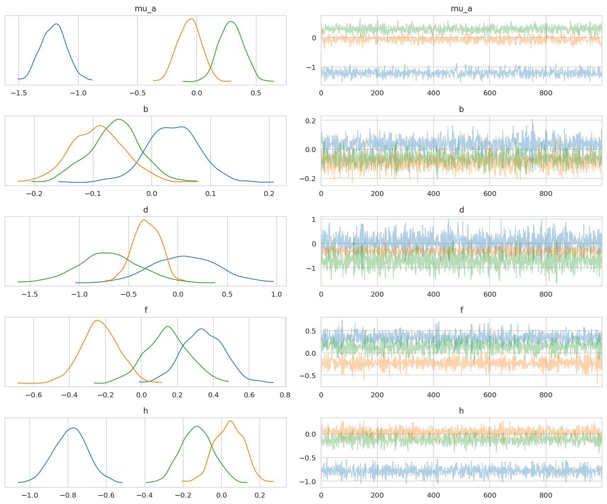


```python
sgrnas_sample = trace.posterior.coords["sgrna"].values[:5]

az.plot_trace(trace, var_names="a", coords={"sgrna": sgrnas_sample}, compact=False)
plt.tight_layout()
plt.show()
```


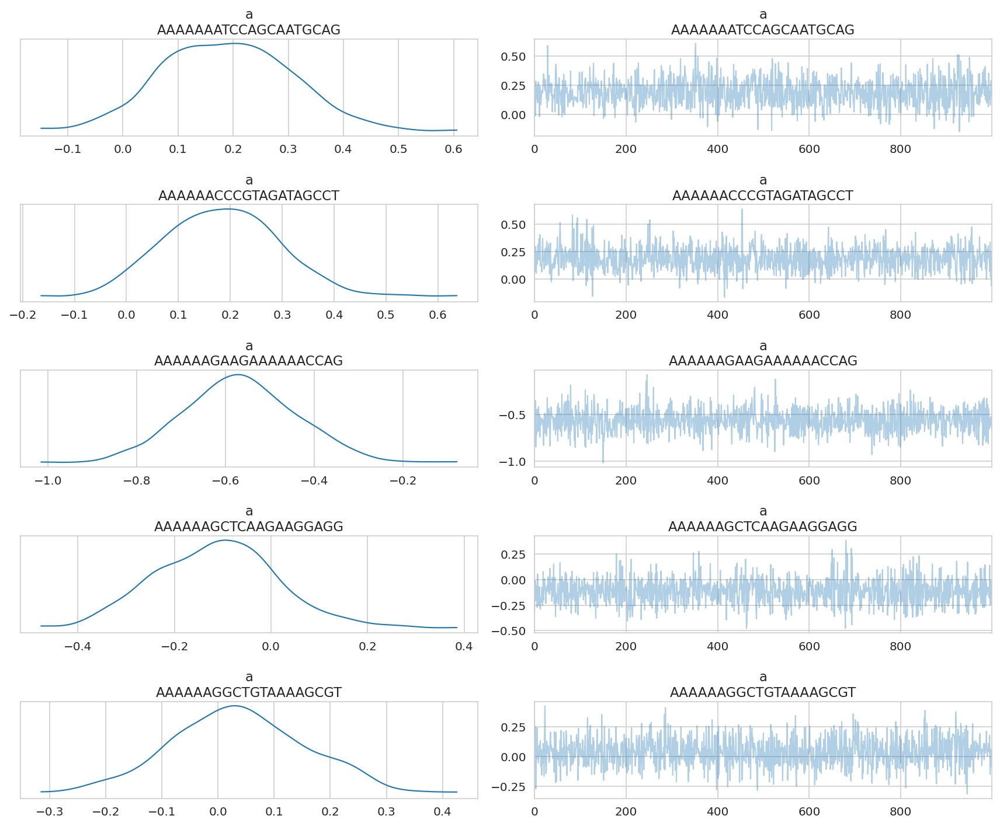


```python
az.plot_forest(trace, var_names=["mu_k", "mu_m"], combined=True, figsize=(5, 4))
plt.tight_layout()
plt.show()
```


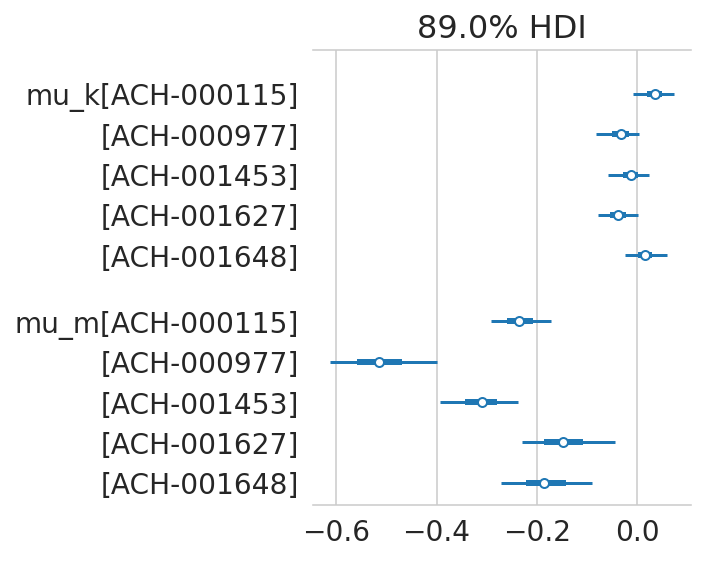


```python
cell_chromosome_map = (
    valid_prostate_data[["depmap_id", "sgrna_target_chr", "cell_chrom"]]
    .drop_duplicates()
    .sort_values("cell_chrom")
    .reset_index(drop=True)
)
```


```python
chromosome_effect_post = (
    az.summary(trace, var_names=["k", "m"], kind="stats")
    .pipe(extract_coords_param_names, names="cell_chrom")
    .assign(var_name=lambda d: [p[0] for p in d.index.values])
    .merge(cell_chromosome_map, on="cell_chrom")
)

cell_effect_post = (
    az.summary(trace, var_names=["mu_k", "mu_m"], kind="stats")
    .pipe(extract_coords_param_names, names="depmap_id")
    .assign(var_name=lambda d: [p[:4] for p in d.index.values])
    .reset_index(drop=True)
    .pivot_wider(
        index="depmap_id",
        names_from="var_name",
        values_from=["mean", "hdi_5.5%", "hdi_94.5%"],
    )
)
```


```python
ncells = chromosome_effect_post["depmap_id"].nunique()
ncols = 3
nrows = ceil(ncells / 3)
fig, axes = plt.subplots(nrows=nrows, ncols=ncols, figsize=(9, nrows * 3))
for ax, (cell, data_c) in zip(
    axes.flatten(), chromosome_effect_post.groupby("depmap_id")
):
    plot_df = data_c.pivot_wider(
        index="sgrna_target_chr",
        names_from="var_name",
        values_from=["mean", "hdi_5.5%", "hdi_94.5%"],
    )
    cell_eff = (
        cell_effect_post.copy().query(f"depmap_id == '{cell}'").reset_index(drop=True)
    )

    ax.axhline(0, color="k", zorder=1)
    ax.axvline(0, color="k", zorder=1)

    ax.vlines(
        x=plot_df["mean_k"],
        ymin=plot_df["hdi_5.5%_m"],
        ymax=plot_df["hdi_94.5%_m"],
        alpha=0.5,
        zorder=5,
    )
    ax.hlines(
        y=plot_df["mean_m"],
        xmin=plot_df["hdi_5.5%_k"],
        xmax=plot_df["hdi_94.5%_k"],
        alpha=0.5,
        zorder=5,
    )
    sns.scatterplot(data=plot_df, x="mean_k", y="mean_m", ax=ax, zorder=10)

    ax.vlines(
        x=cell_eff["mean_mu_k"],
        ymin=cell_eff["hdi_5.5%_mu_m"],
        ymax=cell_eff["hdi_94.5%_mu_m"],
        alpha=0.8,
        zorder=15,
        color="red",
    )
    ax.hlines(
        y=cell_eff["mean_mu_m"],
        xmin=cell_eff["hdi_5.5%_mu_k"],
        xmax=cell_eff["hdi_94.5%_mu_k"],
        alpha=0.8,
        zorder=15,
        color="red",
    )
    sns.scatterplot(
        data=cell_eff, x="mean_mu_k", y="mean_mu_m", ax=ax, zorder=20, color="red"
    )
    ax.set_title(cell)
    ax.set_xlabel(None)
    ax.set_ylabel(None)

for ax in axes[-1, :]:
    ax.set_xlabel("$k$")
for ax in axes[:, 0]:
    ax.set_ylabel("$m$")
for ax in axes.flatten()[ncells:]:
    ax.axis("off")

fig.tight_layout()
plt.show()
```


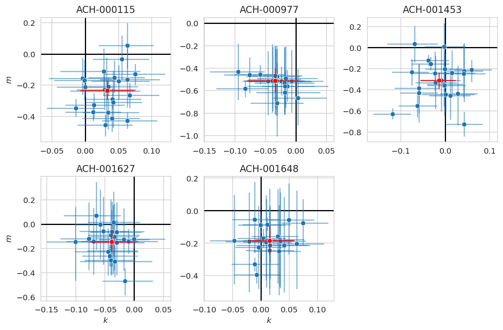


```python
for v, data_v in chromosome_effect_post.groupby("var_name"):
    df = (
        data_v.copy()
        .reset_index(drop=True)
        .pivot_wider(
            index="depmap_id", names_from="sgrna_target_chr", values_from="mean"
        )
        .set_index("depmap_id")
    )
    cg = sns.clustermap(df, figsize=(6, 4))
    cg.ax_col_dendrogram.set_title(f"variable: ${v}$")
    plt.show()
```


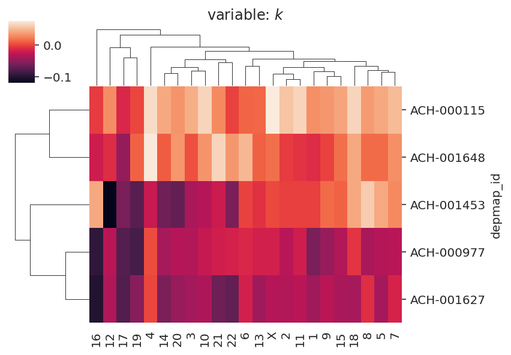


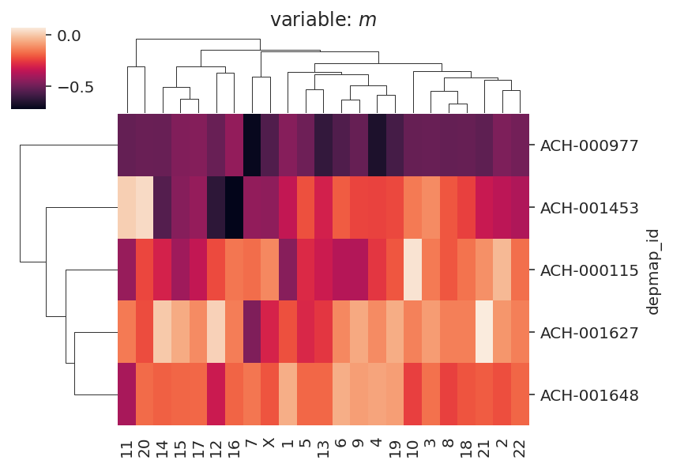


```python
genes_var_names = ["mu_a", "b", "d", "f"]
genes_var_names += [f"h[{g}]" for g in trace.posterior.coords["cancer_gene"].values]
gene_corr_post = (
    az.summary(trace, "genes_chol_cov_corr", kind="stats")
    .pipe(extract_coords_param_names, names=["d1", "d2"])
    .astype({"d1": int, "d2": int})
    .assign(
        p1=lambda d: [genes_var_names[i] for i in d["d1"]],
        p2=lambda d: [genes_var_names[i] for i in d["d2"]],
    )
    .assign(
        p1=lambda d: pd.Categorical(d["p1"], categories=d["p1"].unique(), ordered=True)
    )
    .assign(
        p2=lambda d: pd.Categorical(
            d["p2"], categories=d["p1"].cat.categories, ordered=True
        )
    )
)
```


```python
plot_df = gene_corr_post.pivot_wider("p1", "p2", "mean").set_index("p1")
sns.heatmap(plot_df, cmap="coolwarm", vmin=-1, vmax=1)
plt.show()
```


```python
cancer_genes = trace.posterior.coords["cancer_gene"].values.tolist()
cancer_gene_mutants = (
    valid_prostate_data.filter_column_isin("hugo_symbol", cancer_genes)[
        ["hugo_symbol", "depmap_id", "is_mutated"]
    ]
    .drop_duplicates()
    .assign(is_mutated=lambda d: d["is_mutated"].map({True: "X", False: ""}))
    .pivot_wider("depmap_id", names_from="hugo_symbol", values_from="is_mutated")
    .set_index("depmap_id")
)
cancer_gene_mutants
```


<div>
<style scoped>
    .dataframe tbody tr th:only-of-type {
        vertical-align: middle;
    }

    .dataframe tbody tr th {
        vertical-align: top;
    }

    .dataframe thead th {
        text-align: right;
    }
</style>
<table border="1" class="dataframe">
  <thead>
    <tr style="text-align: right;">
      <th></th>
      <th>ZFHX3</th>
    </tr>
    <tr>
      <th>depmap_id</th>
      <th></th>
    </tr>
  </thead>
  <tbody>
    <tr>
      <th>ACH-000115</th>
      <td></td>
    </tr>
    <tr>
      <th>ACH-000977</th>
      <td>X</td>
    </tr>
    <tr>
      <th>ACH-001453</th>
      <td></td>
    </tr>
    <tr>
      <th>ACH-001627</th>
      <td>X</td>
    </tr>
    <tr>
      <th>ACH-001648</th>
      <td></td>
    </tr>
  </tbody>
</table>
</div>


```python
az.plot_trace(trace, var_names=["sigma_h"], compact=False)
plt.tight_layout()
plt.show()
```


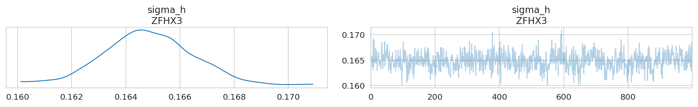


```python
h_post_summary = (
    prostate_post_summary.query("var_name == 'h'")
    .reset_index(drop=True)
    .pipe(
        extract_coords_param_names,
        names=["hugo_symbol", "cancer_gene"],
        col="parameter",
    )
)

ax = sns.kdeplot(data=h_post_summary, x="mean", hue="cancer_gene")
ax.set_xlabel(r"$\bar{h}_g$ posterior")
ax.set_ylabel("density")
ax.get_legend().set_title("cancer gene\ncomut.")
plt.show()
```


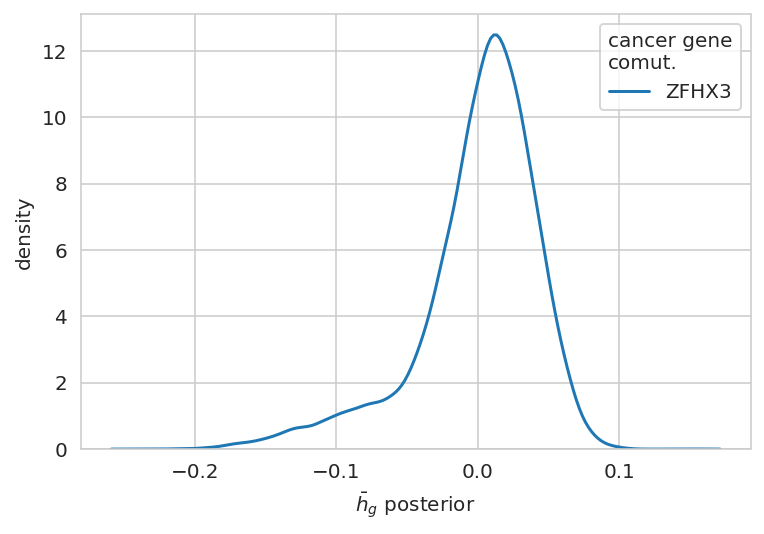


```python
fig, axes = plt.subplots(
    len(cancer_genes), 1, squeeze=False, figsize=(8, len(cancer_genes) * 5)
)
for ax, cg in zip(axes.flatten(), cancer_genes):
    h_hits = (
        h_post_summary.filter_column_isin("cancer_gene", [cg])
        .sort_values("mean")
        .pipe(head_tail, n=5)["hugo_symbol"]
        .tolist()
    )

    h_hits_data = (
        valid_prostate_data.filter_column_isin("hugo_symbol", h_hits)
        .merge(cancer_gene_mutants.reset_index(), on="depmap_id")
        .reset_index()
        .astype({"hugo_symbol": str})
        .assign(
            hugo_symbol=lambda d: pd.Categorical(d["hugo_symbol"], categories=h_hits),
            _cg_mut=lambda d: d[cg].map({"X": "mut.", "": "WT"}),
        )
    )
    mut_pal = {"mut.": "tab:red", "WT": "gray"}
    sns.boxplot(
        data=h_hits_data,
        x="hugo_symbol",
        y="lfc",
        hue="_cg_mut",
        palette=mut_pal,
        ax=ax,
        showfliers=False,
        boxprops={"alpha": 0.5},
    )
    sns.stripplot(
        data=h_hits_data,
        x="hugo_symbol",
        y="lfc",
        hue="_cg_mut",
        dodge=True,
        palette=mut_pal,
        ax=ax,
    )
    sns.move_legend(ax, loc="upper left", bbox_to_anchor=(1, 1), title=cg)

plt.tight_layout()
plt.show()
```


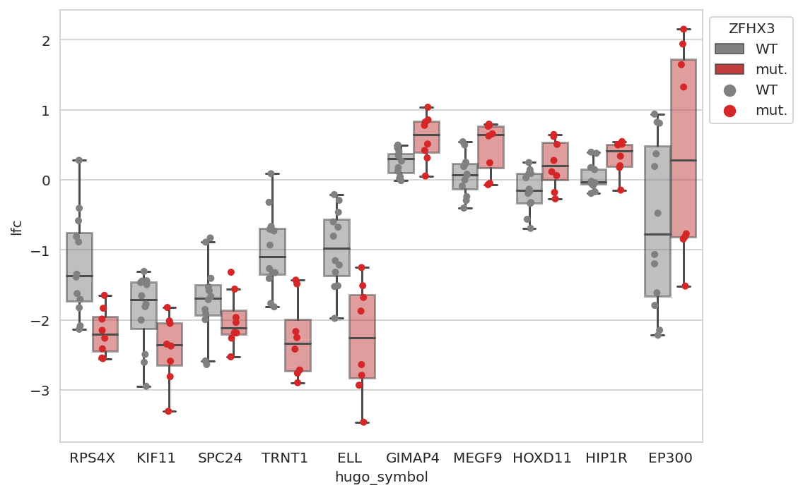


---

## Session info


```python
notebook_toc = time()
print(f"execution time: {(notebook_toc - notebook_tic) / 60:.2f} minutes")
```

    execution time: 2.41 minutes


```python
%load_ext watermark
%watermark -d -u -v -iv -b -h -m
```

    Last updated: 2022-08-08

    Python implementation: CPython
    Python version       : 3.10.5
    IPython version      : 8.4.0

    Compiler    : GCC 10.3.0
    OS          : Linux
    Release     : 3.10.0-1160.45.1.el7.x86_64
    Machine     : x86_64
    Processor   : x86_64
    CPU cores   : 32
    Architecture: 64bit

    Hostname: compute-a-16-170.o2.rc.hms.harvard.edu

    Git branch: varying-chromosome

    seaborn   : 0.11.2
    arviz     : 0.12.1
    matplotlib: 3.5.2
    numpy     : 1.23.1
    pandas    : 1.4.3


```python

```
