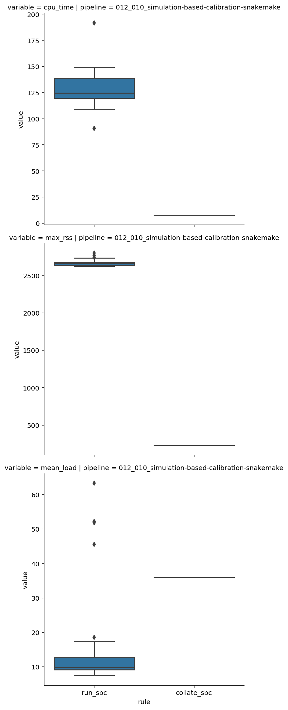

```python
from pathlib import Path

import janitor
import pandas as pd
import plotnine as gg
import seaborn as sns

%config InlineBackend.figure_format='retina'
```

```python
benchmark_dir = Path("../benchmarks/")
assert benchmark_dir.exists()
assert benchmark_dir.is_dir()
```

## Data Processing

Organization of benchmarks directory:

1. pipeline
2. rules
3. individual runs

> I may want to add more information to the name of the rules to keep them separate and not overwritten.
> For instance, including the date would be useful or metadata such as the data size for SBC or debug status for the fitting pipeline.

```python
def process_benchmark_file(bench_f: Path) -> pd.DataFrame:
    return pd.read_csv(bench_f, sep="\t").assign(
        step=bench_f.name.replace(bench_f.suffix, "")
    )


def get_benchmark_data_for_rule_dir(rule_d: Path, pipeline_name: str) -> pd.DataFrame:
    bench_dfs: list[pd.DataFrame] = [
        process_benchmark_file(b) for b in rule_d.iterdir()
    ]
    return (
        pd.concat(bench_dfs)
        .assign(rule=rule_d.name, pipeline=pipeline_name)
        .clean_names()
    )


benchmark_df_list: list[pd.DataFrame] = []

for pipeline_dir in benchmark_dir.iterdir():
    for rule_dir in pipeline_dir.iterdir():
        benchmark_df_list.append(
            get_benchmark_data_for_rule_dir(rule_dir, pipeline_name=pipeline_dir.name)
        )

benchmark_df = pd.concat(benchmark_df_list).reset_index(drop=True)
benchmark_df.head()
```

<div>
<style scoped>
    .dataframe tbody tr th:only-of-type {
        vertical-align: middle;
    }

    .dataframe tbody tr th {
        vertical-align: top;
    }

    .dataframe thead th {
        text-align: right;
    }
</style>
<table border="1" class="dataframe">
  <thead>
    <tr style="text-align: right;">
      <th></th>
      <th>s</th>
      <th>h_m_s</th>
      <th>max_rss</th>
      <th>max_vms</th>
      <th>max_uss</th>
      <th>max_pss</th>
      <th>io_in</th>
      <th>io_out</th>
      <th>mean_load</th>
      <th>cpu_time</th>
      <th>step</th>
      <th>rule</th>
      <th>pipeline</th>
    </tr>
  </thead>
  <tbody>
    <tr>
      <th>0</th>
      <td>1450.1557</td>
      <td>0:24:10</td>
      <td>2632.42</td>
      <td>3493.61</td>
      <td>2584.99</td>
      <td>2607.41</td>
      <td>725.83</td>
      <td>95.04</td>
      <td>10.12</td>
      <td>146.76</td>
      <td>sp4-default-fullrank_ADVI_perm12</td>
      <td>run_sbc</td>
      <td>012_010_simulation-based-calibration-snakemake</td>
    </tr>
    <tr>
      <th>1</th>
      <td>1438.7806</td>
      <td>0:23:58</td>
      <td>2626.87</td>
      <td>3491.89</td>
      <td>2624.31</td>
      <td>2624.38</td>
      <td>1881.28</td>
      <td>97.78</td>
      <td>10.29</td>
      <td>148.10</td>
      <td>sp4-default-fullrank_ADVI_perm6</td>
      <td>run_sbc</td>
      <td>012_010_simulation-based-calibration-snakemake</td>
    </tr>
    <tr>
      <th>2</th>
      <td>187.0007</td>
      <td>0:03:07</td>
      <td>2626.96</td>
      <td>3567.98</td>
      <td>2624.25</td>
      <td>2624.31</td>
      <td>44.03</td>
      <td>91.66</td>
      <td>63.26</td>
      <td>118.45</td>
      <td>sp4-default-fullrank_ADVI_perm0</td>
      <td>run_sbc</td>
      <td>012_010_simulation-based-calibration-snakemake</td>
    </tr>
    <tr>
      <th>3</th>
      <td>1500.0513</td>
      <td>0:25:00</td>
      <td>2659.00</td>
      <td>3522.06</td>
      <td>2656.29</td>
      <td>2656.37</td>
      <td>883.85</td>
      <td>93.74</td>
      <td>12.76</td>
      <td>191.67</td>
      <td>sp4-default-fullrank_ADVI_perm15</td>
      <td>run_sbc</td>
      <td>012_010_simulation-based-calibration-snakemake</td>
    </tr>
    <tr>
      <th>4</th>
      <td>242.4990</td>
      <td>0:04:02</td>
      <td>2744.32</td>
      <td>3586.09</td>
      <td>2741.89</td>
      <td>2741.96</td>
      <td>1889.93</td>
      <td>102.59</td>
      <td>45.52</td>
      <td>110.58</td>
      <td>sp4-default-fullrank_ADVI_perm19</td>
      <td>run_sbc</td>
      <td>012_010_simulation-based-calibration-snakemake</td>
    </tr>
  </tbody>
</table>
</div>

## Data dictionary

| colname | type (unit) | description |
|-------- |-------------|-------------|
| s | float (seconds) | Running time in seconds. |
| h:m:s	| string (-) | Running time in hour, minutes, seconds format. |
| max_rss | float (MB) | Maximum "Resident Set Size”, this is the non-swapped physical memory a process has used. |
| max_vms | float (MB) | Maximum “Virtual Memory Size”, this is the total amount of virtual memory used by the process. |
| max_uss | float (MB) | “Unique Set Size”, this is the memory which is unique to a process and which would be freed if the process was terminated right now. |
| max_pss | float (MB) | “Proportional Set Size”, is the amount of memory shared with other processes, accounted in a way that the amount is divided evenly between the processes that share it (Linux only). |
| io_in | float (MB) | The number of MB read (cumulative). |
| io_out | float (MB) | The number of MB written (cumulative). |
| mean_load | float (-) | CPU usage over time, divided by the total running time (first row). |
| cpu_time | float (-) | CPU time summed for user and system. |

## Data analysis and visualization

```python
benchmark_df.groupby(["pipeline", "rule"]).mean().round(2)
```

<div>
<style scoped>
    .dataframe tbody tr th:only-of-type {
        vertical-align: middle;
    }

    .dataframe tbody tr th {
        vertical-align: top;
    }

    .dataframe thead th {
        text-align: right;
    }
</style>
<table border="1" class="dataframe">
  <thead>
    <tr style="text-align: right;">
      <th></th>
      <th></th>
      <th>s</th>
      <th>max_rss</th>
      <th>max_vms</th>
      <th>max_uss</th>
      <th>max_pss</th>
      <th>io_in</th>
      <th>io_out</th>
      <th>mean_load</th>
      <th>cpu_time</th>
    </tr>
    <tr>
      <th>pipeline</th>
      <th>rule</th>
      <th></th>
      <th></th>
      <th></th>
      <th></th>
      <th></th>
      <th></th>
      <th></th>
      <th></th>
      <th></th>
    </tr>
  </thead>
  <tbody>
    <tr>
      <th rowspan="2" valign="top">012_010_simulation-based-calibration-snakemake</th>
      <th>collate_sbc</th>
      <td>19.85</td>
      <td>226.52</td>
      <td>1084.56</td>
      <td>224.15</td>
      <td>224.22</td>
      <td>281.31</td>
      <td>0.16</td>
      <td>36.01</td>
      <td>7.53</td>
    </tr>
    <tr>
      <th>run_sbc</th>
      <td>1134.71</td>
      <td>2667.23</td>
      <td>3535.64</td>
      <td>2655.57</td>
      <td>2659.89</td>
      <td>1137.86</td>
      <td>85.91</td>
      <td>17.27</td>
      <td>128.89</td>
    </tr>
  </tbody>
</table>
</div>

```python
benchmark_df_long = benchmark_df[
    ["pipeline", "rule", "step", "cpu_time", "max_rss", "mean_load", "cpu_time"]
].pivot_longer(["pipeline", "rule", "step"])

benchmark_df_long
# (
#     alt.Chart(benchmark_df_long)
#     .mark_boxplot(size=50)
#     .encode(
#         x="rule",
#         y=alt.Y("value", title=""),
#         row=alt.Row("variable", title=""),
#         column=alt.Column("pipeline"),
#     )
#     .properties(width=200, height=100)
#     .resolve_scale(y="independent")
# )
```

<div>
<style scoped>
    .dataframe tbody tr th:only-of-type {
        vertical-align: middle;
    }

    .dataframe tbody tr th {
        vertical-align: top;
    }

    .dataframe thead th {
        text-align: right;
    }
</style>
<table border="1" class="dataframe">
  <thead>
    <tr style="text-align: right;">
      <th></th>
      <th>pipeline</th>
      <th>rule</th>
      <th>step</th>
      <th>variable</th>
      <th>value</th>
    </tr>
  </thead>
  <tbody>
    <tr>
      <th>0</th>
      <td>012_010_simulation-based-calibration-snakemake</td>
      <td>run_sbc</td>
      <td>sp4-default-fullrank_ADVI_perm12</td>
      <td>cpu_time</td>
      <td>146.76</td>
    </tr>
    <tr>
      <th>1</th>
      <td>012_010_simulation-based-calibration-snakemake</td>
      <td>run_sbc</td>
      <td>sp4-default-fullrank_ADVI_perm6</td>
      <td>cpu_time</td>
      <td>148.10</td>
    </tr>
    <tr>
      <th>2</th>
      <td>012_010_simulation-based-calibration-snakemake</td>
      <td>run_sbc</td>
      <td>sp4-default-fullrank_ADVI_perm0</td>
      <td>cpu_time</td>
      <td>118.45</td>
    </tr>
    <tr>
      <th>3</th>
      <td>012_010_simulation-based-calibration-snakemake</td>
      <td>run_sbc</td>
      <td>sp4-default-fullrank_ADVI_perm15</td>
      <td>cpu_time</td>
      <td>191.67</td>
    </tr>
    <tr>
      <th>4</th>
      <td>012_010_simulation-based-calibration-snakemake</td>
      <td>run_sbc</td>
      <td>sp4-default-fullrank_ADVI_perm19</td>
      <td>cpu_time</td>
      <td>110.58</td>
    </tr>
    <tr>
      <th>...</th>
      <td>...</td>
      <td>...</td>
      <td>...</td>
      <td>...</td>
      <td>...</td>
    </tr>
    <tr>
      <th>99</th>
      <td>012_010_simulation-based-calibration-snakemake</td>
      <td>run_sbc</td>
      <td>sp4-default-fullrank_ADVI_perm17</td>
      <td>cpu_time</td>
      <td>119.68</td>
    </tr>
    <tr>
      <th>100</th>
      <td>012_010_simulation-based-calibration-snakemake</td>
      <td>run_sbc</td>
      <td>sp4-default-fullrank_ADVI_perm4</td>
      <td>cpu_time</td>
      <td>108.73</td>
    </tr>
    <tr>
      <th>101</th>
      <td>012_010_simulation-based-calibration-snakemake</td>
      <td>run_sbc</td>
      <td>sp4-default-fullrank_ADVI_perm18</td>
      <td>cpu_time</td>
      <td>129.75</td>
    </tr>
    <tr>
      <th>102</th>
      <td>012_010_simulation-based-calibration-snakemake</td>
      <td>run_sbc</td>
      <td>sp4-default-fullrank_ADVI_perm5</td>
      <td>cpu_time</td>
      <td>138.75</td>
    </tr>
    <tr>
      <th>103</th>
      <td>012_010_simulation-based-calibration-snakemake</td>
      <td>collate_sbc</td>
      <td>sp4-default-fullrank_ADVI</td>
      <td>cpu_time</td>
      <td>7.53</td>
    </tr>
  </tbody>
</table>
<p>104 rows × 5 columns</p>
</div>

```python
sns.catplot(
    data=benchmark_df_long,
    x="rule",
    y="value",
    kind="box",
    row="variable",
    col="pipeline",
    sharey=False,
);
```



---

```python
%load_ext watermark
%watermark -d -u -v -iv -b -h -m
```

    Last updated: 2021-07-25

    Python implementation: CPython
    Python version       : 3.9.6
    IPython version      : 7.25.0

    Compiler    : GCC 9.3.0
    OS          : Linux
    Release     : 3.10.0-1062.el7.x86_64
    Machine     : x86_64
    Processor   : x86_64
    CPU cores   : 32
    Architecture: 64bit

    Hostname: compute-a-16-161.o2.rc.hms.harvard.edu

    Git branch: sbc-uniform-check

    plotnine: 0.8.0
    pandas  : 1.3.0
    seaborn : 0.11.1
    janitor : 0.21.0
