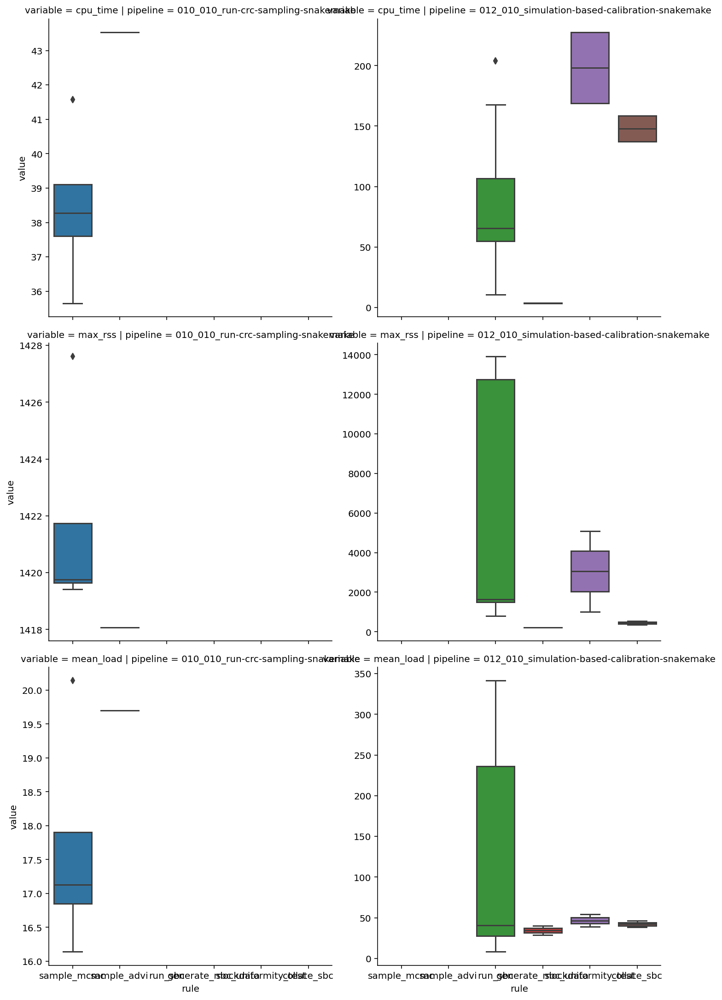

```python
from pathlib import Path
from typing import Optional

import janitor
import pandas as pd
import plotnine as gg
import seaborn as sns

%config InlineBackend.figure_format='retina'
```

```python
benchmark_dir = Path("../benchmarks/")
assert benchmark_dir.exists()
assert benchmark_dir.is_dir()
```

## Data Processing

Organization of benchmarks directory:

1. pipeline
2. rules
3. individual runs

> I may want to add more information to the name of the rules to keep them separate and not overwritten.
> For instance, including the date would be useful or metadata such as the data size for SBC or debug status for the fitting pipeline.

```python
list(benchmark_dir.iterdir())
```

    [PosixPath('../benchmarks/010_010_run-crc-sampling-snakemake'),
     PosixPath('../benchmarks/012_010_simulation-based-calibration-snakemake')]

```python
def process_benchmark_file(bench_f: Path) -> pd.DataFrame:
    return pd.read_csv(bench_f, sep="\t").assign(
        step=bench_f.name.replace(bench_f.suffix, "")
    )


def get_benchmark_data_for_rule_dir(
    rule_d: Path, pipeline_name: str
) -> Optional[pd.DataFrame]:
    bench_dfs: list[pd.DataFrame] = [
        process_benchmark_file(b) for b in rule_d.iterdir()
    ]
    if len(bench_dfs) == 0:
        return None

    return (
        pd.concat(bench_dfs)
        .assign(rule=rule_d.name, pipeline=pipeline_name)
        .clean_names()
    )


benchmark_df_list: list[pd.DataFrame] = []

for pipeline_dir in benchmark_dir.iterdir():
    for rule_dir in pipeline_dir.iterdir():
        df = get_benchmark_data_for_rule_dir(rule_dir, pipeline_name=pipeline_dir.name)
        if df is not None:
            benchmark_df_list.append(df)

benchmark_df = pd.concat(benchmark_df_list).reset_index(drop=True)
benchmark_df.head()
```

<div>
<style scoped>
    .dataframe tbody tr th:only-of-type {
        vertical-align: middle;
    }

    .dataframe tbody tr th {
        vertical-align: top;
    }

    .dataframe thead th {
        text-align: right;
    }
</style>
<table border="1" class="dataframe">
  <thead>
    <tr style="text-align: right;">
      <th></th>
      <th>s</th>
      <th>h_m_s</th>
      <th>max_rss</th>
      <th>max_vms</th>
      <th>max_uss</th>
      <th>max_pss</th>
      <th>io_in</th>
      <th>io_out</th>
      <th>mean_load</th>
      <th>cpu_time</th>
      <th>step</th>
      <th>rule</th>
      <th>pipeline</th>
    </tr>
  </thead>
  <tbody>
    <tr>
      <th>0</th>
      <td>221.5452</td>
      <td>0:03:41</td>
      <td>1419.73</td>
      <td>2140.38</td>
      <td>1417.16</td>
      <td>1417.25</td>
      <td>908.23</td>
      <td>16.45</td>
      <td>17.16</td>
      <td>38.26</td>
      <td>simple-default_chain0</td>
      <td>sample_mcmc</td>
      <td>010_010_run-crc-sampling-snakemake</td>
    </tr>
    <tr>
      <th>1</th>
      <td>224.0925</td>
      <td>0:03:44</td>
      <td>1419.79</td>
      <td>2140.32</td>
      <td>1417.19</td>
      <td>1417.29</td>
      <td>959.60</td>
      <td>12.40</td>
      <td>17.09</td>
      <td>38.29</td>
      <td>simple-default_chain1</td>
      <td>sample_mcmc</td>
      <td>010_010_run-crc-sampling-snakemake</td>
    </tr>
    <tr>
      <th>2</th>
      <td>220.5009</td>
      <td>0:03:40</td>
      <td>1427.61</td>
      <td>2152.48</td>
      <td>1425.79</td>
      <td>1425.96</td>
      <td>931.81</td>
      <td>9.07</td>
      <td>16.14</td>
      <td>35.65</td>
      <td>simple-default_chain3</td>
      <td>sample_mcmc</td>
      <td>010_010_run-crc-sampling-snakemake</td>
    </tr>
    <tr>
      <th>3</th>
      <td>206.2329</td>
      <td>0:03:26</td>
      <td>1419.41</td>
      <td>2211.85</td>
      <td>1416.80</td>
      <td>1416.88</td>
      <td>959.39</td>
      <td>9.04</td>
      <td>20.14</td>
      <td>41.57</td>
      <td>simple-default_chain2</td>
      <td>sample_mcmc</td>
      <td>010_010_run-crc-sampling-snakemake</td>
    </tr>
    <tr>
      <th>4</th>
      <td>220.6069</td>
      <td>0:03:40</td>
      <td>1418.07</td>
      <td>2197.32</td>
      <td>1415.48</td>
      <td>1415.64</td>
      <td>967.38</td>
      <td>25.52</td>
      <td>19.70</td>
      <td>43.53</td>
      <td>simple-default</td>
      <td>sample_advi</td>
      <td>010_010_run-crc-sampling-snakemake</td>
    </tr>
  </tbody>
</table>
</div>

## Data dictionary

| colname | type (unit) | description |
|-------- |-------------|-------------|
| s | float (seconds) | Running time in seconds. |
| h:m:s	| string (-) | Running time in hour, minutes, seconds format. |
| max_rss | float (MB) | Maximum "Resident Set Size”, this is the non-swapped physical memory a process has used. |
| max_vms | float (MB) | Maximum “Virtual Memory Size”, this is the total amount of virtual memory used by the process. |
| max_uss | float (MB) | “Unique Set Size”, this is the memory which is unique to a process and which would be freed if the process was terminated right now. |
| max_pss | float (MB) | “Proportional Set Size”, is the amount of memory shared with other processes, accounted in a way that the amount is divided evenly between the processes that share it (Linux only). |
| io_in | float (MB) | The number of MB read (cumulative). |
| io_out | float (MB) | The number of MB written (cumulative). |
| mean_load | float (-) | CPU usage over time, divided by the total running time (first row). |
| cpu_time | float (-) | CPU time summed for user and system. |

## Data analysis and visualization

```python
benchmark_df.groupby(["pipeline", "rule"]).mean().round(2)
```

<div>
<style scoped>
    .dataframe tbody tr th:only-of-type {
        vertical-align: middle;
    }

    .dataframe tbody tr th {
        vertical-align: top;
    }

    .dataframe thead th {
        text-align: right;
    }
</style>
<table border="1" class="dataframe">
  <thead>
    <tr style="text-align: right;">
      <th></th>
      <th></th>
      <th>s</th>
      <th>max_rss</th>
      <th>max_vms</th>
      <th>max_uss</th>
      <th>max_pss</th>
      <th>io_in</th>
      <th>io_out</th>
      <th>mean_load</th>
      <th>cpu_time</th>
    </tr>
    <tr>
      <th>pipeline</th>
      <th>rule</th>
      <th></th>
      <th></th>
      <th></th>
      <th></th>
      <th></th>
      <th></th>
      <th></th>
      <th></th>
      <th></th>
    </tr>
  </thead>
  <tbody>
    <tr>
      <th rowspan="2" valign="top">010_010_run-crc-sampling-snakemake</th>
      <th>sample_advi</th>
      <td>220.61</td>
      <td>1418.07</td>
      <td>2197.32</td>
      <td>1415.48</td>
      <td>1415.64</td>
      <td>967.38</td>
      <td>25.52</td>
      <td>19.70</td>
      <td>43.53</td>
    </tr>
    <tr>
      <th>sample_mcmc</th>
      <td>218.09</td>
      <td>1421.64</td>
      <td>2161.26</td>
      <td>1419.24</td>
      <td>1419.34</td>
      <td>939.76</td>
      <td>11.74</td>
      <td>17.63</td>
      <td>38.44</td>
    </tr>
    <tr>
      <th rowspan="4" valign="top">012_010_simulation-based-calibration-snakemake</th>
      <th>collate_sbc</th>
      <td>349.97</td>
      <td>449.04</td>
      <td>2958.43</td>
      <td>447.12</td>
      <td>447.18</td>
      <td>8047.58</td>
      <td>0.26</td>
      <td>42.32</td>
      <td>147.87</td>
    </tr>
    <tr>
      <th>generate_mockdata</th>
      <td>10.37</td>
      <td>217.25</td>
      <td>826.30</td>
      <td>214.76</td>
      <td>214.82</td>
      <td>211.50</td>
      <td>0.27</td>
      <td>34.63</td>
      <td>3.58</td>
    </tr>
    <tr>
      <th>run_sbc</th>
      <td>468.31</td>
      <td>5678.15</td>
      <td>7866.74</td>
      <td>1954.82</td>
      <td>1960.67</td>
      <td>150.24</td>
      <td>79.93</td>
      <td>107.71</td>
      <td>76.16</td>
    </tr>
    <tr>
      <th>sbc_uniformity_test</th>
      <td>426.45</td>
      <td>3051.67</td>
      <td>4950.30</td>
      <td>3049.61</td>
      <td>3049.65</td>
      <td>15221.14</td>
      <td>0.15</td>
      <td>46.53</td>
      <td>198.18</td>
    </tr>
  </tbody>
</table>
</div>

```python
benchmark_df_long = benchmark_df[
    ["pipeline", "rule", "step", "cpu_time", "max_rss", "mean_load", "cpu_time"]
].pivot_longer(["pipeline", "rule", "step"])

benchmark_df_long.head()
```

<div>
<style scoped>
    .dataframe tbody tr th:only-of-type {
        vertical-align: middle;
    }

    .dataframe tbody tr th {
        vertical-align: top;
    }

    .dataframe thead th {
        text-align: right;
    }
</style>
<table border="1" class="dataframe">
  <thead>
    <tr style="text-align: right;">
      <th></th>
      <th>pipeline</th>
      <th>rule</th>
      <th>step</th>
      <th>variable</th>
      <th>value</th>
    </tr>
  </thead>
  <tbody>
    <tr>
      <th>0</th>
      <td>010_010_run-crc-sampling-snakemake</td>
      <td>sample_mcmc</td>
      <td>simple-default_chain0</td>
      <td>cpu_time</td>
      <td>38.26</td>
    </tr>
    <tr>
      <th>1</th>
      <td>010_010_run-crc-sampling-snakemake</td>
      <td>sample_mcmc</td>
      <td>simple-default_chain1</td>
      <td>cpu_time</td>
      <td>38.29</td>
    </tr>
    <tr>
      <th>2</th>
      <td>010_010_run-crc-sampling-snakemake</td>
      <td>sample_mcmc</td>
      <td>simple-default_chain3</td>
      <td>cpu_time</td>
      <td>35.65</td>
    </tr>
    <tr>
      <th>3</th>
      <td>010_010_run-crc-sampling-snakemake</td>
      <td>sample_mcmc</td>
      <td>simple-default_chain2</td>
      <td>cpu_time</td>
      <td>41.57</td>
    </tr>
    <tr>
      <th>4</th>
      <td>010_010_run-crc-sampling-snakemake</td>
      <td>sample_advi</td>
      <td>simple-default</td>
      <td>cpu_time</td>
      <td>43.53</td>
    </tr>
  </tbody>
</table>
</div>

```python
sns.catplot(
    data=benchmark_df_long,
    x="rule",
    y="value",
    kind="box",
    row="variable",
    col="pipeline",
    sharey=False,
);
```



---

```python
%load_ext watermark
%watermark -d -u -v -iv -b -h -m
```

    Last updated: 2021-08-16

    Python implementation: CPython
    Python version       : 3.9.6
    IPython version      : 7.25.0

    Compiler    : GCC 9.3.0
    OS          : Linux
    Release     : 3.10.0-1062.el7.x86_64
    Machine     : x86_64
    Processor   : x86_64
    CPU cores   : 32
    Architecture: 64bit

    Hostname: compute-a-16-54.o2.rc.hms.harvard.edu

    Git branch: speclet-simple

    janitor : 0.21.0
    plotnine: 0.8.0
    seaborn : 0.11.1
    pandas  : 1.3.0
