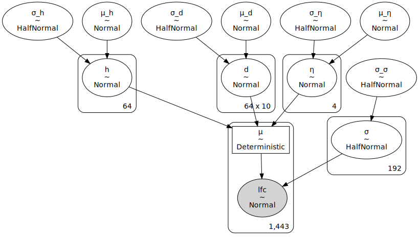
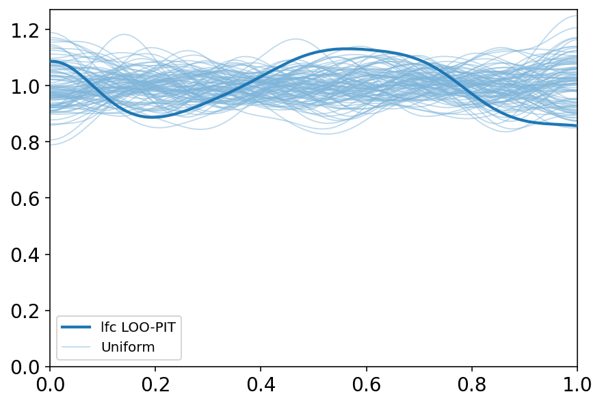
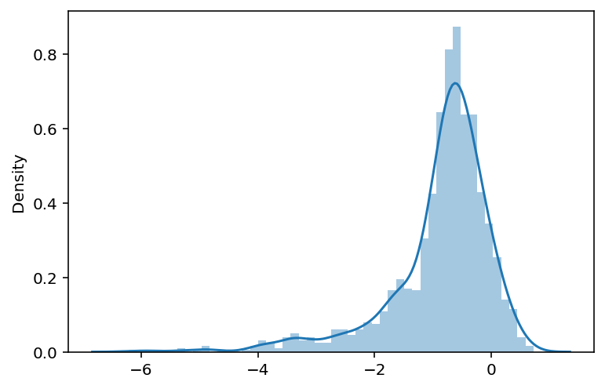
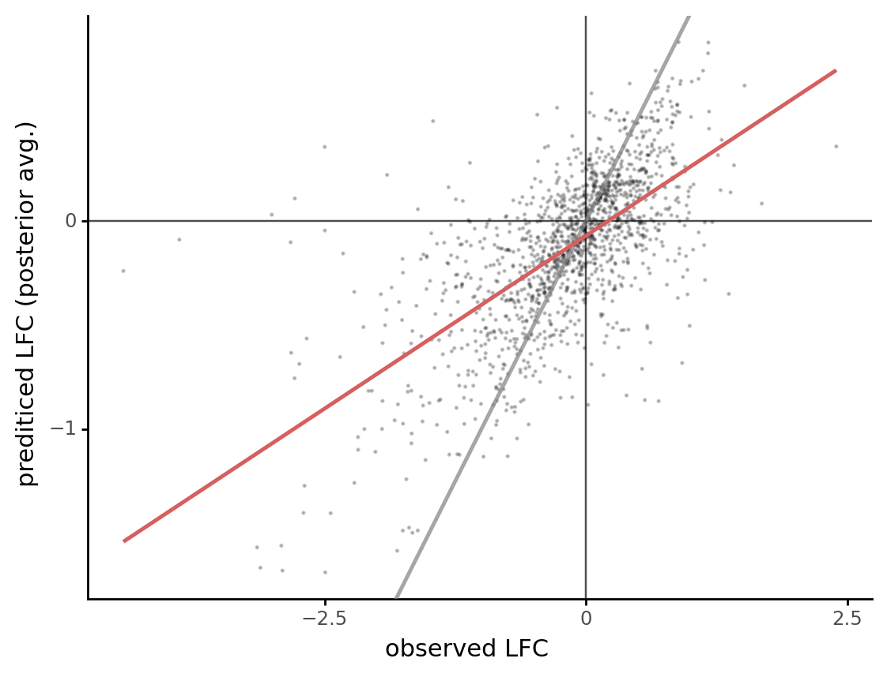
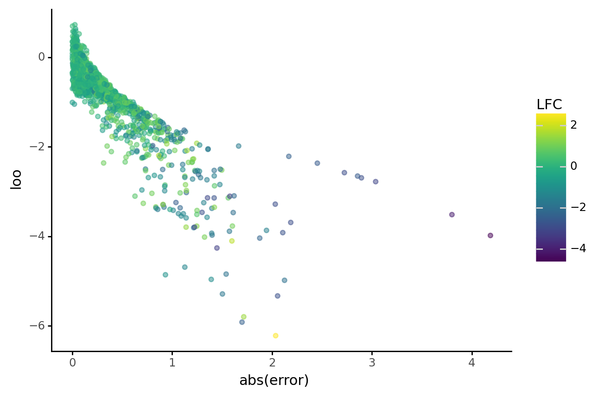
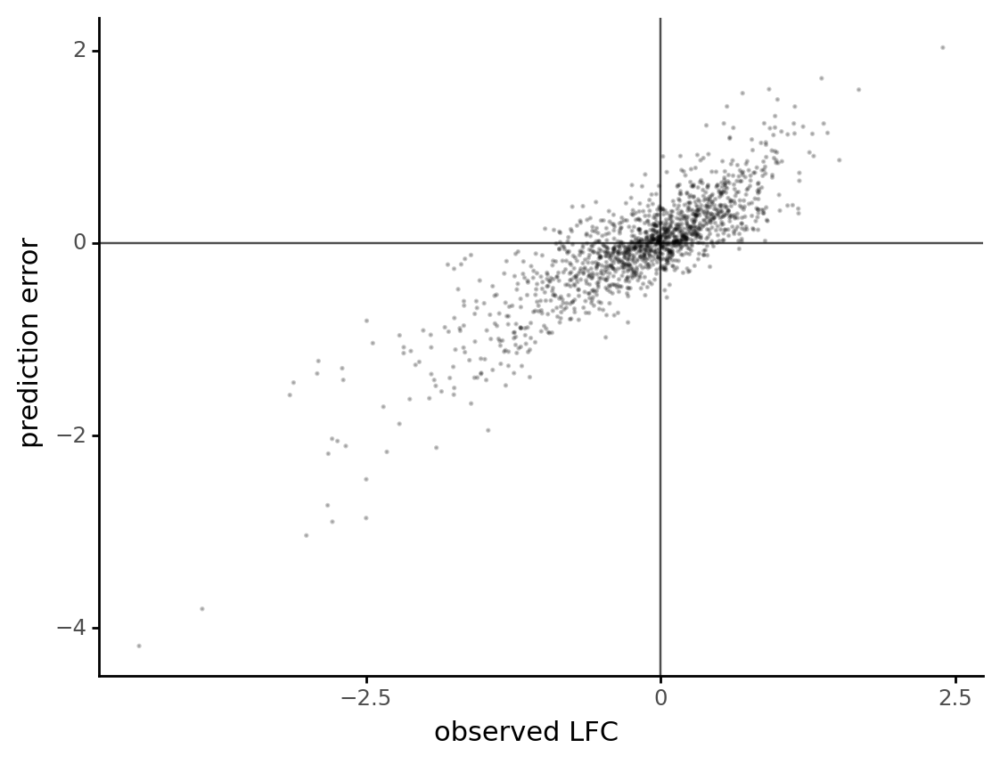
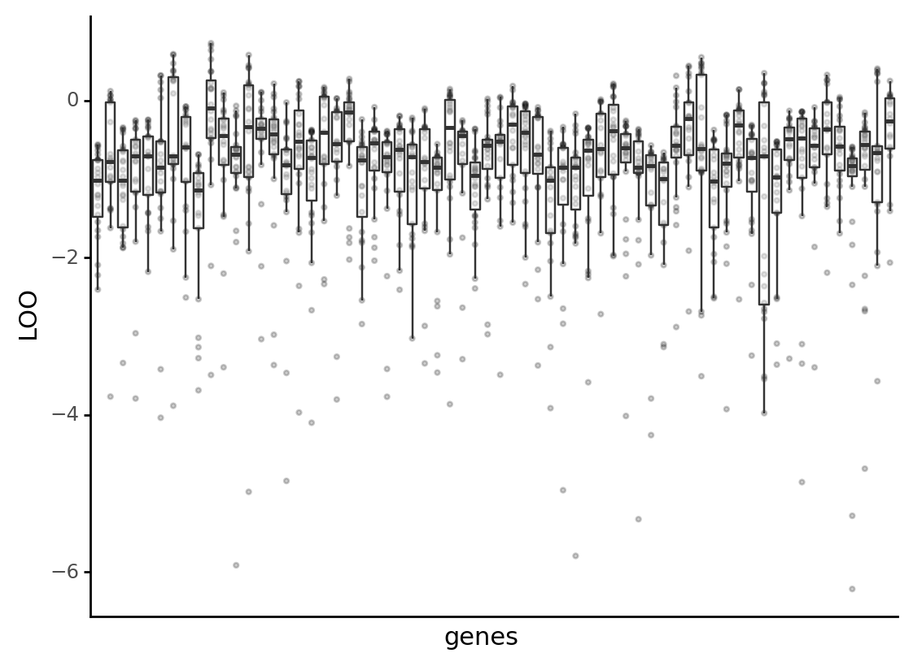
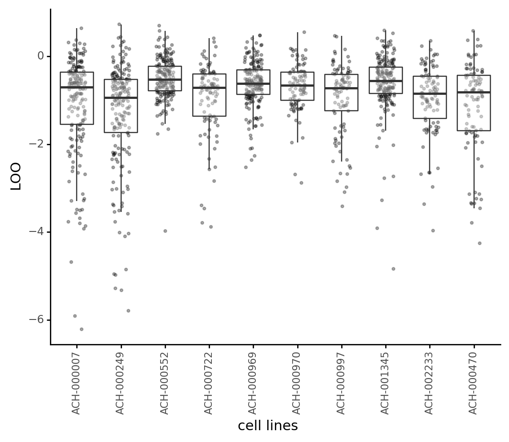
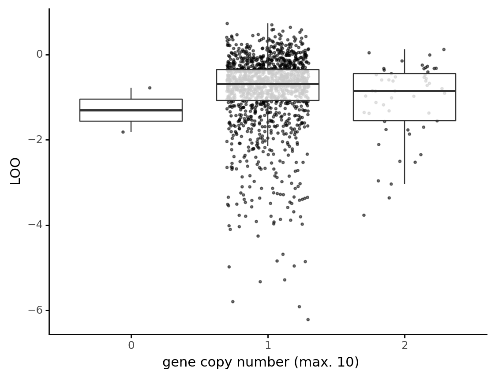
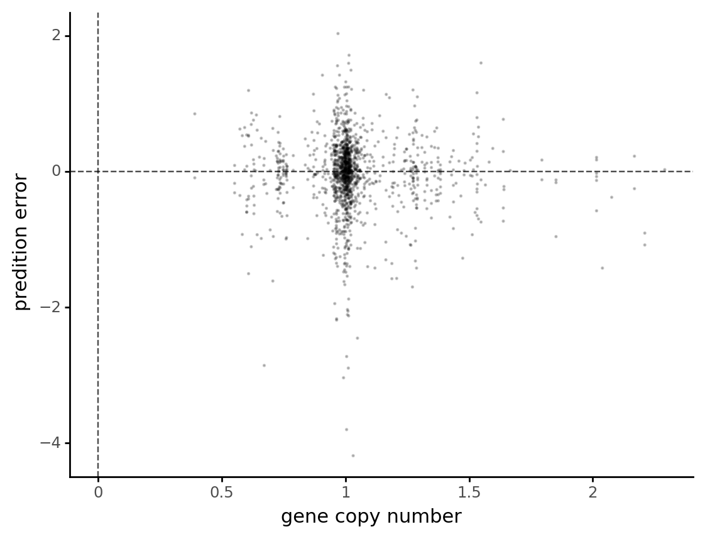

# Model Report

```python
import warnings
from pathlib import Path
from time import time

import arviz as az
import matplotlib.pyplot as plt
import numpy as np
import pandas as pd
import plotnine as gg
import pymc3 as pm
import seaborn as sns
from src.command_line_interfaces import sampling_pymc3_models_cli as sampling
from src.data_processing import common as dphelp
from src.modeling import pymc3_analysis as pmanal
from src.modeling import pymc3_sampling_api as pmapi
from src.models import configuration
from src.models.speclet_pipeline_test_model import SpecletTestModel
from src.plot.color_pal import SeabornColor
from src.project_enums import ModelFitMethod

notebook_tic = time()

warnings.simplefilter(action="ignore", category=UserWarning)

gg.theme_set(gg.theme_classic())
%config InlineBackend.figure_format = "retina"

RANDOM_SEED = 847
np.random.seed(RANDOM_SEED)

path_prefix = Path("..", "..")
```

Parameters for papermill:

- `CONFIG_PATH`: path to configuration file
- `MODEL_NAME`: name of the model
- `FIT_METHOD`: method used to fit the model; either "ADVI" or "MCMC"
- `ROOT_CACHE_DIR`: path to the root caching directory

## Setup

### Papermill parameters

```python
CONFIG_PATH = ""
MODEL_NAME = ""
FIT_METHOD = ""
ROOT_CACHE_DIR = ""
```

```python
# Parameters
CONFIG_PATH = "models/model-configs.yaml"
MODEL_NAME = "sp4-default-config"
FIT_METHOD = "MCMC"
ROOT_CACHE_DIR = "models/"
```

```python
# Check the fit method is recognized.
assert ModelFitMethod(FIT_METHOD) in ModelFitMethod
```

```python
speclet_model = configuration.get_config_and_instantiate_model(
    path_prefix / CONFIG_PATH,
    name=MODEL_NAME,
    root_cache_dir=path_prefix / ROOT_CACHE_DIR,
)

speclet_model.build_model()
```

<pre style="white-space:pre;overflow-x:auto;line-height:normal;font-family:Menlo,'DejaVu Sans Mono',consolas,'Courier New',monospace"><span style="color: #7fbfbf; text-decoration-color: #7fbfbf">[07/08/21 07:46:29] </span><span style="color: #000080; text-decoration-color: #000080">INFO    </span> Instantiating and configuring a speclet      <a href="file:///n/data1/hms/dbmi/park/Cook/speclet/src/models/configuration.py"><span style="color: #7f7f7f; text-decoration-color: #7f7f7f">configuration.py</span></a><span style="color: #7f7f7f; text-decoration-color: #7f7f7f">:79</span>
                             model from config.
</pre>

<pre style="white-space:pre;overflow-x:auto;line-height:normal;font-family:Menlo,'DejaVu Sans Mono',consolas,'Courier New',monospace"><span style="color: #7fbfbf; text-decoration-color: #7fbfbf">                    </span><span style="color: #000080; text-decoration-color: #000080">INFO    </span> Calling `model_specification<span style="font-weight: bold">()</span>` method.     <a href="file:///n/data1/hms/dbmi/park/Cook/speclet/src/models/speclet_model.py"><span style="color: #7f7f7f; text-decoration-color: #7f7f7f">speclet_model.py</span></a><span style="color: #7f7f7f; text-decoration-color: #7f7f7f">:181</span>
</pre>

<pre style="white-space:pre;overflow-x:auto;line-height:normal;font-family:Menlo,'DejaVu Sans Mono',consolas,'Courier New',monospace"><span style="color: #7fbfbf; text-decoration-color: #7fbfbf">                    </span><span style="color: #000080; text-decoration-color: #000080">INFO    </span> Beginning PyMC3 model specification.         <a href="file:///n/data1/hms/dbmi/park/Cook/speclet/src/models/speclet_four.py"><span style="color: #7f7f7f; text-decoration-color: #7f7f7f">speclet_four.py</span></a><span style="color: #7f7f7f; text-decoration-color: #7f7f7f">:183</span>
</pre>

<pre style="white-space:pre;overflow-x:auto;line-height:normal;font-family:Menlo,'DejaVu Sans Mono',consolas,'Courier New',monospace"><span style="color: #7fbfbf; text-decoration-color: #7fbfbf">                    </span><span style="color: #000080; text-decoration-color: #000080">INFO    </span> Applying <span style="color: #008080; text-decoration-color: #008080; font-weight: bold">2</span> data transformations.      <a href="file:///n/data1/hms/dbmi/park/Cook/speclet/src/managers/model_data_managers.py"><span style="color: #7f7f7f; text-decoration-color: #7f7f7f">model_data_managers.py</span></a><span style="color: #7f7f7f; text-decoration-color: #7f7f7f">:131</span>
</pre>

<pre style="white-space:pre;overflow-x:auto;line-height:normal;font-family:Menlo,'DejaVu Sans Mono',consolas,'Courier New',monospace"><span style="color: #7fbfbf; text-decoration-color: #7fbfbf">                    </span><span style="color: #000080; text-decoration-color: #000080">INFO    </span> Applying transformation: <span style="color: #008000; text-decoration-color: #008000">'_drop_sgrna</span> <a href="file:///n/data1/hms/dbmi/park/Cook/speclet/src/managers/model_data_managers.py"><span style="color: #7f7f7f; text-decoration-color: #7f7f7f">model_data_managers.py</span></a><span style="color: #7f7f7f; text-decoration-color: #7f7f7f">:118</span>
                             <span style="color: #008000; text-decoration-color: #008000">s_that_map_to_multiple_genes'</span>
</pre>

<pre style="white-space:pre;overflow-x:auto;line-height:normal;font-family:Menlo,'DejaVu Sans Mono',consolas,'Courier New',monospace"><span style="color: #7fbfbf; text-decoration-color: #7fbfbf">                    </span><span style="color: #800000; text-decoration-color: #800000">WARNING </span> Dropping <span style="color: #008080; text-decoration-color: #008080; font-weight: bold">0</span> sgRNA that map to multiple <a href="file:///n/data1/hms/dbmi/park/Cook/speclet/src/managers/model_data_managers.py"><span style="color: #7f7f7f; text-decoration-color: #7f7f7f">model_data_managers.py</span></a><span style="color: #7f7f7f; text-decoration-color: #7f7f7f">:251</span>
                             genes.
</pre>

<pre style="white-space:pre;overflow-x:auto;line-height:normal;font-family:Menlo,'DejaVu Sans Mono',consolas,'Courier New',monospace"><span style="color: #7fbfbf; text-decoration-color: #7fbfbf">                    </span><span style="color: #000080; text-decoration-color: #000080">INFO    </span> Applying transformation:              <a href="file:///n/data1/hms/dbmi/park/Cook/speclet/src/managers/model_data_managers.py"><span style="color: #7f7f7f; text-decoration-color: #7f7f7f">model_data_managers.py</span></a><span style="color: #7f7f7f; text-decoration-color: #7f7f7f">:118</span>
                             <span style="color: #008000; text-decoration-color: #008000">'_drop_missing_copynumber'</span>
</pre>

<pre style="white-space:pre;overflow-x:auto;line-height:normal;font-family:Menlo,'DejaVu Sans Mono',consolas,'Courier New',monospace"><span style="color: #7fbfbf; text-decoration-color: #7fbfbf">                    </span><span style="color: #800000; text-decoration-color: #800000">WARNING </span> Dropping <span style="color: #008080; text-decoration-color: #008080; font-weight: bold">0</span> data points with missing   <a href="file:///n/data1/hms/dbmi/park/Cook/speclet/src/managers/model_data_managers.py"><span style="color: #7f7f7f; text-decoration-color: #7f7f7f">model_data_managers.py</span></a><span style="color: #7f7f7f; text-decoration-color: #7f7f7f">:261</span>
                             copy number.
</pre>

<pre style="white-space:pre;overflow-x:auto;line-height:normal;font-family:Menlo,'DejaVu Sans Mono',consolas,'Courier New',monospace"><span style="color: #7fbfbf; text-decoration-color: #7fbfbf">                    </span><span style="color: #000080; text-decoration-color: #000080">INFO    </span> Getting Theano shared variables.             <a href="file:///n/data1/hms/dbmi/park/Cook/speclet/src/models/speclet_four.py"><span style="color: #7f7f7f; text-decoration-color: #7f7f7f">speclet_four.py</span></a><span style="color: #7f7f7f; text-decoration-color: #7f7f7f">:193</span>
</pre>

<pre style="white-space:pre;overflow-x:auto;line-height:normal;font-family:Menlo,'DejaVu Sans Mono',consolas,'Courier New',monospace"><span style="color: #7fbfbf; text-decoration-color: #7fbfbf">                    </span><span style="color: #000080; text-decoration-color: #000080">INFO    </span> Saving shared variables to dictionary.       <a href="file:///n/data1/hms/dbmi/park/Cook/speclet/src/models/speclet_four.py"><span style="color: #7f7f7f; text-decoration-color: #7f7f7f">speclet_four.py</span></a><span style="color: #7f7f7f; text-decoration-color: #7f7f7f">:201</span>
</pre>

<pre style="white-space:pre;overflow-x:auto;line-height:normal;font-family:Menlo,'DejaVu Sans Mono',consolas,'Courier New',monospace"><span style="color: #7fbfbf; text-decoration-color: #7fbfbf">                    </span><span style="color: #000080; text-decoration-color: #000080">INFO    </span> Creating PyMC3 model.                        <a href="file:///n/data1/hms/dbmi/park/Cook/speclet/src/models/speclet_four.py"><span style="color: #7f7f7f; text-decoration-color: #7f7f7f">speclet_four.py</span></a><span style="color: #7f7f7f; text-decoration-color: #7f7f7f">:211</span>
</pre>

```python
if FIT_METHOD == "ADVI":
    model_az, advi_approx = speclet_model.load_advi_cache()
else:
    model_az = speclet_model.load_mcmc_cache()
```

<pre style="white-space:pre;overflow-x:auto;line-height:normal;font-family:Menlo,'DejaVu Sans Mono',consolas,'Courier New',monospace"><span style="color: #7fbfbf; text-decoration-color: #7fbfbf">[07/08/21 07:47:06] </span><span style="color: #000080; text-decoration-color: #000080">INFO    </span> ArvizCacheManager: MCMC cache exists.      <a href="file:///n/data1/hms/dbmi/park/Cook/speclet/src/managers/cache_managers.py"><span style="color: #7f7f7f; text-decoration-color: #7f7f7f">cache_managers.py</span></a><span style="color: #7f7f7f; text-decoration-color: #7f7f7f">:257</span>
</pre>

<pre style="white-space:pre;overflow-x:auto;line-height:normal;font-family:Menlo,'DejaVu Sans Mono',consolas,'Courier New',monospace"><span style="color: #7fbfbf; text-decoration-color: #7fbfbf">                    </span><span style="color: #000080; text-decoration-color: #000080">INFO    </span> ArvizCacheManager: MCMC cache exists.      <a href="file:///n/data1/hms/dbmi/park/Cook/speclet/src/managers/cache_managers.py"><span style="color: #7f7f7f; text-decoration-color: #7f7f7f">cache_managers.py</span></a><span style="color: #7f7f7f; text-decoration-color: #7f7f7f">:257</span>
</pre>

### Data

```python
data = speclet_model.data_manager.get_data()
data.head()
```

<div>
<style scoped>
    .dataframe tbody tr th:only-of-type {
        vertical-align: middle;
    }

    .dataframe tbody tr th {
        vertical-align: top;
    }

    .dataframe thead th {
        text-align: right;
    }
</style>
<table border="1" class="dataframe">
  <thead>
    <tr style="text-align: right;">
      <th></th>
      <th>sgrna</th>
      <th>replicate_id</th>
      <th>lfc</th>
      <th>p_dna_batch</th>
      <th>genome_alignment</th>
      <th>hugo_symbol</th>
      <th>screen</th>
      <th>multiple_hits_on_gene</th>
      <th>sgrna_target_chr</th>
      <th>sgrna_target_pos</th>
      <th>...</th>
      <th>num_mutations</th>
      <th>any_deleterious</th>
      <th>any_tcga_hotspot</th>
      <th>any_cosmic_hotspot</th>
      <th>is_mutated</th>
      <th>copy_number</th>
      <th>lineage</th>
      <th>primary_or_metastasis</th>
      <th>is_male</th>
      <th>age</th>
    </tr>
  </thead>
  <tbody>
    <tr>
      <th>0</th>
      <td>CTTGTTAGATAATGGAACT</td>
      <td>LS513_c903R1</td>
      <td>-1.100620</td>
      <td>ERS717283.plasmid</td>
      <td>chr2_157544604_-</td>
      <td>ACVR1C</td>
      <td>sanger</td>
      <td>True</td>
      <td>2</td>
      <td>157544604</td>
      <td>...</td>
      <td>0</td>
      <td>NaN</td>
      <td>NaN</td>
      <td>NaN</td>
      <td>False</td>
      <td>0.964254</td>
      <td>colorectal</td>
      <td>primary</td>
      <td>True</td>
      <td>63.0</td>
    </tr>
    <tr>
      <th>1</th>
      <td>CTTGTTAGATAATGGAACT</td>
      <td>CL11_c903R1</td>
      <td>-0.572939</td>
      <td>ERS717283.plasmid</td>
      <td>chr2_157544604_-</td>
      <td>ACVR1C</td>
      <td>sanger</td>
      <td>True</td>
      <td>2</td>
      <td>157544604</td>
      <td>...</td>
      <td>0</td>
      <td>NaN</td>
      <td>NaN</td>
      <td>NaN</td>
      <td>False</td>
      <td>1.004888</td>
      <td>colorectal</td>
      <td>primary</td>
      <td>True</td>
      <td>NaN</td>
    </tr>
    <tr>
      <th>2</th>
      <td>CTTGTTAGATAATGGAACT</td>
      <td>HT29_c904R1</td>
      <td>0.054573</td>
      <td>ERS717283.plasmid</td>
      <td>chr2_157544604_-</td>
      <td>ACVR1C</td>
      <td>sanger</td>
      <td>True</td>
      <td>2</td>
      <td>157544604</td>
      <td>...</td>
      <td>0</td>
      <td>NaN</td>
      <td>NaN</td>
      <td>NaN</td>
      <td>False</td>
      <td>1.014253</td>
      <td>colorectal</td>
      <td>primary</td>
      <td>False</td>
      <td>44.0</td>
    </tr>
    <tr>
      <th>3</th>
      <td>CTTGTTAGATAATGGAACT</td>
      <td>SNUC1_c903R4</td>
      <td>0.700923</td>
      <td>ERS717283.plasmid</td>
      <td>chr2_157544604_-</td>
      <td>ACVR1C</td>
      <td>sanger</td>
      <td>True</td>
      <td>2</td>
      <td>157544604</td>
      <td>...</td>
      <td>0</td>
      <td>NaN</td>
      <td>NaN</td>
      <td>NaN</td>
      <td>False</td>
      <td>0.946028</td>
      <td>colorectal</td>
      <td>metastasis</td>
      <td>True</td>
      <td>71.0</td>
    </tr>
    <tr>
      <th>4</th>
      <td>CTTGTTAGATAATGGAACT</td>
      <td>KM12_c908R1_100</td>
      <td>-1.123352</td>
      <td>CRISPR_C6596666.sample</td>
      <td>chr2_157544604_-</td>
      <td>ACVR1C</td>
      <td>sanger</td>
      <td>True</td>
      <td>2</td>
      <td>157544604</td>
      <td>...</td>
      <td>0</td>
      <td>NaN</td>
      <td>NaN</td>
      <td>NaN</td>
      <td>False</td>
      <td>1.048861</td>
      <td>colorectal</td>
      <td>primary</td>
      <td>NaN</td>
      <td>NaN</td>
    </tr>
  </tbody>
</table>
<p>5 rows × 22 columns</p>
</div>

### Cached model fit

```python
print(speclet_model.model)
```

          μ_h ~ Normal
    σ_h_log__ ~ TransformedDistribution
          μ_d ~ Normal
    σ_d_log__ ~ TransformedDistribution
          μ_η ~ Normal
    σ_η_log__ ~ TransformedDistribution
            h ~ Normal
            d ~ Normal
            η ~ Normal
    σ_σ_log__ ~ TransformedDistribution
      σ_log__ ~ TransformedDistribution
          σ_h ~ HalfNormal
          σ_d ~ HalfNormal
          σ_η ~ HalfNormal
            μ ~ Deterministic
          σ_σ ~ HalfNormal
            σ ~ HalfNormal
          lfc ~ Normal

```python
pm.model_to_graphviz(speclet_model.model)
```



## Fit diagnostics

```python
if FIT_METHOD == "ADVI":
    pmanal.plot_vi_hist(advi_approx).draw()
    pmanal.plot_vi_hist(advi_approx, y_log=True).draw()
    pmanal.plot_vi_hist(advi_approx, y_log=True, x_start=0.5).draw()
    plt.show()
else:
    print("R-HAT")
    print(az.rhat(model_az))
    print("=" * 60)
    print("BFMI")
    print(az.bfmi(model_az))
```

    R-HAT
    <xarray.Dataset>
    Dimensions:  (d_dim_0: 64, d_dim_1: 10, h_dim_0: 64, η_dim_0: 4, μ_dim_0: 1443, σ_dim_0: 192)
    Coordinates:
      * h_dim_0  (h_dim_0) int64 0 1 2 3 4 5 6 7 8 9 ... 55 56 57 58 59 60 61 62 63
      * d_dim_0  (d_dim_0) int64 0 1 2 3 4 5 6 7 8 9 ... 55 56 57 58 59 60 61 62 63
      * d_dim_1  (d_dim_1) int64 0 1 2 3 4 5 6 7 8 9
      * η_dim_0  (η_dim_0) int64 0 1 2 3
      * μ_dim_0  (μ_dim_0) int64 0 1 2 3 4 5 6 ... 1437 1438 1439 1440 1441 1442
      * σ_dim_0  (σ_dim_0) int64 0 1 2 3 4 5 6 7 ... 184 185 186 187 188 189 190 191
    Data variables:
        μ_h      float64 1.435
        μ_d      float64 1.489
        μ_η      float64 1.025
        h        (h_dim_0) float64 1.298 1.353 1.314 1.337 ... 1.361 1.32 1.363
        d        (d_dim_0, d_dim_1) float64 1.267 1.27 1.254 ... 1.338 1.251 1.341
        η        (η_dim_0) float64 1.068 1.064 1.051 1.063
        σ_h      float64 1.0
        σ_d      float64 1.001
        σ_η      float64 1.006
        μ        (μ_dim_0) float64 1.0 1.0 1.0 1.0 0.9999 ... 1.0 0.9999 1.0 1.0
        σ_σ      float64 1.0
        σ        (σ_dim_0) float64 0.9999 0.9998 1.0 1.0 ... 1.01 1.001 0.9998 1.001
    ============================================================
    BFMI
    [0.48082224 0.48082224 0.48082224 0.48082224]

## Model parameters

```python
def check_shape(trace: np.ndarray) -> np.ndarray:
    if len(trace.shape) == 1:
        return trace[:, None]
    return trace


def add_hdi(p: gg.ggplot, values: np.ndarray, color: str) -> gg.ggplot:
    m = np.mean(values)
    hdi = az.hdi(values, hdi_prob=0.89).flatten()
    p = (
        p
        + gg.geom_vline(xintercept=m, color=color)
        + gg.geom_vline(xintercept=hdi, color=color, linetype="--")
    )
    return p


def variable_distribution_plot(var, trace: np.ndarray, max_plot=20000) -> gg.ggplot:
    trace = check_shape(trace)

    # Sample 25% of the trace.
    d = pd.DataFrame(trace).melt().assign(variable=lambda d: d.variable.astype("str"))
    d_summaries = d.groupby(["variable"])["value"].mean().reset_index(drop=False)

    if d.shape[0] > max_plot:
        d = d.sample(n=max_plot)
    else:
        d = d.sample(frac=0.2)

    p = (
        gg.ggplot(d, gg.aes(x="value"))
        + gg.geom_density(alpha=0.1)
        + gg.geom_vline(xintercept=0, color="black", size=0.7, alpha=0.7, linetype="--")
        + gg.scale_x_continuous(expand=(0, 0))
        + gg.scale_y_continuous(expand=(0, 0, 0.02, 0))
        + gg.theme(legend_position="none", figure_size=(6.5, 3))
        + gg.labs(x="posterior", y="density", title=f"Posterior distirbution of {var}")
    )

    c = SeabornColor.BLUE

    if len(d_summaries) > 1:
        p = p + gg.geom_rug(
            data=d_summaries, sides="b", alpha=0.5, color=c, length=0.08
        )
    else:
        p = add_hdi(p, trace.flatten(), color=c)

    return p
```

```python
ignore_vars = "μ"
vars_to_inspect = model_az.posterior.keys()
vars_to_inspect = [v for v in vars_to_inspect if not "log" in v]
vars_to_inspect.sort()

for var in vars_to_inspect:
    trace = model_az.posterior[var]
    if trace.shape[1] == data.shape[0]:
        # Do not plot the final deterministic mean (usually "μ").
        continue
    try:
        print(variable_distribution_plot(var, model_az.posterior[var].values.flatten()))
    except Exception as err:
        print(f"Skipping variable '{var}'.")
        print(err)
```

    Skipping variable 'd'.
    'SeabornColor' object has no attribute 'lower'
    Skipping variable 'h'.
    'SeabornColor' object has no attribute 'lower'
    Skipping variable 'η'.
    'SeabornColor' object has no attribute 'lower'
    Skipping variable 'μ'.
    'SeabornColor' object has no attribute 'lower'
    Skipping variable 'μ_d'.
    'SeabornColor' object has no attribute 'lower'
    Skipping variable 'μ_h'.
    'SeabornColor' object has no attribute 'lower'
    Skipping variable 'μ_η'.
    'SeabornColor' object has no attribute 'lower'
    Skipping variable 'σ'.
    'SeabornColor' object has no attribute 'lower'
    Skipping variable 'σ_d'.
    'SeabornColor' object has no attribute 'lower'
    Skipping variable 'σ_h'.
    'SeabornColor' object has no attribute 'lower'
    Skipping variable 'σ_η'.
    'SeabornColor' object has no attribute 'lower'
    Skipping variable 'σ_σ'.
    'SeabornColor' object has no attribute 'lower'

```python
if isinstance(speclet_model, SpecletTestModel):
    raise KeyboardInterrupt()
```

## Model predictions

```python
predictions = model_az.posterior_predictive
pred_summary = pmanal.summarize_posterior_predictions(
    predictions["lfc"].values,
    merge_with=data,
    calc_error=True,
    observed_y="lfc",
)
pred_summary.head()
```

    /n/data1/hms/dbmi/park/Cook/speclet/.snakemake/conda/daab5ac5/lib/python3.9/site-packages/arviz/stats/stats.py:456: FutureWarning: hdi currently interprets 2d data as (draw, shape) but this will change in a future release to (chain, draw) for coherence with other functions

<div>
<style scoped>
    .dataframe tbody tr th:only-of-type {
        vertical-align: middle;
    }

    .dataframe tbody tr th {
        vertical-align: top;
    }

    .dataframe thead th {
        text-align: right;
    }
</style>
<table border="1" class="dataframe">
  <thead>
    <tr style="text-align: right;">
      <th></th>
      <th>pred_mean</th>
      <th>pred_hdi_low</th>
      <th>pred_hdi_high</th>
      <th>sgrna</th>
      <th>replicate_id</th>
      <th>lfc</th>
      <th>p_dna_batch</th>
      <th>genome_alignment</th>
      <th>hugo_symbol</th>
      <th>screen</th>
      <th>...</th>
      <th>any_deleterious</th>
      <th>any_tcga_hotspot</th>
      <th>any_cosmic_hotspot</th>
      <th>is_mutated</th>
      <th>copy_number</th>
      <th>lineage</th>
      <th>primary_or_metastasis</th>
      <th>is_male</th>
      <th>age</th>
      <th>error</th>
    </tr>
  </thead>
  <tbody>
    <tr>
      <th>0</th>
      <td>-0.272639</td>
      <td>-1.686515</td>
      <td>1.042471</td>
      <td>CTTGTTAGATAATGGAACT</td>
      <td>LS513_c903R1</td>
      <td>-1.100620</td>
      <td>ERS717283.plasmid</td>
      <td>chr2_157544604_-</td>
      <td>ACVR1C</td>
      <td>sanger</td>
      <td>...</td>
      <td>NaN</td>
      <td>NaN</td>
      <td>NaN</td>
      <td>False</td>
      <td>0.964254</td>
      <td>colorectal</td>
      <td>primary</td>
      <td>True</td>
      <td>63.0</td>
      <td>-0.827981</td>
    </tr>
    <tr>
      <th>1</th>
      <td>-0.012036</td>
      <td>-1.341439</td>
      <td>1.367246</td>
      <td>CTTGTTAGATAATGGAACT</td>
      <td>CL11_c903R1</td>
      <td>-0.572939</td>
      <td>ERS717283.plasmid</td>
      <td>chr2_157544604_-</td>
      <td>ACVR1C</td>
      <td>sanger</td>
      <td>...</td>
      <td>NaN</td>
      <td>NaN</td>
      <td>NaN</td>
      <td>False</td>
      <td>1.004888</td>
      <td>colorectal</td>
      <td>primary</td>
      <td>True</td>
      <td>NaN</td>
      <td>-0.560903</td>
    </tr>
    <tr>
      <th>2</th>
      <td>-0.008719</td>
      <td>-1.353824</td>
      <td>1.389008</td>
      <td>CTTGTTAGATAATGGAACT</td>
      <td>HT29_c904R1</td>
      <td>0.054573</td>
      <td>ERS717283.plasmid</td>
      <td>chr2_157544604_-</td>
      <td>ACVR1C</td>
      <td>sanger</td>
      <td>...</td>
      <td>NaN</td>
      <td>NaN</td>
      <td>NaN</td>
      <td>False</td>
      <td>1.014253</td>
      <td>colorectal</td>
      <td>primary</td>
      <td>False</td>
      <td>44.0</td>
      <td>0.063291</td>
    </tr>
    <tr>
      <th>3</th>
      <td>-0.042563</td>
      <td>-1.426028</td>
      <td>1.339398</td>
      <td>CTTGTTAGATAATGGAACT</td>
      <td>SNUC1_c903R4</td>
      <td>0.700923</td>
      <td>ERS717283.plasmid</td>
      <td>chr2_157544604_-</td>
      <td>ACVR1C</td>
      <td>sanger</td>
      <td>...</td>
      <td>NaN</td>
      <td>NaN</td>
      <td>NaN</td>
      <td>False</td>
      <td>0.946028</td>
      <td>colorectal</td>
      <td>metastasis</td>
      <td>True</td>
      <td>71.0</td>
      <td>0.743486</td>
    </tr>
    <tr>
      <th>4</th>
      <td>0.006105</td>
      <td>-1.242088</td>
      <td>1.454173</td>
      <td>CTTGTTAGATAATGGAACT</td>
      <td>KM12_c908R1_100</td>
      <td>-1.123352</td>
      <td>CRISPR_C6596666.sample</td>
      <td>chr2_157544604_-</td>
      <td>ACVR1C</td>
      <td>sanger</td>
      <td>...</td>
      <td>NaN</td>
      <td>NaN</td>
      <td>NaN</td>
      <td>False</td>
      <td>1.048861</td>
      <td>colorectal</td>
      <td>primary</td>
      <td>NaN</td>
      <td>NaN</td>
      <td>-1.129457</td>
    </tr>
  </tbody>
</table>
<p>5 rows × 26 columns</p>
</div>

```python
try:
    az.plot_loo_pit(model_az, y="lfc")
except Exception as e:
    print(e)
```

    /n/data1/hms/dbmi/park/Cook/speclet/.snakemake/conda/daab5ac5/lib/python3.9/site-packages/arviz/stats/stats.py:876: RuntimeWarning: overflow encountered in exp
    /n/data1/hms/dbmi/park/Cook/speclet/.snakemake/conda/daab5ac5/lib/python3.9/site-packages/numpy/core/_methods.py:47: RuntimeWarning: overflow encountered in reduce



```python
model_loo = az.loo(model_az, pointwise=True)
print(model_loo)
```

    /n/data1/hms/dbmi/park/Cook/speclet/.snakemake/conda/daab5ac5/lib/python3.9/site-packages/arviz/stats/stats.py:876: RuntimeWarning: overflow encountered in exp
    /n/data1/hms/dbmi/park/Cook/speclet/.snakemake/conda/daab5ac5/lib/python3.9/site-packages/numpy/core/_methods.py:47: RuntimeWarning: overflow encountered in reduce


    Computed from 16000 by 1443 log-likelihood matrix

             Estimate       SE
    elpd_loo -1255.06    33.73
    p_loo      755.10        -

    There has been a warning during the calculation. Please check the results.
    ------

    Pareto k diagnostic values:
                             Count   Pct.
    (-Inf, 0.5]   (good)      702   48.6%
     (0.5, 0.7]   (ok)        421   29.2%
       (0.7, 1]   (bad)       296   20.5%
       (1, Inf)   (very bad)   24    1.7%

```python
sns.distplot(model_loo.loo_i.values);
```

    /n/data1/hms/dbmi/park/Cook/speclet/.snakemake/conda/daab5ac5/lib/python3.9/site-packages/seaborn/distributions.py:2557: FutureWarning: `distplot` is a deprecated function and will be removed in a future version. Please adapt your code to use either `displot` (a figure-level function with similar flexibility) or `histplot` (an axes-level function for histograms).


    <AxesSubplot:ylabel='Density'>



```python
pred_summary["loo"] = model_loo.loo_i.values
```

```python
(
    gg.ggplot(pred_summary, gg.aes(x="lfc", y="pred_mean"))
    + gg.geom_hline(yintercept=0, size=0.5, alpha=0.7)
    + gg.geom_vline(xintercept=0, size=0.5, alpha=0.7)
    + gg.geom_point(size=0.1, alpha=0.2)
    + gg.geom_abline(slope=1, intercept=0, size=1, alpha=0.7, color="grey")
    + gg.geom_smooth(method="glm", color=SeabornColor.RED, size=1, alpha=0.7, se=False)
    + gg.labs(x="observed LFC", y="prediticed LFC (posterior avg.)")
)
```

    ---------------------------------------------------------------------------

    AttributeError                            Traceback (most recent call last)

    /n/data1/hms/dbmi/park/Cook/speclet/.snakemake/conda/daab5ac5/lib/python3.9/site-packages/IPython/core/formatters.py in __call__(self, obj)
        700                 type_pprinters=self.type_printers,
        701                 deferred_pprinters=self.deferred_printers)
    --> 702             printer.pretty(obj)
        703             printer.flush()
        704             return stream.getvalue()


    /n/data1/hms/dbmi/park/Cook/speclet/.snakemake/conda/daab5ac5/lib/python3.9/site-packages/IPython/lib/pretty.py in pretty(self, obj)
        392                         if cls is not object \
        393                                 and callable(cls.__dict__.get('__repr__')):
    --> 394                             return _repr_pprint(obj, self, cycle)
        395
        396             return _default_pprint(obj, self, cycle)


    /n/data1/hms/dbmi/park/Cook/speclet/.snakemake/conda/daab5ac5/lib/python3.9/site-packages/IPython/lib/pretty.py in _repr_pprint(obj, p, cycle)
        698     """A pprint that just redirects to the normal repr function."""
        699     # Find newlines and replace them with p.break_()
    --> 700     output = repr(obj)
        701     lines = output.splitlines()
        702     with p.group():


    /n/data1/hms/dbmi/park/Cook/speclet/.snakemake/conda/daab5ac5/lib/python3.9/site-packages/plotnine/ggplot.py in __repr__(self)
         86         # in the jupyter notebook.
         87         if not self.figure:
    ---> 88             self.draw()
         89         plt.show()
         90         return '<ggplot: (%d)>' % self.__hash__()


    /n/data1/hms/dbmi/park/Cook/speclet/.snakemake/conda/daab5ac5/lib/python3.9/site-packages/plotnine/ggplot.py in draw(self, return_ggplot)
        179         # new frames knowing that they are separate from the original.
        180         with pd.option_context('mode.chained_assignment', None):
    --> 181             return self._draw(return_ggplot)
        182
        183     def _draw(self, return_ggplot=False):


    /n/data1/hms/dbmi/park/Cook/speclet/.snakemake/conda/daab5ac5/lib/python3.9/site-packages/plotnine/ggplot.py in _draw(self, return_ggplot)
        210             if self.figure is not None:
        211                 plt.close(self.figure)
    --> 212             raise err
        213
        214         if return_ggplot:


    /n/data1/hms/dbmi/park/Cook/speclet/.snakemake/conda/daab5ac5/lib/python3.9/site-packages/plotnine/ggplot.py in _draw(self, return_ggplot)
        199                 self._resize_panels()
        200                 # Drawing
    --> 201                 self._draw_layers()
        202                 self._draw_labels()
        203                 self._draw_breaks_and_labels()


    /n/data1/hms/dbmi/park/Cook/speclet/.snakemake/conda/daab5ac5/lib/python3.9/site-packages/plotnine/ggplot.py in _draw_layers(self)
        387         """
        388         # Draw the geoms
    --> 389         self.layers.draw(self.layout, self.coordinates)
        390
        391     def _draw_breaks_and_labels(self):


    /n/data1/hms/dbmi/park/Cook/speclet/.snakemake/conda/daab5ac5/lib/python3.9/site-packages/plotnine/layer.py in draw(self, layout, coord)
         75         for i, l in enumerate(self, start=1):
         76             l.zorder = i
    ---> 77             l.draw(layout, coord)
         78
         79     def compute_aesthetics(self, plot):


    /n/data1/hms/dbmi/park/Cook/speclet/.snakemake/conda/daab5ac5/lib/python3.9/site-packages/plotnine/layer.py in draw(self, layout, coord)
        468         # At this point each layer must have the data
        469         # that is created by the plot build process
    --> 470         self.geom.draw_layer(self.data, layout, coord, **params)
        471
        472     def use_defaults(self, data=None):


    /n/data1/hms/dbmi/park/Cook/speclet/.snakemake/conda/daab5ac5/lib/python3.9/site-packages/plotnine/geoms/geom.py in draw_layer(self, data, layout, coord, **params)
        220             panel_params = layout.panel_params[ploc]
        221             ax = layout.axs[ploc]
    --> 222             self.draw_panel(pdata, panel_params, coord, ax, **params)
        223
        224     def draw_panel(self, data, panel_params, coord, ax, **params):


    /n/data1/hms/dbmi/park/Cook/speclet/.snakemake/conda/daab5ac5/lib/python3.9/site-packages/plotnine/geoms/geom.py in draw_panel(self, data, panel_params, coord, ax, **params)
        255         for _, gdata in data.groupby('group'):
        256             gdata.reset_index(inplace=True, drop=True)
    --> 257             self.draw_group(gdata, panel_params, coord, ax, **params)
        258
        259     @staticmethod


    /n/data1/hms/dbmi/park/Cook/speclet/.snakemake/conda/daab5ac5/lib/python3.9/site-packages/plotnine/geoms/geom_smooth.py in draw_group(data, panel_params, coord, ax, **params)
         45
         46         data['alpha'] = 1
    ---> 47         geom_line.draw_group(data, panel_params, coord, ax, **params)
         48
         49     @staticmethod


    /n/data1/hms/dbmi/park/Cook/speclet/.snakemake/conda/daab5ac5/lib/python3.9/site-packages/plotnine/geoms/geom_path.py in draw_group(data, panel_params, coord, ax, **params)
        120             _draw_segments(data, ax, **params)
        121         else:
    --> 122             _draw_lines(data, ax, **params)
        123
        124         if 'arrow' in params and params['arrow']:


    /n/data1/hms/dbmi/park/Cook/speclet/.snakemake/conda/daab5ac5/lib/python3.9/site-packages/plotnine/geoms/geom_path.py in _draw_lines(data, ax, **params)
        380     first point to the last point
        381     """
    --> 382     color = to_rgba(data['color'].iloc[0], data['alpha'].iloc[0])
        383     join_style = _get_joinstyle(data, params)
        384     lines = mlines.Line2D(data['x'],


    /n/data1/hms/dbmi/park/Cook/speclet/.snakemake/conda/daab5ac5/lib/python3.9/site-packages/plotnine/utils.py in to_rgba(colors, alpha)
        595             return [to_rgba_hex(c, alpha) for c in colors]
        596     else:
    --> 597         if no_color(colors):
        598             return colors
        599         if is_iterable(alpha):


    /n/data1/hms/dbmi/park/Cook/speclet/.snakemake/conda/daab5ac5/lib/python3.9/site-packages/plotnine/utils.py in no_color(c)
        568
        569     def no_color(c):
    --> 570         return c is None or c == '' or c.lower() == 'none'
        571
        572     def to_rgba_hex(c, a):


    AttributeError: 'SeabornColor' object has no attribute 'lower'

```python
(
    gg.ggplot(pred_summary, gg.aes(x="lfc", y="loo"))
    + gg.geom_point(gg.aes(color="np.abs(error)"), alpha=0.5)
    + gg.scale_color_gradient(low="grey", high="red")
    + gg.theme()
    + gg.labs(x="observed LFC", y="LOO", color="abs(error)")
)
```



    <ggplot: (8767371278315)>

```python
(
    gg.ggplot(pred_summary, gg.aes(x="np.abs(error)", y="loo"))
    + gg.geom_point(gg.aes(color="lfc"), alpha=0.5)
    + gg.labs(x="abs(error)", y="loo", color="LFC")
)
```



    <ggplot: (8767371229025)>

```python
(
    gg.ggplot(pred_summary, gg.aes(x="lfc", y="error"))
    + gg.geom_hline(yintercept=0, size=0.5, alpha=0.7)
    + gg.geom_vline(xintercept=0, size=0.5, alpha=0.7)
    + gg.geom_point(size=0.1, alpha=0.2)
    + gg.labs(x="observed LFC", y="prediction error")
)
```



    <ggplot: (8767556866142)>

```python
(
    gg.ggplot(pred_summary, gg.aes(x="hugo_symbol", y="loo"))
    + gg.geom_point(alpha=0.2, size=0.7)
    + gg.geom_boxplot(outlier_alpha=0, alpha=0.4)
    + gg.theme(axis_text_x=gg.element_blank(), axis_ticks_major_x=gg.element_blank())
    + gg.labs(x="genes", y="LOO")
)
```



    <ggplot: (8767371237919)>

```python
(
    gg.ggplot(pred_summary, gg.aes(x="depmap_id", y="loo"))
    + gg.geom_jitter(width=0.2, alpha=0.3, size=0.7)
    + gg.geom_boxplot(outlier_alpha=0, alpha=0.4)
    + gg.theme(
        axis_text_x=gg.element_text(angle=90, size=8),
    )
    + gg.labs(x="cell lines", y="LOO")
)
```


    <ggplot: (8767561949407)>

```python
# Remove samples without gene CN data.
ppc_df_no_missing = pred_summary.copy()[~pred_summary["copy_number"].isna()]
ppc_df_no_missing["binned_copy_number"] = [
    np.min([round(x), 10]) for x in ppc_df_no_missing["copy_number"]
]

(
    gg.ggplot(ppc_df_no_missing, gg.aes(x="factor(binned_copy_number)", y="loo"))
    + gg.geom_jitter(size=0.6, alpha=0.5, width=0.3)
    + gg.geom_boxplot(outlier_alpha=0, alpha=0.8)
    + gg.labs(x="gene copy number (max. 10)", y="LOO")
)
```



    <ggplot: (8767564438971)>

```python
gene_error = (
    pred_summary.groupby(["hugo_symbol"])["error"]
    .agg([np.mean, np.std])
    .reset_index(drop=False)
    .sort_values(["mean"])
    .reset_index(drop=True)
    .assign(
        hugo_symbol=lambda d: pd.Categorical(
            d.hugo_symbol.astype(str),
            categories=d.hugo_symbol.astype(str),
            ordered=True,
        )
    )
)

n_genes = 15

(
    gg.ggplot(
        gene_error.iloc[list(range(n_genes)) + list(range(-n_genes, -1))],
        gg.aes(x="hugo_symbol", y="mean"),
    )
    + gg.geom_col()
    + gg.theme(axis_text_x=gg.element_text(angle=90))
    + gg.labs(x="gene", y="error", title="Genes with the highest average error")
)
```



    <ggplot: (8767560377850)>

```python
(
    gg.ggplot(pred_summary, gg.aes(x="copy_number", y="error"))
    + gg.geom_hline(yintercept=0, size=0.5, alpha=0.7, linetype="--")
    + gg.geom_vline(xintercept=0, size=0.5, alpha=0.7, linetype="--")
    + gg.geom_point(size=0.1, alpha=0.2)
    + gg.labs(x="gene copy number", y="predition error")
)
```



    <ggplot: (8767561741132)>

---

```python
notebook_toc = time()
print(f"execution time: {(notebook_toc - notebook_tic) / 60:.2f} minutes")
```

    execution time: 3.78 minutes

```python
%load_ext watermark
%watermark -d -u -v -iv -b -h -m
```

    Last updated: 2021-07-08

    Python implementation: CPython
    Python version       : 3.9.2
    IPython version      : 7.21.0

    Compiler    : GCC 9.3.0
    OS          : Linux
    Release     : 3.10.0-1062.el7.x86_64
    Machine     : x86_64
    Processor   : x86_64
    CPU cores   : 28
    Architecture: 64bit

    Hostname: compute-e-16-236.o2.rc.hms.harvard.edu

    Git branch: pipeline-confg

    seaborn   : 0.11.1
    pandas    : 1.2.3
    arviz     : 0.11.2
    matplotlib: 3.3.4
    pymc3     : 3.11.1
    plotnine  : 0.7.1
    numpy     : 1.20.1
