# Model Report

```python
import logging
import warnings
from pathlib import Path
from time import time

import arviz as az
import matplotlib.pyplot as plt
import numpy as np
import pandas as pd
import plotnine as gg
import pymc3 as pm
import seaborn as sns
from src.command_line_interfaces import sampling_pymc3_models_cli as sampling
from src.data_processing import common as dphelp
from src.loggers import set_console_handler_level
from src.modeling import pymc3_analysis as pmanal
from src.modeling import pymc3_sampling_api as pmapi
from src.models import configuration
from src.models.speclet_pipeline_test_model import SpecletTestModel
from src.plot.color_pal import SeabornColor
from src.project_enums import ModelFitMethod
```

```python
notebook_tic = time()

set_console_handler_level(logging.WARNING)
warnings.simplefilter(action="ignore", category=UserWarning)

gg.theme_set(gg.theme_classic())
%config InlineBackend.figure_format = "retina"

RANDOM_SEED = 847
np.random.seed(RANDOM_SEED)

path_prefix = Path("..", "..")
```

Parameters for papermill:

- `CONFIG_PATH`: path to configuration file
- `MODEL_NAME`: name of the model
- `FIT_METHOD`: method used to fit the model; either "ADVI" or "MCMC"
- `ROOT_CACHE_DIR`: path to the root caching directory

## Setup

### Papermill parameters

```python
CONFIG_PATH = ""
MODEL_NAME = ""
FIT_METHOD = ""
ROOT_CACHE_DIR = ""
```

```python
# Parameters
CONFIG_PATH = "models/model-configs.yaml"
MODEL_NAME = "sp7-default"
FIT_METHOD = "MCMC"
ROOT_CACHE_DIR = "models/"
```

```python
# Check the fit method is recognized.
assert ModelFitMethod(FIT_METHOD) in ModelFitMethod
```

```python
speclet_model = configuration.get_config_and_instantiate_model(
    path_prefix / CONFIG_PATH,
    name=MODEL_NAME,
    root_cache_dir=path_prefix / ROOT_CACHE_DIR,
)

speclet_model.build_model()
```

<pre style="white-space:pre;overflow-x:auto;line-height:normal;font-family:Menlo,'DejaVu Sans Mono',consolas,'Courier New',monospace"><span style="color: #7fbfbf; text-decoration-color: #7fbfbf">[07/09/21 22:43:38] </span><span style="color: #800000; text-decoration-color: #800000">WARNING </span> Dropping <span style="color: #008080; text-decoration-color: #008080; font-weight: bold">0</span> sgRNA that map to multiple <a href="file:///n/data1/hms/dbmi/park/Cook/speclet/src/managers/model_data_managers.py"><span style="color: #7f7f7f; text-decoration-color: #7f7f7f">model_data_managers.py</span></a><span style="color: #7f7f7f; text-decoration-color: #7f7f7f">:250</span>
                             genes.
</pre>

<pre style="white-space:pre;overflow-x:auto;line-height:normal;font-family:Menlo,'DejaVu Sans Mono',consolas,'Courier New',monospace"><span style="color: #7fbfbf; text-decoration-color: #7fbfbf">                    </span><span style="color: #800000; text-decoration-color: #800000">WARNING </span> Dropping <span style="color: #008080; text-decoration-color: #008080; font-weight: bold">0</span> data points with missing   <a href="file:///n/data1/hms/dbmi/park/Cook/speclet/src/managers/model_data_managers.py"><span style="color: #7f7f7f; text-decoration-color: #7f7f7f">model_data_managers.py</span></a><span style="color: #7f7f7f; text-decoration-color: #7f7f7f">:260</span>
                             copy number.
</pre>

```python
if FIT_METHOD == "ADVI":
    model_az, advi_approx = speclet_model.load_advi_cache()
else:
    model_az = speclet_model.load_mcmc_cache()
```

### Data

```python
data = speclet_model.data_manager.get_data()
data.head()
```

<div>
<style scoped>
    .dataframe tbody tr th:only-of-type {
        vertical-align: middle;
    }

    .dataframe tbody tr th {
        vertical-align: top;
    }

    .dataframe thead th {
        text-align: right;
    }
</style>
<table border="1" class="dataframe">
  <thead>
    <tr style="text-align: right;">
      <th></th>
      <th>sgrna</th>
      <th>replicate_id</th>
      <th>lfc</th>
      <th>p_dna_batch</th>
      <th>genome_alignment</th>
      <th>hugo_symbol</th>
      <th>screen</th>
      <th>multiple_hits_on_gene</th>
      <th>sgrna_target_chr</th>
      <th>sgrna_target_pos</th>
      <th>...</th>
      <th>num_mutations</th>
      <th>any_deleterious</th>
      <th>any_tcga_hotspot</th>
      <th>any_cosmic_hotspot</th>
      <th>is_mutated</th>
      <th>copy_number</th>
      <th>lineage</th>
      <th>primary_or_metastasis</th>
      <th>is_male</th>
      <th>age</th>
    </tr>
  </thead>
  <tbody>
    <tr>
      <th>0</th>
      <td>CTTGTTAGATAATGGAACT</td>
      <td>LS513_c903R1</td>
      <td>-1.100620</td>
      <td>ERS717283.plasmid</td>
      <td>chr2_157544604_-</td>
      <td>ACVR1C</td>
      <td>sanger</td>
      <td>True</td>
      <td>2</td>
      <td>157544604</td>
      <td>...</td>
      <td>0</td>
      <td>NaN</td>
      <td>NaN</td>
      <td>NaN</td>
      <td>False</td>
      <td>0.964254</td>
      <td>colorectal</td>
      <td>primary</td>
      <td>True</td>
      <td>63.0</td>
    </tr>
    <tr>
      <th>1</th>
      <td>CTTGTTAGATAATGGAACT</td>
      <td>CL11_c903R1</td>
      <td>-0.572939</td>
      <td>ERS717283.plasmid</td>
      <td>chr2_157544604_-</td>
      <td>ACVR1C</td>
      <td>sanger</td>
      <td>True</td>
      <td>2</td>
      <td>157544604</td>
      <td>...</td>
      <td>0</td>
      <td>NaN</td>
      <td>NaN</td>
      <td>NaN</td>
      <td>False</td>
      <td>1.004888</td>
      <td>colorectal</td>
      <td>primary</td>
      <td>True</td>
      <td>NaN</td>
    </tr>
    <tr>
      <th>2</th>
      <td>CTTGTTAGATAATGGAACT</td>
      <td>HT29_c904R1</td>
      <td>0.054573</td>
      <td>ERS717283.plasmid</td>
      <td>chr2_157544604_-</td>
      <td>ACVR1C</td>
      <td>sanger</td>
      <td>True</td>
      <td>2</td>
      <td>157544604</td>
      <td>...</td>
      <td>0</td>
      <td>NaN</td>
      <td>NaN</td>
      <td>NaN</td>
      <td>False</td>
      <td>1.014253</td>
      <td>colorectal</td>
      <td>primary</td>
      <td>False</td>
      <td>44.0</td>
    </tr>
    <tr>
      <th>3</th>
      <td>CTTGTTAGATAATGGAACT</td>
      <td>SNUC1_c903R4</td>
      <td>0.700923</td>
      <td>ERS717283.plasmid</td>
      <td>chr2_157544604_-</td>
      <td>ACVR1C</td>
      <td>sanger</td>
      <td>True</td>
      <td>2</td>
      <td>157544604</td>
      <td>...</td>
      <td>0</td>
      <td>NaN</td>
      <td>NaN</td>
      <td>NaN</td>
      <td>False</td>
      <td>0.946028</td>
      <td>colorectal</td>
      <td>metastasis</td>
      <td>True</td>
      <td>71.0</td>
    </tr>
    <tr>
      <th>4</th>
      <td>CTTGTTAGATAATGGAACT</td>
      <td>KM12_c908R1_100</td>
      <td>-1.123352</td>
      <td>CRISPR_C6596666.sample</td>
      <td>chr2_157544604_-</td>
      <td>ACVR1C</td>
      <td>sanger</td>
      <td>True</td>
      <td>2</td>
      <td>157544604</td>
      <td>...</td>
      <td>0</td>
      <td>NaN</td>
      <td>NaN</td>
      <td>NaN</td>
      <td>False</td>
      <td>1.048861</td>
      <td>colorectal</td>
      <td>primary</td>
      <td>NaN</td>
      <td>NaN</td>
    </tr>
  </tbody>
</table>
<p>5 rows × 22 columns</p>
</div>

### Cached model fit

```python
print(speclet_model.model)
```

          μ_μ_μ_a ~ Normal
    σ_μ_μ_a_log__ ~ TransformedDistribution
    σ_σ_μ_a_log__ ~ TransformedDistribution
      σ_μ_a_log__ ~ TransformedDistribution
      σ_σ_a_log__ ~ TransformedDistribution
        σ_a_log__ ~ TransformedDistribution
            μ_μ_a ~ Normal
              μ_a ~ Normal
                a ~ Normal
          σ_log__ ~ TransformedDistribution
          σ_μ_μ_a ~ HalfNormal
          σ_σ_μ_a ~ HalfNormal
            σ_μ_a ~ HalfNormal
            σ_σ_a ~ HalfNormal
              σ_a ~ HalfNormal
                μ ~ Deterministic
                σ ~ HalfNormal
              lfc ~ Normal

```python
pm.model_to_graphviz(speclet_model.model)
```

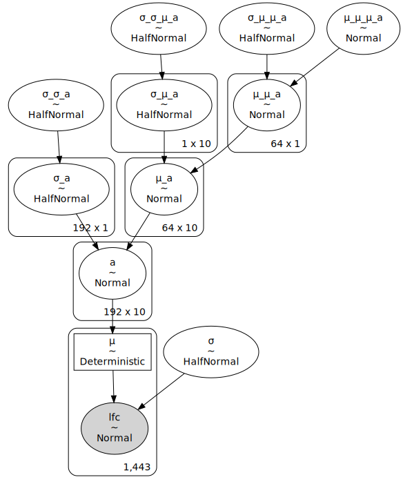

## Fit diagnostics

```python
if FIT_METHOD == "ADVI":
    pmanal.plot_vi_hist(advi_approx).draw()
    pmanal.plot_vi_hist(advi_approx, y_log=True).draw()
    pmanal.plot_vi_hist(advi_approx, y_log=True, x_start=0.5).draw()
    plt.show()
else:
    print("R-HAT")
    print(az.rhat(model_az))
    print("=" * 60)
    print("BFMI")
    print(az.bfmi(model_az))
```

    R-HAT
    <xarray.Dataset>
    Dimensions:      (a_dim_0: 192, a_dim_1: 10, μ_a_dim_0: 64, μ_a_dim_1: 10, μ_dim_0: 1443, μ_μ_a_dim_0: 64, μ_μ_a_dim_1: 1, σ_a_dim_0: 192, σ_a_dim_1: 1, σ_μ_a_dim_0: 1, σ_μ_a_dim_1: 10)
    Coordinates:
      * μ_μ_a_dim_0  (μ_μ_a_dim_0) int64 0 1 2 3 4 5 6 7 ... 56 57 58 59 60 61 62 63
      * μ_μ_a_dim_1  (μ_μ_a_dim_1) int64 0
      * μ_a_dim_0    (μ_a_dim_0) int64 0 1 2 3 4 5 6 7 8 ... 56 57 58 59 60 61 62 63
      * μ_a_dim_1    (μ_a_dim_1) int64 0 1 2 3 4 5 6 7 8 9
      * a_dim_0      (a_dim_0) int64 0 1 2 3 4 5 6 7 ... 185 186 187 188 189 190 191
      * a_dim_1      (a_dim_1) int64 0 1 2 3 4 5 6 7 8 9
      * σ_μ_a_dim_0  (σ_μ_a_dim_0) int64 0
      * σ_μ_a_dim_1  (σ_μ_a_dim_1) int64 0 1 2 3 4 5 6 7 8 9
      * σ_a_dim_0    (σ_a_dim_0) int64 0 1 2 3 4 5 6 ... 185 186 187 188 189 190 191
      * σ_a_dim_1    (σ_a_dim_1) int64 0
      * μ_dim_0      (μ_dim_0) int64 0 1 2 3 4 5 6 ... 1437 1438 1439 1440 1441 1442
    Data variables:
        μ_μ_μ_a      float64 1.005
        μ_μ_a        (μ_μ_a_dim_0, μ_μ_a_dim_1) float64 1.024 1.08 ... 1.034 1.078
        μ_a          (μ_a_dim_0, μ_a_dim_1) float64 1.004 1.004 ... 1.013 1.005
        a            (a_dim_0, a_dim_1) float64 1.001 1.001 1.005 ... 1.005 1.006
        σ_μ_μ_a      float64 1.016
        σ_σ_μ_a      float64 1.003
        σ_μ_a        (σ_μ_a_dim_0, σ_μ_a_dim_1) float64 1.009 1.062 ... 1.052 1.007
        σ_σ_a        float64 1.081
        σ_a          (σ_a_dim_0, σ_a_dim_1) float64 1.006 1.015 ... 1.039 1.062
        μ            (μ_dim_0) float64 1.001 1.001 1.005 1.001 ... 1.015 1.011 1.004
        σ            float64 1.192
    ============================================================
    BFMI
    [0.1308795  0.11554764 0.10217622 0.16979274]

## Model parameters

```python
def check_shape(trace: np.ndarray) -> np.ndarray:
    if len(trace.shape) == 1:
        return trace[:, None]
    return trace


def add_hdi(p: gg.ggplot, values: np.ndarray, color: str) -> gg.ggplot:
    m = np.mean(values)
    hdi = az.hdi(values, hdi_prob=0.89).flatten()
    p = (
        p
        + gg.geom_vline(xintercept=m, color=color)
        + gg.geom_vline(xintercept=hdi, color=color, linetype="--")
    )
    return p


def variable_distribution_plot(var, trace: np.ndarray, max_plot=20000) -> gg.ggplot:
    trace = check_shape(trace)

    # Sample 25% of the trace.
    d = pd.DataFrame(trace).melt().assign(variable=lambda d: d.variable.astype("str"))
    d_summaries = d.groupby(["variable"])["value"].mean().reset_index(drop=False)

    if d.shape[0] > max_plot:
        d = d.sample(n=max_plot)
    else:
        d = d.sample(frac=0.2)

    p = (
        gg.ggplot(d, gg.aes(x="value"))
        + gg.geom_density(alpha=0.1)
        + gg.geom_vline(xintercept=0, color="black", size=0.7, alpha=0.7, linetype="--")
        + gg.scale_x_continuous(expand=(0, 0))
        + gg.scale_y_continuous(expand=(0, 0, 0.02, 0))
        + gg.theme(legend_position="none", figure_size=(6.5, 3))
        + gg.labs(x="posterior", y="density", title=f"Posterior distirbution of {var}")
    )

    c = SeabornColor.BLUE

    if len(d_summaries) > 1:
        p = p + gg.geom_rug(
            data=d_summaries, sides="b", alpha=0.5, color=c, length=0.08
        )
    else:
        p = add_hdi(p, trace.flatten(), color=c)

    return p
```

```python
ignore_vars = "μ"
vars_to_inspect = model_az.posterior.keys()
vars_to_inspect = [v for v in vars_to_inspect if not "log" in v]
vars_to_inspect.sort()

for var in vars_to_inspect:
    trace = model_az.posterior[var]
    if trace.shape[1] == data.shape[0]:
        # Do not plot the final deterministic mean (usually "μ").
        continue
    try:
        print(variable_distribution_plot(var, model_az.posterior[var].values.flatten()))
    except Exception as err:
        print(f"Skipping variable '{var}'.")
        print(err)
```

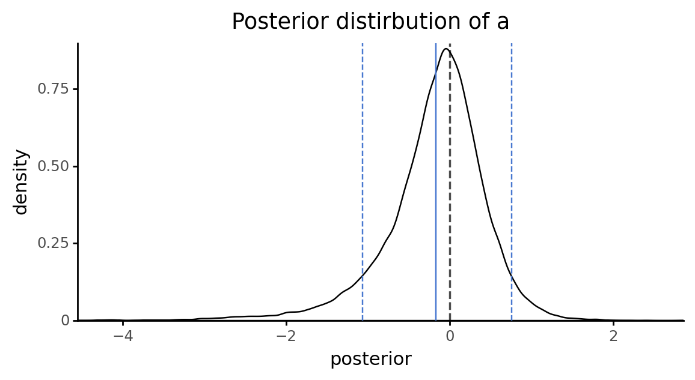

    <ggplot: (2952937683267)>

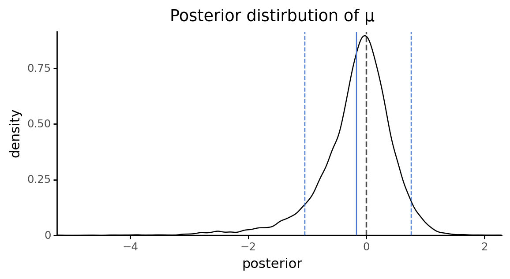

    <ggplot: (2952939460762)>

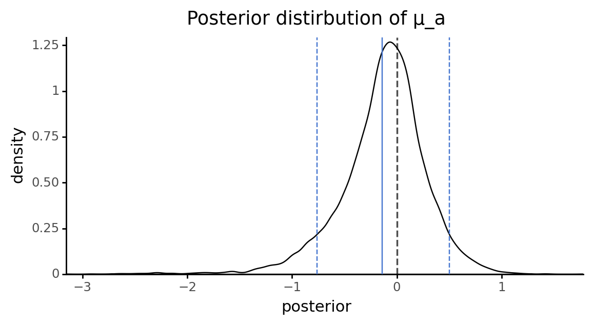

    <ggplot: (2952937687727)>

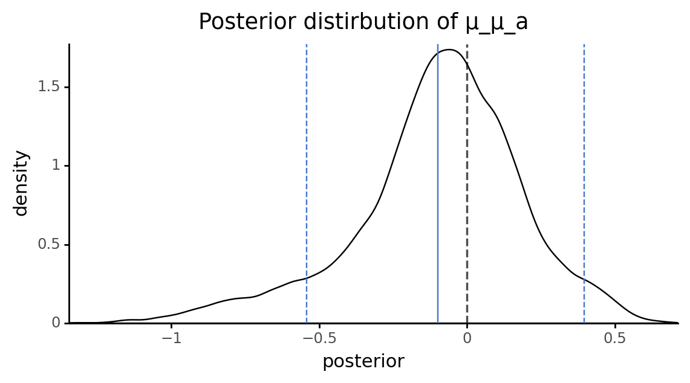

    <ggplot: (2953000516124)>

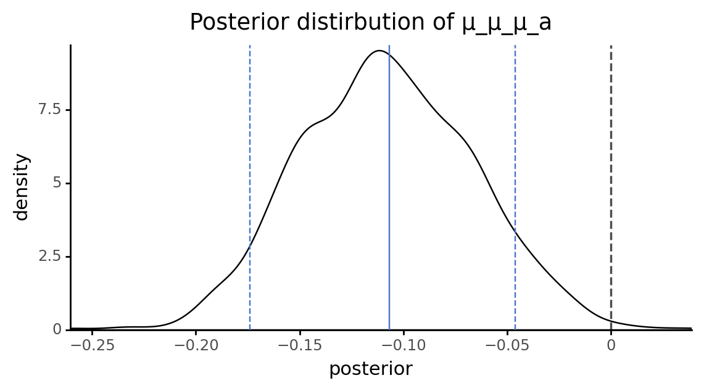

    <ggplot: (2952976127943)>

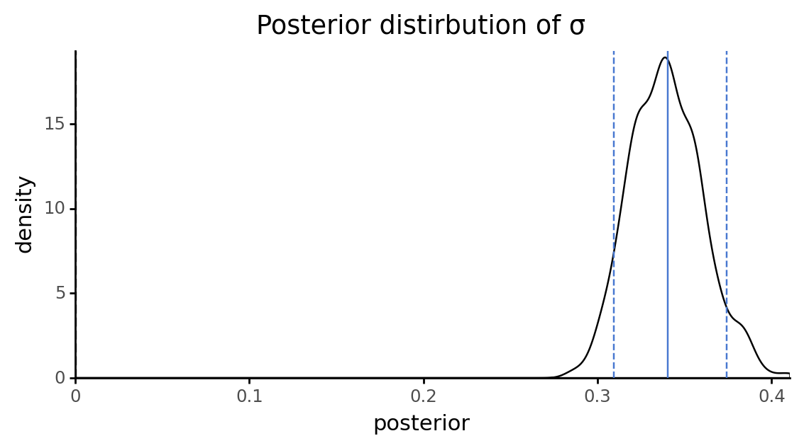

    <ggplot: (2953001454463)>

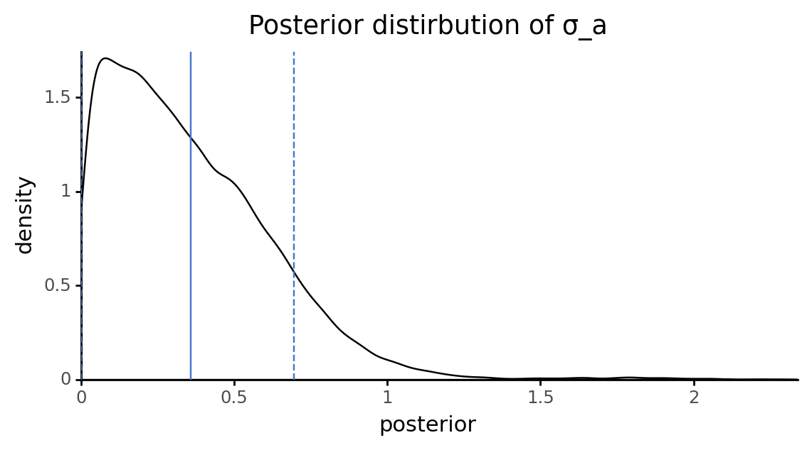

    <ggplot: (2952939470845)>

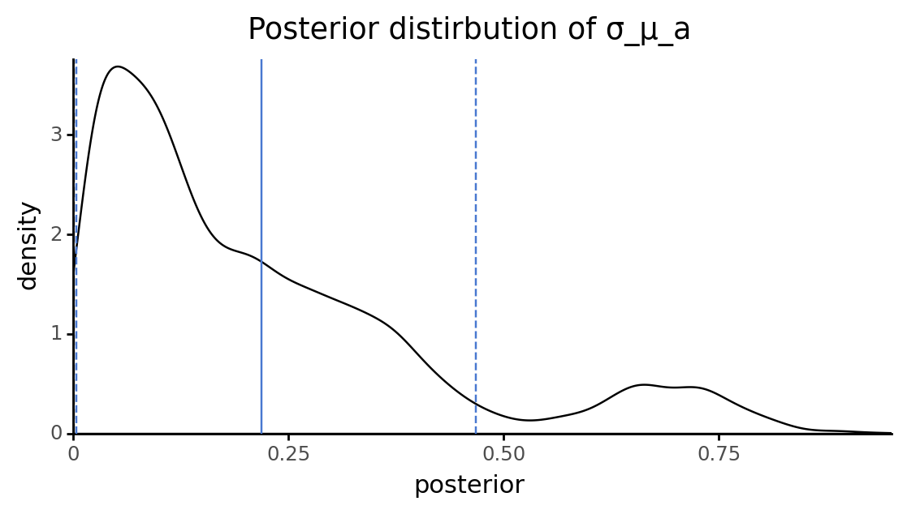

    <ggplot: (2952940896805)>

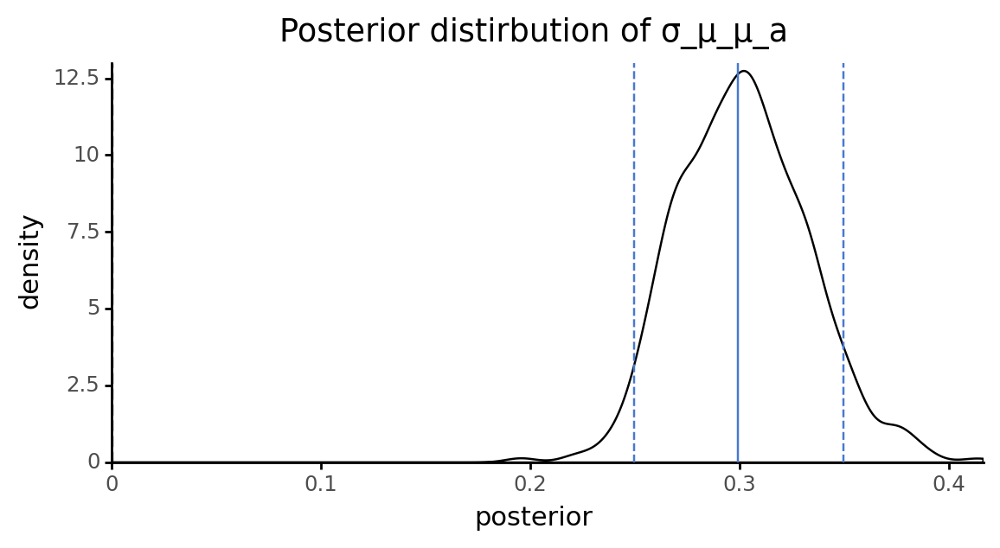

    <ggplot: (2952940553180)>

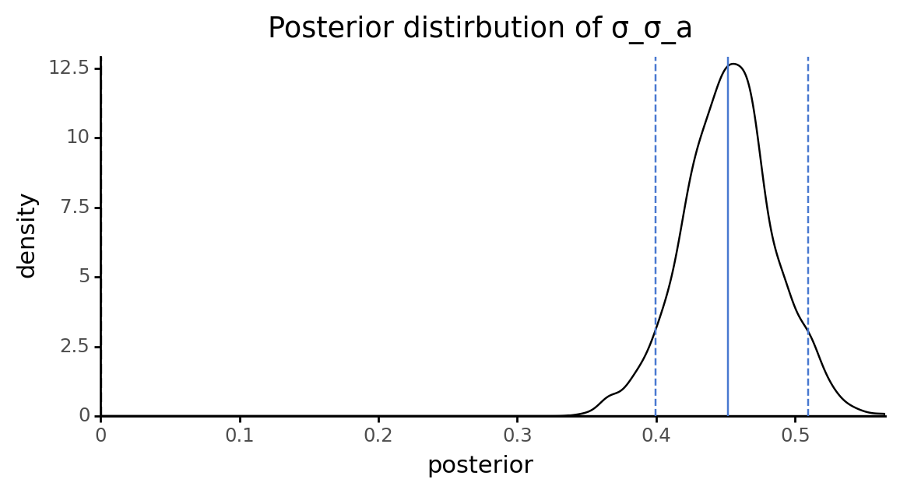

    <ggplot: (2952940896844)>

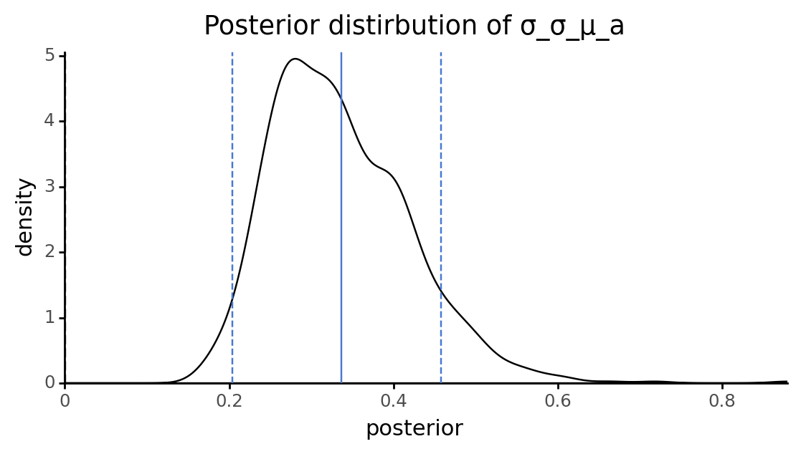

    <ggplot: (2952939153134)>

```python
if isinstance(speclet_model, SpecletTestModel):
    raise KeyboardInterrupt()
```

## Model predictions

```python
predictions = model_az.posterior_predictive
pred_summary = pmanal.summarize_posterior_predictions(
    predictions["lfc"].values,
    merge_with=data,
    calc_error=True,
    observed_y="lfc",
)
pred_summary.head()
```

    /n/data1/hms/dbmi/park/Cook/speclet/.snakemake/conda/daab5ac5/lib/python3.9/site-packages/arviz/stats/stats.py:456: FutureWarning: hdi currently interprets 2d data as (draw, shape) but this will change in a future release to (chain, draw) for coherence with other functions

<div>
<style scoped>
    .dataframe tbody tr th:only-of-type {
        vertical-align: middle;
    }

    .dataframe tbody tr th {
        vertical-align: top;
    }

    .dataframe thead th {
        text-align: right;
    }
</style>
<table border="1" class="dataframe">
  <thead>
    <tr style="text-align: right;">
      <th></th>
      <th>pred_mean</th>
      <th>pred_hdi_low</th>
      <th>pred_hdi_high</th>
      <th>sgrna</th>
      <th>replicate_id</th>
      <th>lfc</th>
      <th>p_dna_batch</th>
      <th>genome_alignment</th>
      <th>hugo_symbol</th>
      <th>screen</th>
      <th>...</th>
      <th>any_deleterious</th>
      <th>any_tcga_hotspot</th>
      <th>any_cosmic_hotspot</th>
      <th>is_mutated</th>
      <th>copy_number</th>
      <th>lineage</th>
      <th>primary_or_metastasis</th>
      <th>is_male</th>
      <th>age</th>
      <th>error</th>
    </tr>
  </thead>
  <tbody>
    <tr>
      <th>0</th>
      <td>-0.909827</td>
      <td>-1.712361</td>
      <td>-0.215837</td>
      <td>CTTGTTAGATAATGGAACT</td>
      <td>LS513_c903R1</td>
      <td>-1.100620</td>
      <td>ERS717283.plasmid</td>
      <td>chr2_157544604_-</td>
      <td>ACVR1C</td>
      <td>sanger</td>
      <td>...</td>
      <td>NaN</td>
      <td>NaN</td>
      <td>NaN</td>
      <td>False</td>
      <td>0.964254</td>
      <td>colorectal</td>
      <td>primary</td>
      <td>True</td>
      <td>63.0</td>
      <td>-0.190793</td>
    </tr>
    <tr>
      <th>1</th>
      <td>-0.420592</td>
      <td>-1.123976</td>
      <td>0.306654</td>
      <td>CTTGTTAGATAATGGAACT</td>
      <td>CL11_c903R1</td>
      <td>-0.572939</td>
      <td>ERS717283.plasmid</td>
      <td>chr2_157544604_-</td>
      <td>ACVR1C</td>
      <td>sanger</td>
      <td>...</td>
      <td>NaN</td>
      <td>NaN</td>
      <td>NaN</td>
      <td>False</td>
      <td>1.004888</td>
      <td>colorectal</td>
      <td>primary</td>
      <td>True</td>
      <td>NaN</td>
      <td>-0.152347</td>
    </tr>
    <tr>
      <th>2</th>
      <td>0.023131</td>
      <td>-0.733555</td>
      <td>0.723509</td>
      <td>CTTGTTAGATAATGGAACT</td>
      <td>HT29_c904R1</td>
      <td>0.054573</td>
      <td>ERS717283.plasmid</td>
      <td>chr2_157544604_-</td>
      <td>ACVR1C</td>
      <td>sanger</td>
      <td>...</td>
      <td>NaN</td>
      <td>NaN</td>
      <td>NaN</td>
      <td>False</td>
      <td>1.014253</td>
      <td>colorectal</td>
      <td>primary</td>
      <td>False</td>
      <td>44.0</td>
      <td>0.031441</td>
    </tr>
    <tr>
      <th>3</th>
      <td>0.497284</td>
      <td>-0.200849</td>
      <td>1.257356</td>
      <td>CTTGTTAGATAATGGAACT</td>
      <td>SNUC1_c903R4</td>
      <td>0.700923</td>
      <td>ERS717283.plasmid</td>
      <td>chr2_157544604_-</td>
      <td>ACVR1C</td>
      <td>sanger</td>
      <td>...</td>
      <td>NaN</td>
      <td>NaN</td>
      <td>NaN</td>
      <td>False</td>
      <td>0.946028</td>
      <td>colorectal</td>
      <td>metastasis</td>
      <td>True</td>
      <td>71.0</td>
      <td>0.203639</td>
    </tr>
    <tr>
      <th>4</th>
      <td>-0.871660</td>
      <td>-1.606786</td>
      <td>-0.140908</td>
      <td>CTTGTTAGATAATGGAACT</td>
      <td>KM12_c908R1_100</td>
      <td>-1.123352</td>
      <td>CRISPR_C6596666.sample</td>
      <td>chr2_157544604_-</td>
      <td>ACVR1C</td>
      <td>sanger</td>
      <td>...</td>
      <td>NaN</td>
      <td>NaN</td>
      <td>NaN</td>
      <td>False</td>
      <td>1.048861</td>
      <td>colorectal</td>
      <td>primary</td>
      <td>NaN</td>
      <td>NaN</td>
      <td>-0.251693</td>
    </tr>
  </tbody>
</table>
<p>5 rows × 26 columns</p>
</div>

```python
try:
    az.plot_loo_pit(model_az, y="lfc")
except Exception as e:
    print(e)
```

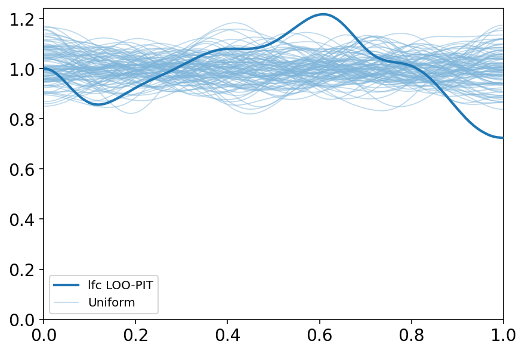

```python
model_loo = az.loo(model_az, pointwise=True)
print(model_loo)
```

    Computed from 4000 by 1443 log-likelihood matrix

             Estimate       SE
    elpd_loo -1088.98    29.21
    p_loo      806.85        -

    There has been a warning during the calculation. Please check the results.
    ------

    Pareto k diagnostic values:
                             Count   Pct.
    (-Inf, 0.5]   (good)      203   14.1%
     (0.5, 0.7]   (ok)        669   46.4%
       (0.7, 1]   (bad)       513   35.6%
       (1, Inf)   (very bad)   58    4.0%

```python
sns.distplot(model_loo.loo_i.values);
```

    /n/data1/hms/dbmi/park/Cook/speclet/.snakemake/conda/daab5ac5/lib/python3.9/site-packages/seaborn/distributions.py:2557: FutureWarning: `distplot` is a deprecated function and will be removed in a future version. Please adapt your code to use either `displot` (a figure-level function with similar flexibility) or `histplot` (an axes-level function for histograms).


    <AxesSubplot:ylabel='Density'>

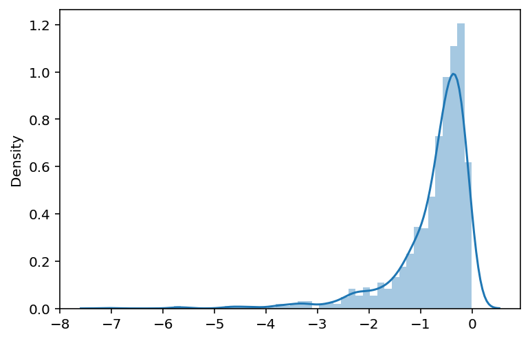

```python
pred_summary["loo"] = model_loo.loo_i.values
```

```python
(
    gg.ggplot(pred_summary, gg.aes(x="lfc", y="pred_mean"))
    + gg.geom_hline(yintercept=0, size=0.5, alpha=0.7)
    + gg.geom_vline(xintercept=0, size=0.5, alpha=0.7)
    + gg.geom_point(size=0.1, alpha=0.2)
    + gg.geom_abline(slope=1, intercept=0, size=1, alpha=0.7, color="grey")
    + gg.geom_smooth(method="glm", color=SeabornColor.RED, size=1, alpha=0.7, se=False)
    + gg.labs(x="observed LFC", y="prediticed LFC (posterior avg.)")
)
```

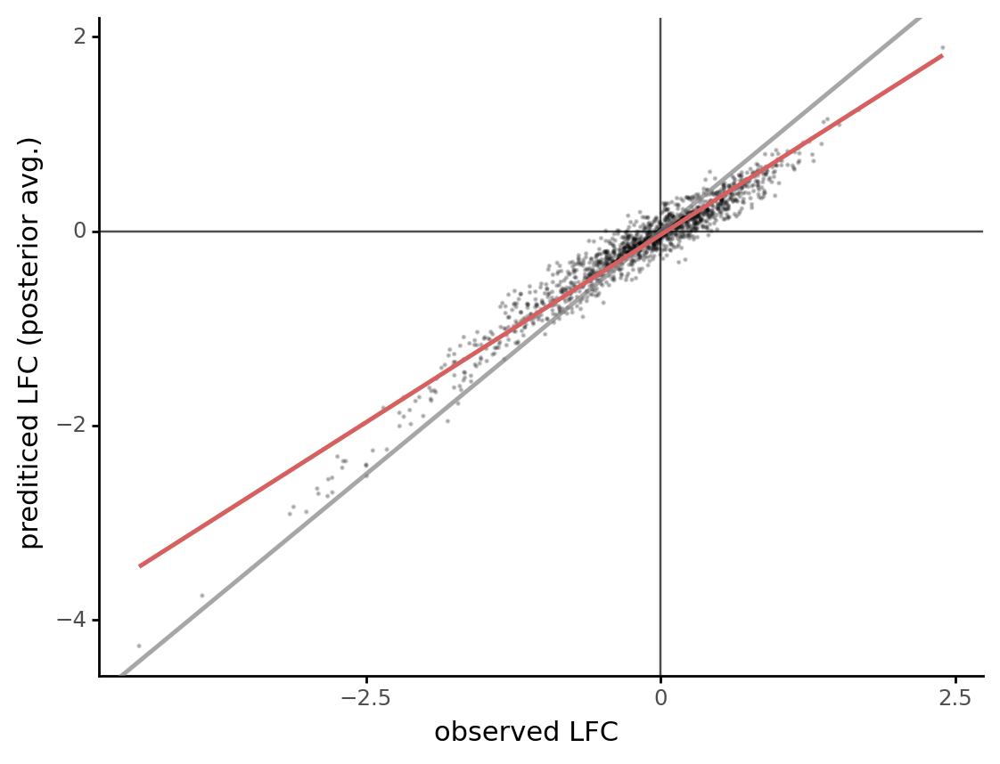

    <ggplot: (2952944081649)>

```python
(
    gg.ggplot(pred_summary, gg.aes(x="lfc", y="loo"))
    + gg.geom_point(gg.aes(color="np.abs(error)"), alpha=0.5)
    + gg.scale_color_gradient(low="grey", high="red")
    + gg.theme()
    + gg.labs(x="observed LFC", y="LOO", color="abs(error)")
)
```

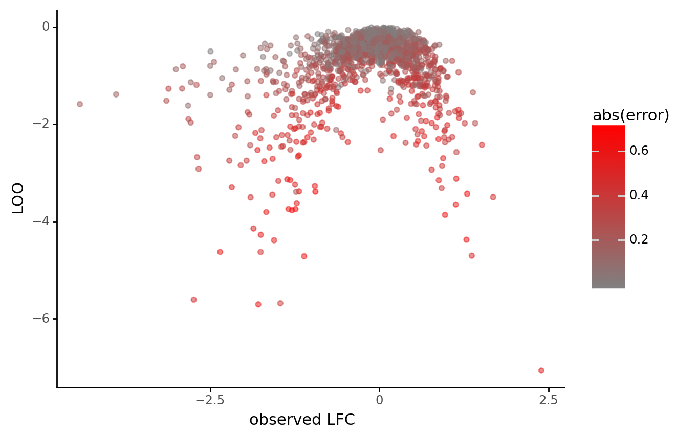

    <ggplot: (2952890808375)>

```python
(
    gg.ggplot(pred_summary, gg.aes(x="np.abs(error)", y="loo"))
    + gg.geom_point(gg.aes(color="lfc"), alpha=0.5)
    + gg.labs(x="abs(error)", y="loo", color="LFC")
)
```

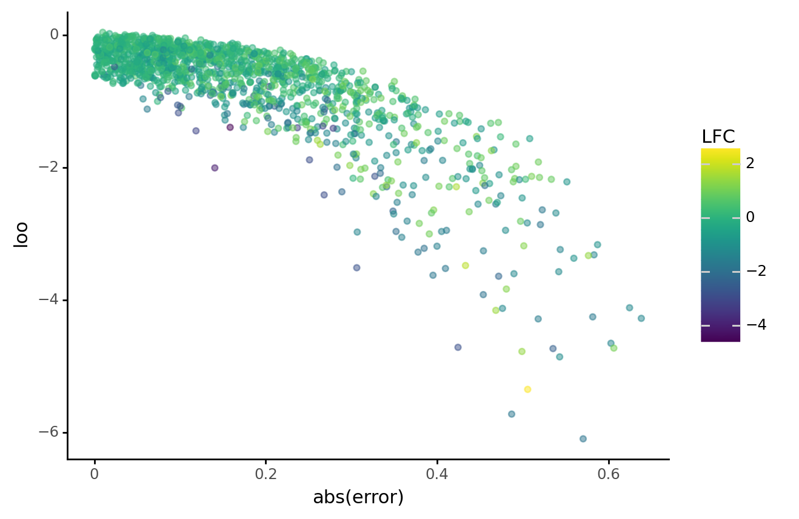

    <ggplot: (2953001952603)>

```python
(
    gg.ggplot(pred_summary, gg.aes(x="lfc", y="error"))
    + gg.geom_hline(yintercept=0, size=0.5, alpha=0.7)
    + gg.geom_vline(xintercept=0, size=0.5, alpha=0.7)
    + gg.geom_point(size=0.1, alpha=0.2)
    + gg.labs(x="observed LFC", y="prediction error")
)
```

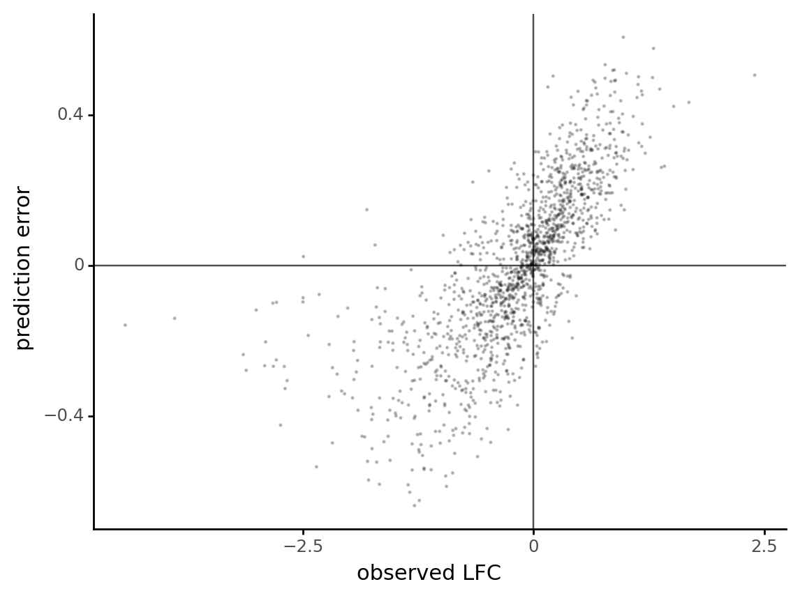

    <ggplot: (2953001926235)>

```python
(
    gg.ggplot(pred_summary, gg.aes(x="hugo_symbol", y="loo"))
    + gg.geom_point(alpha=0.2, size=0.7)
    + gg.geom_boxplot(outlier_alpha=0, alpha=0.4)
    + gg.theme(axis_text_x=gg.element_blank(), axis_ticks_major_x=gg.element_blank())
    + gg.labs(x="genes", y="LOO")
)
```

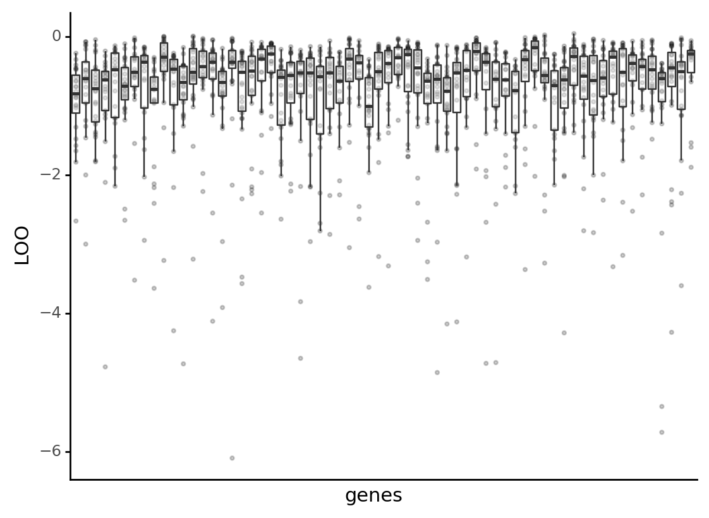

    <ggplot: (2952996757920)>

```python
(
    gg.ggplot(pred_summary, gg.aes(x="depmap_id", y="loo"))
    + gg.geom_jitter(width=0.2, alpha=0.3, size=0.7)
    + gg.geom_boxplot(outlier_alpha=0, alpha=0.4)
    + gg.theme(
        axis_text_x=gg.element_text(angle=90, size=8),
    )
    + gg.labs(x="cell lines", y="LOO")
)
```

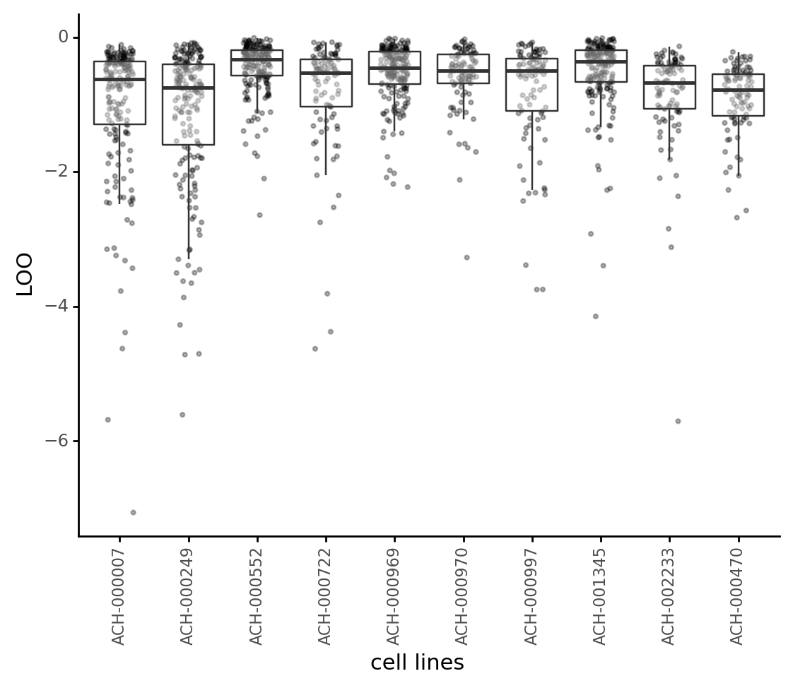

    <ggplot: (2952996744482)>

```python
# Remove samples without gene CN data.
ppc_df_no_missing = pred_summary.copy()[~pred_summary["copy_number"].isna()]
ppc_df_no_missing["binned_copy_number"] = [
    np.min([round(x), 10]) for x in ppc_df_no_missing["copy_number"]
]

(
    gg.ggplot(ppc_df_no_missing, gg.aes(x="factor(binned_copy_number)", y="loo"))
    + gg.geom_jitter(size=0.6, alpha=0.5, width=0.3)
    + gg.geom_boxplot(outlier_alpha=0, alpha=0.8)
    + gg.labs(x="gene copy number (max. 10)", y="LOO")
)
```

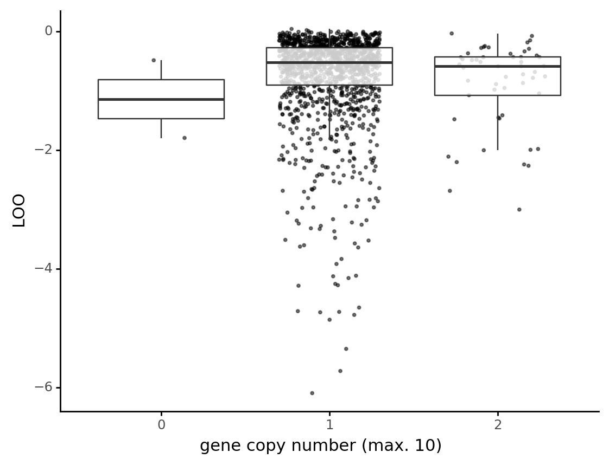

    <ggplot: (2953001950272)>

```python
gene_error = (
    pred_summary.groupby(["hugo_symbol"])["error"]
    .agg([np.mean, np.std])
    .reset_index(drop=False)
    .sort_values(["mean"])
    .reset_index(drop=True)
    .assign(
        hugo_symbol=lambda d: pd.Categorical(
            d.hugo_symbol.astype(str),
            categories=d.hugo_symbol.astype(str),
            ordered=True,
        )
    )
)

n_genes = 15

(
    gg.ggplot(
        gene_error.iloc[list(range(n_genes)) + list(range(-n_genes, -1))],
        gg.aes(x="hugo_symbol", y="mean"),
    )
    + gg.geom_col()
    + gg.theme(axis_text_x=gg.element_text(angle=90))
    + gg.labs(x="gene", y="error", title="Genes with the highest average error")
)
```

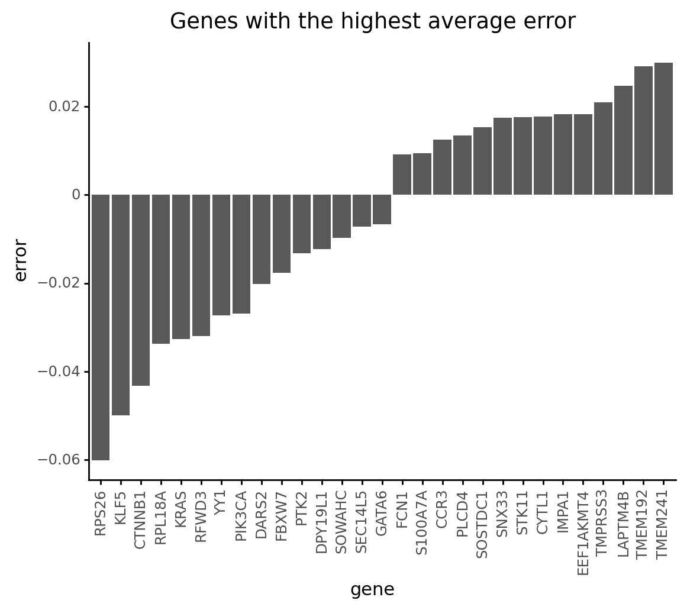

    <ggplot: (2952940082972)>

```python
(
    gg.ggplot(pred_summary, gg.aes(x="copy_number", y="error"))
    + gg.geom_hline(yintercept=0, size=0.5, alpha=0.7, linetype="--")
    + gg.geom_vline(xintercept=0, size=0.5, alpha=0.7, linetype="--")
    + gg.geom_point(size=0.1, alpha=0.2)
    + gg.labs(x="gene copy number", y="predition error")
)
```

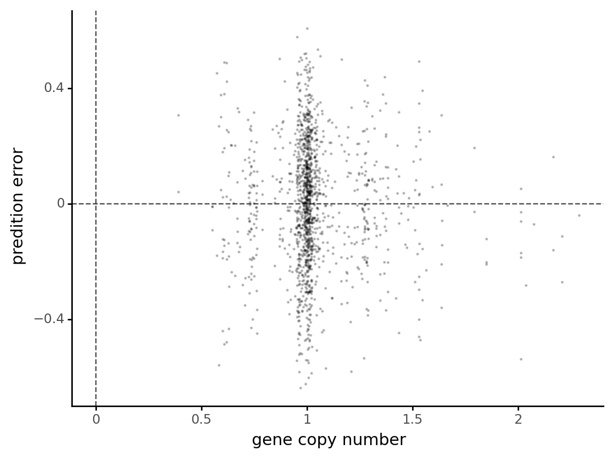

    <ggplot: (2952940163316)>

---

```python
notebook_toc = time()
print(f"execution time: {(notebook_toc - notebook_tic) / 60:.2f} minutes")
```

    execution time: 3.89 minutes

```python
%load_ext watermark
%watermark -d -u -v -iv -b -h -m
```

    Last updated: 2021-07-09

    Python implementation: CPython
    Python version       : 3.9.2
    IPython version      : 7.21.0

    Compiler    : GCC 9.3.0
    OS          : Linux
    Release     : 3.10.0-1062.el7.x86_64
    Machine     : x86_64
    Processor   : x86_64
    CPU cores   : 32
    Architecture: 64bit

    Hostname: compute-h-17-54.o2.rc.hms.harvard.edu

    Git branch: fit-models

    pandas    : 1.2.3
    logging   : 0.5.1.2
    numpy     : 1.20.1
    arviz     : 0.11.2
    matplotlib: 3.3.4
    plotnine  : 0.7.1
    pymc3     : 3.11.1
    seaborn   : 0.11.1
