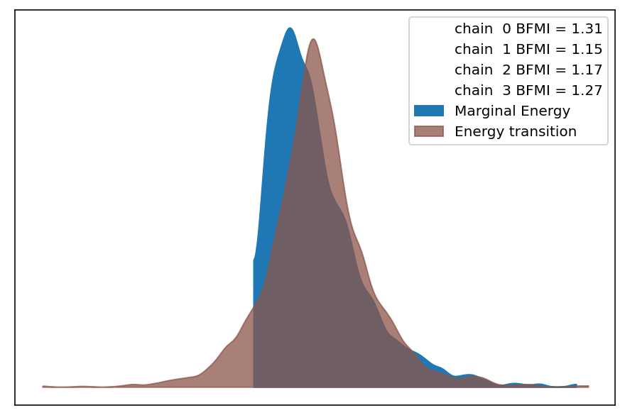
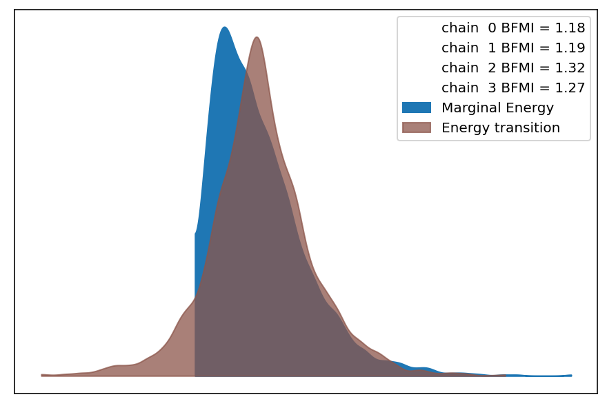
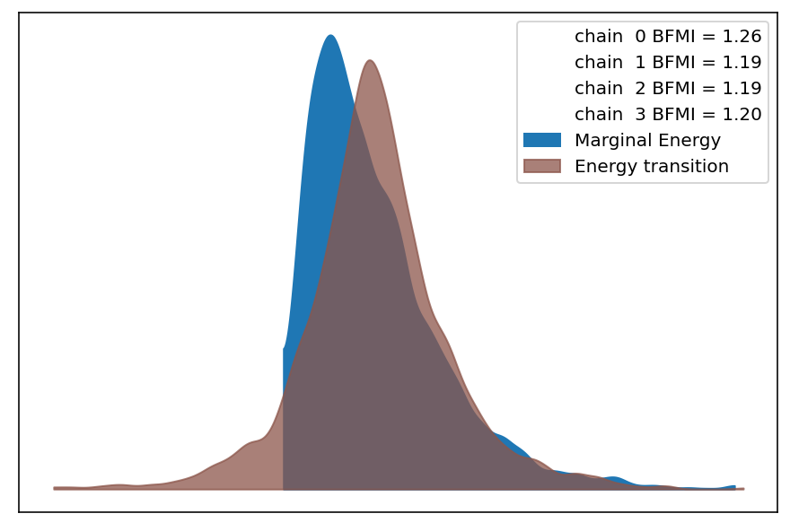
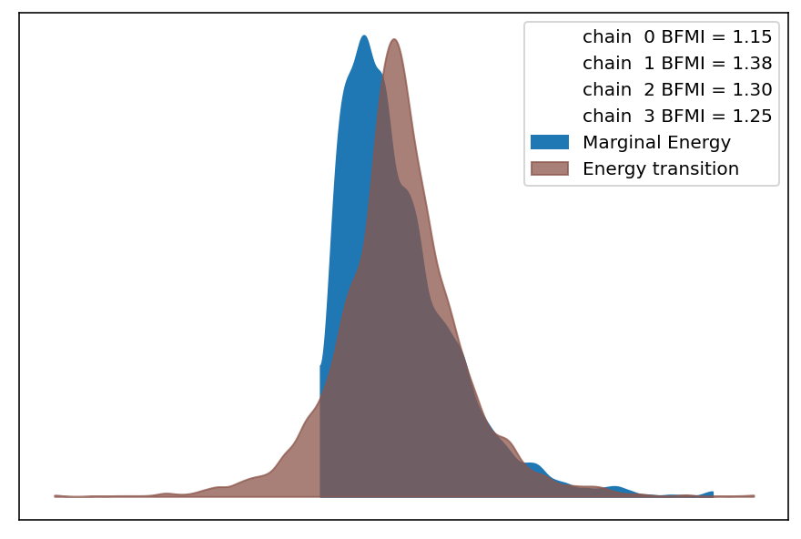
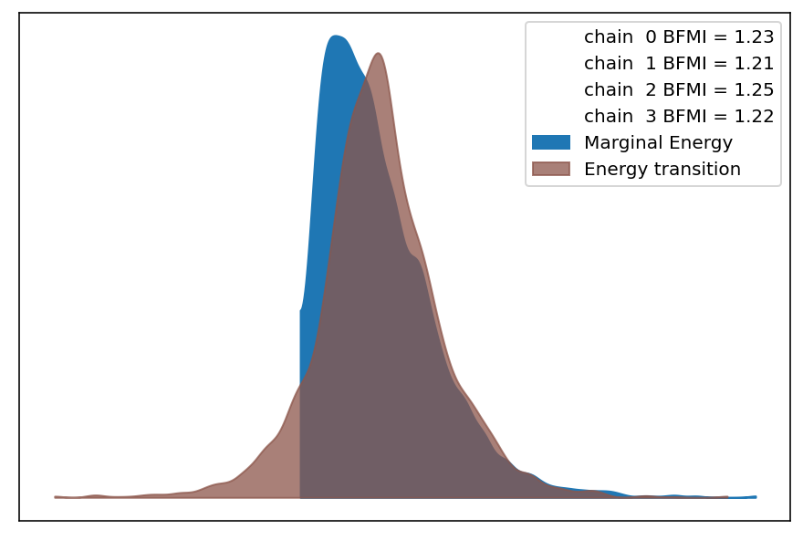
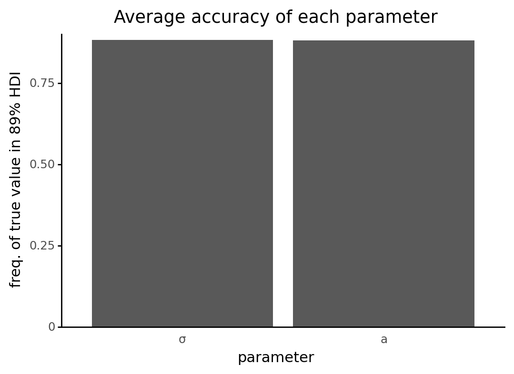
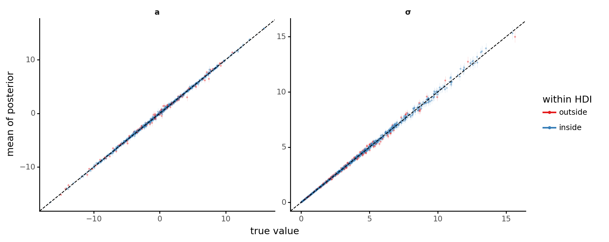
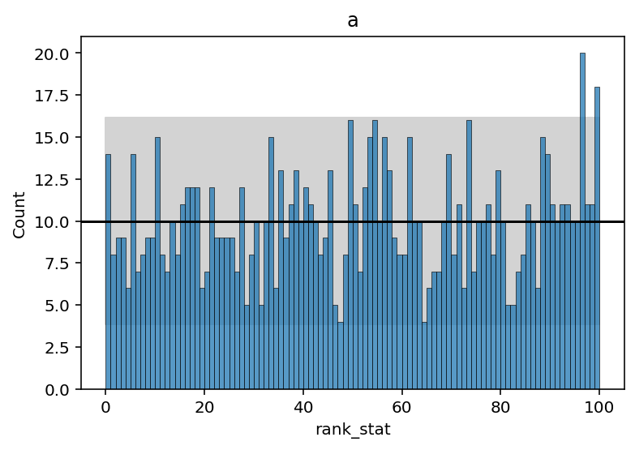
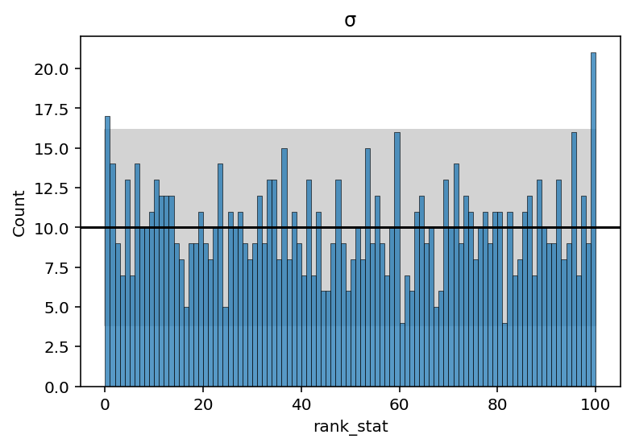

# Model SBC Report

```python
import logging
import warnings
from pathlib import Path
from pprint import pprint
from time import time

import janitor  # noqa: F401
import matplotlib.pyplot as plt
import numpy as np
import pandas as pd
import plotnine as gg

from src.analysis import pymc3_analysis as pmanal
from src.analysis import sbc_analysis as sbcanal
from src.loggers import set_console_handler_level
from src.managers.model_cache_managers import Pymc3ModelCacheManager
from src.modeling import simulation_based_calibration_helpers as sbc
from src.project_enums import ModelFitMethod
```

```python
notebook_tic = time()

warnings.simplefilter(action="ignore", category=UserWarning)

gg.theme_set(gg.theme_classic())
%config InlineBackend.figure_format = "retina"

RANDOM_SEED = 847
np.random.seed(RANDOM_SEED)

set_console_handler_level(logging.WARNING)
pymc3_cache_dir = Path("..", "models", "modeling_cache", "pymc3_model_cache")
```

Parameters for papermill:

- `MODEL_NAME`: unique, identifiable name of the model
- `SBC_RESULTS_DIR`: directory containing results of many rounds of SBC
- `SBC_COLLATED_RESULTS`: path to collated simulation posteriors
- `SBC_UNIFORMITY_RESULTS`: path to results of the uniformity test
- `NUM_SIMULATIONS`: the number of simiulations; will be used to check that all results are found
- `CONFIG_PATH`: path to the model configuration file
- `FIT_METHOD`: model fitting method used for this SBC

## Setup

### Papermill parameters

```python
MODEL_NAME = ""
SBC_RESULTS_DIR = ""
SBC_COLLATED_RESULTS = ""
SBC_UNIFORMITY_RESULTS = ""
NUM_SIMULATIONS = -1
CONFIG_PATH = ""
FIT_METHOD_STR = ""
```

```python
# Parameters
MODEL_NAME = "simple-default"
SBC_RESULTS_DIR = "/n/scratch3/users/j/jc604/speclet-sbc/simple-default_MCMC"
SBC_COLLATED_RESULTS = (
    "cache/sbc-cache/simple-default_MCMC_collated-posterior-summaries.pkl"
)
SBC_UNIFORMITY_RESULTS = (
    "cache/sbc-cache/simple-default_MCMC_uniformity-test-results.pkl"
)
NUM_SIMULATIONS = 1000
CONFIG_PATH = "models/model-configs.yaml"
FIT_METHOD_STR = "MCMC"

```

### Prepare and validate papermill parameters

Check values passed as the directory with results of the rounds of SBC.

```python
path_addition = "../.."

sbc_results_dir = Path(path_addition, SBC_RESULTS_DIR)
assert sbc_results_dir.is_dir()
assert sbc_results_dir.exists()

sbc_collated_results_path = Path(path_addition, SBC_COLLATED_RESULTS)
assert sbc_collated_results_path.is_file()
assert sbc_collated_results_path.exists()

sbc_uniformity_results_path = Path(path_addition, SBC_UNIFORMITY_RESULTS)
assert sbc_uniformity_results_path.is_file()
assert sbc_uniformity_results_path.exists()
```

Confirm that there is a positive number of simulations.

```python
assert NUM_SIMULATIONS > 0
```

```python
FIT_METHOD = ModelFitMethod(FIT_METHOD_STR)
```

## Read in all results

```python
# Posterior summaries dataframe.
simulation_posteriors_df = pd.read_pickle(sbc_collated_results_path)
simulation_posteriors_df.head()
```

<div>
<style scoped>
    .dataframe tbody tr th:only-of-type {
        vertical-align: middle;
    }

    .dataframe tbody tr th {
        vertical-align: top;
    }

    .dataframe thead th {
        text-align: right;
    }
</style>
<table border="1" class="dataframe">
  <thead>
    <tr style="text-align: right;">
      <th></th>
      <th></th>
      <th>mean</th>
      <th>sd</th>
      <th>hdi_5.5%</th>
      <th>hdi_94.5%</th>
      <th>mcse_mean</th>
      <th>mcse_sd</th>
      <th>ess_bulk</th>
      <th>ess_tail</th>
      <th>r_hat</th>
      <th>true_value</th>
      <th>simulation_id</th>
      <th>within_hdi</th>
    </tr>
    <tr>
      <th>parameter</th>
      <th>parameter_name</th>
      <th></th>
      <th></th>
      <th></th>
      <th></th>
      <th></th>
      <th></th>
      <th></th>
      <th></th>
      <th></th>
      <th></th>
      <th></th>
      <th></th>
    </tr>
  </thead>
  <tbody>
    <tr>
      <th>a</th>
      <th>a</th>
      <td>8.734</td>
      <td>0.047</td>
      <td>8.660</td>
      <td>8.806</td>
      <td>0.001</td>
      <td>0.001</td>
      <td>3189.0</td>
      <td>2814.0</td>
      <td>1.0</td>
      <td>8.747274</td>
      <td>sim_id_0000</td>
      <td>True</td>
    </tr>
    <tr>
      <th>σ</th>
      <th>σ</th>
      <td>1.443</td>
      <td>0.032</td>
      <td>1.390</td>
      <td>1.491</td>
      <td>0.001</td>
      <td>0.000</td>
      <td>3523.0</td>
      <td>2553.0</td>
      <td>1.0</td>
      <td>1.430365</td>
      <td>sim_id_0000</td>
      <td>True</td>
    </tr>
    <tr>
      <th>a</th>
      <th>a</th>
      <td>10.857</td>
      <td>0.158</td>
      <td>10.590</td>
      <td>11.088</td>
      <td>0.003</td>
      <td>0.002</td>
      <td>3390.0</td>
      <td>2904.0</td>
      <td>1.0</td>
      <td>10.824675</td>
      <td>sim_id_0001</td>
      <td>True</td>
    </tr>
    <tr>
      <th>σ</th>
      <th>σ</th>
      <td>4.890</td>
      <td>0.113</td>
      <td>4.712</td>
      <td>5.074</td>
      <td>0.002</td>
      <td>0.001</td>
      <td>3202.0</td>
      <td>2584.0</td>
      <td>1.0</td>
      <td>4.953259</td>
      <td>sim_id_0001</td>
      <td>True</td>
    </tr>
    <tr>
      <th>a</th>
      <th>a</th>
      <td>8.333</td>
      <td>0.140</td>
      <td>8.116</td>
      <td>8.560</td>
      <td>0.002</td>
      <td>0.002</td>
      <td>3360.0</td>
      <td>2713.0</td>
      <td>1.0</td>
      <td>8.340341</td>
      <td>sim_id_0002</td>
      <td>True</td>
    </tr>
  </tbody>
</table>
</div>

```python
# Uniformity test results dataframe.
sbc_uniformity_test = pd.read_pickle(sbc_uniformity_results_path)
var_names = sbc_uniformity_test.parameter.tolist()
parameter_names = [x.split("[")[0] for x in var_names]
sbc_uniformity_test["parameter_name"] = parameter_names
sbc_uniformity_test.head()
```

<div>
<style scoped>
    .dataframe tbody tr th:only-of-type {
        vertical-align: middle;
    }

    .dataframe tbody tr th {
        vertical-align: top;
    }

    .dataframe thead th {
        text-align: right;
    }
</style>
<table border="1" class="dataframe">
  <thead>
    <tr style="text-align: right;">
      <th></th>
      <th>parameter</th>
      <th>rank_stat</th>
      <th>parameter_name</th>
    </tr>
  </thead>
  <tbody>
    <tr>
      <th>0</th>
      <td>a</td>
      <td>2</td>
      <td>a</td>
    </tr>
    <tr>
      <th>1</th>
      <td>σ</td>
      <td>22</td>
      <td>σ</td>
    </tr>
    <tr>
      <th>0</th>
      <td>a</td>
      <td>77</td>
      <td>a</td>
    </tr>
    <tr>
      <th>1</th>
      <td>σ</td>
      <td>21</td>
      <td>σ</td>
    </tr>
    <tr>
      <th>0</th>
      <td>a</td>
      <td>27</td>
      <td>a</td>
    </tr>
  </tbody>
</table>
</div>

## Analysis

```python
sbc_analyzer = sbcanal.SBCAnalysis(
    root_dir=sbc_results_dir,
    pattern="perm",
    n_simulations=NUM_SIMULATIONS,
    simulation_posteriors=simulation_posteriors_df,
    uniformity_test_results=sbc_uniformity_test,
)
```

### ADVI approximation histories

```python
if FIT_METHOD is ModelFitMethod.ADVI:
    advi_histories: list[np.ndarray] = []

    for dir in sbc_results_dir.iterdir():
        if not dir.is_dir():
            continue

        cache_manager = Pymc3ModelCacheManager(name=MODEL_NAME, root_cache_dir=dir)
        if cache_manager.advi_cache_exists():
            _, advi_approx = cache_manager.get_advi_cache()
            advi_histories.append(advi_approx.hist)
    n_sims_advi_hist = min(NUM_SIMULATIONS, 5)
    sample_hist_idxs = np.random.choice(
        list(range(len(advi_histories))), size=n_sims_advi_hist, replace=False
    )

    def make_hist_df(sim_idx: int, hist_list: list[np.ndarray]) -> pd.DataFrame:
        df = pd.DataFrame({"sim_idx": sim_idx, "loss": hist_list[sim_idx].flatten()})
        df["step"] = np.arange(df.shape[0])
        return df

    sampled_advi_histories = pd.concat(
        [make_hist_df(i, advi_histories) for i in sample_hist_idxs]
    ).reset_index(drop=True)

    (
        gg.ggplot(
            sampled_advi_histories,
            gg.aes(x="step", y="np.log(loss)", color="factor(sim_idx)"),
        )
        + gg.geom_line(alpha=0.5)
        + gg.scale_color_brewer(type="qual", palette="Set1")
        + gg.scale_x_continuous(expand=(0, 0))
        + gg.scale_y_continuous(expand=(0.01, 0, 0.02, 0))
        + gg.theme(legend_position=(0.8, 0.5))
        + gg.labs(y="log loss", color="sim. idx.")
    ).draw()
    plt.show()
```

### MCMC diagnostics

```python
class IncompleteCachedResultsWarning(UserWarning):
    pass


if FIT_METHOD is ModelFitMethod.MCMC:
    pprint(sbc_analyzer.mcmc_diagnostics())
    print("=" * 60)

    all_sbc_perm_dirs = list(sbc_results_dir.iterdir())
    for perm_dir in np.random.choice(
        all_sbc_perm_dirs, size=min([5, len(all_sbc_perm_dirs)]), replace=False
    ):
        print(perm_dir.name)
        print("-" * 30)
        sbc_fm = sbc.SBCFileManager(perm_dir)
        if sbc_fm.all_data_exists():
            sbc_res = sbc_fm.get_sbc_results()
            _ = pmanal.describe_mcmc(sbc_res.inference_obj)
        else:
            warnings.warn(
                "Cannot find all components of the SBC results.",
                IncompleteCachedResultsWarning,
            )
```

    {'bfmi_mean': 1.2489559122765277,
     'bfmi_median': 1.2484674622732936,
     'bfmi_std_dev': 0.07992446552965049,
     'pct_divegences_mean': 0.0,
     'pct_divegences_median': 0.0,
     'pct_divegences_std_dev': 0.0,
     'step_size_mean': 1.2610116497118526,
     'step_size_median': 1.2441369890376048,
     'step_size_std_dev': 0.19680953282381244}
    ============================================================
    sbc-perm442
    ------------------------------
    sampled 4 chains with (unknown) tuning steps and 1,000 draws
    num. divergences: 0, 0, 0, 0
    percent divergences: 0.0, 0.0, 0.0, 0.0
    BFMI: 1.312, 1.151, 1.166, 1.273
    avg. step size: 1.247, 1.478, 1.222, 1.098



    sbc-perm414
    ------------------------------
    sampled 4 chains with (unknown) tuning steps and 1,000 draws
    num. divergences: 0, 0, 0, 0
    percent divergences: 0.0, 0.0, 0.0, 0.0
    BFMI: 1.182, 1.189, 1.321, 1.268
    avg. step size: 1.109, 1.238, 0.933, 1.331



    sbc-perm761
    ------------------------------
    sampled 4 chains with (unknown) tuning steps and 1,000 draws
    num. divergences: 0, 0, 0, 0
    percent divergences: 0.0, 0.0, 0.0, 0.0
    BFMI: 1.263, 1.192, 1.191, 1.203
    avg. step size: 1.172, 1.282, 0.995, 0.901



    sbc-perm782
    ------------------------------
    sampled 4 chains with (unknown) tuning steps and 1,000 draws
    num. divergences: 0, 0, 0, 0
    percent divergences: 0.0, 0.0, 0.0, 0.0
    BFMI: 1.149, 1.376, 1.3, 1.246
    avg. step size: 1.379, 1.264, 1.405, 1.356



    sbc-perm451
    ------------------------------
    sampled 4 chains with (unknown) tuning steps and 1,000 draws
    num. divergences: 0, 0, 0, 0
    percent divergences: 0.0, 0.0, 0.0, 0.0
    BFMI: 1.233, 1.211, 1.254, 1.222
    avg. step size: 1.15, 1.002, 1.201, 1.302



### Estimate accuracy

```python
accuracy_per_parameter = sbc_analyzer.run_posterior_accuracy_test()

accuracy_per_parameter["parameter_name"] = pd.Categorical(
    accuracy_per_parameter["parameter_name"],
    categories=accuracy_per_parameter["parameter_name"].values,
)

(
    gg.ggplot(accuracy_per_parameter, gg.aes(x="parameter_name", y="within_hdi"))
    + gg.geom_col()
    + gg.scale_y_continuous(expand=(0, 0, 0.02, 0))
    + gg.labs(
        x="parameter",
        y="freq. of true value in 89% HDI",
        title="Average accuracy of each parameter",
    )
    + gg.theme(axis_ticks_major_x=gg.element_blank(), figure_size=(6, 4))
)
```



    <ggplot: (2937290935504)>

```python
hdi_low, hdi_high = pmanal.get_hdi_colnames_from_az_summary(simulation_posteriors_df)


def filter_uninsteresting_parameters(df: pd.DataFrame) -> pd.DataFrame:
    return (
        df.reset_index(drop=False)
        .query("parameter_name != 'μ'")
        .filter_string("parameter_name", search_string="offset", complement=True)
    )


plot_df = filter_uninsteresting_parameters(simulation_posteriors_df)
n_params = plot_df.parameter_name.nunique()
plot_height = (1 + n_params // 4) * 4

(
    gg.ggplot(plot_df, gg.aes(x="true_value", y="mean", color="within_hdi"))
    + gg.facet_wrap("~ parameter_name", ncol=3, scales="free")
    + gg.geom_linerange(gg.aes(ymin=hdi_low, ymax=hdi_high), alpha=0.2, size=0.2)
    + gg.geom_point(size=0.3, alpha=0.3)
    + gg.geom_abline(slope=1, intercept=0, linetype="--")
    + gg.scale_color_brewer(
        type="qual",
        palette="Set1",
        labels=("outside", "inside"),
        guide=gg.guide_legend(
            title="within HDI",
            override_aes={"alpha": 1, "size": 1},
        ),
    )
    + gg.theme(
        figure_size=(10, plot_height),
        strip_background=gg.element_blank(),
        strip_text=gg.element_text(face="bold"),
        panel_spacing=0.25,
    )
    + gg.labs(
        x="true value",
        y="mean of posterior",
    )
)
```



    <ggplot: (2937479226724)>

### SBC Uniformity Test

```python
var_names_to_plot = (
    sbc_uniformity_test[["parameter", "parameter_name"]]
    .drop_duplicates()
    .reset_index(drop=True)
    .sort_values(["parameter_name", "parameter"])
    .groupby("parameter_name")
    .head(3)
    .reset_index(drop=True)
    .parameter.tolist()
)
```

```python
for v in var_names_to_plot:
    ax = sbc_analyzer.plot_uniformity(sbc_uniformity_test.query(f"parameter == '{v}'"))
    ax.set_title(v)
    plt.show()
```





---

```python
notebook_toc = time()
print(f"execution time: {(notebook_toc - notebook_tic) / 60:.2f} minutes")
```

    execution time: 25.22 minutes

```python
%load_ext watermark
%watermark -d -u -v -iv -b -h -m
```

    Last updated: 2021-08-16

    Python implementation: CPython
    Python version       : 3.9.2
    IPython version      : 7.21.0

    Compiler    : GCC 9.3.0
    OS          : Linux
    Release     : 3.10.0-1062.el7.x86_64
    Machine     : x86_64
    Processor   : x86_64
    CPU cores   : 32
    Architecture: 64bit

    Hostname: compute-a-16-167.o2.rc.hms.harvard.edu

    Git branch: speclet-simple

    plotnine  : 0.7.1
    janitor   : 0.20.14
    pandas    : 1.2.3
    matplotlib: 3.3.4
    logging   : 0.5.1.2
    numpy     : 1.20.1
