# Model SBC Report

```python
import logging
import warnings
from pathlib import Path
from time import time
from typing import List

import arviz as az
import janitor
import matplotlib.pyplot as plt
import numpy as np
import pandas as pd
import plotnine as gg

from src.loggers import set_console_handler_level
from src.managers.model_cache_managers import Pymc3ModelCacheManager
from src.modeling import pymc3_analysis as pmanal
from src.modeling import simulation_based_calibration_helpers as sbc
from src.project_enums import ModelFitMethod
```

```python
notebook_tic = time()

warnings.simplefilter(action="ignore", category=UserWarning)

gg.theme_set(gg.theme_classic())
%config InlineBackend.figure_format = "retina"

RANDOM_SEED = 847
np.random.seed(RANDOM_SEED)

set_console_handler_level(logging.WARNING)
pymc3_cache_dir = Path("..", "models", "modeling_cache", "pymc3_model_cache")
```

Parameters for papermill:

- `MODEL_NAME`: unique, identifiable name of the model
- `SBC_RESULTS_DIR`: directory containing results of many rounds of SBC
- `SBC_COLLATED_RESULTS`: path to collated simulation posteriors
- `SBC_UNIFORMITY_RESULTS`: path to results of the uniformity test
- `NUM_SIMULATIONS`: the number of simiulations; will be used to check that all results are found
- `CONFIG_PATH`: path to the model configuration file
- `FIT_METHOD`: model fitting method used for this SBC

## Setup

### Papermill parameters

```python
MODEL_NAME = ""
SBC_RESULTS_DIR = ""
SBC_COLLATED_RESULTS = ""
SBC_UNIFORMITY_RESULTS = ""
NUM_SIMULATIONS = -1
CONFIG_PATH = ""
FIT_METHOD_STR = ""
```

```python
# Parameters
MODEL_NAME = "sp2-default"
SBC_RESULTS_DIR = "/n/scratch3/users/j/jc604/speclet-sbc/sp2-default_MCMC"
SBC_COLLATED_RESULTS = (
    "cache/sbc-cache/sp2-default_MCMC_collated-posterior-summaries.pkl"
)
SBC_UNIFORMITY_RESULTS = "cache/sbc-cache/sp2-default_MCMC_uniformity-test-results.pkl"
NUM_SIMULATIONS = 500
CONFIG_PATH = "models/model-configs.yaml"
FIT_METHOD_STR = "MCMC"

```

### Prepare and validate papermill parameters

Check values passed as the directory with results of the rounds of SBC.

```python
path_addition = "../.."

sbc_results_dir = Path(path_addition, SBC_RESULTS_DIR)
assert sbc_results_dir.is_dir()
assert sbc_results_dir.exists()

sbc_collated_results_path = Path(path_addition, SBC_COLLATED_RESULTS)
assert sbc_collated_results_path.is_file()
assert sbc_collated_results_path.exists()

sbc_uniformity_results_path = Path(path_addition, SBC_UNIFORMITY_RESULTS)
assert sbc_uniformity_results_path.is_file()
assert sbc_uniformity_results_path.exists()
```

Confirm that there is a positive number of simulations.

```python
assert NUM_SIMULATIONS > 0
```

```python
FIT_METHOD = ModelFitMethod(FIT_METHOD_STR)
```

## Read in all results

```python
simulation_posteriors_df = pd.read_pickle(sbc_collated_results_path)
simulation_posteriors_df.head()
```

<div>
<style scoped>
    .dataframe tbody tr th:only-of-type {
        vertical-align: middle;
    }

    .dataframe tbody tr th {
        vertical-align: top;
    }

    .dataframe thead th {
        text-align: right;
    }
</style>
<table border="1" class="dataframe">
  <thead>
    <tr style="text-align: right;">
      <th></th>
      <th></th>
      <th>mean</th>
      <th>sd</th>
      <th>hdi_5.5%</th>
      <th>hdi_94.5%</th>
      <th>mcse_mean</th>
      <th>mcse_sd</th>
      <th>ess_bulk</th>
      <th>ess_tail</th>
      <th>r_hat</th>
      <th>true_value</th>
      <th>simulation_id</th>
      <th>within_hdi</th>
    </tr>
    <tr>
      <th>parameter</th>
      <th>parameter_name</th>
      <th></th>
      <th></th>
      <th></th>
      <th></th>
      <th></th>
      <th></th>
      <th></th>
      <th></th>
      <th></th>
      <th></th>
      <th></th>
      <th></th>
    </tr>
  </thead>
  <tbody>
    <tr>
      <th>μ_α</th>
      <th>μ_α</th>
      <td>0.064</td>
      <td>0.099</td>
      <td>-0.011</td>
      <td>0.250</td>
      <td>0.048</td>
      <td>0.037</td>
      <td>6.0</td>
      <td>28.0</td>
      <td>2.39</td>
      <td>0.882026</td>
      <td>sim_id_0000</td>
      <td>False</td>
    </tr>
    <tr>
      <th>α[0,0]</th>
      <th>α</th>
      <td>0.470</td>
      <td>0.100</td>
      <td>0.373</td>
      <td>0.632</td>
      <td>0.050</td>
      <td>0.038</td>
      <td>5.0</td>
      <td>15.0</td>
      <td>3.23</td>
      <td>1.273675</td>
      <td>sim_id_0000</td>
      <td>False</td>
    </tr>
    <tr>
      <th>α[0,1]</th>
      <th>α</th>
      <td>0.921</td>
      <td>0.085</td>
      <td>0.829</td>
      <td>1.068</td>
      <td>0.042</td>
      <td>0.032</td>
      <td>4.0</td>
      <td>12.0</td>
      <td>3.55</td>
      <td>1.778736</td>
      <td>sim_id_0000</td>
      <td>False</td>
    </tr>
    <tr>
      <th>α[0,2]</th>
      <th>α</th>
      <td>0.769</td>
      <td>0.085</td>
      <td>0.676</td>
      <td>0.916</td>
      <td>0.042</td>
      <td>0.032</td>
      <td>4.0</td>
      <td>12.0</td>
      <td>3.60</td>
      <td>1.629343</td>
      <td>sim_id_0000</td>
      <td>False</td>
    </tr>
    <tr>
      <th>α[0,3]</th>
      <th>α</th>
      <td>-0.310</td>
      <td>0.101</td>
      <td>-0.409</td>
      <td>-0.147</td>
      <td>0.050</td>
      <td>0.038</td>
      <td>4.0</td>
      <td>15.0</td>
      <td>3.33</td>
      <td>0.490961</td>
      <td>sim_id_0000</td>
      <td>False</td>
    </tr>
  </tbody>
</table>
</div>

## Analysis

### ADVI approximation histories

```python
if FIT_METHOD is ModelFitMethod.ADVI:
    advi_histories: List[np.ndarray] = []

    for dir in sbc_results_dir.iterdir():
        if not dir.is_dir():
            continue

        cache_manager = Pymc3ModelCacheManager(name=MODEL_NAME, root_cache_dir=dir)
        if cache_manager.advi_cache_exists():
            _, advi_approx = cache_manager.get_advi_cache()
            advi_histories.append(advi_approx.hist)
    n_sims_advi_hist = min(NUM_SIMULATIONS, 5)
    sample_hist_idxs = np.random.choice(
        list(range(len(advi_histories))), size=n_sims_advi_hist, replace=False
    )

    def make_hist_df(sim_idx: int, hist_list: List[np.ndarray]) -> pd.DataFrame:
        df = pd.DataFrame({"sim_idx": sim_idx, "loss": hist_list[sim_idx].flatten()})
        df["step"] = np.arange(df.shape[0])
        return df

    sampled_advi_histories = pd.concat(
        [make_hist_df(i, advi_histories) for i in sample_hist_idxs]
    ).reset_index(drop=True)

    (
        gg.ggplot(
            sampled_advi_histories,
            gg.aes(x="step", y="np.log(loss)", color="factor(sim_idx)"),
        )
        + gg.geom_line(alpha=0.5)
        + gg.scale_color_brewer(type="qual", palette="Set1")
        + gg.scale_x_continuous(expand=(0, 0))
        + gg.scale_y_continuous(expand=(0.01, 0, 0.02, 0))
        + gg.theme(legend_position=(0.8, 0.5))
        + gg.labs(y="log loss", color="sim. idx.")
    ).draw()
    plt.show()
```

### MCMC diagnostics

```python
class IncompleteCachedResultsWarning(UserWarning):
    pass


all_sbc_perm_dirs = list(sbc_results_dir.iterdir())

for perm_dir in np.random.choice(
    all_sbc_perm_dirs, size=min([5, len(all_sbc_perm_dirs)]), replace=False
):
    print(perm_dir.name)
    print("-" * 30)
    sbc_fm = sbc.SBCFileManager(perm_dir)
    if sbc_fm.all_data_exists():
        sbc_res = sbc_fm.get_sbc_results()
        _ = pmanal.describe_mcmc(sbc_res.inference_obj)
    else:
        warnings.warn(
            "Cannot find all components of the SBC results.",
            IncompleteCachedResultsWarning,
        )
```

    sbc-perm435
    ------------------------------
    sampled 4 chains with (unknown) tuning steps and 1,000 draws
    num. divergences: 138, 97, 72, 79
    percent divergences: 13.8, 9.7, 7.2, 7.9
    BFMI: 0.346, 0.404, 0.34, 0.482
    avg. step size: 0.044, 0.01, 0.055, 0.031

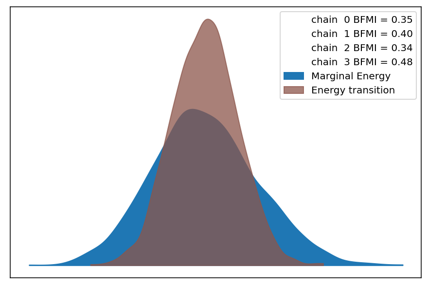

    sbc-perm56
    ------------------------------
    sampled 4 chains with (unknown) tuning steps and 1,000 draws
    num. divergences: 110, 86, 168, 119
    percent divergences: 11.0, 8.6, 16.8, 11.9
    BFMI: 0.339, 0.42, 0.445, 0.465
    avg. step size: 0.054, 0.049, 0.053, 0.047

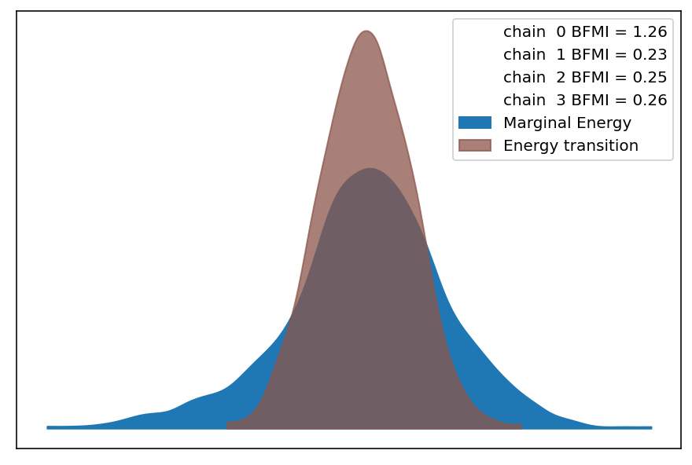

    sbc-perm439
    ------------------------------
    sampled 4 chains with (unknown) tuning steps and 1,000 draws
    num. divergences: 901, 190, 123, 334
    percent divergences: 90.1, 19.0, 12.3, 33.4
    BFMI: 1.158, 0.569, 0.497, 0.529
    avg. step size: 0.04, 0.069, 0.028, 0.035

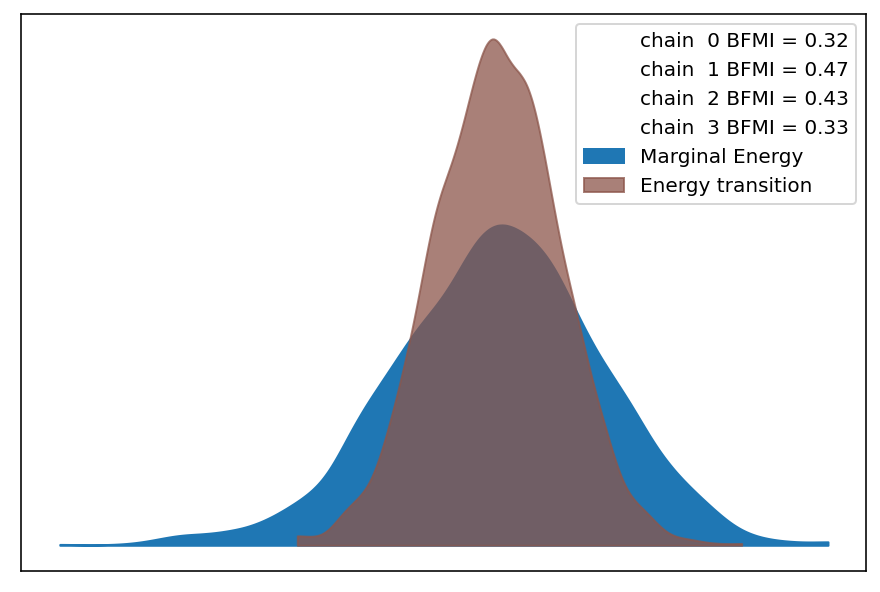

    sbc-perm67
    ------------------------------
    sampled 4 chains with (unknown) tuning steps and 1,000 draws
    num. divergences: 253, 121, 163, 1000
    percent divergences: 25.3, 12.1, 16.3, 100.0
    BFMI: 0.509, 0.457, 0.376, 1.489
    avg. step size: 0.035, 0.034, 0.022, 0.019

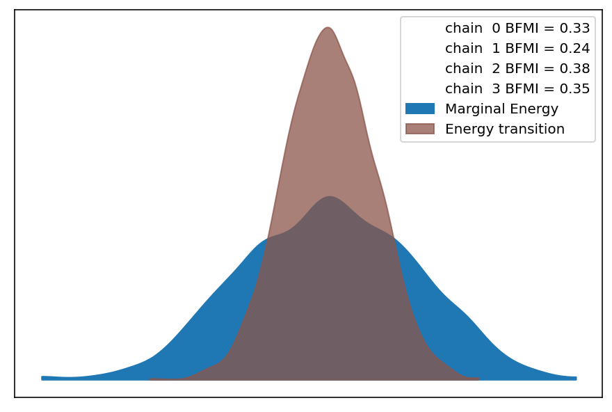

    sbc-perm417
    ------------------------------
    sampled 4 chains with (unknown) tuning steps and 1,000 draws
    num. divergences: 263, 575, 606, 33
    percent divergences: 26.3, 57.5, 60.6, 3.3
    BFMI: 0.551, 0.578, 0.699, 0.337
    avg. step size: 0.072, 0.029, 0.05, 0.046

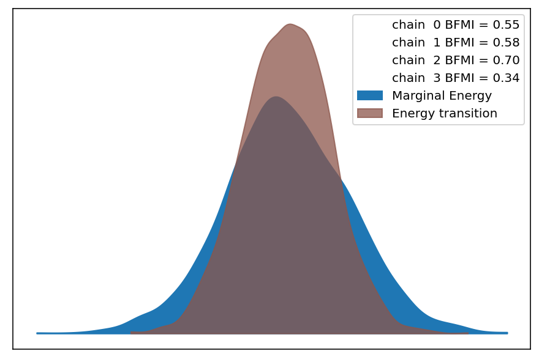

### Estimate accuracy

```python
accuracy_per_parameter = (
    simulation_posteriors_df.copy()
    .groupby(["parameter_name"])["within_hdi"]
    .mean()
    .reset_index(drop=False)
    .sort_values("within_hdi", ascending=False)
    .reset_index(drop=True)
)

accuracy_per_parameter["parameter_name"] = pd.Categorical(
    accuracy_per_parameter["parameter_name"],
    categories=accuracy_per_parameter["parameter_name"].values,
)

(
    gg.ggplot(accuracy_per_parameter, gg.aes(x="parameter_name", y="within_hdi"))
    + gg.geom_col()
    + gg.scale_y_continuous(expand=(0, 0, 0.02, 0))
    + gg.labs(
        x="parameter",
        y="freq. of true value in 89% HDI",
        title="Average accuracy of each parameter",
    )
    + gg.theme(axis_ticks_major_x=gg.element_blank(), figure_size=(6, 4))
)
```

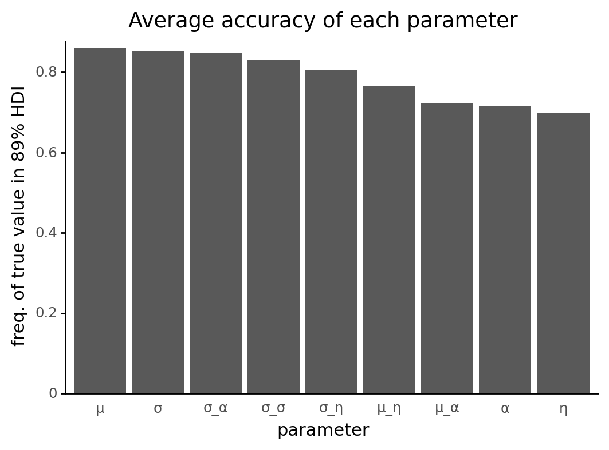

    <ggplot: (2975434951554)>

```python
hdi_low, hdi_high = pmanal.get_hdi_colnames_from_az_summary(simulation_posteriors_df)


def filter_uninsteresting_parameters(df: pd.DataFrame) -> pd.DataFrame:
    return (
        df.reset_index(drop=False)
        .query("parameter_name != 'μ'")
        .filter_string("parameter_name", search_string="offset", complement=True)
    )


(
    gg.ggplot(
        filter_uninsteresting_parameters(simulation_posteriors_df),
        gg.aes(x="true_value", y="mean", color="within_hdi"),
    )
    + gg.facet_wrap("~ parameter_name", ncol=3, scales="free")
    + gg.geom_linerange(gg.aes(ymin=hdi_low, ymax=hdi_high), alpha=0.2, size=0.2)
    + gg.geom_point(size=0.3, alpha=0.3)
    + gg.geom_abline(slope=1, intercept=0, linetype="--")
    + gg.scale_color_brewer(
        type="qual",
        palette="Set1",
        labels=("outside", "inside"),
        guide=gg.guide_legend(
            title="within HDI",
            override_aes={"alpha": 1, "size": 1},
        ),
    )
    + gg.theme(
        figure_size=(10, 20),
        strip_background=gg.element_blank(),
        strip_text=gg.element_text(face="bold"),
        panel_spacing=0.25,
    )
    + gg.labs(
        x="true value",
        y="mean of posterior",
    )
)
```

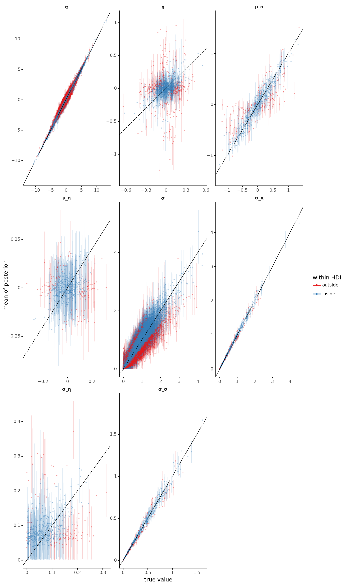

    <ggplot: (2975438602518)>

### SBC Uniformity Test

```python
sbc_analyzer = sbc.SBCAnalysis(
    root_dir=sbc_results_dir, pattern="sbc-perm", n_simulations=NUM_SIMULATIONS
)
```

```python
sbc_uniformity_test = pd.read_pickle(sbc_uniformity_results_path)

var_names = sbc_uniformity_test.parameter.tolist()
parameter_names = [x.split("[")[0] for x in var_names]
sbc_uniformity_test["parameter_name"] = parameter_names

sbc_uniformity_test.head()
```

<div>
<style scoped>
    .dataframe tbody tr th:only-of-type {
        vertical-align: middle;
    }

    .dataframe tbody tr th {
        vertical-align: top;
    }

    .dataframe thead th {
        text-align: right;
    }
</style>
<table border="1" class="dataframe">
  <thead>
    <tr style="text-align: right;">
      <th></th>
      <th>parameter</th>
      <th>rank_stat</th>
      <th>parameter_name</th>
    </tr>
  </thead>
  <tbody>
    <tr>
      <th>0</th>
      <td>μ_α</td>
      <td>0</td>
      <td>μ_α</td>
    </tr>
    <tr>
      <th>1</th>
      <td>α[0,0]</td>
      <td>0</td>
      <td>α</td>
    </tr>
    <tr>
      <th>2</th>
      <td>α[0,1]</td>
      <td>0</td>
      <td>α</td>
    </tr>
    <tr>
      <th>3</th>
      <td>α[0,2]</td>
      <td>0</td>
      <td>α</td>
    </tr>
    <tr>
      <th>4</th>
      <td>α[0,3]</td>
      <td>0</td>
      <td>α</td>
    </tr>
  </tbody>
</table>
</div>

```python
var_names_to_plot = (
    sbc_uniformity_test[["parameter", "parameter_name"]]
    .drop_duplicates()
    .reset_index(drop=True)
    .sort_values(["parameter_name", "parameter"])
    .groupby("parameter_name")
    .head(3)
    .reset_index(drop=True)
    .parameter.tolist()
)
```

```python
for v in var_names_to_plot:
    ax = sbc_analyzer.plot_uniformity(sbc_uniformity_test.query(f"parameter == '{v}'"))
    ax.set_title(v)
    plt.show()
```

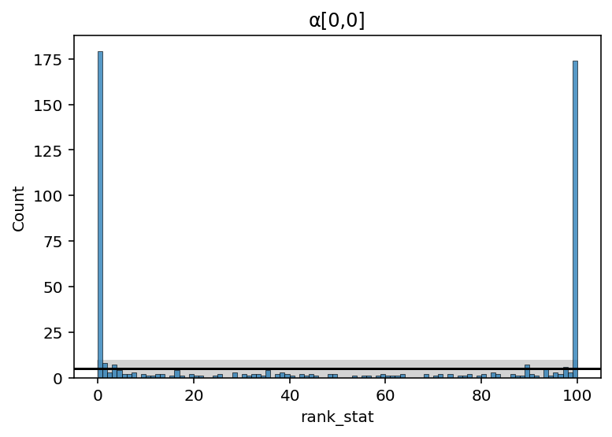

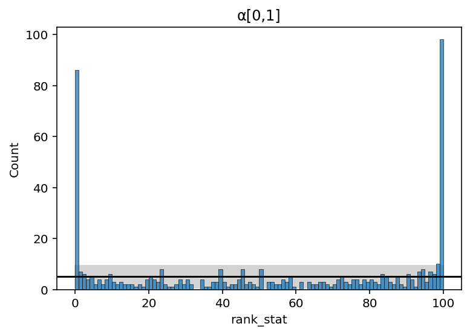


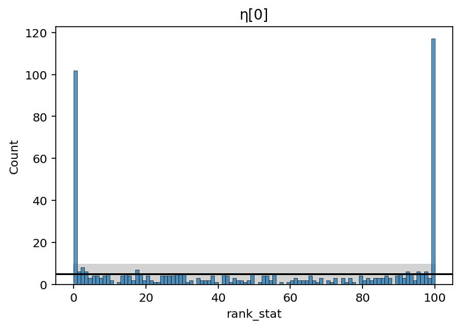

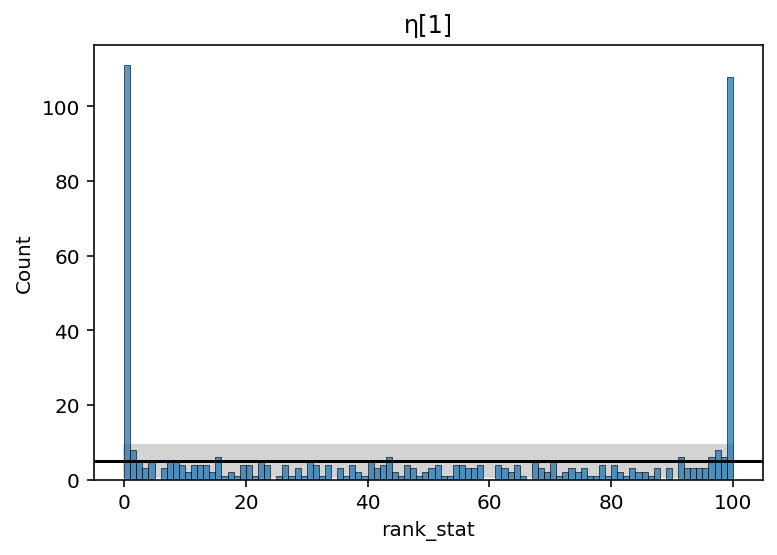

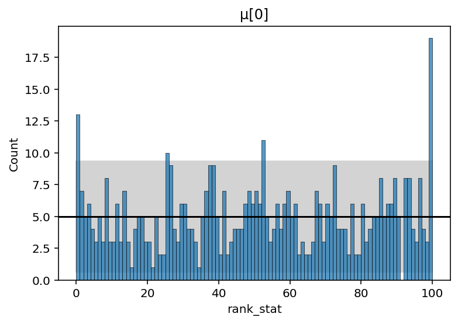

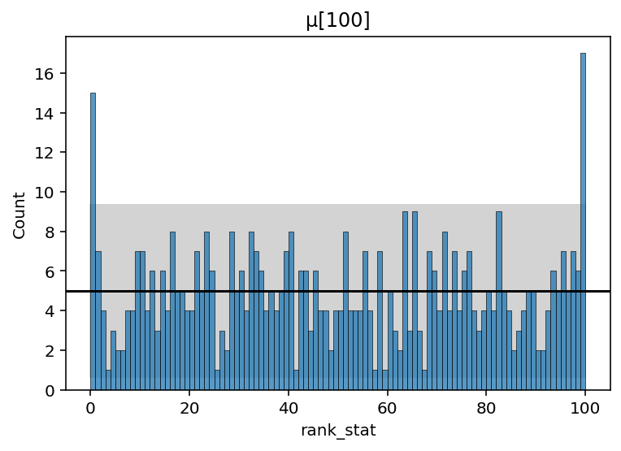


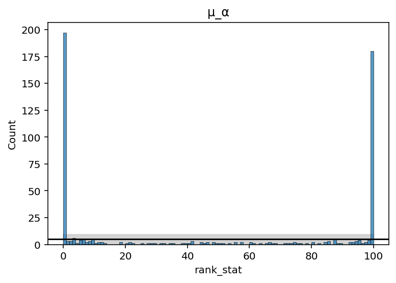

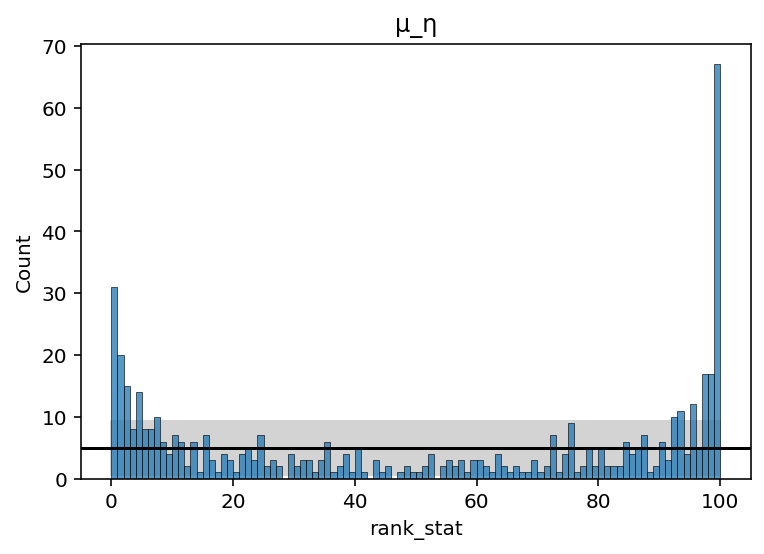

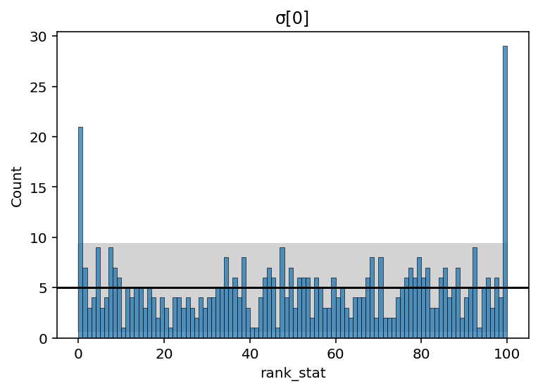

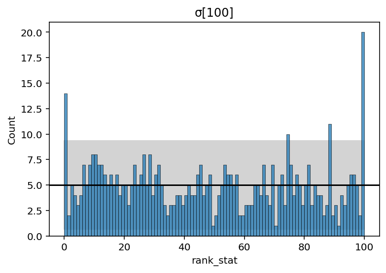

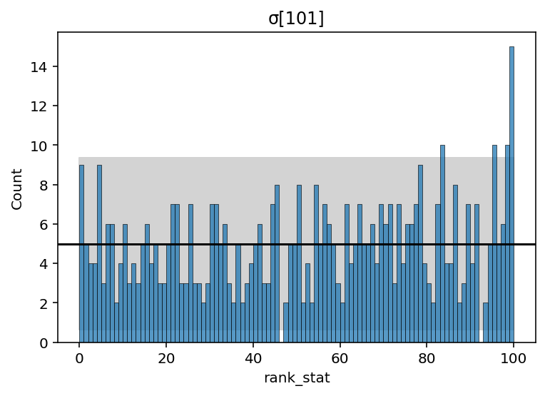

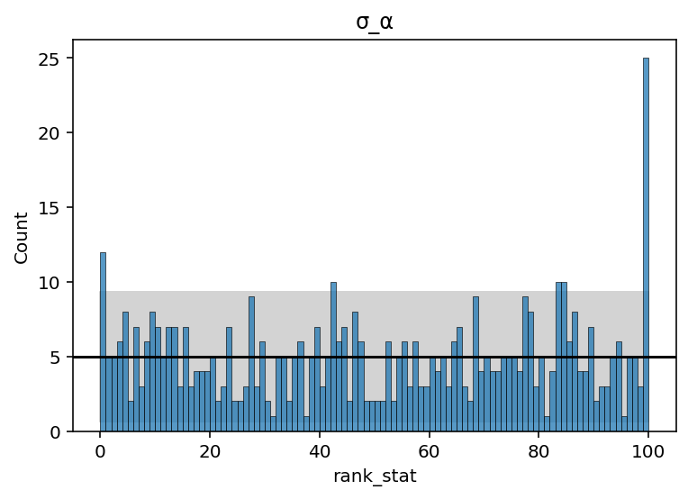


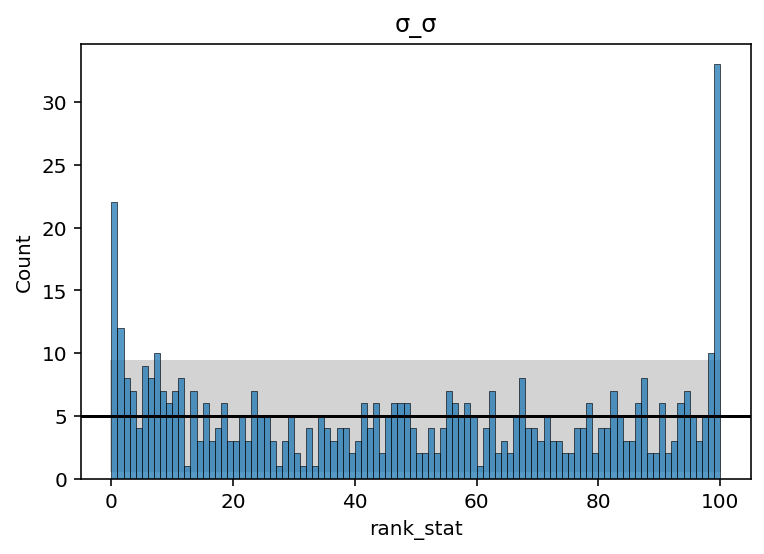

---

```python
notebook_toc = time()
print(f"execution time: {(notebook_toc - notebook_tic) / 60:.2f} minutes")
```

    execution time: 0.64 minutes

```python
%load_ext watermark
%watermark -d -u -v -iv -b -h -m
```

    Last updated: 2021-07-26

    Python implementation: CPython
    Python version       : 3.9.2
    IPython version      : 7.21.0

    Compiler    : GCC 9.3.0
    OS          : Linux
    Release     : 3.10.0-1062.el7.x86_64
    Machine     : x86_64
    Processor   : x86_64
    CPU cores   : 32
    Architecture: 64bit

    Hostname: compute-a-16-167.o2.rc.hms.harvard.edu

    Git branch: sbc-uniform-check

    pandas    : 1.2.3
    arviz     : 0.11.2
    logging   : 0.5.1.2
    numpy     : 1.20.1
    matplotlib: 3.3.4
    janitor   : 0.20.14
    plotnine  : 0.7.1
