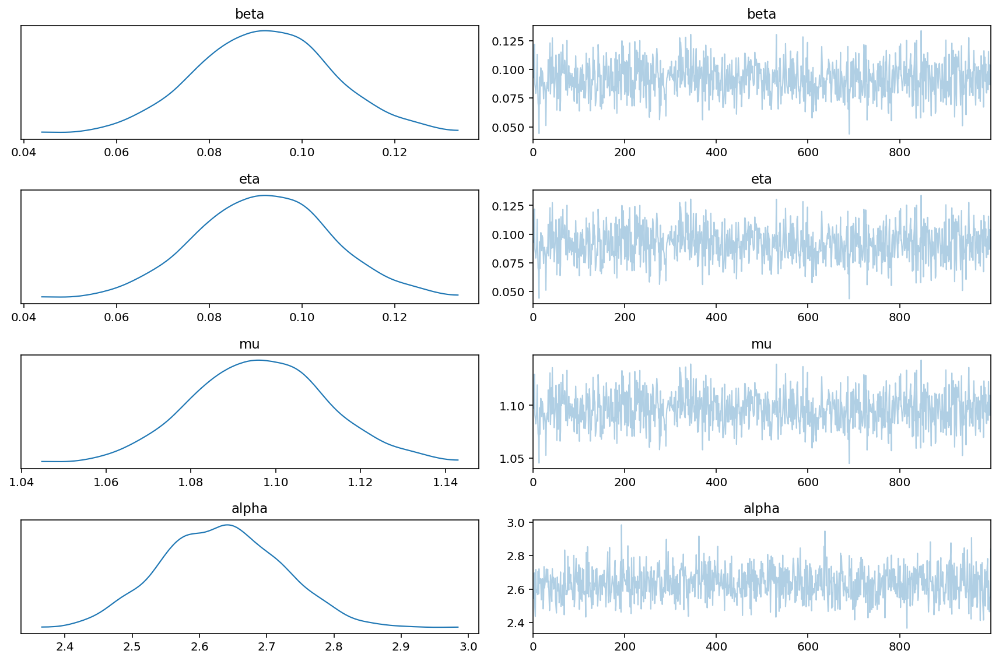
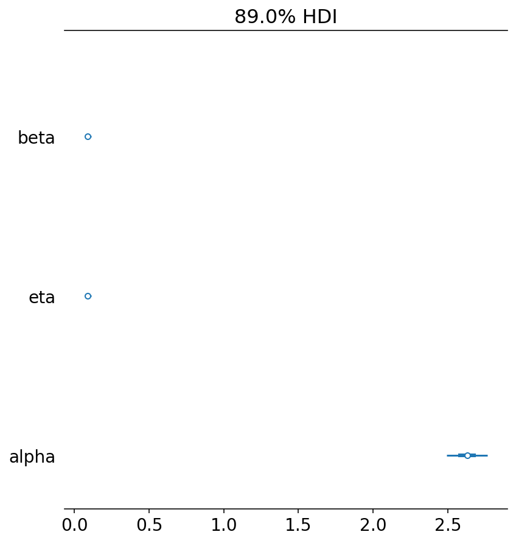
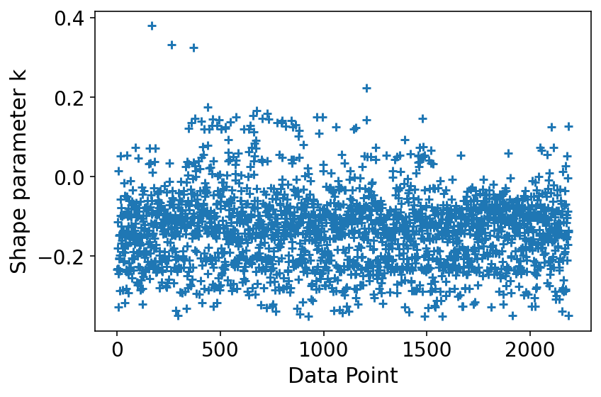

# Model Report

```python
import logging
from time import time

import arviz as az
import matplotlib.pyplot as plt

from speclet import model_configuration
from speclet.analysis.arviz_analysis import describe_mcmc
from speclet.io import project_root
from speclet.loggers import set_console_handler_level
from speclet.managers.cache_manager import (
    get_cached_posterior,
    get_posterior_cache_name,
)
from speclet.project_configuration import get_bayesian_modeling_constants
from speclet.project_enums import ModelFitMethod
```

```python
notebook_tic = time()
set_console_handler_level(logging.WARNING)
%config InlineBackend.figure_format = "retina"
HDI_PROB = get_bayesian_modeling_constants().hdi_prob
```

Parameters for papermill:

- `MODEL_NAME`: name of the model
- `FIT_METHOD`: method used to fit the model; either "ADVI" or "MCMC"
- `CONFIG_PATH`: path to configuration file
- `ROOT_CACHE_DIR`: path to the root caching directory

## Setup

### Papermill parameters

```python
CONFIG_PATH = ""
MODEL_NAME = ""
FIT_METHOD_STR = ""
ROOT_CACHE_DIR = ""
```

```python
# Parameters
MODEL_NAME = "example-specification"
FIT_METHOD_STR = "PYMC3_ADVI"
CONFIG_PATH = "models/model-configs.yaml"
ROOT_CACHE_DIR = "models"
```

```python
FIT_METHOD = ModelFitMethod(FIT_METHOD_STR)
```

```python
speclet_model = model_configuration.get_configuration_for_model(
    config_path=project_root() / CONFIG_PATH, name=MODEL_NAME
)
trace = get_cached_posterior(
    get_posterior_cache_name(MODEL_NAME, FIT_METHOD),
    cache_dir=project_root() / ROOT_CACHE_DIR,
)
```

## Fit diagnostics

```python
if "MCMC" in FIT_METHOD.value:
    print("R-HAT")
    print(az.rhat(trace))
    print("=" * 60)
    describe_mcmc(trace)
```

## Model parameters

```python
def _as_int(x: float) -> str:
    return str(int(x))


az.summary(trace, hdi_prob=HDI_PROB).style.format(
    formatter={"ess_bulk": _as_int, "ess_tail": _as_int}, precision=2
)
```

    arviz - WARNING - Shape validation failed: input_shape: (1, 1000), minimum_shape: (chains=2, draws=4)

<style type="text/css">
</style>
<table id="T_a40f7_">
  <thead>
    <tr>
      <th class="blank level0" >&nbsp;</th>
      <th class="col_heading level0 col0" >mean</th>
      <th class="col_heading level0 col1" >sd</th>
      <th class="col_heading level0 col2" >hdi_5.5%</th>
      <th class="col_heading level0 col3" >hdi_94.5%</th>
      <th class="col_heading level0 col4" >mcse_mean</th>
      <th class="col_heading level0 col5" >mcse_sd</th>
      <th class="col_heading level0 col6" >ess_bulk</th>
      <th class="col_heading level0 col7" >ess_tail</th>
      <th class="col_heading level0 col8" >r_hat</th>
    </tr>
  </thead>
  <tbody>
    <tr>
      <th id="T_a40f7_level0_row0" class="row_heading level0 row0" >beta</th>
      <td id="T_a40f7_row0_col0" class="data row0 col0" >0.09</td>
      <td id="T_a40f7_row0_col1" class="data row0 col1" >0.01</td>
      <td id="T_a40f7_row0_col2" class="data row0 col2" >0.07</td>
      <td id="T_a40f7_row0_col3" class="data row0 col3" >0.12</td>
      <td id="T_a40f7_row0_col4" class="data row0 col4" >0.00</td>
      <td id="T_a40f7_row0_col5" class="data row0 col5" >0.00</td>
      <td id="T_a40f7_row0_col6" class="data row0 col6" >847</td>
      <td id="T_a40f7_row0_col7" class="data row0 col7" >839</td>
      <td id="T_a40f7_row0_col8" class="data row0 col8" >nan</td>
    </tr>
    <tr>
      <th id="T_a40f7_level0_row1" class="row_heading level0 row1" >eta</th>
      <td id="T_a40f7_row1_col0" class="data row1 col0" >0.09</td>
      <td id="T_a40f7_row1_col1" class="data row1 col1" >0.01</td>
      <td id="T_a40f7_row1_col2" class="data row1 col2" >0.07</td>
      <td id="T_a40f7_row1_col3" class="data row1 col3" >0.12</td>
      <td id="T_a40f7_row1_col4" class="data row1 col4" >0.00</td>
      <td id="T_a40f7_row1_col5" class="data row1 col5" >0.00</td>
      <td id="T_a40f7_row1_col6" class="data row1 col6" >847</td>
      <td id="T_a40f7_row1_col7" class="data row1 col7" >839</td>
      <td id="T_a40f7_row1_col8" class="data row1 col8" >nan</td>
    </tr>
    <tr>
      <th id="T_a40f7_level0_row2" class="row_heading level0 row2" >mu</th>
      <td id="T_a40f7_row2_col0" class="data row2 col0" >1.10</td>
      <td id="T_a40f7_row2_col1" class="data row2 col1" >0.02</td>
      <td id="T_a40f7_row2_col2" class="data row2 col2" >1.07</td>
      <td id="T_a40f7_row2_col3" class="data row2 col3" >1.12</td>
      <td id="T_a40f7_row2_col4" class="data row2 col4" >0.00</td>
      <td id="T_a40f7_row2_col5" class="data row2 col5" >0.00</td>
      <td id="T_a40f7_row2_col6" class="data row2 col6" >847</td>
      <td id="T_a40f7_row2_col7" class="data row2 col7" >839</td>
      <td id="T_a40f7_row2_col8" class="data row2 col8" >nan</td>
    </tr>
    <tr>
      <th id="T_a40f7_level0_row3" class="row_heading level0 row3" >alpha</th>
      <td id="T_a40f7_row3_col0" class="data row3 col0" >2.63</td>
      <td id="T_a40f7_row3_col1" class="data row3 col1" >0.09</td>
      <td id="T_a40f7_row3_col2" class="data row3 col2" >2.48</td>
      <td id="T_a40f7_row3_col3" class="data row3 col3" >2.77</td>
      <td id="T_a40f7_row3_col4" class="data row3 col4" >0.00</td>
      <td id="T_a40f7_row3_col5" class="data row3 col5" >0.00</td>
      <td id="T_a40f7_row3_col6" class="data row3 col6" >1000</td>
      <td id="T_a40f7_row3_col7" class="data row3 col7" >1119</td>
      <td id="T_a40f7_row3_col8" class="data row3 col8" >nan</td>
    </tr>
  </tbody>
</table>

```python
az.plot_trace(trace)
plt.tight_layout()
plt.show()
```

    /var/folders/r4/qpcdgl_14hbd412snp1jnv300000gn/T/ipykernel_71822/2181183454.py:2: UserWarning: This figure was using constrained_layout, but that is incompatible with subplots_adjust and/or tight_layout; disabling constrained_layout.
      plt.tight_layout()



```python
az.plot_forest(trace, hdi_prob=HDI_PROB, combined=True)
plt.tight_layout()
plt.show()
```

    /var/folders/r4/qpcdgl_14hbd412snp1jnv300000gn/T/ipykernel_71822/2859506492.py:2: UserWarning: This figure was using constrained_layout, but that is incompatible with subplots_adjust and/or tight_layout; disabling constrained_layout.
      plt.tight_layout()



## Model predictions

```python
az.plot_ppc(trace, num_pp_samples=100, random_seed=123)
plt.tight_layout()
plt.show()
```

    /var/folders/r4/qpcdgl_14hbd412snp1jnv300000gn/T/ipykernel_71822/3422798424.py:2: UserWarning: This figure was using constrained_layout, but that is incompatible with subplots_adjust and/or tight_layout; disabling constrained_layout.
      plt.tight_layout()


```python
psis_loo = az.loo(trace, pointwise=True)
psis_loo
```

    Computed from 1000 by 2188 log-likelihood matrix

             Estimate       SE
    elpd_loo -15081.55    54.82
    p_loo        5.69        -
    ------

    Pareto k diagnostic values:
                             Count   Pct.
    (-Inf, 0.5]   (good)     2188  100.0%
     (0.5, 0.7]   (ok)          0    0.0%
       (0.7, 1]   (bad)         0    0.0%
       (1, Inf)   (very bad)    0    0.0%

```python
az.plot_khat(psis_loo)
plt.tight_layout()
plt.show()
```

    /var/folders/r4/qpcdgl_14hbd412snp1jnv300000gn/T/ipykernel_71822/3910446358.py:2: UserWarning: This figure was using constrained_layout, but that is incompatible with subplots_adjust and/or tight_layout; disabling constrained_layout.
      plt.tight_layout()



---

```python
notebook_toc = time()
print(f"execution time: {(notebook_toc - notebook_tic) / 60:.2f} minutes")
```

    execution time: 0.08 minutes

```python
%load_ext watermark
%watermark -d -u -v -iv -b -h -m
```

    Last updated: 2022-01-13

    Python implementation: CPython
    Python version       : 3.9.9
    IPython version      : 8.0.0

    Compiler    : Clang 11.1.0
    OS          : Darwin
    Release     : 21.2.0
    Machine     : x86_64
    Processor   : i386
    CPU cores   : 4
    Architecture: 64bit

    Hostname: JHCookMac

    Git branch: refactor-stan

    logging   : 0.5.1.2
    matplotlib: 3.5.1
    arviz     : 0.11.2
    speclet   : 0.0.9000
