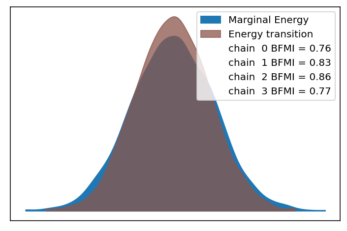
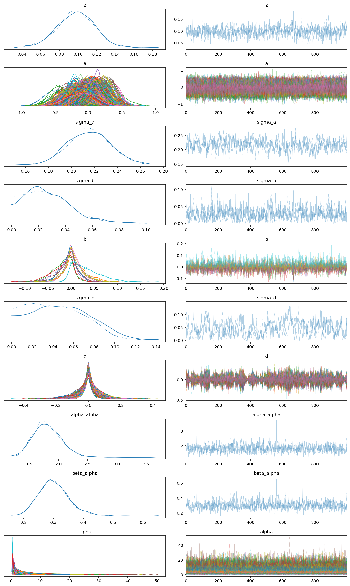
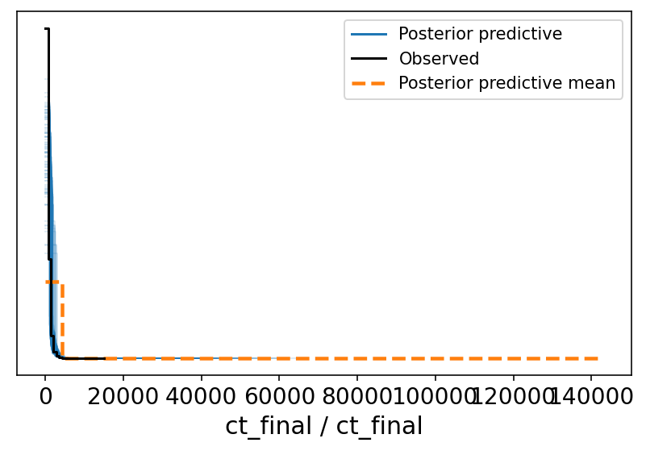
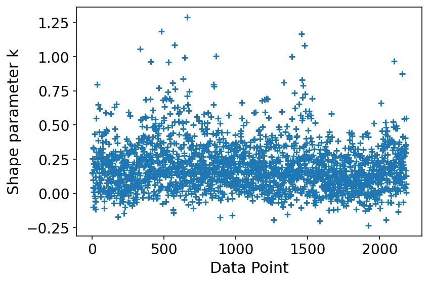

# Model Report

```python
import logging
from time import time
from typing import Optional

import arviz as az
import matplotlib.pyplot as plt

from speclet import model_configuration
from speclet.analysis.arviz_analysis import describe_mcmc
from speclet.bayesian_models import get_bayesian_model
from speclet.io import project_root
from speclet.loggers import set_console_handler_level
from speclet.managers.cache_manager import (
    get_cached_posterior,
    get_posterior_cache_name,
)
from speclet.project_configuration import get_bayesian_modeling_constants
from speclet.project_enums import ModelFitMethod
```

    WARNING (theano.tensor.blas): Using NumPy C-API based implementation for BLAS functions.

```python
notebook_tic = time()
set_console_handler_level(logging.WARNING)
%config InlineBackend.figure_format = "retina"
HDI_PROB = get_bayesian_modeling_constants().hdi_prob
```

Parameters for papermill:

- `MODEL_NAME`: name of the model
- `FIT_METHOD`: method used to fit the model; either "ADVI" or "MCMC"
- `CONFIG_PATH`: path to configuration file
- `ROOT_CACHE_DIR`: path to the root caching directory

## Setup

### Papermill parameters

```python
CONFIG_PATH = ""
MODEL_NAME = ""
FIT_METHOD_STR = ""
ROOT_CACHE_DIR = ""
```

```python
# Parameters
MODEL_NAME = "hierarchical-nb"
FIT_METHOD_STR = "PYMC3_MCMC"
CONFIG_PATH = "models/model-configs.yaml"
ROOT_CACHE_DIR = "models"
```

```python
FIT_METHOD = ModelFitMethod(FIT_METHOD_STR)
model_config = model_configuration.get_configuration_for_model(
    config_path=project_root() / CONFIG_PATH, name=MODEL_NAME
)
model = get_bayesian_model(model_config.model)()
trace = get_cached_posterior(
    get_posterior_cache_name(MODEL_NAME, FIT_METHOD),
    cache_dir=project_root() / ROOT_CACHE_DIR,
)
```

## Fit diagnostics

```python
if "MCMC" in FIT_METHOD.value:
    print("R-HAT")
    print(az.rhat(trace))
    print("=" * 60)
    describe_mcmc(trace)
```

    R-HAT
    <xarray.Dataset>
    Dimensions:      (sgrna: 16954, cell_line: 87, gene: 2000, lineage: 2, eta_dim_0: 874194, mu_dim_0: 874194)
    Coordinates:
      * sgrna        (sgrna) object 'AAAAAAAAATCCAGAACCT' ... 'TTTTGTTAAGTGACCACCT'
      * cell_line    (cell_line) object 'ACH-000007' 'ACH-000009' ... 'ACH-002233'
      * gene         (gene) object 'A1BG' 'AAK1' 'AAR2' ... 'ZSWIM2' 'ZSWIM4'
      * lineage      (lineage) object 'bone' 'colorectal'
      * eta_dim_0    (eta_dim_0) int64 0 1 2 3 4 ... 874190 874191 874192 874193
      * mu_dim_0     (mu_dim_0) int64 0 1 2 3 4 ... 874190 874191 874192 874193
    Data variables: (12/14)
        z            float64 1.021
        a            (sgrna) float64 1.003 0.9998 1.002 1.0 ... 1.002 1.002 0.9998
        delta_b      (cell_line) float64 1.016 1.016 1.009 ... 1.008 1.016 1.014
        delta_d      (gene, lineage) float64 1.001 1.001 1.005 ... 1.001 1.002 1.003
        sigma_a      float64 1.003
        sigma_b      float64 1.01
        ...           ...
        d            (gene, lineage) float64 1.002 1.001 1.006 ... 1.001 1.001 1.003
        eta          (eta_dim_0) float64 1.001 1.0 1.0 1.001 ... 1.001 1.002 1.0
        mu           (mu_dim_0) float64 1.001 1.0 1.0 1.001 ... 1.001 1.002 1.0
        alpha_alpha  float64 1.0
        beta_alpha   float64 1.0
        alpha        (gene) float64 1.003 1.002 1.003 1.002 ... 1.0 1.001 1.0 1.001
    ============================================================
    sampled 4 chains with (unknown) tuning steps and 1,000 draws
    num. divergences: 0, 0, 0, 0
    percent divergences: 0.0, 0.0, 0.0, 0.0
    BFMI: 0.763, 0.832, 0.86, 0.766
    avg. step size: 0.055, 0.065, 0.067, 0.072



## Model parameters

```python
var_regex = model.vars_regex(FIT_METHOD)
var_regex += ["~^log_lik$", "~^y_hat$"]
```

```python
az.plot_trace(trace, var_names=var_regex, filter_vars="regex")
plt.tight_layout()
plt.show()
```

    /n/data1/hms/dbmi/park/Cook/speclet/.snakemake/conda/6337336a7c816194e7bf8de34b0d1ef5/lib/python3.9/site-packages/arviz/utils.py:129: UserWarning: Items starting with ~: ['^log_lik$', '^y_hat$'] have not been found and will be ignored
      warnings.warn(



## Model predictions

```python
data_pairs: Optional[dict[str, str]] = None

# NOTE: This is a bit of a hack for now...
if FIT_METHOD is ModelFitMethod.STAN_MCMC:
    # obs_var = model.stan_idata_addons["observed_data"][0]
    # ppc_var = model.stan_idata_addons["posterior_predictive"][0]
    obs_var = list(trace.observed_data.data_vars.keys())[0]
    ppc_var = list(trace.posterior_predictive.data_vars.keys())[0]
    data_pairs = {obs_var: ppc_var}


az.plot_ppc(trace, data_pairs=data_pairs, num_pp_samples=100, random_seed=123)
plt.tight_layout()
plt.show()
```



```python
psis_loo = az.loo(trace, pointwise=True)
psis_loo
```

    /n/data1/hms/dbmi/park/Cook/speclet/.snakemake/conda/6337336a7c816194e7bf8de34b0d1ef5/lib/python3.9/site-packages/arviz/stats/stats.py:694: UserWarning: Estimated shape parameter of Pareto distribution is greater than 0.7 for one or more samples. You should consider using a more robust model, this is because importance sampling is less likely to work well if the marginal posterior and LOO posterior are very different. This is more likely to happen with a non-robust model and highly influential observations.
      warnings.warn(


    Computed from 4000 by 874194 log-likelihood matrix

             Estimate       SE
    elpd_loo -5760684.30  1199.65
    p_loo    23828.65        -

    There has been a warning during the calculation. Please check the results.
    ------

    Pareto k diagnostic values:
                              Count   Pct.
    (-Inf, 0.5]   (good)     873586   99.9%
     (0.5, 0.7]   (ok)          431    0.0%
       (0.7, 1]   (bad)         131    0.0%
       (1, Inf)   (very bad)     46    0.0%

```python
az.plot_khat(psis_loo)
plt.tight_layout()
plt.show()
```



---

```python
notebook_toc = time()
print(f"execution time: {(notebook_toc - notebook_tic) / 60:.2f} minutes")
```

    execution time: 1343.40 minutes

```python
%load_ext watermark
%watermark -d -u -v -iv -b -h -m
```

    Last updated: 2022-02-11

    Python implementation: CPython
    Python version       : 3.9.9
    IPython version      : 8.0.1

    Compiler    : GCC 9.4.0
    OS          : Linux
    Release     : 3.10.0-1160.45.1.el7.x86_64
    Machine     : x86_64
    Processor   : x86_64
    CPU cores   : 32
    Architecture: 64bit

    Hostname: compute-a-16-90.o2.rc.hms.harvard.edu

    Git branch: theano-blas-warning

    logging   : 0.5.1.2
    speclet   : 0.0.9000
    arviz     : 0.11.4
    matplotlib: 3.5.1
