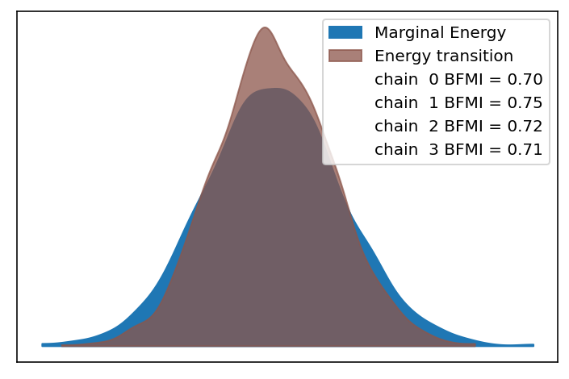
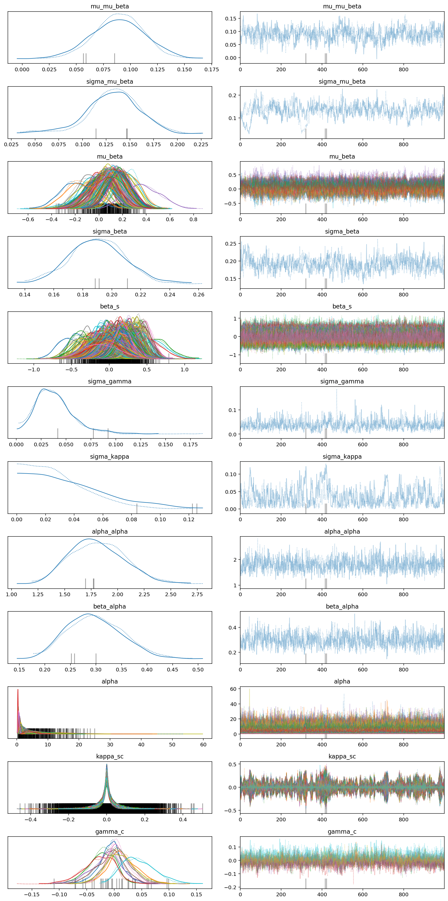
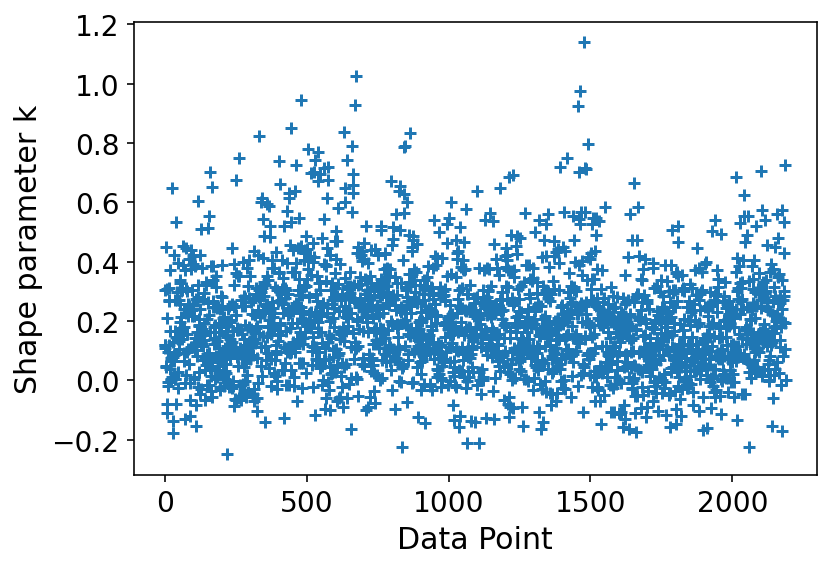
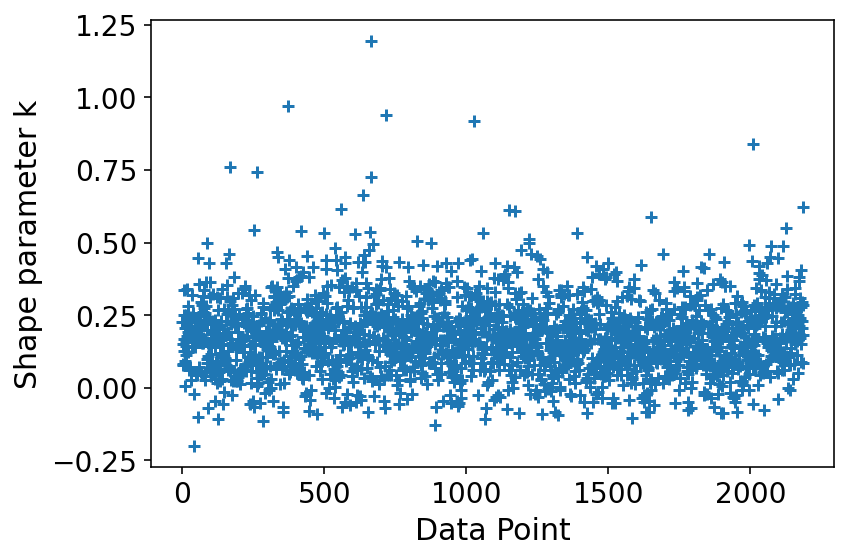

# Model Report

```python
import logging
from time import time
from typing import Optional

import arviz as az
import matplotlib.pyplot as plt

from speclet import model_configuration
from speclet.analysis.arviz_analysis import describe_mcmc
from speclet.bayesian_models import get_bayesian_model
from speclet.io import project_root
from speclet.loggers import set_console_handler_level
from speclet.managers.cache_manager import (
    get_cached_posterior,
    get_posterior_cache_name,
)
from speclet.project_configuration import get_bayesian_modeling_constants
from speclet.project_enums import ModelFitMethod
```

```python
notebook_tic = time()
set_console_handler_level(logging.WARNING)
%config InlineBackend.figure_format = "retina"
HDI_PROB = get_bayesian_modeling_constants().hdi_prob
```

Parameters for papermill:

- `MODEL_NAME`: name of the model
- `FIT_METHOD`: method used to fit the model; either "ADVI" or "MCMC"
- `CONFIG_PATH`: path to configuration file
- `ROOT_CACHE_DIR`: path to the root caching directory

## Setup

### Papermill parameters

```python
CONFIG_PATH = ""
MODEL_NAME = ""
FIT_METHOD_STR = ""
ROOT_CACHE_DIR = ""
```

```python
# Parameters
MODEL_NAME = "hierarchical-nb"
FIT_METHOD_STR = "STAN_MCMC"
CONFIG_PATH = "models/model-configs.yaml"
ROOT_CACHE_DIR = "models"
```

```python
FIT_METHOD = ModelFitMethod(FIT_METHOD_STR)
model_config = model_configuration.get_configuration_for_model(
    config_path=project_root() / CONFIG_PATH, name=MODEL_NAME
)
model = get_bayesian_model(model_config.model)()
trace = get_cached_posterior(
    get_posterior_cache_name(MODEL_NAME, FIT_METHOD),
    cache_dir=project_root() / ROOT_CACHE_DIR,
)
```

## Fit diagnostics

```python
if "MCMC" in FIT_METHOD.value:
    print("R-HAT")
    print(az.rhat(trace))
    print("=" * 60)
    describe_mcmc(trace)
```

    R-HAT
    <xarray.Dataset>
    Dimensions:            (gene: 114, sgrna: 338, delta_gamma_dim_0: 10, delta_kappa_dim_0: 338, delta_kappa_dim_1: 10, alpha_dim_0: 114, eta_dim_0: 2188, mu_dim_0: 2188, cell_line: 10, log_lik_dim_0: 2188, y_hat_dim_0: 2188)
    Coordinates:
      * gene               (gene) object 'ACVR1C' 'ADAMTS2' ... 'ZC2HC1C' 'ZNF44'
      * sgrna              (sgrna) object 'AAACTTGCTGACGTGCCTGG' ... 'TTTGTTGGGAC...
      * cell_line          (cell_line) object 'ACH-000007' ... 'ACH-002116'
      * delta_gamma_dim_0  (delta_gamma_dim_0) int64 0 1 2 3 4 5 6 7 8 9
      * delta_kappa_dim_0  (delta_kappa_dim_0) int64 0 1 2 3 4 ... 334 335 336 337
      * delta_kappa_dim_1  (delta_kappa_dim_1) int64 0 1 2 3 4 5 6 7 8 9
      * alpha_dim_0        (alpha_dim_0) int64 0 1 2 3 4 5 ... 109 110 111 112 113
      * eta_dim_0          (eta_dim_0) int64 0 1 2 3 4 ... 2183 2184 2185 2186 2187
      * mu_dim_0           (mu_dim_0) int64 0 1 2 3 4 5 ... 2183 2184 2185 2186 2187
      * log_lik_dim_0      (log_lik_dim_0) int64 0 1 2 3 4 ... 2184 2185 2186 2187
      * y_hat_dim_0        (y_hat_dim_0) int64 0 1 2 3 4 ... 2184 2185 2186 2187
    Data variables: (12/18)
        mu_mu_beta         float64 1.004
        sigma_mu_beta      float64 1.009
        mu_beta            (gene) float64 1.001 1.0 1.0 1.001 ... 1.003 1.003 1.004
        sigma_beta         float64 1.009
        beta_s             (sgrna) float64 1.0 1.002 0.9996 ... 0.9999 1.003 1.002
        sigma_gamma        float64 1.001
        ...                 ...
        eta                (eta_dim_0) float64 0.9995 0.9998 1.0 ... 1.002 1.001
        mu                 (mu_dim_0) float64 0.9995 0.9998 1.0 ... 1.002 1.001
        kappa_sc           (sgrna, cell_line) float64 1.012 1.005 ... 1.005 1.004
        gamma_c            (cell_line) float64 1.003 1.0 1.002 ... 1.001 1.005 1.001
        log_lik            (log_lik_dim_0) float64 1.0 1.0 1.002 ... 1.002 0.9996
        y_hat              (y_hat_dim_0) float64 0.9998 1.0 1.002 ... 0.9997 1.001
    ============================================================
    sampled 2 chains with (unknown) tuning steps and 1,000 draws
    num. divergences: 3, 0
    percent divergences: 0.3, 0.0
    BFMI: 0.907, 0.915
    avg. step size: 0.132, 0.11



## Model parameters

```python
var_regex = model.vars_regex(FIT_METHOD)
var_regex += ["~log_lik", "~y_hat"]
```

```python
# def _as_int(x: float) -> str:
#     return str(int(x))


# az.summary(
#     trace, var_names=var_regex, filter_vars="regex", hdi_prob=HDI_PROB
# ).style.format(formatter={"ess_bulk": _as_int, "ess_tail": _as_int}, precision=2)
```

```python
az.plot_trace(trace, var_names=var_regex, filter_vars="regex")
plt.tight_layout()
plt.show()
```

    /var/folders/r4/qpcdgl_14hbd412snp1jnv300000gn/T/ipykernel_70175/2160019948.py:2: UserWarning: This figure was using constrained_layout, but that is incompatible with subplots_adjust and/or tight_layout; disabling constrained_layout.
      plt.tight_layout()



```python
# az.plot_forest(
#     trace, var_names=var_regex, filter_vars="regex", hdi_prob=HDI_PROB, combined=True
# )
# plt.tight_layout()
# plt.show()
```

## Model predictions

```python
data_pairs: Optional[dict[str, str]] = None

# NOTE: This is a bit of a hack for now...
if FIT_METHOD is ModelFitMethod.STAN_MCMC:
    # obs_var = model.stan_idata_addons["observed_data"][0]
    # ppc_var = model.stan_idata_addons["posterior_predictive"][0]
    obs_var = list(trace.observed_data.data_vars.keys())[0]
    ppc_var = list(trace.posterior_predictive.data_vars.keys())[0]
    data_pairs = {obs_var: ppc_var}


az.plot_ppc(trace, data_pairs=data_pairs, num_pp_samples=100, random_seed=123)
plt.tight_layout()
plt.show()
```

    /var/folders/r4/qpcdgl_14hbd412snp1jnv300000gn/T/ipykernel_70175/1880208410.py:13: UserWarning: This figure was using constrained_layout, but that is incompatible with subplots_adjust and/or tight_layout; disabling constrained_layout.
      plt.tight_layout()



```python
psis_loo = az.loo(trace, pointwise=True)
psis_loo
```

    /usr/local/Caskroom/miniconda/base/envs/speclet_smk/lib/python3.9/site-packages/arviz/stats/stats.py:655: UserWarning: Estimated shape parameter of Pareto distribution is greater than 0.7 for one or more samples. You should consider using a more robust model, this is because importance sampling is less likely to work well if the marginal posterior and LOO posterior are very different. This is more likely to happen with a non-robust model and highly influential observations.
      warnings.warn(


    Computed from 2000 by 2188 log-likelihood matrix

             Estimate       SE
    elpd_loo -14612.20    53.33
    p_loo      344.44        -

    There has been a warning during the calculation. Please check the results.
    ------

    Pareto k diagnostic values:
                             Count   Pct.
    (-Inf, 0.5]   (good)     2064   94.3%
     (0.5, 0.7]   (ok)         92    4.2%
       (0.7, 1]   (bad)        28    1.3%
       (1, Inf)   (very bad)    4    0.2%

```python
az.plot_khat(psis_loo)
plt.tight_layout()
plt.show()
```

    /var/folders/r4/qpcdgl_14hbd412snp1jnv300000gn/T/ipykernel_70175/3910446358.py:2: UserWarning: This figure was using constrained_layout, but that is incompatible with subplots_adjust and/or tight_layout; disabling constrained_layout.
      plt.tight_layout()



---

```python
notebook_toc = time()
print(f"execution time: {(notebook_toc - notebook_tic) / 60:.2f} minutes")
```

    execution time: 5.20 minutes

```python
%load_ext watermark
%watermark -d -u -v -iv -b -h -m
```

    Last updated: 2022-01-25

    Python implementation: CPython
    Python version       : 3.9.9
    IPython version      : 8.0.1

    Compiler    : Clang 11.1.0
    OS          : Darwin
    Release     : 21.2.0
    Machine     : x86_64
    Processor   : i386
    CPU cores   : 4
    Architecture: 64bit

    Hostname: JHCookMac

    Git branch: nb-model

    matplotlib: 3.5.1
    arviz     : 0.11.2
    logging   : 0.5.1.2
    speclet   : 0.0.9000
