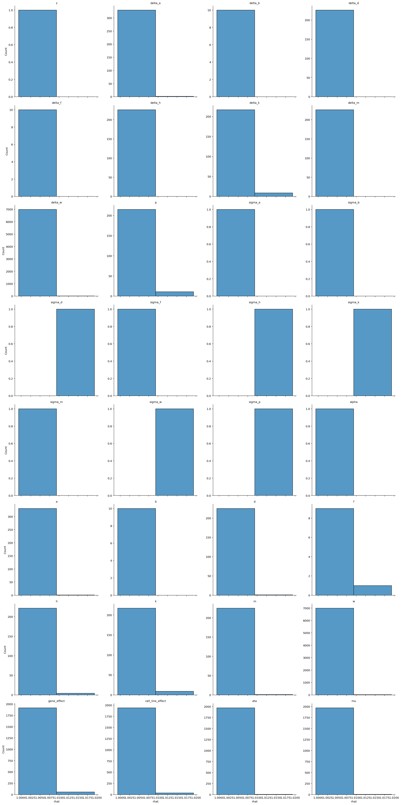
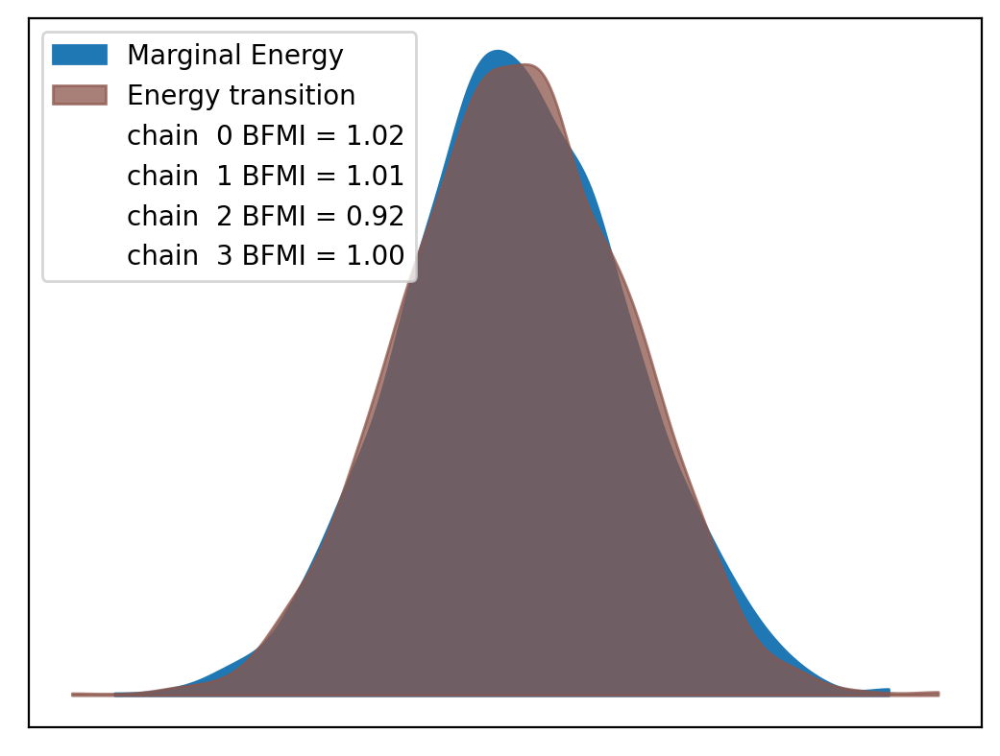
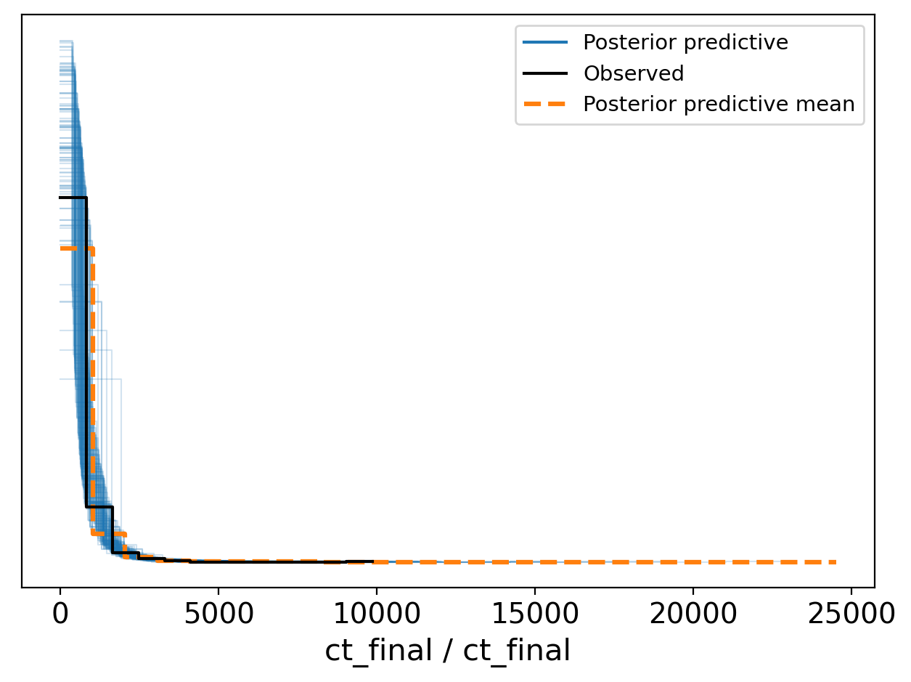
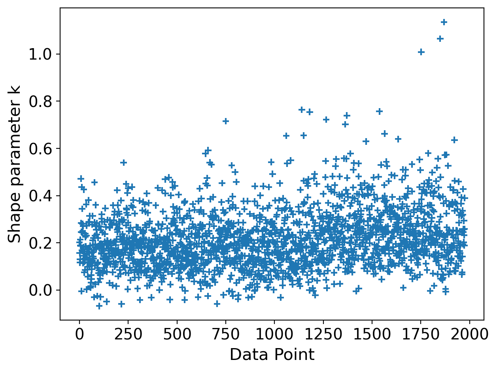

# Model Report


```python
import logging
from time import time
from typing import Optional

import arviz as az
import matplotlib.pyplot as plt

from speclet import model_configuration
from speclet.analysis.arviz_analysis import describe_mcmc, summarize_rhat
from speclet.bayesian_models import get_bayesian_model
from speclet.io import project_root
from speclet.loggers import set_console_handler_level
from speclet.managers.cache_manager import (
    get_cached_posterior,
    get_posterior_cache_name,
)
from speclet.project_configuration import get_bayesian_modeling_constants
from speclet.project_enums import ModelFitMethod
```

    /home/jc604/.conda/envs/speclet_smk/bin/../lib/gcc/x86_64-conda-linux-gnu/10.3.0/../../../../x86_64-conda-linux-gnu/bin/ld: /n/app/gcc/6.2.0/lib64/libquadmath.so.0: undefined reference to `memcpy@GLIBC_2.14'
    collect2: error: ld returned 1 exit status
    /home/jc604/.conda/envs/speclet_smk/bin/../lib/gcc/x86_64-conda-linux-gnu/10.3.0/../../../../x86_64-conda-linux-gnu/bin/ld: /n/app/gcc/6.2.0/lib64/libquadmath.so.0: undefined reference to `memcpy@GLIBC_2.14'
    collect2: error: ld returned 1 exit status
    /home/jc604/.conda/envs/speclet_smk/bin/../lib/gcc/x86_64-conda-linux-gnu/10.3.0/../../../../x86_64-conda-linux-gnu/bin/ld: /n/app/gcc/6.2.0/lib64/libquadmath.so.0: undefined reference to `memcpy@GLIBC_2.14'
    collect2: error: ld returned 1 exit status
    /home/jc604/.conda/envs/speclet_smk/bin/../lib/gcc/x86_64-conda-linux-gnu/10.3.0/../../../../x86_64-conda-linux-gnu/bin/ld: /n/app/gcc/6.2.0/lib64/libquadmath.so.0: undefined reference to `memcpy@GLIBC_2.14'
    collect2: error: ld returned 1 exit status
    /home/jc604/.conda/envs/speclet_smk/bin/../lib/gcc/x86_64-conda-linux-gnu/10.3.0/../../../../x86_64-conda-linux-gnu/bin/ld: /n/app/gcc/6.2.0/lib64/libquadmath.so.0: undefined reference to `memcpy@GLIBC_2.14'
    collect2: error: ld returned 1 exit status
    /home/jc604/.conda/envs/speclet_smk/bin/../lib/gcc/x86_64-conda-linux-gnu/10.3.0/../../../../x86_64-conda-linux-gnu/bin/ld: /n/app/gcc/6.2.0/lib64/libquadmath.so.0: undefined reference to `memcpy@GLIBC_2.14'
    collect2: error: ld returned 1 exit status
    WARNING (aesara.tensor.blas): Using NumPy C-API based implementation for BLAS functions.


```python
notebook_tic = time()
set_console_handler_level(logging.WARNING)
%config InlineBackend.figure_format = "retina"
HDI_PROB = get_bayesian_modeling_constants().hdi_prob
```

Parameters for papermill:

- `MODEL_NAME`: name of the model
- `FIT_METHOD`: method used to fit the model; either "ADVI" or "MCMC"
- `CONFIG_PATH`: path to configuration file
- `ROOT_CACHE_DIR`: path to the root caching directory

## Setup

### Papermill parameters


```python
CONFIG_PATH = ""
MODEL_NAME = ""
FIT_METHOD_STR = ""
ROOT_CACHE_DIR = ""
```


```python
# Parameters
MODEL_NAME = "hnb-comutation-synlet"
FIT_METHOD_STR = "PYMC_MCMC"
CONFIG_PATH = "models/model-configs.yaml"
ROOT_CACHE_DIR = "models"
```


```python
FIT_METHOD = ModelFitMethod(FIT_METHOD_STR)
model_config = model_configuration.get_configuration_for_model(
    config_path=project_root() / CONFIG_PATH, name=MODEL_NAME
)
model = get_bayesian_model(model_config.model)()
trace = get_cached_posterior(
    get_posterior_cache_name(MODEL_NAME, FIT_METHOD),
    cache_dir=project_root() / ROOT_CACHE_DIR,
)
```

## Fit diagnostics


```python
if "MCMC" in FIT_METHOD.value:
    print("R-HAT")
    rhat_summ = summarize_rhat(trace)
    print(rhat_summ)
    print("=" * 60)
    describe_mcmc(trace)
```

    R-HAT





                       count      mean       std       min       25%       50%  \
    var_name
    a                  332.0  1.002742  0.001570  0.999802  1.001699  1.002447
    alpha                1.0  1.003152       NaN  1.003152  1.003152  1.003152
    b                   10.0  1.002555  0.001309  1.000488  1.001721  1.002622
    cell_line_effect  1976.0  1.002682  0.001909  1.000229  1.001743  1.002388
    d                  226.0  1.003184  0.001541  1.000286  1.002085  1.002922
    delta_a            332.0  1.002442  0.001779  0.999603  1.001304  1.002135
    delta_b             10.0  1.003070  0.001636  1.000584  1.002157  1.002706
    delta_d            226.0  1.002226  0.001673  0.999500  1.000968  1.001873
    delta_f             10.0  1.002987  0.001528  1.000852  1.002422  1.002657
    delta_h            226.0  1.002402  0.001589  0.999765  1.001255  1.002168
    delta_k            226.0  1.003382  0.002724  0.999564  1.001569  1.002679
    delta_m            226.0  1.002216  0.001591  0.999780  1.000984  1.002013
    delta_w           7006.0  1.002239  0.001590  0.999464  1.001127  1.001911
    eta               1976.0  1.001513  0.001443  0.999357  1.000571  1.001160
    f                   10.0  1.003658  0.002767  1.000981  1.001410  1.002909
    gene_effect       1976.0  1.003302  0.002384  0.999594  1.001639  1.002782
    h                  226.0  1.003921  0.001869  1.000692  1.002448  1.003740
    k                  226.0  1.003505  0.002687  0.999723  1.001632  1.002776
    m                  226.0  1.002883  0.001644  0.999943  1.001758  1.002678
    mu                1976.0  1.001508  0.001449  0.999357  1.000545  1.001147
    p                  226.0  1.003860  0.002594  0.999931  1.001831  1.003388
    sigma_a              1.0  1.004067       NaN  1.004067  1.004067  1.004067
    sigma_b              1.0  1.005041       NaN  1.005041  1.005041  1.005041
    sigma_d              1.0  1.011854       NaN  1.011854  1.011854  1.011854
    sigma_f              1.0  1.008743       NaN  1.008743  1.008743  1.008743
    sigma_h              1.0  1.016891       NaN  1.016891  1.016891  1.016891
    sigma_k              1.0  1.012491       NaN  1.012491  1.012491  1.012491
    sigma_m              1.0  1.009266       NaN  1.009266  1.009266  1.009266
    sigma_p              1.0  1.010057       NaN  1.010057  1.010057  1.010057
    sigma_w              1.0  1.010248       NaN  1.010248  1.010248  1.010248
    w                 7006.0  1.003066  0.001584  0.999695  1.001933  1.002833
    z                    1.0  1.008520       NaN  1.008520  1.008520  1.008520

                           75%       max
    var_name
    a                 1.003543  1.009911
    alpha             1.003152  1.003152
    b                 1.003244  1.004410
    cell_line_effect  1.003363  1.012925
    d                 1.004016  1.009745
    delta_a           1.003134  1.015232
    delta_b           1.004313  1.005642
    delta_d           1.002991  1.009068
    delta_f           1.003269  1.005659
    delta_h           1.003251  1.008343
    delta_k           1.004531  1.014915
    delta_m           1.002887  1.008624
    delta_w           1.002973  1.015270
    eta               1.002017  1.011275
    f                 1.004684  1.009394
    gene_effect       1.004302  1.017448
    h                 1.004949  1.011458
    k                 1.004750  1.015467
    m                 1.003853  1.011090
    mu                1.002028  1.011275
    p                 1.005051  1.015057
    sigma_a           1.004067  1.004067
    sigma_b           1.005041  1.005041
    sigma_d           1.011854  1.011854
    sigma_f           1.008743  1.008743
    sigma_h           1.016891  1.016891
    sigma_k           1.012491  1.012491
    sigma_m           1.009266  1.009266
    sigma_p           1.010057  1.010057
    sigma_w           1.010248  1.010248
    w                 1.003959  1.014346
    z                 1.008520  1.008520
    ============================================================
    sampled 4 chains with (unknown) tuning steps and 1,000 draws
    num. divergences: 0, 1, 0, 0
    percent divergences: 0.0, 0.1, 0.0, 0.0
    BFMI: 1.019, 1.005, 0.916, 0.996
    avg. step size: 0.003, 0.002, 0.002, 0.002





## Model predictions


```python
az.plot_ppc(trace, num_pp_samples=100, random_seed=123)
plt.tight_layout()
plt.show()
```





```python
psis_loo = az.loo(trace, pointwise=True)
psis_loo
```

    /home/jc604/.conda/envs/speclet_smk/lib/python3.10/site-packages/arviz/stats/stats.py:811: UserWarning: Estimated shape parameter of Pareto distribution is greater than 0.7 for one or more samples. You should consider using a more robust model, this is because importance sampling is less likely to work well if the marginal posterior and LOO posterior are very different. This is more likely to happen with a non-robust model and highly influential observations.
      warnings.warn(


    Computed from 4000 by 1976 log-likelihood matrix

             Estimate       SE
    elpd_loo -12838.33    53.98
    p_loo      250.81        -

    There has been a warning during the calculation. Please check the results.
    ------

    Pareto k diagnostic values:
                             Count   Pct.
    (-Inf, 0.5]   (good)     1928   97.6%
     (0.5, 0.7]   (ok)         38    1.9%
       (0.7, 1]   (bad)         7    0.4%
       (1, Inf)   (very bad)    3    0.2%


```python
az.plot_khat(psis_loo)
plt.tight_layout()
plt.show()
```





---


```python
notebook_toc = time()
print(f"execution time: {(notebook_toc - notebook_tic) / 60:.2f} minutes")
```

    execution time: 1.81 minutes


```python
%load_ext watermark
%watermark -d -u -v -iv -b -h -m
```

    Last updated: 2022-05-14

    Python implementation: CPython
    Python version       : 3.10.4
    IPython version      : 8.3.0

    Compiler    : GCC 10.3.0
    OS          : Linux
    Release     : 3.10.0-1160.45.1.el7.x86_64
    Machine     : x86_64
    Processor   : x86_64
    CPU cores   : 20
    Architecture: 64bit

    Hostname: compute-f-17-09.o2.rc.hms.harvard.edu

    Git branch: refactor-slurm-resources

    arviz     : 0.12.0
    logging   : 0.5.1.2
    speclet   : 0.0.9000
    matplotlib: 3.5.2
