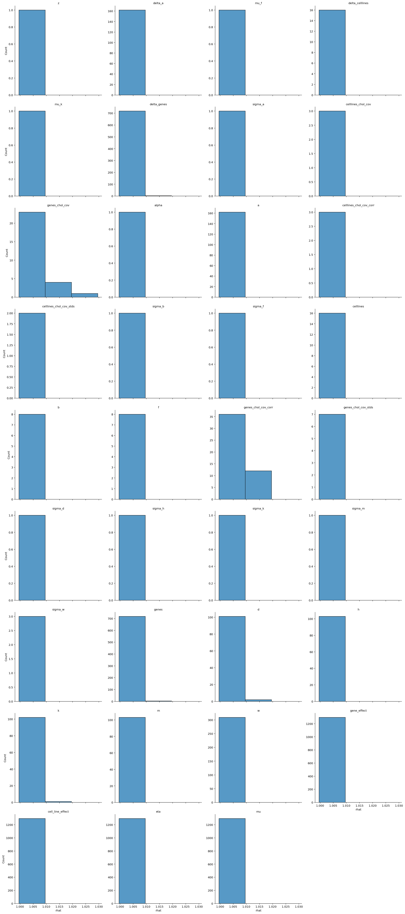
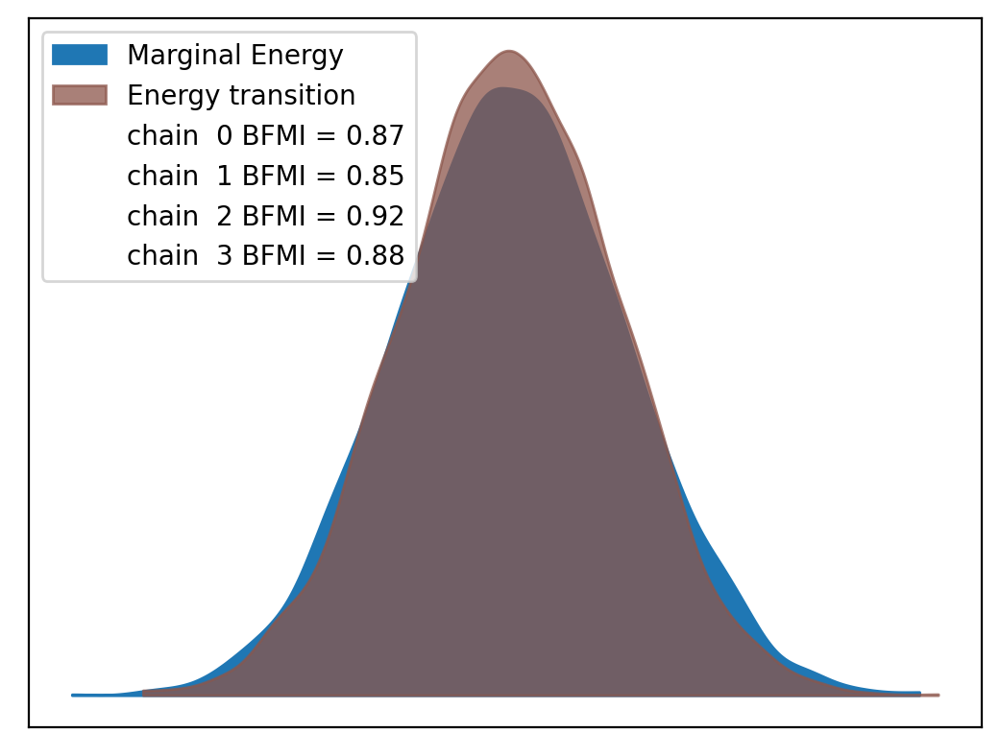
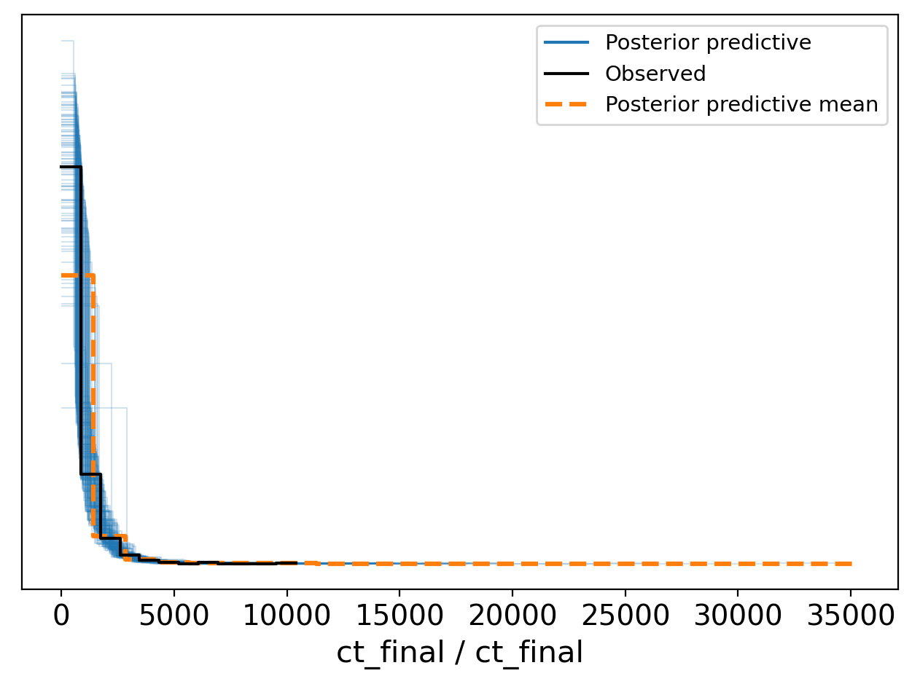
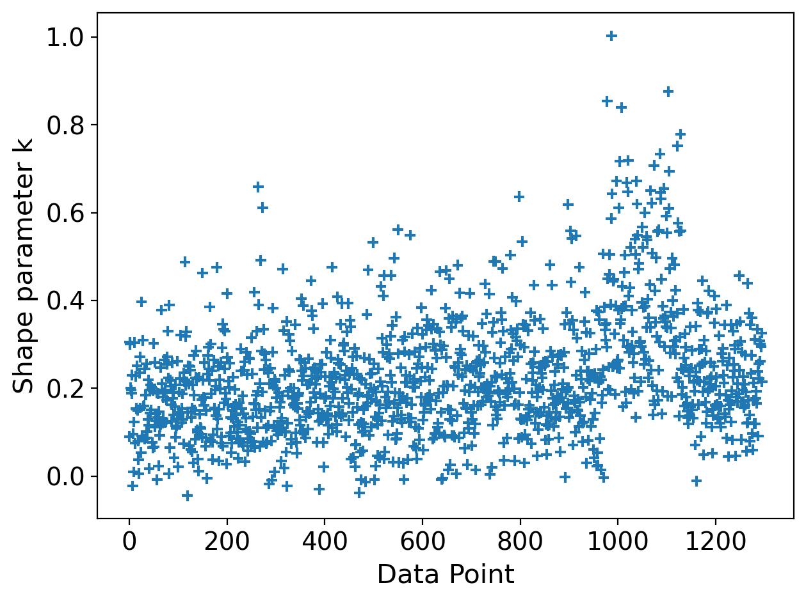

# Model Report


```python
import logging
from time import time
from typing import Optional

import arviz as az
import matplotlib.pyplot as plt

from speclet import model_configuration
from speclet.analysis.arviz_analysis import describe_mcmc, summarize_rhat
from speclet.bayesian_models import get_bayesian_model
from speclet.io import project_root
from speclet.loggers import set_console_handler_level
from speclet.managers.cache_manager import (
    get_cached_posterior,
    get_posterior_cache_name,
)
from speclet.project_configuration import get_bayesian_modeling_constants
from speclet.project_enums import ModelFitMethod
```

    /home/jc604/.conda/envs/speclet_smk/bin/../lib/gcc/x86_64-conda-linux-gnu/10.3.0/../../../../x86_64-conda-linux-gnu/bin/ld: /n/app/gcc/6.2.0/lib64/libquadmath.so.0: undefined reference to `memcpy@GLIBC_2.14'
    collect2: error: ld returned 1 exit status
    /home/jc604/.conda/envs/speclet_smk/bin/../lib/gcc/x86_64-conda-linux-gnu/10.3.0/../../../../x86_64-conda-linux-gnu/bin/ld: /n/app/gcc/6.2.0/lib64/libquadmath.so.0: undefined reference to `memcpy@GLIBC_2.14'
    collect2: error: ld returned 1 exit status
    /home/jc604/.conda/envs/speclet_smk/bin/../lib/gcc/x86_64-conda-linux-gnu/10.3.0/../../../../x86_64-conda-linux-gnu/bin/ld: /n/app/gcc/6.2.0/lib64/libquadmath.so.0: undefined reference to `memcpy@GLIBC_2.14'
    collect2: error: ld returned 1 exit status
    /home/jc604/.conda/envs/speclet_smk/bin/../lib/gcc/x86_64-conda-linux-gnu/10.3.0/../../../../x86_64-conda-linux-gnu/bin/ld: /n/app/gcc/6.2.0/lib64/libquadmath.so.0: undefined reference to `memcpy@GLIBC_2.14'
    collect2: error: ld returned 1 exit status
    /home/jc604/.conda/envs/speclet_smk/bin/../lib/gcc/x86_64-conda-linux-gnu/10.3.0/../../../../x86_64-conda-linux-gnu/bin/ld: /n/app/gcc/6.2.0/lib64/libquadmath.so.0: undefined reference to `memcpy@GLIBC_2.14'
    collect2: error: ld returned 1 exit status
    /home/jc604/.conda/envs/speclet_smk/bin/../lib/gcc/x86_64-conda-linux-gnu/10.3.0/../../../../x86_64-conda-linux-gnu/bin/ld: /n/app/gcc/6.2.0/lib64/libquadmath.so.0: undefined reference to `memcpy@GLIBC_2.14'
    collect2: error: ld returned 1 exit status


```python
notebook_tic = time()
set_console_handler_level(logging.WARNING)
%config InlineBackend.figure_format = "retina"
HDI_PROB = get_bayesian_modeling_constants().hdi_prob
```

Parameters for papermill:

- `MODEL_NAME`: name of the model
- `FIT_METHOD`: method used to fit the model; either "ADVI" or "MCMC"
- `CONFIG_PATH`: path to configuration file
- `ROOT_CACHE_DIR`: path to the root caching directory

## Setup

### Papermill parameters


```python
CONFIG_PATH = ""
MODEL_NAME = ""
FIT_METHOD_STR = ""
ROOT_CACHE_DIR = ""
```


```python
# Parameters
MODEL_NAME = "hnb-single-lineage-CRC-subsample"
FIT_METHOD_STR = "PYMC_NUMPYRO"
CONFIG_PATH = "models/model-configs.yaml"
ROOT_CACHE_DIR = "models"
```


```python
FIT_METHOD = ModelFitMethod(FIT_METHOD_STR)
model_config = model_configuration.get_configuration_for_model(
    config_path=project_root() / CONFIG_PATH, name=MODEL_NAME
)
model = get_bayesian_model(model_config.model)(**model_config.model_kwargs)
trace = get_cached_posterior(
    get_posterior_cache_name(MODEL_NAME, FIT_METHOD),
    cache_dir=project_root() / ROOT_CACHE_DIR,
)
```

## Fit diagnostics


```python
if FIT_METHOD is ModelFitMethod.PYMC_NUMPYRO or FIT_METHOD is ModelFitMethod.PYMC_MCMC:
    print("R-HAT")
    rhat_summ = summarize_rhat(trace)
    print(rhat_summ)
    print("=" * 60)
    describe_mcmc(trace)
```

    R-HAT


    /home/jc604/.conda/envs/speclet_smk/lib/python3.10/site-packages/arviz/stats/diagnostics.py:586: RuntimeWarning: invalid value encountered in double_scalars
      (between_chain_variance / within_chain_variance + num_samples - 1) / (num_samples)





                              count      mean       std       min       25%  \
    var_name
    a                         162.0  1.000484  0.000438  0.999792  1.000198
    alpha                       1.0  1.000276       NaN  1.000276  1.000276
    b                           8.0  1.000623  0.000373  1.000146  1.000429
    cell_line_effect         1296.0  1.000522  0.000339  1.000011  1.000350
    celllines                  16.0  1.000487  0.000366  0.999984  1.000201
    celllines_chol_cov          3.0  1.000803  0.000190  1.000667  1.000694
    celllines_chol_cov_corr     3.0  1.000397  0.000337  1.000008  1.000299
    celllines_chol_cov_stds     2.0  1.000891  0.000240  1.000721  1.000806
    d                         103.0  1.001692  0.002029  0.999887  1.000506
    delta_a                   162.0  1.000530  0.000482  0.999596  1.000182
    delta_celllines            16.0  1.000811  0.000634  1.000032  1.000338
    delta_genes               721.0  1.000896  0.001302  0.999740  1.000301
    eta                      1296.0  1.000427  0.000466  0.999672  1.000096
    f                           8.0  1.000351  0.000325  0.999984  1.000131
    gene_effect              1296.0  1.000456  0.000461  0.999673  1.000130
    genes                     721.0  1.001244  0.001424  0.999653  1.000308
    genes_chol_cov             28.0  1.006000  0.005437  1.000556  1.002360
    genes_chol_cov_corr        48.0  1.004119  0.004853  0.999806  1.000577
    genes_chol_cov_stds         7.0  1.004146  0.002862  1.000461  1.002217
    h                         103.0  1.002177  0.001205  1.000553  1.001406
    k                         103.0  1.001219  0.001771  0.999799  1.000403
    m                         103.0  1.002374  0.000781  1.000546  1.001819
    mu                       1296.0  1.000418  0.000464  0.999672  1.000099
    mu_f                        1.0  1.000040       NaN  1.000040  1.000040
    mu_k                        1.0  1.000618       NaN  1.000618  1.000618
    sigma_a                     1.0  1.000356       NaN  1.000356  1.000356
    sigma_b                     1.0  1.000721       NaN  1.000721  1.000721
    sigma_d                     1.0  1.006504       NaN  1.006504  1.006504
    sigma_f                     1.0  1.001061       NaN  1.001061  1.001061
    sigma_h                     1.0  1.004401       NaN  1.004401  1.004401
    sigma_k                     1.0  1.008226       NaN  1.008226  1.008226
    sigma_m                     1.0  1.004996       NaN  1.004996  1.004996
    sigma_w                     3.0  1.001631  0.001896  1.000461  1.000538
    w                         309.0  1.000416  0.000428  0.999653  1.000127
    z                           1.0  1.003747       NaN  1.003747  1.003747

                                  50%       75%       max
    var_name
    a                        1.000443  1.000722  1.003780
    alpha                    1.000276  1.000276  1.000276
    b                        1.000557  1.000692  1.001407
    cell_line_effect         1.000423  1.000617  1.001664
    celllines                1.000458  1.000659  1.001407
    celllines_chol_cov       1.000721  1.000870  1.001020
    celllines_chol_cov_corr  1.000591  1.000591  1.000591
    celllines_chol_cov_stds  1.000891  1.000976  1.001061
    d                        1.001166  1.001961  1.011831
    delta_a                  1.000467  1.000854  1.002569
    delta_celllines          1.000627  1.001149  1.002310
    delta_genes              1.000607  1.001116  1.015822
    eta                      1.000329  1.000636  1.003954
    f                        1.000280  1.000533  1.000913
    gene_effect              1.000368  1.000680  1.003275
    genes                    1.000772  1.001806  1.011831
    genes_chol_cov           1.004346  1.007741  1.020281
    genes_chol_cov_corr      1.001652  1.006241  1.014190
    genes_chol_cov_stds      1.004401  1.005750  1.008226
    h                        1.001847  1.002510  1.008057
    k                        1.000669  1.001201  1.010778
    m                        1.002322  1.002950  1.004221
    mu                       1.000307  1.000633  1.004204
    mu_f                     1.000040  1.000040  1.000040
    mu_k                     1.000618  1.000618  1.000618
    sigma_a                  1.000356  1.000356  1.000356
    sigma_b                  1.000721  1.000721  1.000721
    sigma_d                  1.006504  1.006504  1.006504
    sigma_f                  1.001061  1.001061  1.001061
    sigma_h                  1.004401  1.004401  1.004401
    sigma_k                  1.008226  1.008226  1.008226
    sigma_m                  1.004996  1.004996  1.004996
    sigma_w                  1.000614  1.002217  1.003819
    w                        1.000322  1.000618  1.002794
    z                        1.003747  1.003747  1.003747
    ============================================================
    sampled 4 chains with (unknown) tuning steps and 2,000 draws
    num. divergences: 0, 0, 0, 4
    percent divergences: 0.0, 0.0, 0.0, 0.2
    BFMI: 0.867, 0.85, 0.92, 0.877
    avg. step size: 0.003, 0.003, 0.003, 0.004





## Model predictions


```python
az.plot_ppc(trace, num_pp_samples=100, random_seed=123)
plt.tight_layout()
plt.show()
```





```python
psis_loo = az.loo(trace, pointwise=True)
psis_loo
```

    /home/jc604/.conda/envs/speclet_smk/lib/python3.10/site-packages/arviz/stats/stats.py:812: UserWarning: Estimated shape parameter of Pareto distribution is greater than 0.7 for one or more samples. You should consider using a more robust model, this is because importance sampling is less likely to work well if the marginal posterior and LOO posterior are very different. This is more likely to happen with a non-robust model and highly influential observations.
      warnings.warn(


    Computed from 8000 posterior samples and 1296 observations log-likelihood matrix.

             Estimate       SE
    elpd_loo -8658.86    44.03
    p_loo      161.94        -

    There has been a warning during the calculation. Please check the results.
    ------

    Pareto k diagnostic values:
                             Count   Pct.
    (-Inf, 0.5]   (good)     1239   95.6%
     (0.5, 0.7]   (ok)         47    3.6%
       (0.7, 1]   (bad)         9    0.7%
       (1, Inf)   (very bad)    1    0.1%


```python
az.plot_khat(psis_loo)
plt.tight_layout()
plt.show()
```





---


```python
notebook_toc = time()
print(f"execution time: {(notebook_toc - notebook_tic) / 60:.2f} minutes")
```

    execution time: 1.08 minutes


```python
%load_ext watermark
%watermark -d -u -v -iv -b -h -m
```

    Last updated: 2022-06-28

    Python implementation: CPython
    Python version       : 3.10.4
    IPython version      : 8.4.0

    Compiler    : GCC 10.3.0
    OS          : Linux
    Release     : 3.10.0-1160.45.1.el7.x86_64
    Machine     : x86_64
    Processor   : x86_64
    CPU cores   : 32
    Architecture: 64bit

    Hostname: compute-a-16-166.o2.rc.hms.harvard.edu

    Git branch: per-lineage

    logging   : 0.5.1.2
    matplotlib: 3.5.2
    arviz     : 0.12.1
    speclet   : 0.0.9000
