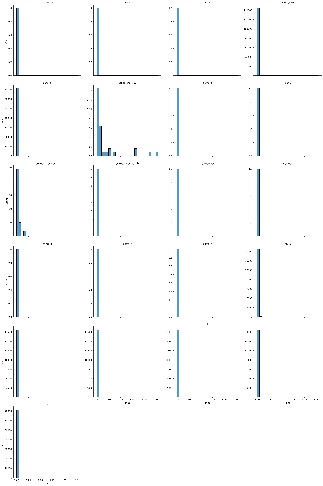
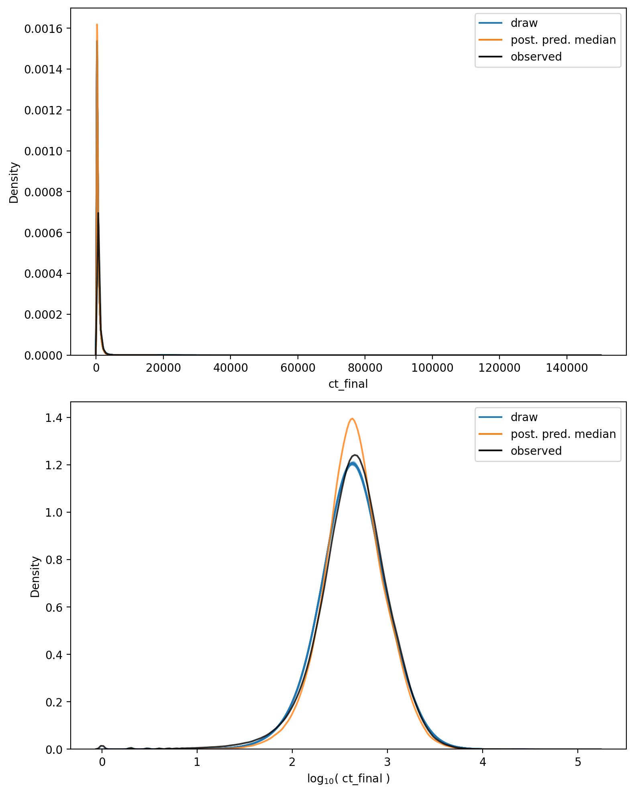

# Model Report


```python
import logging
from itertools import product
from time import time
from typing import Optional

import arviz as az
import matplotlib.pyplot as plt
import numpy as np
import seaborn as sns
from matplotlib.lines import Line2D
from xarray import Dataset

from speclet import model_configuration
from speclet.analysis.arviz_analysis import describe_mcmc, summarize_rhat
from speclet.bayesian_models import get_bayesian_model
from speclet.io import project_root
from speclet.loggers import set_console_handler_level
from speclet.managers.cache_manager import (
    get_cached_posterior,
    get_posterior_cache_name,
)
from speclet.project_configuration import get_bayesian_modeling_constants
from speclet.project_enums import ModelFitMethod
```


```python
notebook_tic = time()
set_console_handler_level(logging.WARNING)
%config InlineBackend.figure_format = "retina"
HDI_PROB = get_bayesian_modeling_constants().hdi_prob
```

Parameters for papermill:

- `MODEL_NAME`: name of the model
- `FIT_METHOD`: method used to fit the model; either "ADVI" or "MCMC"
- `CONFIG_PATH`: path to configuration file
- `ROOT_CACHE_DIR`: path to the root caching directory

## Setup

### Papermill parameters


```python
CONFIG_PATH = ""
MODEL_NAME = ""
FIT_METHOD_STR = ""
ROOT_CACHE_DIR = ""
```


```python
# Parameters
MODEL_NAME = "hnb-single-lineage-liver-004"
FIT_METHOD_STR = "PYMC_NUMPYRO"
CONFIG_PATH = "models/model-configs.yaml"
ROOT_CACHE_DIR = "models"
```


```python
FIT_METHOD = ModelFitMethod(FIT_METHOD_STR)
model_config = model_configuration.get_configuration_for_model(
    config_path=project_root() / CONFIG_PATH, name=MODEL_NAME
)
model = get_bayesian_model(model_config.model)(**model_config.model_kwargs)
trace = get_cached_posterior(
    get_posterior_cache_name(MODEL_NAME, FIT_METHOD),
    cache_dir=project_root() / ROOT_CACHE_DIR,
)
```

## Fit diagnostics


```python
if FIT_METHOD in {ModelFitMethod.PYMC_NUMPYRO, ModelFitMethod.PYMC_MCMC}:
    print("R-HAT")
    rhat_summ = summarize_rhat(trace)
    print(rhat_summ)
    print("=" * 60)
    describe_mcmc(trace)
```

    R-HAT


    /home/jc604/.conda/envs/speclet_smk/lib/python3.10/site-packages/arviz/stats/diagnostics.py:586: RuntimeWarning: invalid value encountered in double_scalars
      (between_chain_variance / within_chain_variance + num_samples - 1) / (num_samples)





                            count      mean       std       min       25%  \
    var_name
    a                     71062.0  1.000789  0.000929  0.999148  1.000102
    alpha                     1.0  1.000333       NaN  1.000333  1.000333
    b                     18119.0  1.000893  0.000939  0.999251  1.000210
    d                     18119.0  1.000913  0.000956  0.999178  1.000214
    delta_a               71062.0  1.001664  0.001221  0.999191  1.000786
    delta_genes          144952.0  1.001267  0.001440  0.999099  1.000358
    f                     18119.0  1.000939  0.000951  0.999193  1.000237
    genes_chol_cov           36.0  1.035404  0.063161  1.000091  1.003757
    genes_chol_cov_corr      63.0  1.006592  0.007864  0.999701  1.001494
    genes_chol_cov_stds       8.0  1.003405  0.002504  0.999474  1.001927
    h                     72476.0  1.001348  0.001220  0.999132  1.000487
    mu_a                  18119.0  1.002459  0.001632  0.999426  1.001281
    mu_b                      1.0  1.001083       NaN  1.001083  1.001083
    mu_d                      1.0  1.002416       NaN  1.002416  1.002416
    mu_mu_a                   1.0  1.003719       NaN  1.003719  1.003719
    sigma_a                   1.0  1.000835       NaN  1.000835  1.000835
    sigma_b                   1.0  1.005678       NaN  1.005678  1.005678
    sigma_d                   1.0  1.002226       NaN  1.002226  1.002226
    sigma_f                   1.0  0.999474       NaN  0.999474  0.999474
    sigma_h                   4.0  1.003296  0.001925  1.001030  1.002097
    sigma_mu_a                1.0  1.006676       NaN  1.006676  1.006676

                              50%       75%       max
    var_name
    a                    1.000607  1.001290  1.007577
    alpha                1.000333  1.000333  1.000333
    b                    1.000706  1.001378  1.006846
    d                    1.000715  1.001416  1.007134
    delta_a              1.001436  1.002293  1.011296
    delta_genes          1.000958  1.001801  1.048549
    f                    1.000755  1.001441  1.007409
    genes_chol_cov       1.009142  1.023971  1.249963
    genes_chol_cov_corr  1.004106  1.008057  1.032143
    genes_chol_cov_stds  1.003417  1.005409  1.006676
    h                    1.001080  1.001914  1.012881
    mu_a                 1.002137  1.003318  1.015504
    mu_b                 1.001083  1.001083  1.001083
    mu_d                 1.002416  1.002416  1.002416
    mu_mu_a              1.003719  1.003719  1.003719
    sigma_a              1.000835  1.000835  1.000835
    sigma_b              1.005678  1.005678  1.005678
    sigma_d              1.002226  1.002226  1.002226
    sigma_f              0.999474  0.999474  0.999474
    sigma_h              1.003417  1.004616  1.005320
    sigma_mu_a           1.006676  1.006676  1.006676
    ============================================================
    sampled 4 chains with (unknown) tuning steps and 1,000 draws
    num. divergences: 0, 0, 0, 0
    percent divergences: 0.0, 0.0, 0.0, 0.0
    BFMI: 0.751, 0.771, 0.69, 0.743
    avg. step size: 0.014, 0.014, 0.014, 0.014


## Model predictions


```python
np.random.seed(333)

pp: Dataset = trace.posterior_predictive["ct_final"]
n_chains, n_draws, n_data = pp.shape
n_rand = 10
draws_idx = np.random.choice(np.arange(n_draws), n_rand, replace=False)

fig, axes = plt.subplots(
    nrows=2, ncols=1, figsize=(8, 10), squeeze=True, sharex=False, sharey=False
)

alpha = 0.2

for c, d in product(range(n_chains), draws_idx):
    draw = pp[c, d, :].values.flatten()
    sns.kdeplot(x=draw, ax=axes[0], color="tab:blue", alpha=alpha)
    sns.kdeplot(x=np.log10(draw + 1), ax=axes[1], color="tab:blue", alpha=alpha)

avg_ppc = pp.median(axis=(0, 1))
sns.kdeplot(x=avg_ppc, ax=axes[0], color="tab:orange", alpha=0.8)
sns.kdeplot(x=np.log10(avg_ppc + 1), ax=axes[1], color="tab:orange", alpha=0.8)

obs_data = trace.observed_data["ct_final"].values.flatten()
sns.kdeplot(x=obs_data, ax=axes[0], color="black", alpha=0.8)
sns.kdeplot(x=np.log10(obs_data + 1), ax=axes[1], color="black", alpha=0.8)

axes[0].set_xlabel("ct_final")
axes[1].set_xlabel(r"$\log_{10}($ ct_final $)$")

leg_handles = [
    Line2D([0], [0], color="tab:blue", label="draw"),
    Line2D([0], [0], color="tab:orange", label="post. pred. median"),
    Line2D([0], [0], color="black", label="observed"),
]
for ax in axes:
    ax.legend(handles=leg_handles, loc="best")

plt.tight_layout()
plt.show()
```





```python
has_log_likelihood = "log_likelihood" in trace
```


```python
if has_log_likelihood:
    psis_loo = az.loo(trace, pointwise=True)
    psis_loo
```


```python
if has_log_likelihood:
    az.plot_khat(psis_loo)
    plt.tight_layout()
    plt.show()
```

---


```python
notebook_toc = time()
print(f"execution time: {(notebook_toc - notebook_tic) / 60:.2f} minutes")
```

    execution time: 42.06 minutes


```python
%load_ext watermark
%watermark -d -u -v -iv -b -h -m
```

    Last updated: 2022-07-30

    Python implementation: CPython
    Python version       : 3.10.5
    IPython version      : 8.4.0

    Compiler    : GCC 10.3.0
    OS          : Linux
    Release     : 3.10.0-1160.71.1.el7.x86_64
    Machine     : x86_64
    Processor   : x86_64
    CPU cores   : 32
    Architecture: 64bit

    Hostname: compute-h-17-53.o2.rc.hms.harvard.edu

    Git branch: simplify

    logging   : 0.5.1.2
    matplotlib: 3.5.2
    numpy     : 1.23.0
    arviz     : 0.12.1
    seaborn   : 0.11.2
    speclet   : 0.0.9000
