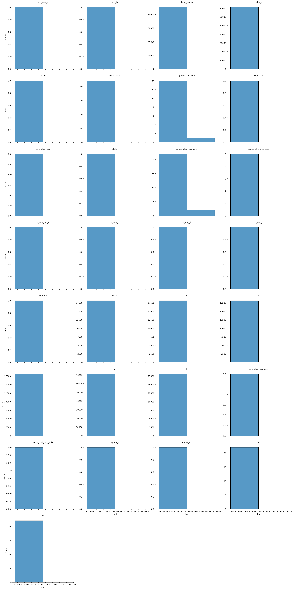
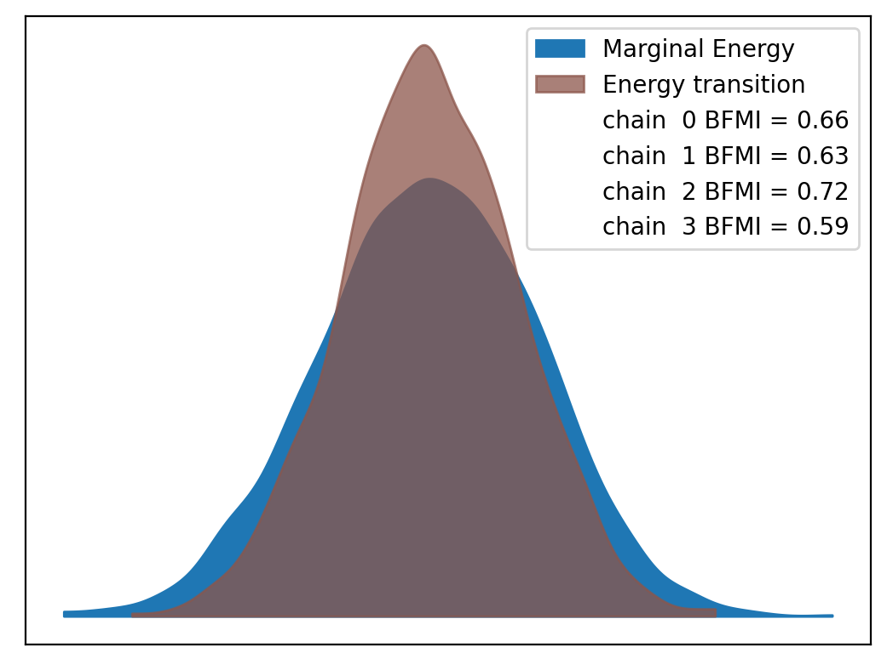
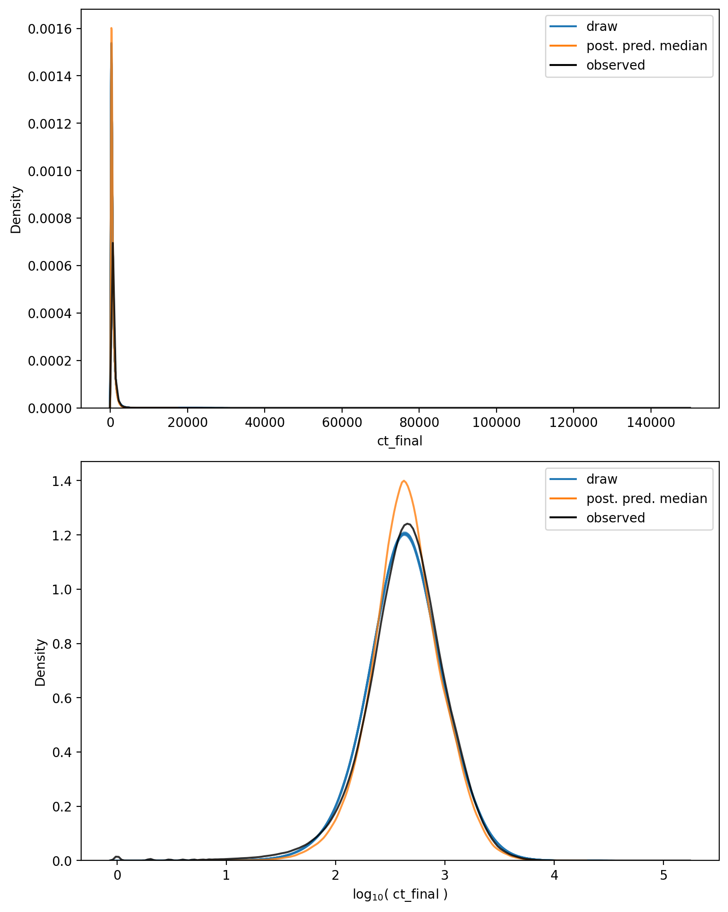

# Model Report


```python
import logging
from itertools import product
from time import time
from typing import Optional

import arviz as az
import matplotlib.pyplot as plt
import numpy as np
import seaborn as sns
from matplotlib.lines import Line2D
from xarray import Dataset

from speclet import model_configuration
from speclet.analysis.arviz_analysis import describe_mcmc, summarize_rhat
from speclet.bayesian_models import get_bayesian_model
from speclet.io import project_root
from speclet.loggers import set_console_handler_level
from speclet.managers.cache_manager import (
    get_cached_posterior,
    get_posterior_cache_name,
)
from speclet.project_configuration import get_bayesian_modeling_constants
from speclet.project_enums import ModelFitMethod
```

    WARNING (aesara.tensor.blas): Using NumPy C-API based implementation for BLAS functions.


```python
notebook_tic = time()
set_console_handler_level(logging.WARNING)
%config InlineBackend.figure_format = "retina"
HDI_PROB = get_bayesian_modeling_constants().hdi_prob
```

Parameters for papermill:

- `MODEL_NAME`: name of the model
- `FIT_METHOD`: method used to fit the model; either "ADVI" or "MCMC"
- `CONFIG_PATH`: path to configuration file
- `ROOT_CACHE_DIR`: path to the root caching directory

## Setup

### Papermill parameters


```python
CONFIG_PATH = ""
MODEL_NAME = ""
FIT_METHOD_STR = ""
ROOT_CACHE_DIR = ""
```


```python
# Parameters
MODEL_NAME = "hnb-single-lineage-liver-007"
FIT_METHOD_STR = "PYMC_NUMPYRO"
CONFIG_PATH = "models/model-configs.yaml"
ROOT_CACHE_DIR = "models"
```


```python
FIT_METHOD = ModelFitMethod(FIT_METHOD_STR)
model_config = model_configuration.get_configuration_for_model(
    config_path=project_root() / CONFIG_PATH, name=MODEL_NAME
)
model = get_bayesian_model(model_config.model)(**model_config.model_kwargs)
trace = get_cached_posterior(
    get_posterior_cache_name(MODEL_NAME, FIT_METHOD),
    cache_dir=project_root() / ROOT_CACHE_DIR,
)
```

## Fit diagnostics


```python
if FIT_METHOD in {ModelFitMethod.PYMC_NUMPYRO, ModelFitMethod.PYMC_MCMC}:
    print("R-HAT")
    rhat_summ = summarize_rhat(trace)
    print(rhat_summ)
    print("=" * 60)
    describe_mcmc(trace)
```

    R-HAT


    /home/jc604/.conda/envs/speclet_smk/lib/python3.10/site-packages/arviz/stats/diagnostics.py:586: RuntimeWarning: invalid value encountered in double_scalars
      (between_chain_variance / within_chain_variance + num_samples - 1) / (num_samples)





                           count      mean       std       min       25%  \
    var_name
    a                    71062.0  1.000856  0.000879  0.999109  1.000228
    alpha                    1.0  1.001909       NaN  1.001909  1.001909
    b                    18119.0  1.001226  0.001187  0.999153  1.000347
    cells_chol_cov           3.0  1.002118  0.000963  1.001302  1.001586
    cells_chol_cov_corr      3.0  1.001308  0.000164  1.001213  1.001213
    cells_chol_cov_stds      2.0  1.002157  0.001209  1.001302  1.001730
    d                    18119.0  1.001239  0.001194  0.999132  1.000359
    delta_a              71062.0  1.000867  0.000829  0.999193  1.000273
    delta_cells             44.0  1.003433  0.001138  1.001062  1.002491
    delta_genes          90595.0  1.001277  0.001189  0.999122  1.000410
    f                    18119.0  1.001377  0.001265  0.999257  1.000442
    genes_chol_cov          15.0  1.002942  0.002681  0.999834  1.000638
    genes_chol_cov_corr     24.0  1.002253  0.002575  0.999409  1.000818
    genes_chol_cov_stds      5.0  1.001789  0.001281  1.000316  1.000958
    h                    18119.0  1.001246  0.001181  0.999199  1.000365
    k                       22.0  1.003517  0.000307  1.003047  1.003367
    m                       22.0  1.000766  0.000501  0.999917  1.000477
    mu_a                 18119.0  1.001146  0.000987  0.999272  1.000445
    mu_b                     1.0  1.001676       NaN  1.001676  1.001676
    mu_m                     1.0  1.001860       NaN  1.001860  1.001860
    mu_mu_a                  1.0  1.004564       NaN  1.004564  1.004564
    sigma_a                  1.0  1.001157       NaN  1.001157  1.001157
    sigma_b                  1.0  1.000316       NaN  1.000316  1.000316
    sigma_d                  1.0  1.003364       NaN  1.003364  1.003364
    sigma_f                  1.0  1.000958       NaN  1.000958  1.000958
    sigma_h                  1.0  1.001464       NaN  1.001464  1.001464
    sigma_k                  1.0  1.001302       NaN  1.001302  1.001302
    sigma_m                  1.0  1.003012       NaN  1.003012  1.003012
    sigma_mu_a               1.0  1.002843       NaN  1.002843  1.002843

                              50%       75%       max
    var_name
    a                    1.000683  1.001311  1.008320
    alpha                1.001909  1.001909  1.001909
    b                    1.000998  1.001850  1.009266
    cells_chol_cov       1.001870  1.002525  1.003181
    cells_chol_cov_corr  1.001213  1.001355  1.001497
    cells_chol_cov_stds  1.002157  1.002584  1.003012
    d                    1.001011  1.001870  1.010569
    delta_a              1.000727  1.001299  1.007481
    delta_cells          1.003599  1.004142  1.005776
    delta_genes          1.001052  1.001897  1.010262
    f                    1.001139  1.002054  1.009676
    genes_chol_cov       1.002828  1.004232  1.010059
    genes_chol_cov_corr  1.001775  1.002762  1.009373
    genes_chol_cov_stds  1.001464  1.002843  1.003364
    h                    1.001017  1.001877  1.008963
    k                    1.003513  1.003634  1.004354
    m                    1.000755  1.001031  1.002312
    mu_a                 1.000970  1.001653  1.008300
    mu_b                 1.001676  1.001676  1.001676
    mu_m                 1.001860  1.001860  1.001860
    mu_mu_a              1.004564  1.004564  1.004564
    sigma_a              1.001157  1.001157  1.001157
    sigma_b              1.000316  1.000316  1.000316
    sigma_d              1.003364  1.003364  1.003364
    sigma_f              1.000958  1.000958  1.000958
    sigma_h              1.001464  1.001464  1.001464
    sigma_k              1.001302  1.001302  1.001302
    sigma_m              1.003012  1.003012  1.003012
    sigma_mu_a           1.002843  1.002843  1.002843
    ============================================================
    sampled 4 chains with (unknown) tuning steps and 1,000 draws
    num. divergences: 0, 0, 0, 0
    percent divergences: 0.0, 0.0, 0.0, 0.0
    BFMI: 0.657, 0.628, 0.721, 0.592
    avg. step size: 0.014, 0.012, 0.012, 0.013





## Model predictions


```python
np.random.seed(333)

pp: Dataset = trace.posterior_predictive["ct_final"]
n_chains, n_draws, n_data = pp.shape
n_rand = 10
draws_idx = np.random.choice(np.arange(n_draws), n_rand, replace=False)

fig, axes = plt.subplots(
    nrows=2, ncols=1, figsize=(8, 10), squeeze=True, sharex=False, sharey=False
)

alpha = 0.2

for c, d in product(range(n_chains), draws_idx):
    draw = pp[c, d, :].values.flatten()
    sns.kdeplot(x=draw, ax=axes[0], color="tab:blue", alpha=alpha)
    sns.kdeplot(x=np.log10(draw + 1), ax=axes[1], color="tab:blue", alpha=alpha)

avg_ppc = pp.median(axis=(0, 1))
sns.kdeplot(x=avg_ppc, ax=axes[0], color="tab:orange", alpha=0.8)
sns.kdeplot(x=np.log10(avg_ppc + 1), ax=axes[1], color="tab:orange", alpha=0.8)

obs_data = trace.observed_data["ct_final"].values.flatten()
sns.kdeplot(x=obs_data, ax=axes[0], color="black", alpha=0.8)
sns.kdeplot(x=np.log10(obs_data + 1), ax=axes[1], color="black", alpha=0.8)

axes[0].set_xlabel("ct_final")
axes[1].set_xlabel(r"$\log_{10}($ ct_final $)$")

leg_handles = [
    Line2D([0], [0], color="tab:blue", label="draw"),
    Line2D([0], [0], color="tab:orange", label="post. pred. median"),
    Line2D([0], [0], color="black", label="observed"),
]
for ax in axes:
    ax.legend(handles=leg_handles, loc="best")

plt.tight_layout()
plt.show()
```





```python
has_log_likelihood = "log_likelihood" in trace
```


```python
if has_log_likelihood:
    psis_loo = az.loo(trace, pointwise=True)
    psis_loo
```


```python
if has_log_likelihood:
    az.plot_khat(psis_loo)
    plt.tight_layout()
    plt.show()
```

---


```python
notebook_toc = time()
print(f"execution time: {(notebook_toc - notebook_tic) / 60:.2f} minutes")
```

    execution time: 37.99 minutes


```python
%load_ext watermark
%watermark -d -u -v -iv -b -h -m
```

    Last updated: 2022-08-04

    Python implementation: CPython
    Python version       : 3.10.5
    IPython version      : 8.4.0

    Compiler    : GCC 10.3.0
    OS          : Linux
    Release     : 3.10.0-1160.66.1.el7.x86_64
    Machine     : x86_64
    Processor   : x86_64
    CPU cores   : 32
    Architecture: 64bit

    Hostname: compute-h-17-50.o2.rc.hms.harvard.edu

    Git branch: simplify

    matplotlib: 3.5.2
    arviz     : 0.12.1
    seaborn   : 0.11.2
    logging   : 0.5.1.2
    numpy     : 1.23.1
    speclet   : 0.0.9000
