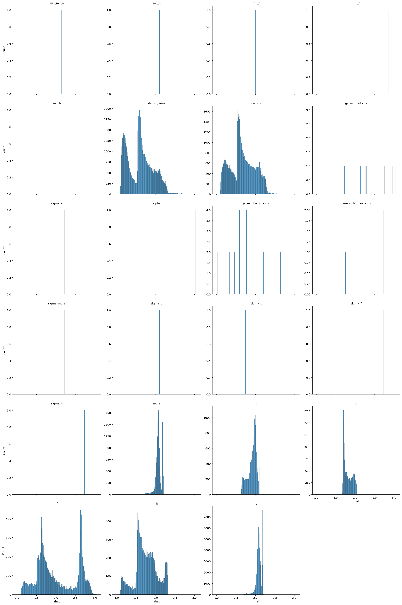
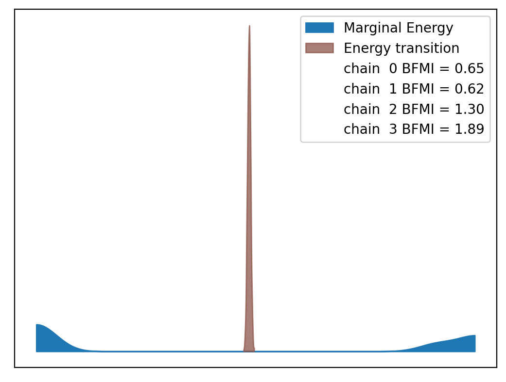
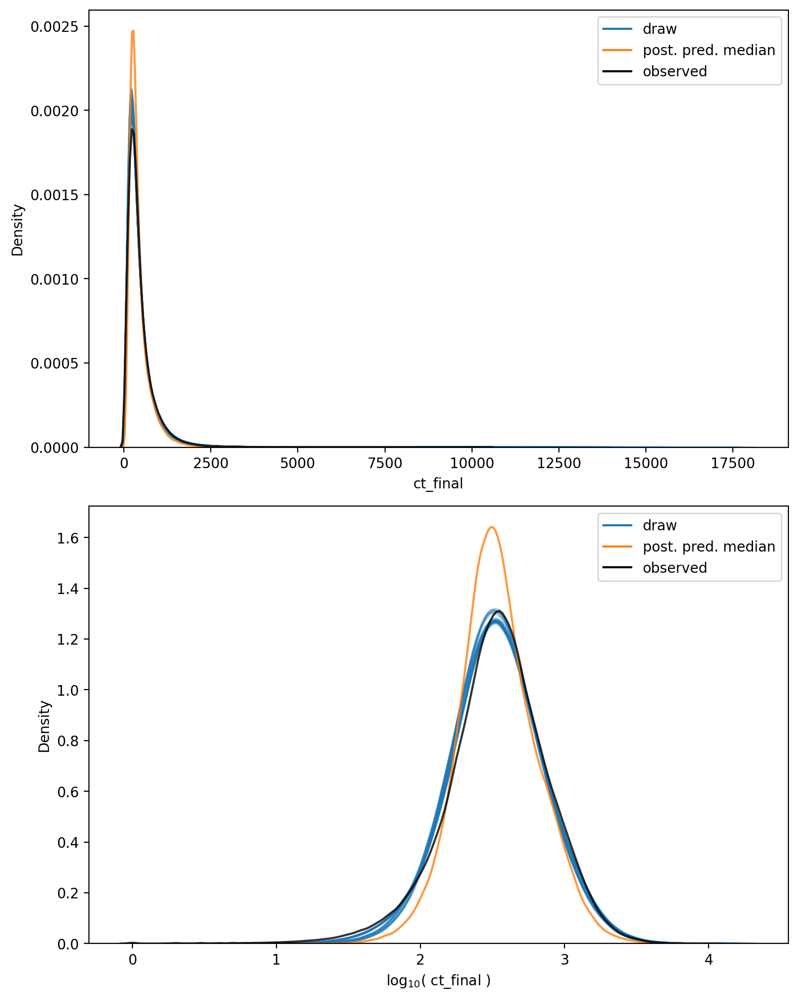

# Model Report


```python
import logging
from itertools import product
from time import time
from typing import Optional

import arviz as az
import matplotlib.pyplot as plt
import numpy as np
import seaborn as sns
from matplotlib.lines import Line2D
from xarray import Dataset

from speclet import model_configuration
from speclet.analysis.arviz_analysis import describe_mcmc, summarize_rhat
from speclet.bayesian_models import get_bayesian_model
from speclet.io import project_root
from speclet.loggers import set_console_handler_level
from speclet.managers.cache_manager import (
    get_cached_posterior,
    get_posterior_cache_name,
)
from speclet.project_configuration import get_bayesian_modeling_constants
from speclet.project_enums import ModelFitMethod
```

    WARNING (aesara.tensor.blas): Using NumPy C-API based implementation for BLAS functions.


```python
notebook_tic = time()
set_console_handler_level(logging.WARNING)
%config InlineBackend.figure_format = "retina"
HDI_PROB = get_bayesian_modeling_constants().hdi_prob
```

Parameters for papermill:

- `MODEL_NAME`: name of the model
- `FIT_METHOD`: method used to fit the model; either "ADVI" or "MCMC"
- `CONFIG_PATH`: path to configuration file
- `ROOT_CACHE_DIR`: path to the root caching directory

## Setup

### Papermill parameters


```python
CONFIG_PATH = ""
MODEL_NAME = ""
FIT_METHOD_STR = ""
ROOT_CACHE_DIR = ""
```


```python
# Parameters
MODEL_NAME = "hnb-single-lineage-prostate-002"
FIT_METHOD_STR = "PYMC_NUMPYRO"
CONFIG_PATH = "models/model-configs.yaml"
ROOT_CACHE_DIR = "models"
```


```python
FIT_METHOD = ModelFitMethod(FIT_METHOD_STR)
model_config = model_configuration.get_configuration_for_model(
    config_path=project_root() / CONFIG_PATH, name=MODEL_NAME
)
model = get_bayesian_model(model_config.model)(**model_config.model_kwargs)
trace = get_cached_posterior(
    get_posterior_cache_name(MODEL_NAME, FIT_METHOD),
    cache_dir=project_root() / ROOT_CACHE_DIR,
)
```

## Fit diagnostics


```python
if FIT_METHOD in {ModelFitMethod.PYMC_NUMPYRO, ModelFitMethod.PYMC_MCMC}:
    print("R-HAT")
    rhat_summ = summarize_rhat(trace)
    print(rhat_summ)
    print("=" * 60)
    describe_mcmc(trace)
```

    R-HAT


    /home/jc604/.conda/envs/speclet_smk/lib/python3.10/site-packages/arviz/stats/diagnostics.py:586: RuntimeWarning: invalid value encountered in double_scalars
      (between_chain_variance / within_chain_variance + num_samples - 1) / (num_samples)





                           count      mean       std       min       25%  \
    var_name
    a                    71062.0  2.095263  0.070284  1.688635  2.062719
    alpha                    1.0  3.015632       NaN  3.015632  3.015632
    b                    18119.0  1.916941  0.113841  1.613723  1.853253
    d                    18119.0  1.816767  0.111094  1.659469  1.711828
    delta_a              71062.0  1.670292  0.310806  1.086977  1.443481
    delta_genes          90595.0  1.610256  0.327221  1.089308  1.296186
    f                    18119.0  2.019910  0.509272  1.096578  1.625528
    genes_chol_cov          15.0  2.241857  0.422273  1.726364  1.938832
    genes_chol_cov_corr     24.0  1.668775  0.459871  1.002452  1.425214
    genes_chol_cov_stds      5.0  2.311100  0.429208  1.746181  2.100934
    h                    18119.0  1.748232  0.282688  1.091310  1.567505
    mu_a                 18119.0  2.070414  0.075491  1.679046  2.039878
    mu_b                     1.0  2.100498       NaN  2.100498  2.100498
    mu_d                     1.0  2.011660       NaN  2.011660  2.011660
    mu_f                     1.0  2.868174       NaN  2.868174  2.868174
    mu_h                     1.0  2.235412       NaN  2.235412  2.235412
    mu_mu_a                  1.0  2.141453       NaN  2.141453  2.141453
    sigma_a                  1.0  2.225364       NaN  2.225364  2.225364
    sigma_b                  1.0  2.100934       NaN  2.100934  2.100934
    sigma_d                  1.0  1.746181       NaN  1.746181  1.746181
    sigma_f                  1.0  2.737601       NaN  2.737601  2.737601
    sigma_h                  1.0  2.741239       NaN  2.741239  2.741239
    sigma_mu_a               1.0  2.229546       NaN  2.229546  2.229546

                              50%       75%       max
    var_name
    a                    2.092984  2.138944  2.203603
    alpha                3.015632  3.015632  3.015632
    b                    1.949128  1.998481  2.105121
    d                    1.788060  1.917874  2.057927
    delta_a              1.638834  1.904792  2.881516
    delta_genes          1.602772  1.836247  2.995599
    f                    1.862456  2.615606  3.042389
    genes_chol_cov       2.230141  2.310484  3.052277
    genes_chol_cov_corr  1.607367  1.834272  2.647386
    genes_chol_cov_stds  2.229546  2.737601  2.741239
    h                    1.726748  1.932139  2.308505
    mu_a                 2.070441  2.101117  2.204371
    mu_b                 2.100498  2.100498  2.100498
    mu_d                 2.011660  2.011660  2.011660
    mu_f                 2.868174  2.868174  2.868174
    mu_h                 2.235412  2.235412  2.235412
    mu_mu_a              2.141453  2.141453  2.141453
    sigma_a              2.225364  2.225364  2.225364
    sigma_b              2.100934  2.100934  2.100934
    sigma_d              1.746181  1.746181  1.746181
    sigma_f              2.737601  2.737601  2.737601
    sigma_h              2.741239  2.741239  2.741239
    sigma_mu_a           2.229546  2.229546  2.229546
    ============================================================
    sampled 4 chains with (unknown) tuning steps and 1,000 draws
    num. divergences: 0, 0, 0, 0
    percent divergences: 0.0, 0.0, 0.0, 0.0
    BFMI: 0.649, 0.624, 1.298, 1.889
    avg. step size: 0.021, 0.021, 0.0, 0.0





## Model predictions


```python
np.random.seed(333)

pp: Dataset = trace.posterior_predictive["ct_final"]
n_chains, n_draws, n_data = pp.shape
n_rand = 10
draws_idx = np.random.choice(np.arange(n_draws), n_rand, replace=False)

fig, axes = plt.subplots(
    nrows=2, ncols=1, figsize=(8, 10), squeeze=True, sharex=False, sharey=False
)

alpha = 0.2

for c, d in product(range(n_chains), draws_idx):
    draw = pp[c, d, :].values.flatten()
    sns.kdeplot(x=draw, ax=axes[0], color="tab:blue", alpha=alpha)
    sns.kdeplot(x=np.log10(draw + 1), ax=axes[1], color="tab:blue", alpha=alpha)

avg_ppc = pp.median(axis=(0, 1))
sns.kdeplot(x=avg_ppc, ax=axes[0], color="tab:orange", alpha=0.8)
sns.kdeplot(x=np.log10(avg_ppc + 1), ax=axes[1], color="tab:orange", alpha=0.8)

obs_data = trace.observed_data["ct_final"].values.flatten()
sns.kdeplot(x=obs_data, ax=axes[0], color="black", alpha=0.8)
sns.kdeplot(x=np.log10(obs_data + 1), ax=axes[1], color="black", alpha=0.8)

axes[0].set_xlabel("ct_final")
axes[1].set_xlabel(r"$\log_{10}($ ct_final $)$")

leg_handles = [
    Line2D([0], [0], color="tab:blue", label="draw"),
    Line2D([0], [0], color="tab:orange", label="post. pred. median"),
    Line2D([0], [0], color="black", label="observed"),
]
for ax in axes:
    ax.legend(handles=leg_handles, loc="best")

plt.tight_layout()
plt.show()
```





```python
has_log_likelihood = "log_likelihood" in trace
```


```python
if has_log_likelihood:
    psis_loo = az.loo(trace, pointwise=True)
    psis_loo
```


```python
if has_log_likelihood:
    az.plot_khat(psis_loo)
    plt.tight_layout()
    plt.show()
```

---


```python
notebook_toc = time()
print(f"execution time: {(notebook_toc - notebook_tic) / 60:.2f} minutes")
```

    execution time: 19.67 minutes


```python
%load_ext watermark
%watermark -d -u -v -iv -b -h -m
```

    Last updated: 2022-07-25

    Python implementation: CPython
    Python version       : 3.10.5
    IPython version      : 8.4.0

    Compiler    : GCC 10.3.0
    OS          : Linux
    Release     : 3.10.0-1160.71.1.el7.x86_64
    Machine     : x86_64
    Processor   : x86_64
    CPU cores   : 32
    Architecture: 64bit

    Hostname: compute-h-17-51.o2.rc.hms.harvard.edu

    Git branch: simplify

    logging   : 0.5.1.2
    numpy     : 1.23.0
    seaborn   : 0.11.2
    speclet   : 0.0.9000
    arviz     : 0.12.1
    matplotlib: 3.5.2
