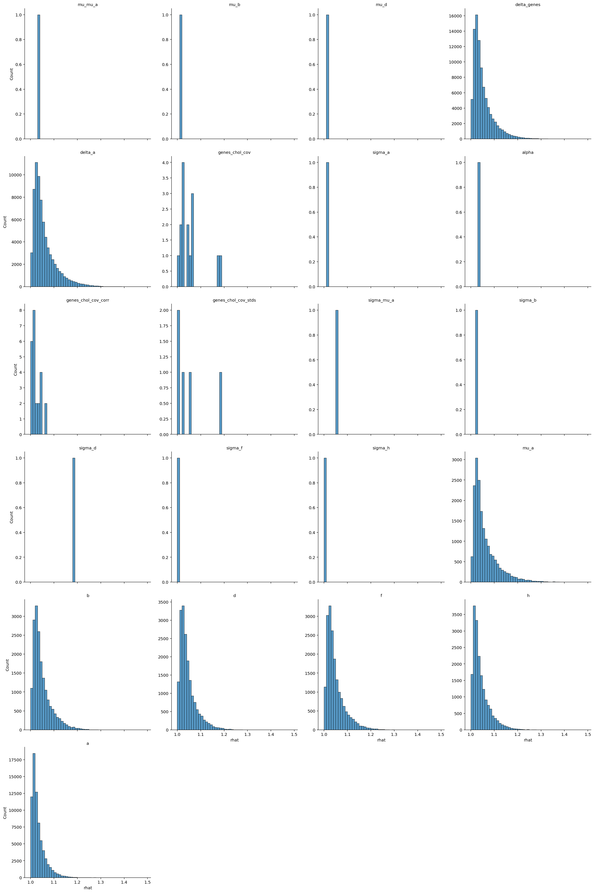
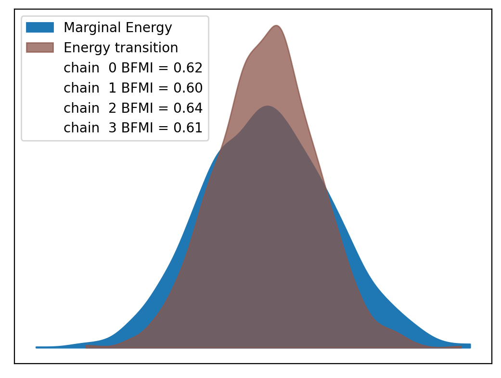

# Model Report


```python
import logging
from itertools import product
from time import time
from typing import Optional

import arviz as az
import matplotlib.pyplot as plt
import numpy as np
import seaborn as sns
from matplotlib.lines import Line2D
from xarray import Dataset

from speclet import model_configuration
from speclet.analysis.arviz_analysis import describe_mcmc, summarize_rhat
from speclet.bayesian_models import get_bayesian_model
from speclet.io import project_root
from speclet.loggers import set_console_handler_level
from speclet.managers.cache_manager import (
    get_cached_posterior,
    get_posterior_cache_name,
)
from speclet.project_configuration import get_bayesian_modeling_constants
from speclet.project_enums import ModelFitMethod
```

    WARNING (aesara.tensor.blas): Using NumPy C-API based implementation for BLAS functions.


```python
notebook_tic = time()
set_console_handler_level(logging.WARNING)
%config InlineBackend.figure_format = "retina"
HDI_PROB = get_bayesian_modeling_constants().hdi_prob
```

Parameters for papermill:

- `MODEL_NAME`: name of the model
- `FIT_METHOD`: method used to fit the model; either "ADVI" or "MCMC"
- `CONFIG_PATH`: path to configuration file
- `ROOT_CACHE_DIR`: path to the root caching directory

## Setup

### Papermill parameters


```python
CONFIG_PATH = ""
MODEL_NAME = ""
FIT_METHOD_STR = ""
ROOT_CACHE_DIR = ""
```


```python
# Parameters
MODEL_NAME = "hnb-single-lineage-prostate-003"
FIT_METHOD_STR = "PYMC_NUMPYRO"
CONFIG_PATH = "models/model-configs.yaml"
ROOT_CACHE_DIR = "models"
```


```python
FIT_METHOD = ModelFitMethod(FIT_METHOD_STR)
model_config = model_configuration.get_configuration_for_model(
    config_path=project_root() / CONFIG_PATH, name=MODEL_NAME
)
model = get_bayesian_model(model_config.model)(**model_config.model_kwargs)
trace = get_cached_posterior(
    get_posterior_cache_name(MODEL_NAME, FIT_METHOD),
    cache_dir=project_root() / ROOT_CACHE_DIR,
)
```

## Fit diagnostics


```python
if FIT_METHOD in {ModelFitMethod.PYMC_NUMPYRO, ModelFitMethod.PYMC_MCMC}:
    print("R-HAT")
    rhat_summ = summarize_rhat(trace)
    print(rhat_summ)
    print("=" * 60)
    describe_mcmc(trace)
```

    R-HAT


    /home/jc604/.conda/envs/speclet_smk/lib/python3.10/site-packages/arviz/stats/diagnostics.py:586: RuntimeWarning: invalid value encountered in double_scalars
      (between_chain_variance / within_chain_variance + num_samples - 1) / (num_samples)





                           count      mean       std       min       25%  \
    var_name
    a                    71062.0  1.032592  0.029499  0.999689  1.012579
    alpha                    1.0  1.035754       NaN  1.035754  1.035754
    b                    18119.0  1.049164  0.040852  0.999693  1.021128
    d                    18119.0  1.044629  0.037144  0.999643  1.019428
    delta_a              71062.0  1.058839  0.049822  0.999629  1.025081
    delta_genes          90595.0  1.050903  0.043620  0.999659  1.021580
    f                    18119.0  1.047856  0.039643  0.999753  1.020723
    genes_chol_cov          15.0  1.054204  0.054366  1.008015  1.020383
    genes_chol_cov_corr     24.0  1.023577  0.018094  0.999674  1.012554
    genes_chol_cov_stds      5.0  1.057139  0.075834  1.009369  1.009507
    h                    18119.0  1.042759  0.036815  0.999782  1.017285
    mu_a                 18119.0  1.061256  0.053966  0.999998  1.024631
    mu_b                     1.0  1.015464       NaN  1.015464  1.015464
    mu_d                     1.0  1.009680       NaN  1.009680  1.009680
    mu_mu_a                  1.0  1.029840       NaN  1.029840  1.029840
    sigma_a                  1.0  1.014050       NaN  1.014050  1.014050
    sigma_b                  1.0  1.024209       NaN  1.024209  1.024209
    sigma_d                  1.0  1.188884       NaN  1.188884  1.188884
    sigma_f                  1.0  1.009507       NaN  1.009507  1.009507
    sigma_h                  1.0  1.009369       NaN  1.009369  1.009369
    sigma_mu_a               1.0  1.053726       NaN  1.053726  1.053726

                              50%       75%       max
    var_name
    a                    1.023113  1.042895  1.324492
    alpha                1.035754  1.035754  1.035754
    b                    1.036202  1.064152  1.379894
    d                    1.033162  1.057724  1.352839
    delta_a              1.042822  1.076841  1.481950
    delta_genes          1.036932  1.066104  1.466442
    f                    1.035334  1.062465  1.443406
    genes_chol_cov       1.040757  1.062412  1.181856
    genes_chol_cov_corr  1.019372  1.032345  1.062214
    genes_chol_cov_stds  1.024209  1.053726  1.188884
    h                    1.030707  1.056930  1.328592
    mu_a                 1.042370  1.080658  1.464509
    mu_b                 1.015464  1.015464  1.015464
    mu_d                 1.009680  1.009680  1.009680
    mu_mu_a              1.029840  1.029840  1.029840
    sigma_a              1.014050  1.014050  1.014050
    sigma_b              1.024209  1.024209  1.024209
    sigma_d              1.188884  1.188884  1.188884
    sigma_f              1.009507  1.009507  1.009507
    sigma_h              1.009369  1.009369  1.009369
    sigma_mu_a           1.053726  1.053726  1.053726
    ============================================================
    sampled 4 chains with (unknown) tuning steps and 1,000 draws
    num. divergences: 0, 0, 0, 0
    percent divergences: 0.0, 0.0, 0.0, 0.0
    BFMI: 0.617, 0.597, 0.64, 0.609
    avg. step size: 0.01, 0.011, 0.01, 0.0





## Model predictions


```python
np.random.seed(333)

pp: Dataset = trace.posterior_predictive["ct_final"]
n_chains, n_draws, n_data = pp.shape
n_rand = 10
draws_idx = np.random.choice(np.arange(n_draws), n_rand, replace=False)

fig, axes = plt.subplots(
    nrows=2, ncols=1, figsize=(8, 10), squeeze=True, sharex=False, sharey=False
)

alpha = 0.2

for c, d in product(range(n_chains), draws_idx):
    draw = pp[c, d, :].values.flatten()
    sns.kdeplot(x=draw, ax=axes[0], color="tab:blue", alpha=alpha)
    sns.kdeplot(x=np.log10(draw + 1), ax=axes[1], color="tab:blue", alpha=alpha)

avg_ppc = pp.median(axis=(0, 1))
sns.kdeplot(x=avg_ppc, ax=axes[0], color="tab:orange", alpha=0.8)
sns.kdeplot(x=np.log10(avg_ppc + 1), ax=axes[1], color="tab:orange", alpha=0.8)

obs_data = trace.observed_data["ct_final"].values.flatten()
sns.kdeplot(x=obs_data, ax=axes[0], color="black", alpha=0.8)
sns.kdeplot(x=np.log10(obs_data + 1), ax=axes[1], color="black", alpha=0.8)

axes[0].set_xlabel("ct_final")
axes[1].set_xlabel(r"$\log_{10}($ ct_final $)$")

leg_handles = [
    Line2D([0], [0], color="tab:blue", label="draw"),
    Line2D([0], [0], color="tab:orange", label="post. pred. median"),
    Line2D([0], [0], color="black", label="observed"),
]
for ax in axes:
    ax.legend(handles=leg_handles, loc="best")

plt.tight_layout()
plt.show()
```


```python
has_log_likelihood = "log_likelihood" in trace
```


```python
if has_log_likelihood:
    psis_loo = az.loo(trace, pointwise=True)
    psis_loo
```


```python
if has_log_likelihood:
    az.plot_khat(psis_loo)
    plt.tight_layout()
    plt.show()
```

---


```python
notebook_toc = time()
print(f"execution time: {(notebook_toc - notebook_tic) / 60:.2f} minutes")
```

    execution time: 19.97 minutes


```python
%load_ext watermark
%watermark -d -u -v -iv -b -h -m
```

    Last updated: 2022-07-28

    Python implementation: CPython
    Python version       : 3.10.5
    IPython version      : 8.4.0

    Compiler    : GCC 10.3.0
    OS          : Linux
    Release     : 3.10.0-1160.71.1.el7.x86_64
    Machine     : x86_64
    Processor   : x86_64
    CPU cores   : 28
    Architecture: 64bit

    Hostname: compute-e-16-193.o2.rc.hms.harvard.edu

    Git branch: simplify

    seaborn   : 0.11.2
    matplotlib: 3.5.2
    speclet   : 0.0.9000
    logging   : 0.5.1.2
    numpy     : 1.23.0
    arviz     : 0.12.1
