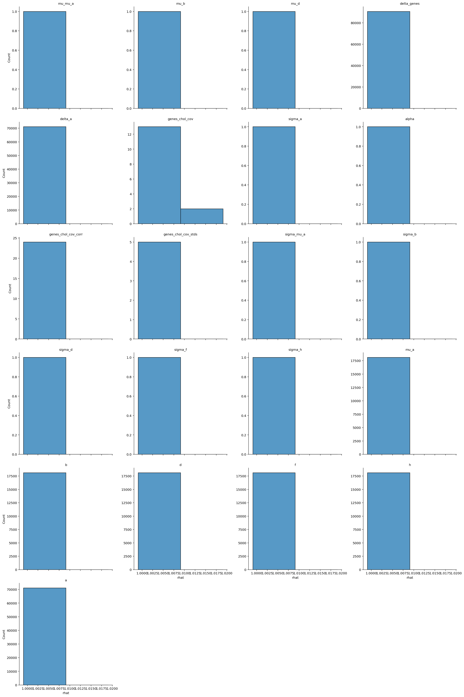
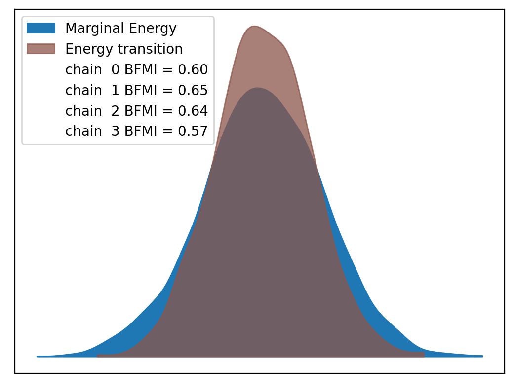
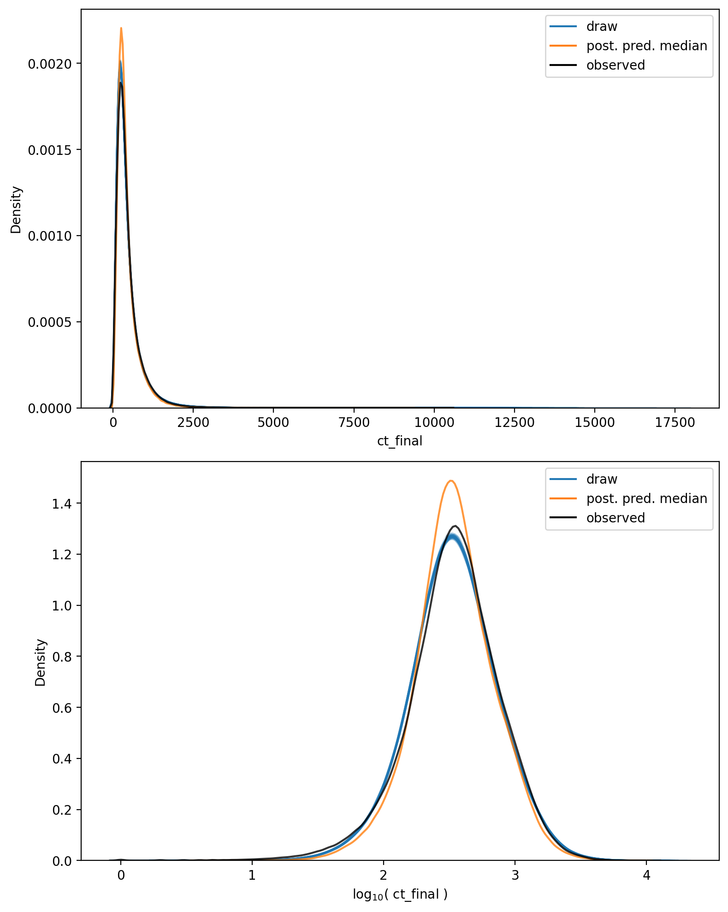

# Model Report


```python
import logging
from itertools import product
from time import time
from typing import Optional

import arviz as az
import matplotlib.pyplot as plt
import numpy as np
import seaborn as sns
from matplotlib.lines import Line2D
from xarray import Dataset

from speclet import model_configuration
from speclet.analysis.arviz_analysis import describe_mcmc, summarize_rhat
from speclet.bayesian_models import get_bayesian_model
from speclet.io import project_root
from speclet.loggers import set_console_handler_level
from speclet.managers.cache_manager import (
    get_cached_posterior,
    get_posterior_cache_name,
)
from speclet.project_configuration import get_bayesian_modeling_constants
from speclet.project_enums import ModelFitMethod
```

    WARNING (aesara.tensor.blas): Using NumPy C-API based implementation for BLAS functions.


```python
notebook_tic = time()
set_console_handler_level(logging.WARNING)
%config InlineBackend.figure_format = "retina"
HDI_PROB = get_bayesian_modeling_constants().hdi_prob
```

Parameters for papermill:

- `MODEL_NAME`: name of the model
- `FIT_METHOD`: method used to fit the model; either "ADVI" or "MCMC"
- `CONFIG_PATH`: path to configuration file
- `ROOT_CACHE_DIR`: path to the root caching directory

## Setup

### Papermill parameters


```python
CONFIG_PATH = ""
MODEL_NAME = ""
FIT_METHOD_STR = ""
ROOT_CACHE_DIR = ""
```


```python
# Parameters
MODEL_NAME = "hnb-single-lineage-prostate-004"
FIT_METHOD_STR = "PYMC_NUMPYRO"
CONFIG_PATH = "models/model-configs.yaml"
ROOT_CACHE_DIR = "models"
```


```python
FIT_METHOD = ModelFitMethod(FIT_METHOD_STR)
model_config = model_configuration.get_configuration_for_model(
    config_path=project_root() / CONFIG_PATH, name=MODEL_NAME
)
model = get_bayesian_model(model_config.model)(**model_config.model_kwargs)
trace = get_cached_posterior(
    get_posterior_cache_name(MODEL_NAME, FIT_METHOD),
    cache_dir=project_root() / ROOT_CACHE_DIR,
)
```

## Fit diagnostics


```python
if FIT_METHOD in {ModelFitMethod.PYMC_NUMPYRO, ModelFitMethod.PYMC_MCMC}:
    print("R-HAT")
    rhat_summ = summarize_rhat(trace)
    print(rhat_summ)
    print("=" * 60)
    describe_mcmc(trace)
```

    R-HAT


    /home/jc604/.conda/envs/speclet_smk/lib/python3.10/site-packages/arviz/stats/diagnostics.py:586: RuntimeWarning: invalid value encountered in double_scalars
      (between_chain_variance / within_chain_variance + num_samples - 1) / (num_samples)





                           count      mean       std       min       25%  \
    var_name
    a                    71062.0  1.000926  0.001012  0.999115  1.000177
    alpha                    1.0  1.002740       NaN  1.002740  1.002740
    b                    18119.0  1.001186  0.001180  0.999200  1.000319
    d                    18119.0  1.001267  0.001222  0.999153  1.000359
    delta_a              71062.0  1.000616  0.000759  0.999103  1.000071
    delta_genes          90595.0  1.001171  0.001166  0.999147  1.000326
    f                    18119.0  1.001308  0.001226  0.999129  1.000408
    genes_chol_cov          15.0  1.003545  0.003955  1.000185  1.001016
    genes_chol_cov_corr     24.0  1.001643  0.001803  0.999880  1.000584
    genes_chol_cov_stds      5.0  1.001660  0.001946  1.000206  1.000218
    h                    18119.0  1.000719  0.000880  0.999098  1.000075
    mu_a                 18119.0  1.000712  0.000724  0.999253  1.000196
    mu_b                     1.0  1.000566       NaN  1.000566  1.000566
    mu_d                     1.0  1.001584       NaN  1.001584  1.001584
    mu_mu_a                  1.0  1.003192       NaN  1.003192  1.003192
    sigma_a                  1.0  1.000972       NaN  1.000972  1.000972
    sigma_b                  1.0  1.000206       NaN  1.000206  1.000206
    sigma_d                  1.0  1.004910       NaN  1.004910  1.004910
    sigma_f                  1.0  1.001079       NaN  1.001079  1.001079
    sigma_h                  1.0  1.000218       NaN  1.000218  1.000218
    sigma_mu_a               1.0  1.001886       NaN  1.001886  1.001886

                              50%       75%       max
    var_name
    a                    1.000735  1.001465  1.009985
    alpha                1.002740  1.002740  1.002740
    b                    1.000954  1.001808  1.010490
    d                    1.001041  1.001931  1.010133
    delta_a              1.000472  1.001006  1.006688
    delta_genes          1.000931  1.001773  1.010001
    f                    1.001101  1.001961  1.010085
    genes_chol_cov       1.002055  1.004348  1.013350
    genes_chol_cov_corr  1.001119  1.001579  1.006662
    genes_chol_cov_stds  1.001079  1.001886  1.004910
    h                    1.000537  1.001182  1.006362
    mu_a                 1.000595  1.001101  1.005267
    mu_b                 1.000566  1.000566  1.000566
    mu_d                 1.001584  1.001584  1.001584
    mu_mu_a              1.003192  1.003192  1.003192
    sigma_a              1.000972  1.000972  1.000972
    sigma_b              1.000206  1.000206  1.000206
    sigma_d              1.004910  1.004910  1.004910
    sigma_f              1.001079  1.001079  1.001079
    sigma_h              1.000218  1.000218  1.000218
    sigma_mu_a           1.001886  1.001886  1.001886
    ============================================================
    sampled 4 chains with (unknown) tuning steps and 1,000 draws
    num. divergences: 0, 0, 0, 0
    percent divergences: 0.0, 0.0, 0.0, 0.0
    BFMI: 0.601, 0.646, 0.638, 0.573
    avg. step size: 0.019, 0.018, 0.018, 0.02





## Model predictions


```python
np.random.seed(333)

pp: Dataset = trace.posterior_predictive["ct_final"]
n_chains, n_draws, n_data = pp.shape
n_rand = 10
draws_idx = np.random.choice(np.arange(n_draws), n_rand, replace=False)

fig, axes = plt.subplots(
    nrows=2, ncols=1, figsize=(8, 10), squeeze=True, sharex=False, sharey=False
)

alpha = 0.2

for c, d in product(range(n_chains), draws_idx):
    draw = pp[c, d, :].values.flatten()
    sns.kdeplot(x=draw, ax=axes[0], color="tab:blue", alpha=alpha)
    sns.kdeplot(x=np.log10(draw + 1), ax=axes[1], color="tab:blue", alpha=alpha)

avg_ppc = pp.median(axis=(0, 1))
sns.kdeplot(x=avg_ppc, ax=axes[0], color="tab:orange", alpha=0.8)
sns.kdeplot(x=np.log10(avg_ppc + 1), ax=axes[1], color="tab:orange", alpha=0.8)

obs_data = trace.observed_data["ct_final"].values.flatten()
sns.kdeplot(x=obs_data, ax=axes[0], color="black", alpha=0.8)
sns.kdeplot(x=np.log10(obs_data + 1), ax=axes[1], color="black", alpha=0.8)

axes[0].set_xlabel("ct_final")
axes[1].set_xlabel(r"$\log_{10}($ ct_final $)$")

leg_handles = [
    Line2D([0], [0], color="tab:blue", label="draw"),
    Line2D([0], [0], color="tab:orange", label="post. pred. median"),
    Line2D([0], [0], color="black", label="observed"),
]
for ax in axes:
    ax.legend(handles=leg_handles, loc="best")

plt.tight_layout()
plt.show()
```





```python
has_log_likelihood = "log_likelihood" in trace
```


```python
if has_log_likelihood:
    psis_loo = az.loo(trace, pointwise=True)
    psis_loo
```


```python
if has_log_likelihood:
    az.plot_khat(psis_loo)
    plt.tight_layout()
    plt.show()
```

---


```python
notebook_toc = time()
print(f"execution time: {(notebook_toc - notebook_tic) / 60:.2f} minutes")
```

    execution time: 19.29 minutes


```python
%load_ext watermark
%watermark -d -u -v -iv -b -h -m
```

    Last updated: 2022-07-29

    Python implementation: CPython
    Python version       : 3.10.5
    IPython version      : 8.4.0

    Compiler    : GCC 10.3.0
    OS          : Linux
    Release     : 3.10.0-1160.45.1.el7.x86_64
    Machine     : x86_64
    Processor   : x86_64
    CPU cores   : 28
    Architecture: 64bit

    Hostname: compute-e-16-183.o2.rc.hms.harvard.edu

    Git branch: simplify

    speclet   : 0.0.9000
    logging   : 0.5.1.2
    arviz     : 0.12.1
    seaborn   : 0.11.2
    numpy     : 1.23.0
    matplotlib: 3.5.2
