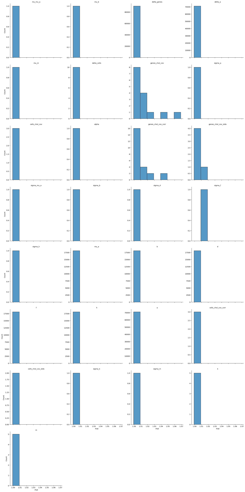
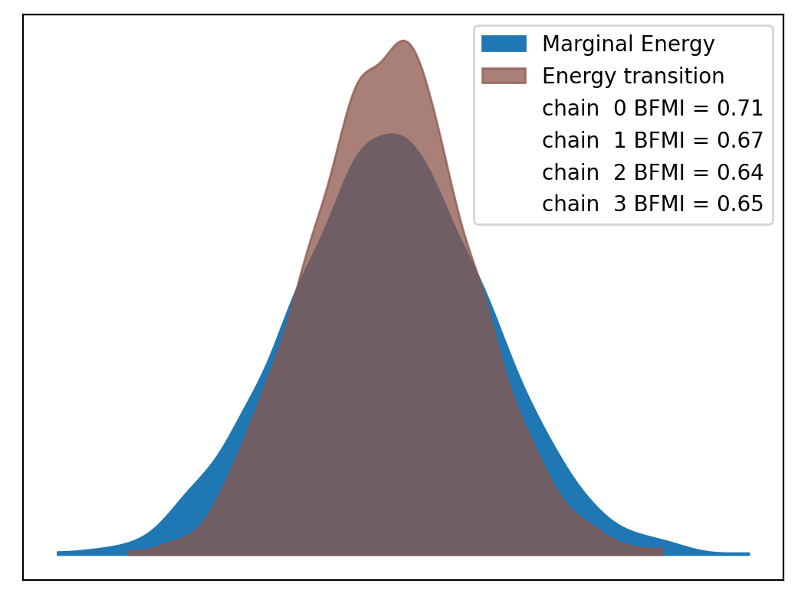
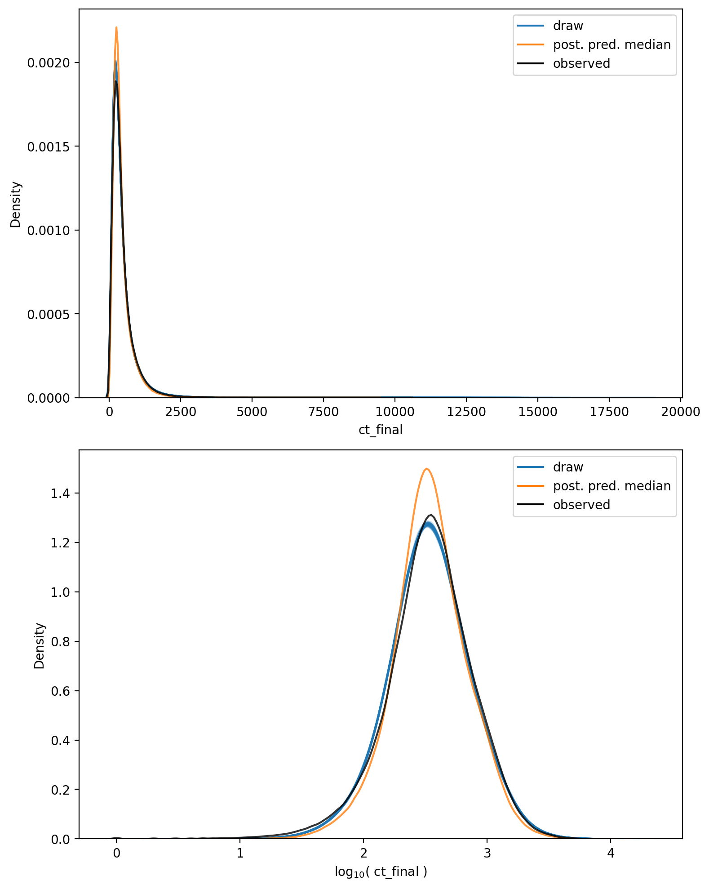

# Model Report


```python
import logging
from itertools import product
from time import time
from typing import Optional

import arviz as az
import matplotlib.pyplot as plt
import numpy as np
import seaborn as sns
from matplotlib.lines import Line2D
from xarray import Dataset

from speclet import model_configuration
from speclet.analysis.arviz_analysis import describe_mcmc, summarize_rhat
from speclet.bayesian_models import get_bayesian_model
from speclet.io import project_root
from speclet.loggers import set_console_handler_level
from speclet.managers.cache_manager import (
    get_cached_posterior,
    get_posterior_cache_name,
)
from speclet.project_configuration import get_bayesian_modeling_constants
from speclet.project_enums import ModelFitMethod
```

    WARNING (aesara.tensor.blas): Using NumPy C-API based implementation for BLAS functions.


```python
notebook_tic = time()
set_console_handler_level(logging.WARNING)
%config InlineBackend.figure_format = "retina"
HDI_PROB = get_bayesian_modeling_constants().hdi_prob
```

Parameters for papermill:

- `MODEL_NAME`: name of the model
- `FIT_METHOD`: method used to fit the model; either "ADVI" or "MCMC"
- `CONFIG_PATH`: path to configuration file
- `ROOT_CACHE_DIR`: path to the root caching directory

## Setup

### Papermill parameters


```python
CONFIG_PATH = ""
MODEL_NAME = ""
FIT_METHOD_STR = ""
ROOT_CACHE_DIR = ""
```


```python
# Parameters
MODEL_NAME = "hnb-single-lineage-prostate-007"
FIT_METHOD_STR = "PYMC_NUMPYRO"
CONFIG_PATH = "models/model-configs.yaml"
ROOT_CACHE_DIR = "models"
```


```python
FIT_METHOD = ModelFitMethod(FIT_METHOD_STR)
model_config = model_configuration.get_configuration_for_model(
    config_path=project_root() / CONFIG_PATH, name=MODEL_NAME
)
model = get_bayesian_model(model_config.model)(**model_config.model_kwargs)
trace = get_cached_posterior(
    get_posterior_cache_name(MODEL_NAME, FIT_METHOD),
    cache_dir=project_root() / ROOT_CACHE_DIR,
)
```

## Fit diagnostics


```python
if FIT_METHOD in {ModelFitMethod.PYMC_NUMPYRO, ModelFitMethod.PYMC_MCMC}:
    print("R-HAT")
    rhat_summ = summarize_rhat(trace)
    print(rhat_summ)
    print("=" * 60)
    describe_mcmc(trace)
```

    R-HAT


    /home/jc604/.conda/envs/speclet_smk/lib/python3.10/site-packages/arviz/stats/diagnostics.py:586: RuntimeWarning: invalid value encountered in double_scalars
      (between_chain_variance / within_chain_variance + num_samples - 1) / (num_samples)





                           count      mean       std       min       25%  \
    var_name
    a                    71062.0  1.000799  0.000898  0.999118  1.000147
    alpha                    1.0  1.001385       NaN  1.001385  1.001385
    b                    18119.0  1.001041  0.001061  0.999216  1.000272
    cells_chol_cov           3.0  1.002107  0.001743  1.000094  1.001595
    cells_chol_cov_corr      3.0  1.001429  0.001277  0.999955  1.001061
    cells_chol_cov_stds      2.0  1.001912  0.001722  1.000695  1.001303
    d                    18119.0  1.001132  0.001124  0.999185  1.000304
    delta_a              71062.0  1.000799  0.000781  0.999155  1.000238
    delta_cells             10.0  1.002459  0.001446  1.000616  1.001259
    delta_genes          90595.0  1.001117  0.001069  0.999155  1.000345
    f                    18119.0  1.001136  0.001089  0.999216  1.000336
    genes_chol_cov          15.0  1.014620  0.018121  1.000619  1.003896
    genes_chol_cov_corr     24.0  1.009939  0.011635  0.999573  1.002331
    genes_chol_cov_stds      5.0  1.005466  0.006899  1.000803  1.001083
    h                    18119.0  1.000677  0.000792  0.999165  1.000103
    k                        5.0  1.003063  0.000142  1.002904  1.002912
    m                        5.0  1.000392  0.000246  1.000119  1.000157
    mu_a                 18119.0  1.001320  0.001082  0.999321  1.000557
    mu_b                     1.0  1.000388       NaN  1.000388  1.000388
    mu_m                     1.0  1.001125       NaN  1.001125  1.001125
    mu_mu_a                  1.0  1.003461       NaN  1.003461  1.003461
    sigma_a                  1.0  1.003169       NaN  1.003169  1.003169
    sigma_b                  1.0  1.000803       NaN  1.000803  1.000803
    sigma_d                  1.0  1.006880       NaN  1.006880  1.006880
    sigma_f                  1.0  1.016973       NaN  1.016973  1.016973
    sigma_h                  1.0  1.001591       NaN  1.001591  1.001591
    sigma_k                  1.0  1.003130       NaN  1.003130  1.003130
    sigma_m                  1.0  1.000695       NaN  1.000695  1.000695
    sigma_mu_a               1.0  1.001083       NaN  1.001083  1.001083

                              50%       75%       max
    var_name
    a                    1.000616  1.001259  1.008106
    alpha                1.001385  1.001385  1.001385
    b                    1.000826  1.001583  1.007955
    cells_chol_cov       1.003097  1.003113  1.003130
    cells_chol_cov_corr  1.002166  1.002166  1.002166
    cells_chol_cov_stds  1.001912  1.002521  1.003130
    d                    1.000905  1.001715  1.010333
    delta_a              1.000671  1.001220  1.007034
    delta_cells          1.002294  1.003500  1.004664
    delta_genes          1.000909  1.001670  1.009487
    f                    1.000925  1.001722  1.008644
    genes_chol_cov       1.007303  1.015291  1.064847
    genes_chol_cov_corr  1.004947  1.018212  1.039608
    genes_chol_cov_stds  1.001591  1.006880  1.016973
    h                    1.000527  1.001087  1.006209
    k                    1.003162  1.003168  1.003172
    m                    1.000429  1.000611  1.000643
    mu_a                 1.001115  1.001862  1.010385
    mu_b                 1.000388  1.000388  1.000388
    mu_m                 1.001125  1.001125  1.001125
    mu_mu_a              1.003461  1.003461  1.003461
    sigma_a              1.003169  1.003169  1.003169
    sigma_b              1.000803  1.000803  1.000803
    sigma_d              1.006880  1.006880  1.006880
    sigma_f              1.016973  1.016973  1.016973
    sigma_h              1.001591  1.001591  1.001591
    sigma_k              1.003130  1.003130  1.003130
    sigma_m              1.000695  1.000695  1.000695
    sigma_mu_a           1.001083  1.001083  1.001083
    ============================================================
    sampled 4 chains with (unknown) tuning steps and 1,000 draws
    num. divergences: 0, 0, 1, 1
    percent divergences: 0.0, 0.0, 0.1, 0.1
    BFMI: 0.715, 0.674, 0.641, 0.645
    avg. step size: 0.008, 0.005, 0.008, 0.006





## Model predictions


```python
np.random.seed(333)

pp: Dataset = trace.posterior_predictive["ct_final"]
n_chains, n_draws, n_data = pp.shape
n_rand = 10
draws_idx = np.random.choice(np.arange(n_draws), n_rand, replace=False)

fig, axes = plt.subplots(
    nrows=2, ncols=1, figsize=(8, 10), squeeze=True, sharex=False, sharey=False
)

alpha = 0.2

for c, d in product(range(n_chains), draws_idx):
    draw = pp[c, d, :].values.flatten()
    sns.kdeplot(x=draw, ax=axes[0], color="tab:blue", alpha=alpha)
    sns.kdeplot(x=np.log10(draw + 1), ax=axes[1], color="tab:blue", alpha=alpha)

avg_ppc = pp.median(axis=(0, 1))
sns.kdeplot(x=avg_ppc, ax=axes[0], color="tab:orange", alpha=0.8)
sns.kdeplot(x=np.log10(avg_ppc + 1), ax=axes[1], color="tab:orange", alpha=0.8)

obs_data = trace.observed_data["ct_final"].values.flatten()
sns.kdeplot(x=obs_data, ax=axes[0], color="black", alpha=0.8)
sns.kdeplot(x=np.log10(obs_data + 1), ax=axes[1], color="black", alpha=0.8)

axes[0].set_xlabel("ct_final")
axes[1].set_xlabel(r"$\log_{10}($ ct_final $)$")

leg_handles = [
    Line2D([0], [0], color="tab:blue", label="draw"),
    Line2D([0], [0], color="tab:orange", label="post. pred. median"),
    Line2D([0], [0], color="black", label="observed"),
]
for ax in axes:
    ax.legend(handles=leg_handles, loc="best")

plt.tight_layout()
plt.show()
```





```python
has_log_likelihood = "log_likelihood" in trace
```


```python
if has_log_likelihood:
    psis_loo = az.loo(trace, pointwise=True)
    psis_loo
```


```python
if has_log_likelihood:
    az.plot_khat(psis_loo)
    plt.tight_layout()
    plt.show()
```

---


```python
notebook_toc = time()
print(f"execution time: {(notebook_toc - notebook_tic) / 60:.2f} minutes")
```

    execution time: 20.31 minutes


```python
%load_ext watermark
%watermark -d -u -v -iv -b -h -m
```

    Last updated: 2022-08-03

    Python implementation: CPython
    Python version       : 3.10.5
    IPython version      : 8.4.0

    Compiler    : GCC 10.3.0
    OS          : Linux
    Release     : 3.10.0-1160.71.1.el7.x86_64
    Machine     : x86_64
    Processor   : x86_64
    CPU cores   : 32
    Architecture: 64bit

    Hostname: compute-h-17-51.o2.rc.hms.harvard.edu

    Git branch: simplify

    seaborn   : 0.11.2
    logging   : 0.5.1.2
    arviz     : 0.12.1
    numpy     : 1.23.1
    matplotlib: 3.5.2
    speclet   : 0.0.9000
