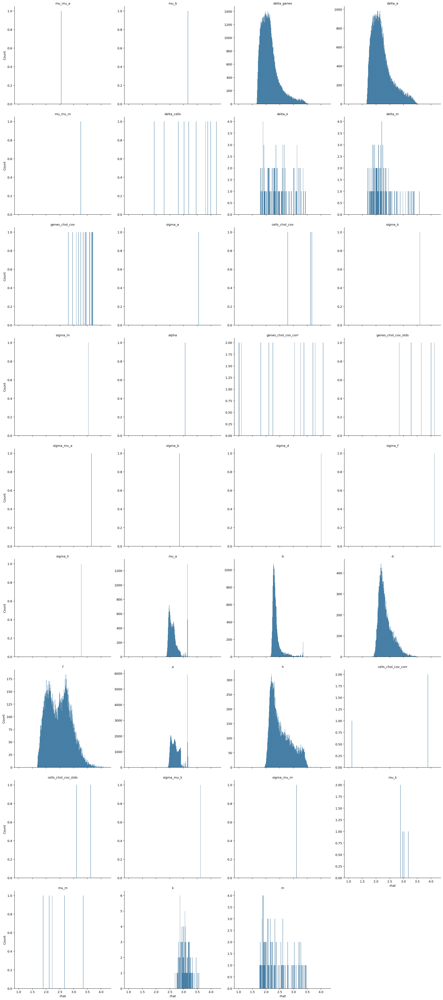
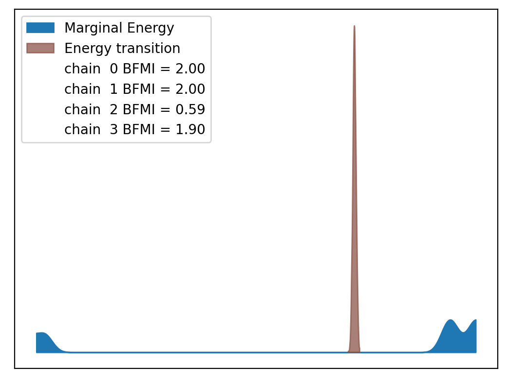
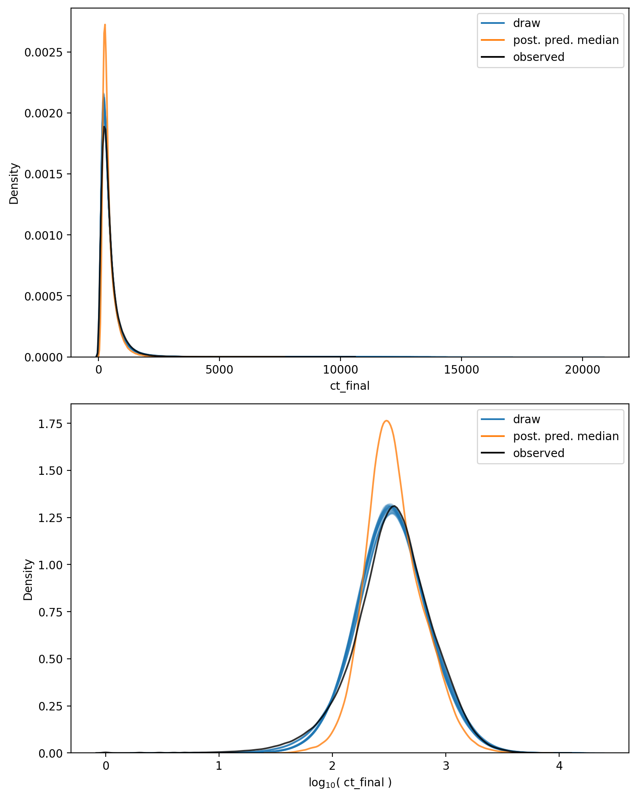

# Model Report


```python
import logging
from itertools import product
from time import time
from typing import Optional

import arviz as az
import matplotlib.pyplot as plt
import numpy as np
import seaborn as sns
from matplotlib.lines import Line2D
from xarray import Dataset

from speclet import model_configuration
from speclet.analysis.arviz_analysis import describe_mcmc, summarize_rhat
from speclet.bayesian_models import get_bayesian_model
from speclet.io import project_root
from speclet.loggers import set_console_handler_level
from speclet.managers.cache_manager import (
    get_cached_posterior,
    get_posterior_cache_name,
)
from speclet.project_configuration import get_bayesian_modeling_constants
from speclet.project_enums import ModelFitMethod
```

    WARNING (aesara.tensor.blas): Using NumPy C-API based implementation for BLAS functions.


```python
notebook_tic = time()
set_console_handler_level(logging.WARNING)
%config InlineBackend.figure_format = "retina"
HDI_PROB = get_bayesian_modeling_constants().hdi_prob
```

Parameters for papermill:

- `MODEL_NAME`: name of the model
- `FIT_METHOD`: method used to fit the model; either "ADVI" or "MCMC"
- `CONFIG_PATH`: path to configuration file
- `ROOT_CACHE_DIR`: path to the root caching directory

## Setup

### Papermill parameters


```python
CONFIG_PATH = ""
MODEL_NAME = ""
FIT_METHOD_STR = ""
ROOT_CACHE_DIR = ""
```


```python
# Parameters
MODEL_NAME = "hnb-single-lineage-prostate-008"
FIT_METHOD_STR = "PYMC_NUMPYRO"
CONFIG_PATH = "models/model-configs.yaml"
ROOT_CACHE_DIR = "models"
```


```python
FIT_METHOD = ModelFitMethod(FIT_METHOD_STR)
model_config = model_configuration.get_configuration_for_model(
    config_path=project_root() / CONFIG_PATH, name=MODEL_NAME
)
model = get_bayesian_model(model_config.model)(**model_config.model_kwargs)
trace = get_cached_posterior(
    get_posterior_cache_name(MODEL_NAME, FIT_METHOD),
    cache_dir=project_root() / ROOT_CACHE_DIR,
)
```

## Fit diagnostics


```python
if FIT_METHOD in {ModelFitMethod.PYMC_NUMPYRO, ModelFitMethod.PYMC_MCMC}:
    print("R-HAT")
    rhat_summ = summarize_rhat(trace)
    print(rhat_summ)
    print("=" * 60)
    describe_mcmc(trace)
```

    R-HAT


    /home/jc604/.conda/envs/speclet_smk/lib/python3.10/site-packages/arviz/stats/diagnostics.py:586: RuntimeWarning: invalid value encountered in double_scalars
      (between_chain_variance / within_chain_variance + num_samples - 1) / (num_samples)





                           count      mean       std       min       25%  \
    var_name
    a                    71062.0  2.736515  0.194374  2.404184  2.581061
    alpha                    1.0  3.063183       NaN  3.063183  3.063183
    b                    18119.0  2.382509  0.202953  2.152913  2.273992
    cells_chol_cov           3.0  3.358535  0.492038  2.790979  3.205348
    cells_chol_cov_corr      3.0  2.968812  1.598114  1.123469  2.507477
    cells_chol_cov_stds      2.0  3.362617  0.363594  3.105518  3.234067
    d                    18119.0  2.352194  0.258104  1.790803  2.165487
    delta_a              71062.0  2.214271  0.370899  1.661492  1.940510
    delta_cells             10.0  3.257295  0.753314  1.927275  2.861143
    delta_genes          90595.0  2.137110  0.333239  1.655047  1.900064
    delta_k                115.0  2.455010  0.463537  1.788244  2.085945
    delta_m                115.0  2.238541  0.422493  1.686018  1.946424
    f                    18119.0  2.476886  0.429784  1.675953  2.112106
    genes_chol_cov          15.0  3.389816  0.278010  2.814051  3.221273
    genes_chol_cov_corr     24.0  2.544958  1.117114  1.004831  1.630477
    genes_chol_cov_stds      5.0  3.583680  0.530450  2.845818  3.280840
    h                    18119.0  2.544376  0.377780  1.923729  2.234333
    k                      115.0  3.051748  0.178715  2.690607  2.922679
    m                      115.0  2.385827  0.500154  1.770488  1.956665
    mu_a                 18119.0  2.646241  0.205969  2.346969  2.496508
    mu_b                     1.0  3.154919       NaN  3.154919  3.154919
    mu_k                     5.0  2.990407  0.118405  2.888969  2.891330
    mu_m                     5.0  2.446406  0.578161  1.886529  2.114087
    mu_mu_a                  1.0  2.553504       NaN  2.553504  2.553504
    mu_mu_m                  1.0  3.256905       NaN  3.256905  3.256905
    sigma_a                  1.0  3.545734       NaN  3.545734  3.545734
    sigma_b                  1.0  2.845818       NaN  2.845818  2.845818
    sigma_d                  1.0  4.011500       NaN  4.011500  4.011500
    sigma_f                  1.0  4.133548       NaN  4.133548  4.133548
    sigma_h                  1.0  3.280840       NaN  3.280840  3.280840
    sigma_k                  1.0  3.604388       NaN  3.604388  3.604388
    sigma_m                  1.0  3.542785       NaN  3.542785  3.542785
    sigma_mu_a               1.0  3.646695       NaN  3.646695  3.646695
    sigma_mu_k               1.0  3.619717       NaN  3.619717  3.619717
    sigma_mu_m               1.0  3.105518       NaN  3.105518  3.105518

                              50%       75%       max
    var_name
    a                    2.692476  2.842687  3.164000
    alpha                3.063183  3.063183  3.063183
    b                    2.319822  2.393574  3.358265
    cells_chol_cov       3.619717  3.642314  3.664910
    cells_chol_cov_corr  3.891484  3.891484  3.891484
    cells_chol_cov_stds  3.362617  3.491167  3.619717
    d                    2.283140  2.483715  3.531927
    delta_a              2.131796  2.385012  3.902800
    delta_cells          3.324341  3.862885  4.201421
    delta_genes          2.070543  2.268475  4.019504
    delta_k              2.356446  2.713627  3.438705
    delta_m              2.135470  2.358686  3.580514
    f                    2.471633  2.786581  4.191010
    genes_chol_cov       3.435236  3.617714  3.696504
    genes_chol_cov_corr  2.643310  3.460298  4.082297
    genes_chol_cov_stds  3.646695  4.011500  4.133548
    h                    2.436298  2.804924  3.843229
    k                    3.043272  3.172715  3.555884
    m                    2.223349  2.688716  3.462512
    mu_a                 2.590278  2.701470  3.158962
    mu_b                 3.154919  3.154919  3.154919
    mu_k                 2.972874  3.022317  3.176546
    mu_m                 2.214895  2.670454  3.346066
    mu_mu_a              2.553504  2.553504  2.553504
    mu_mu_m              3.256905  3.256905  3.256905
    sigma_a              3.545734  3.545734  3.545734
    sigma_b              2.845818  2.845818  2.845818
    sigma_d              4.011500  4.011500  4.011500
    sigma_f              4.133548  4.133548  4.133548
    sigma_h              3.280840  3.280840  3.280840
    sigma_k              3.604388  3.604388  3.604388
    sigma_m              3.542785  3.542785  3.542785
    sigma_mu_a           3.646695  3.646695  3.646695
    sigma_mu_k           3.619717  3.619717  3.619717
    sigma_mu_m           3.105518  3.105518  3.105518
    ============================================================
    date created: 2022-08-07 22:52
    sampled 4 chains with (unknown) tuning steps and 1,000 draws
    num. divergences: 0, 0, 0, 0
    percent divergences: 0.0, 0.0, 0.0, 0.0
    BFMI: 2.001, 1.995, 0.588, 1.9
    avg. step size: 0.0, 0.0, 0.003, 0.0
    avg. accept prob.: 0.981, 0.987, 0.987, 0.974
    avg. tree depth: 11.0, 11.0, 11.0, 11.0





## Model predictions


```python
np.random.seed(333)

pp: Dataset = trace.posterior_predictive["ct_final"]
n_chains, n_draws, n_data = pp.shape
n_rand = 10
draws_idx = np.random.choice(np.arange(n_draws), n_rand, replace=False)

fig, axes = plt.subplots(
    nrows=2, ncols=1, figsize=(8, 10), squeeze=True, sharex=False, sharey=False
)

alpha = 0.2

for c, d in product(range(n_chains), draws_idx):
    draw = pp[c, d, :].values.flatten()
    sns.kdeplot(x=draw, ax=axes[0], color="tab:blue", alpha=alpha)
    sns.kdeplot(x=np.log10(draw + 1), ax=axes[1], color="tab:blue", alpha=alpha)

avg_ppc = pp.median(axis=(0, 1))
sns.kdeplot(x=avg_ppc, ax=axes[0], color="tab:orange", alpha=0.8)
sns.kdeplot(x=np.log10(avg_ppc + 1), ax=axes[1], color="tab:orange", alpha=0.8)

obs_data = trace.observed_data["ct_final"].values.flatten()
sns.kdeplot(x=obs_data, ax=axes[0], color="black", alpha=0.8)
sns.kdeplot(x=np.log10(obs_data + 1), ax=axes[1], color="black", alpha=0.8)

axes[0].set_xlabel("ct_final")
axes[1].set_xlabel(r"$\log_{10}($ ct_final $)$")

leg_handles = [
    Line2D([0], [0], color="tab:blue", label="draw"),
    Line2D([0], [0], color="tab:orange", label="post. pred. median"),
    Line2D([0], [0], color="black", label="observed"),
]
for ax in axes:
    ax.legend(handles=leg_handles, loc="best")

plt.tight_layout()
plt.show()
```





```python
has_log_likelihood = "log_likelihood" in trace
```


```python
if has_log_likelihood:
    psis_loo = az.loo(trace, pointwise=True)
    psis_loo
```


```python
if has_log_likelihood:
    az.plot_khat(psis_loo)
    plt.tight_layout()
    plt.show()
```

---


```python
notebook_toc = time()
print(f"execution time: {(notebook_toc - notebook_tic) / 60:.2f} minutes")
```

    execution time: 18.53 minutes


```python
%load_ext watermark
%watermark -d -u -v -iv -b -h -m
```

    Last updated: 2022-08-07

    Python implementation: CPython
    Python version       : 3.10.5
    IPython version      : 8.4.0

    Compiler    : GCC 10.3.0
    OS          : Linux
    Release     : 3.10.0-1160.66.1.el7.x86_64
    Machine     : x86_64
    Processor   : x86_64
    CPU cores   : 32
    Architecture: 64bit

    Hostname: compute-h-17-50.o2.rc.hms.harvard.edu

    Git branch: varying-chromosome

    seaborn   : 0.11.2
    speclet   : 0.0.9000
    arviz     : 0.12.1
    logging   : 0.5.1.2
    matplotlib: 3.5.2
    numpy     : 1.23.1
