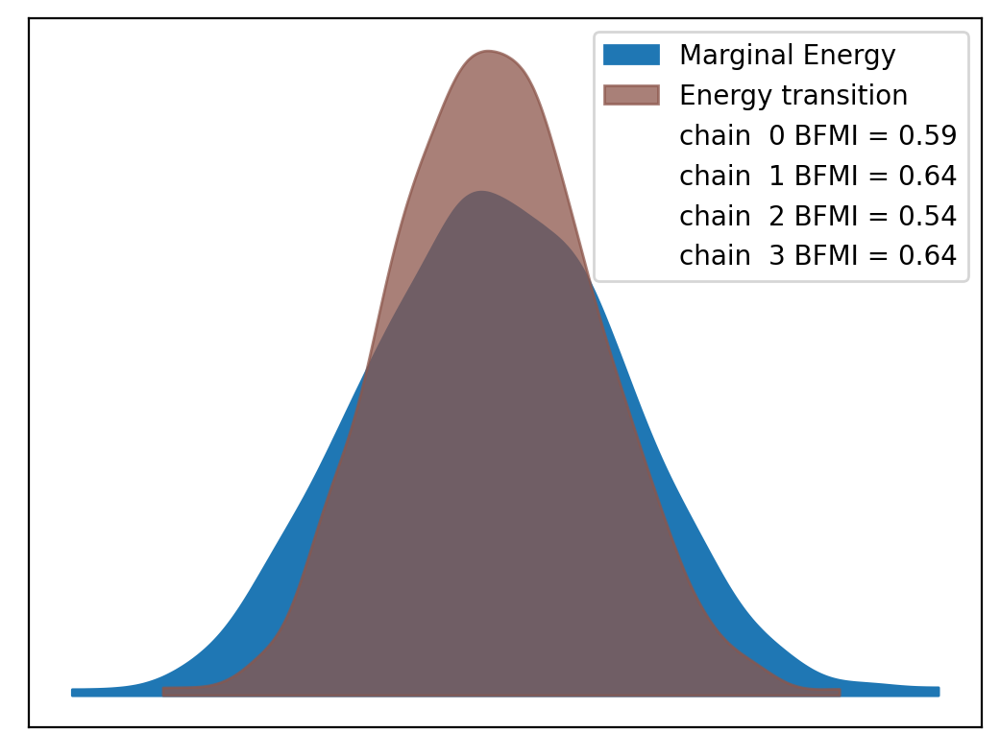
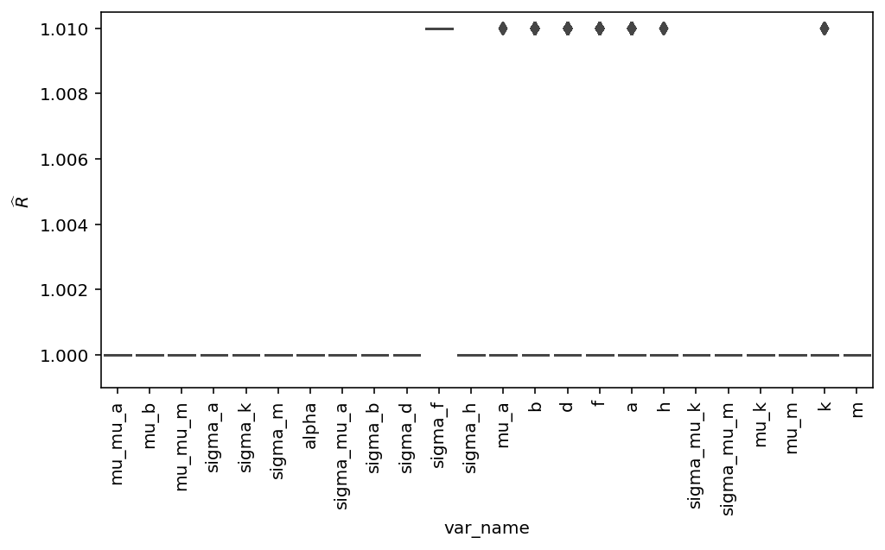

# Model Report


```python
import logging
from itertools import product
from time import time
from typing import Optional

import arviz as az
import matplotlib.pyplot as plt
import numpy as np
import seaborn as sns
from matplotlib.lines import Line2D
from xarray import Dataset

from speclet import model_configuration
from speclet.analysis.arviz_analysis import describe_mcmc, summarize_rhat
from speclet.bayesian_models import get_bayesian_model
from speclet.io import project_root
from speclet.loggers import set_console_handler_level
from speclet.managers.cache_manager import (
    get_cached_posterior,
    get_posterior_cache_name,
)
from speclet.project_configuration import get_bayesian_modeling_constants
from speclet.project_enums import ModelFitMethod
```

    WARNING (aesara.tensor.blas): Using NumPy C-API based implementation for BLAS functions.


```python
notebook_tic = time()
set_console_handler_level(logging.WARNING)
%config InlineBackend.figure_format = "retina"
HDI_PROB = get_bayesian_modeling_constants().hdi_prob
```

Parameters for papermill:

- `MODEL_NAME`: name of the model
- `FIT_METHOD`: method used to fit the model; either "ADVI" or "MCMC"
- `CONFIG_PATH`: path to configuration file
- `ROOT_CACHE_DIR`: path to the root caching directory

## Setup

### Papermill parameters


```python
CONFIG_PATH = ""
MODEL_NAME = ""
FIT_METHOD_STR = ""
ROOT_CACHE_DIR = ""
```


```python
# Parameters
MODEL_NAME = "hnb-single-lineage-prostate-009"
FIT_METHOD_STR = "PYMC_NUMPYRO"
CONFIG_PATH = "models/model-configs.yaml"
ROOT_CACHE_DIR = "models"
```


```python
FIT_METHOD = ModelFitMethod(FIT_METHOD_STR)
model_config = model_configuration.get_configuration_for_model(
    config_path=project_root() / CONFIG_PATH, name=MODEL_NAME
)
model = get_bayesian_model(model_config.model)(**model_config.model_kwargs)
trace = get_cached_posterior(
    get_posterior_cache_name(MODEL_NAME, FIT_METHOD),
    cache_dir=project_root() / ROOT_CACHE_DIR,
)
```

## Fit diagnostics


```python
if FIT_METHOD in {ModelFitMethod.PYMC_NUMPYRO, ModelFitMethod.PYMC_MCMC}:
    print("R-HAT")
    rhat_summ = summarize_rhat(trace)
    print(rhat_summ)
    print("=" * 60)
    describe_mcmc(trace)
```

    R-HAT


    /home/jc604/.conda/envs/speclet_smk/lib/python3.10/site-packages/arviz/stats/diagnostics.py:586: RuntimeWarning: invalid value encountered in double_scalars
      (between_chain_variance / within_chain_variance + num_samples - 1) / (num_samples)


                           count      mean       std       min       25%  \
    var_name
    a                    71062.0  1.000876  0.000953  0.999194  1.000178
    alpha                    1.0  1.000431       NaN  1.000431  1.000431
    b                    18119.0  1.001246  0.001208  0.999183  1.000350
    cells_chol_cov           3.0  1.001217  0.001040  1.000449  1.000625
    cells_chol_cov_corr      3.0  1.000911  0.000595  1.000224  1.000739
    cells_chol_cov_stds      2.0  1.001130  0.000963  1.000449  1.000789
    d                    18119.0  1.001382  0.001284  0.999143  1.000433
    delta_a              71062.0  1.000645  0.000766  0.999165  1.000099
    delta_cells             10.0  1.001724  0.001258  0.999939  1.000850
    delta_genes          90595.0  1.001208  0.001181  0.999085  1.000351
    delta_k                115.0  1.001830  0.001446  0.999573  1.000632
    delta_m                115.0  1.001445  0.001066  0.999712  1.000652
    f                    18119.0  1.001316  0.001232  0.999194  1.000410
    genes_chol_cov          15.0  1.010272  0.010963  1.000433  1.002299
    genes_chol_cov_corr     24.0  1.006836  0.005014  1.000106  1.001792
    genes_chol_cov_stds      5.0  1.002882  0.001874  1.001179  1.001441
    h                    18119.0  1.000697  0.000848  0.999192  1.000081
    k                      115.0  1.003532  0.001318  1.000231  1.002720
    m                      115.0  1.000945  0.000917  0.999498  1.000224
    mu_a                 18119.0  1.000918  0.000794  0.999210  1.000348
    mu_b                     1.0  1.000658       NaN  1.000658  1.000658
    mu_k                     5.0  1.003901  0.001202  1.002055  1.003491
    mu_m                     5.0  1.002097  0.000845  1.001283  1.001480
    mu_mu_a                  1.0  1.004079       NaN  1.004079  1.004079
    mu_mu_m                  1.0  1.000135       NaN  1.000135  1.000135
    sigma_a                  1.0  1.001151       NaN  1.001151  1.001151
    sigma_b                  1.0  1.001441       NaN  1.001441  1.001441
    sigma_d                  1.0  1.002845       NaN  1.002845  1.002845
    sigma_f                  1.0  1.005889       NaN  1.005889  1.005889
    sigma_h                  1.0  1.001179       NaN  1.001179  1.001179
    sigma_k                  1.0  1.003778       NaN  1.003778  1.003778
    sigma_m                  1.0  1.004125       NaN  1.004125  1.004125
    sigma_mu_a               1.0  1.003056       NaN  1.003056  1.003056
    sigma_mu_k               1.0  1.000449       NaN  1.000449  1.000449
    sigma_mu_m               1.0  1.001811       NaN  1.001811  1.001811

                              50%       75%       max
    var_name
    a                    1.000681  1.001373  1.008229
    alpha                1.000431  1.000431  1.000431
    b                    1.001027  1.001897  1.009086
    cells_chol_cov       1.000800  1.001600  1.002401
    cells_chol_cov_corr  1.001255  1.001255  1.001255
    cells_chol_cov_stds  1.001130  1.001470  1.001811
    d                    1.001147  1.002072  1.010556
    delta_a              1.000501  1.001035  1.006661
    delta_cells          1.001400  1.002640  1.003570
    delta_genes          1.000965  1.001807  1.010490
    delta_k              1.001569  1.002777  1.006638
    delta_m              1.001378  1.002031  1.004695
    f                    1.001091  1.001975  1.011918
    genes_chol_cov       1.006333  1.013279  1.035345
    genes_chol_cov_corr  1.007092  1.011545  1.014685
    genes_chol_cov_stds  1.002845  1.003056  1.005889
    h                    1.000527  1.001131  1.008331
    k                    1.003445  1.004510  1.006557
    m                    1.000675  1.001521  1.004259
    mu_a                 1.000794  1.001350  1.007392
    mu_b                 1.000658  1.000658  1.000658
    mu_k                 1.004073  1.004917  1.004969
    mu_m                 1.001742  1.002779  1.003201
    mu_mu_a              1.004079  1.004079  1.004079
    mu_mu_m              1.000135  1.000135  1.000135
    sigma_a              1.001151  1.001151  1.001151
    sigma_b              1.001441  1.001441  1.001441
    sigma_d              1.002845  1.002845  1.002845
    sigma_f              1.005889  1.005889  1.005889
    sigma_h              1.001179  1.001179  1.001179
    sigma_k              1.003778  1.003778  1.003778
    sigma_m              1.004125  1.004125  1.004125
    sigma_mu_a           1.003056  1.003056  1.003056
    sigma_mu_k           1.000449  1.000449  1.000449
    sigma_mu_m           1.001811  1.001811  1.001811
    ============================================================
    date created: 2022-08-08 13:59
    sampled 4 chains with (unknown) tuning steps and 1,000 draws
    num. divergences: 0, 0, 0, 0
    percent divergences: 0.0, 0.0, 0.0, 0.0
    BFMI: 0.591, 0.639, 0.536, 0.64
    avg. step size: 0.009, 0.01, 0.008, 0.009
    avg. accept prob.: 0.975, 0.974, 0.98, 0.975
    avg. tree depth: 9.0, 9.0, 9.0, 9.0





## Model predictions


```python
np.random.seed(333)

pp: Dataset = trace.posterior_predictive["ct_final"]
n_chains, n_draws, n_data = pp.shape
n_rand = 10
draws_idx = np.random.choice(np.arange(n_draws), n_rand, replace=False)

fig, axes = plt.subplots(
    nrows=2, ncols=1, figsize=(8, 10), squeeze=True, sharex=False, sharey=False
)

alpha = 0.2

for c, d in product(range(n_chains), draws_idx):
    draw = pp[c, d, :].values.flatten()
    sns.kdeplot(x=draw, ax=axes[0], color="tab:blue", alpha=alpha)
    sns.kdeplot(x=np.log10(draw + 1), ax=axes[1], color="tab:blue", alpha=alpha)

avg_ppc = pp.median(axis=(0, 1))
sns.kdeplot(x=avg_ppc, ax=axes[0], color="tab:orange", alpha=0.8)
sns.kdeplot(x=np.log10(avg_ppc + 1), ax=axes[1], color="tab:orange", alpha=0.8)

obs_data = trace.observed_data["ct_final"].values.flatten()
sns.kdeplot(x=obs_data, ax=axes[0], color="black", alpha=0.8)
sns.kdeplot(x=np.log10(obs_data + 1), ax=axes[1], color="black", alpha=0.8)

axes[0].set_xlabel("ct_final")
axes[1].set_xlabel(r"$\log_{10}($ ct_final $)$")

leg_handles = [
    Line2D([0], [0], color="tab:blue", label="draw"),
    Line2D([0], [0], color="tab:orange", label="post. pred. median"),
    Line2D([0], [0], color="black", label="observed"),
]
for ax in axes:
    ax.legend(handles=leg_handles, loc="best")

plt.tight_layout()
plt.show()
```





```python
has_log_likelihood = "log_likelihood" in trace
```


```python
if has_log_likelihood:
    psis_loo = az.loo(trace, pointwise=True)
    psis_loo
```


```python
if has_log_likelihood:
    az.plot_khat(psis_loo)
    plt.tight_layout()
    plt.show()
```

---


```python
notebook_toc = time()
print(f"execution time: {(notebook_toc - notebook_tic) / 60:.2f} minutes")
```

    execution time: 18.48 minutes


```python
%load_ext watermark
%watermark -d -u -v -iv -b -h -m
```

    Last updated: 2022-08-08

    Python implementation: CPython
    Python version       : 3.10.5
    IPython version      : 8.4.0

    Compiler    : GCC 10.3.0
    OS          : Linux
    Release     : 3.10.0-1160.66.1.el7.x86_64
    Machine     : x86_64
    Processor   : x86_64
    CPU cores   : 32
    Architecture: 64bit

    Hostname: compute-a-16-112.o2.rc.hms.harvard.edu

    Git branch: varying-chromosome

    seaborn   : 0.11.2
    arviz     : 0.12.1
    logging   : 0.5.1.2
    numpy     : 1.23.1
    speclet   : 0.0.9000
    matplotlib: 3.5.2
