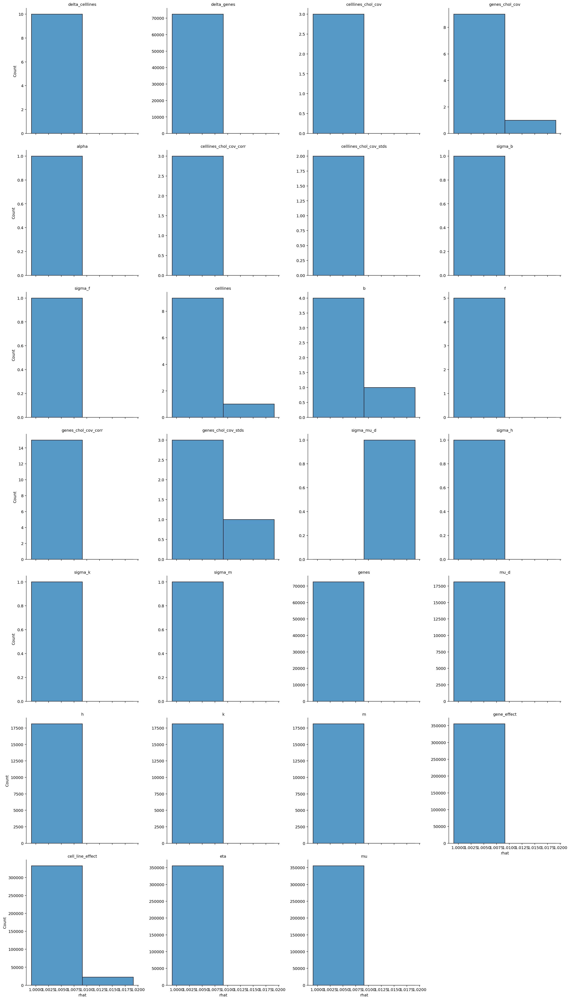
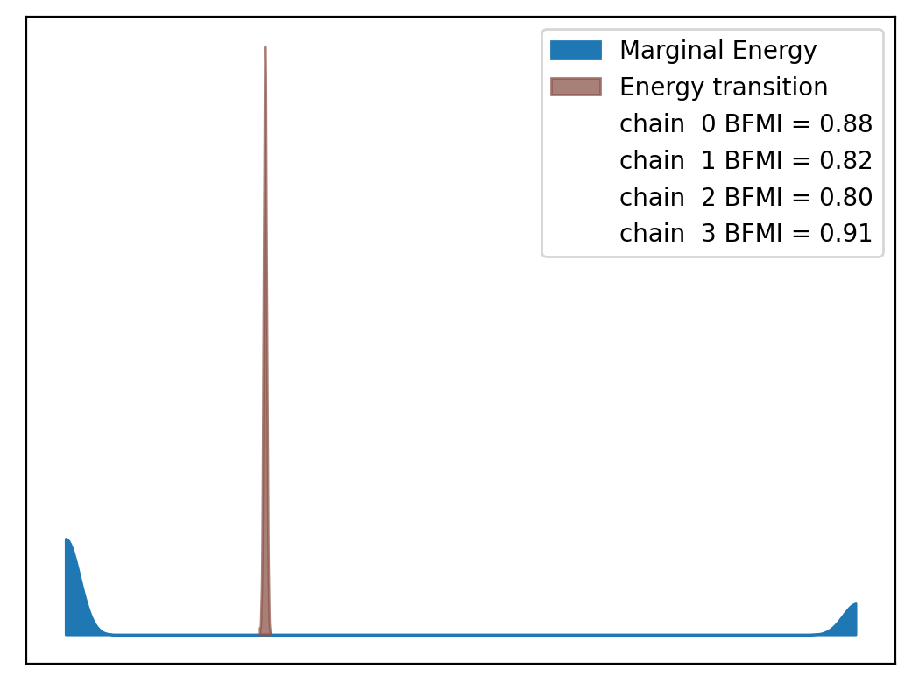
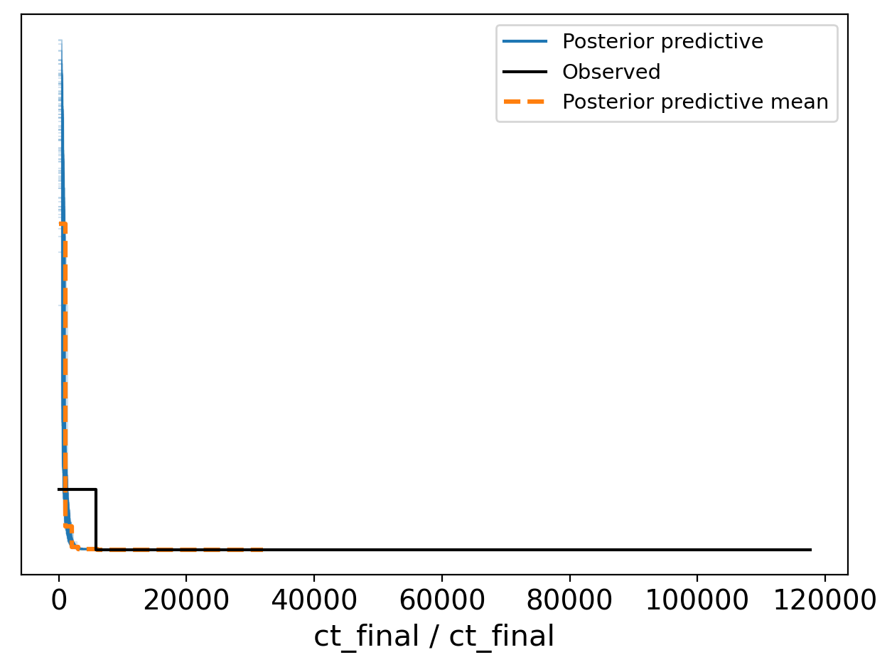
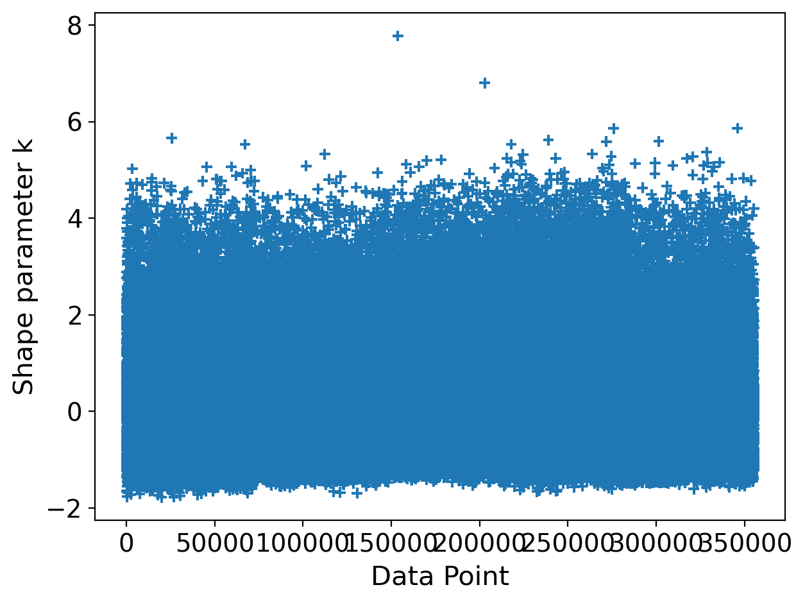

# Model Report


```python
import logging
from time import time
from typing import Optional

import arviz as az
import matplotlib.pyplot as plt

from speclet import model_configuration
from speclet.analysis.arviz_analysis import describe_mcmc, summarize_rhat
from speclet.bayesian_models import get_bayesian_model
from speclet.io import project_root
from speclet.loggers import set_console_handler_level
from speclet.managers.cache_manager import (
    get_cached_posterior,
    get_posterior_cache_name,
)
from speclet.project_configuration import get_bayesian_modeling_constants
from speclet.project_enums import ModelFitMethod
```

    WARNING (aesara.tensor.blas): Using NumPy C-API based implementation for BLAS functions.


```python
notebook_tic = time()
set_console_handler_level(logging.WARNING)
%config InlineBackend.figure_format = "retina"
HDI_PROB = get_bayesian_modeling_constants().hdi_prob
```

Parameters for papermill:

- `MODEL_NAME`: name of the model
- `FIT_METHOD`: method used to fit the model; either "ADVI" or "MCMC"
- `CONFIG_PATH`: path to configuration file
- `ROOT_CACHE_DIR`: path to the root caching directory

## Setup

### Papermill parameters


```python
CONFIG_PATH = ""
MODEL_NAME = ""
FIT_METHOD_STR = ""
ROOT_CACHE_DIR = ""
```


```python
# Parameters
MODEL_NAME = "hnb-single-lineage-prostate"
FIT_METHOD_STR = "PYMC_NUMPYRO"
CONFIG_PATH = "models/model-configs.yaml"
ROOT_CACHE_DIR = "models"
```


```python
FIT_METHOD = ModelFitMethod(FIT_METHOD_STR)
model_config = model_configuration.get_configuration_for_model(
    config_path=project_root() / CONFIG_PATH, name=MODEL_NAME
)
model = get_bayesian_model(model_config.model)(**model_config.model_kwargs)
trace = get_cached_posterior(
    get_posterior_cache_name(MODEL_NAME, FIT_METHOD),
    cache_dir=project_root() / ROOT_CACHE_DIR,
)
```

## Fit diagnostics


```python
if FIT_METHOD is ModelFitMethod.PYMC_NUMPYRO or FIT_METHOD is ModelFitMethod.PYMC_MCMC:
    print("R-HAT")
    rhat_summ = summarize_rhat(trace)
    print(rhat_summ)
    print("=" * 60)
    describe_mcmc(trace)
```

    R-HAT


    /home/jc604/.conda/envs/speclet_smk/lib/python3.10/site-packages/arviz/stats/diagnostics.py:586: RuntimeWarning: invalid value encountered in double_scalars
      (between_chain_variance / within_chain_variance + num_samples - 1) / (num_samples)





                                count      mean       std       min       25%  \
    var_name
    alpha                         1.0  1.570502       NaN  1.570502  1.570502
    b                             5.0  3.180170  0.128538  2.973945  3.137678
    cell_line_effect         355310.0  3.146699  0.134089  2.596185  3.066556
    celllines                    10.0  2.300329  0.943666  1.019821  1.528760
    celllines_chol_cov            3.0  1.808008  0.552692  1.403251  1.493162
    celllines_chol_cov_corr       3.0  1.393304  0.337029  1.004137  1.296012
    celllines_chol_cov_stds       2.0  1.756325  0.963611  1.074949  1.415637
    d                         71062.0  2.086415  0.204563  1.521951  1.952083
    delta_celllines              10.0  1.961427  0.655561  1.113916  1.527776
    delta_d                   71062.0  1.320554  0.206403  1.057946  1.101571
    delta_genes              163071.0  1.322540  0.197479  1.059817  1.120645
    eta                      355310.0  1.469235  0.150995  1.035666  1.403007
    f                             5.0  1.420488  0.227631  1.019821  1.456023
    gene_effect              355310.0  2.075798  0.190288  1.493946  1.942148
    genes                    163071.0  1.605477  0.534120  1.046232  1.319895
    genes_chol_cov               45.0  1.693474  0.347190  1.176996  1.551234
    genes_chol_cov_corr          80.0  1.428098  0.397536  1.000862  1.163250
    genes_chol_cov_stds           9.0  1.698477  0.189352  1.536064  1.560796
    h                         18119.0  1.362962  0.188643  1.059145  1.152597
    k                         18119.0  1.497214  0.118639  1.063498  1.528693
    m                         18119.0  1.344710  0.157367  1.046232  1.216048
    mu                       355310.0  1.469245  0.151008  1.036101  1.403013
    mu_d                      18119.0  3.034826  0.192141  2.401678  2.853115
    mu_f                          1.0  1.622173       NaN  1.622173  1.622173
    mu_k                          1.0  1.551966       NaN  1.551966  1.551966
    mu_mu_d                       1.0  2.954362       NaN  2.954362  2.954362
    sigma_b                       1.0  2.437701       NaN  2.437701  2.437701
    sigma_d                       1.0  1.536830       NaN  1.536830  1.536830
    sigma_f                       1.0  1.074949       NaN  1.074949  1.074949
    sigma_h                       1.0  1.536064       NaN  1.536064  1.536064
    sigma_k                       1.0  1.560796       NaN  1.560796  1.560796
    sigma_m                       1.0  2.093208       NaN  2.093208  2.093208
    sigma_mu_d                    1.0  1.564658       NaN  1.564658  1.564658
    sigma_w                       5.0  1.706314  0.129878  1.537104  1.636042
    w                         90595.0  1.441915  0.167853  1.061190  1.317896

                                  50%       75%       max
    var_name
    alpha                    1.570502  1.570502  1.570502
    b                        3.237435  3.267306  3.284484
    cell_line_effect         3.173553  3.266162  3.284637
    celllines                2.271141  3.212496  3.284484
    celllines_chol_cov       1.583074  2.010387  2.437701
    celllines_chol_cov_corr  1.587888  1.587888  1.587888
    celllines_chol_cov_stds  1.756325  2.097013  2.437701
    d                        2.118948  2.224104  2.704973
    delta_celllines          1.778213  2.514657  2.893243
    delta_d                  1.299382  1.528282  1.593255
    delta_genes              1.280681  1.528355  2.108712
    eta                      1.538057  1.576867  1.627887
    f                        1.528390  1.529871  1.568336
    gene_effect              2.115422  2.213726  2.702285
    genes                    1.528885  1.581281  3.552855
    genes_chol_cov           1.612247  1.748540  2.897412
    genes_chol_cov_corr      1.341276  1.544139  2.970989
    genes_chol_cov_stds      1.636042  1.824647  2.093208
    h                        1.526834  1.529151  1.594430
    k                        1.537514  1.555355  1.629098
    m                        1.334790  1.489065  1.720025
    mu                       1.538072  1.576887  1.627887
    mu_d                     3.037480  3.170011  3.552855
    mu_f                     1.622173  1.622173  1.622173
    mu_k                     1.551966  1.551966  1.551966
    mu_mu_d                  2.954362  2.954362  2.954362
    sigma_b                  2.437701  2.437701  2.437701
    sigma_d                  1.536830  1.536830  1.536830
    sigma_f                  1.074949  1.074949  1.074949
    sigma_h                  1.536064  1.536064  1.536064
    sigma_k                  1.560796  1.560796  1.560796
    sigma_m                  2.093208  2.093208  2.093208
    sigma_mu_d               1.564658  1.564658  1.564658
    sigma_w                  1.687637  1.824647  1.846140
    w                        1.507288  1.576788  2.019255
    ============================================================
    sampled 4 chains with (unknown) tuning steps and 1,000 draws
    num. divergences: 0, 0, 0, 0
    percent divergences: 0.0, 0.0, 0.0, 0.0
    BFMI: 0.88, 0.818, 0.803, 0.909
    avg. step size: 0.0, 0.005, 0.004, 0.002





## Model predictions


```python
az.plot_ppc(trace, num_pp_samples=100, random_seed=123)
plt.tight_layout()
plt.show()
```





```python
psis_loo = az.loo(trace, pointwise=True)
psis_loo
```

    /home/jc604/.conda/envs/speclet_smk/lib/python3.10/site-packages/arviz/stats/stats.py:1048: RuntimeWarning: overflow encountered in exp
      weights = 1 / np.exp(len_scale - len_scale[:, None]).sum(axis=1)
    /home/jc604/.conda/envs/speclet_smk/lib/python3.10/site-packages/numpy/core/_methods.py:48: RuntimeWarning: overflow encountered in reduce
      return umr_sum(a, axis, dtype, out, keepdims, initial, where)
    /home/jc604/.conda/envs/speclet_smk/lib/python3.10/site-packages/arviz/stats/stats.py:812: UserWarning: Estimated shape parameter of Pareto distribution is greater than 0.7 for one or more samples. You should consider using a more robust model, this is because importance sampling is less likely to work well if the marginal posterior and LOO posterior are very different. This is more likely to happen with a non-robust model and highly influential observations.
      warnings.warn(


    Computed from 4000 posterior samples and 355310 observations log-likelihood matrix.

             Estimate       SE
    elpd_loo -2327750.08   705.42
    p_loo    172218.79        -

    There has been a warning during the calculation. Please check the results.
    ------

    Pareto k diagnostic values:
                              Count   Pct.
    (-Inf, 0.5]   (good)     179515   50.5%
     (0.5, 0.7]   (ok)        45272   12.7%
       (0.7, 1]   (bad)       39564   11.1%
       (1, Inf)   (very bad)  90959   25.6%


```python
az.plot_khat(psis_loo)
plt.tight_layout()
plt.show()
```





---


```python
notebook_toc = time()
print(f"execution time: {(notebook_toc - notebook_tic) / 60:.2f} minutes")
```

    execution time: 297.77 minutes


```python
%load_ext watermark
%watermark -d -u -v -iv -b -h -m
```

    Last updated: 2022-07-11

    Python implementation: CPython
    Python version       : 3.10.5
    IPython version      : 8.4.0

    Compiler    : GCC 10.3.0
    OS          : Linux
    Release     : 3.10.0-1160.45.1.el7.x86_64
    Machine     : x86_64
    Processor   : x86_64
    CPU cores   : 32
    Architecture: 64bit

    Hostname: compute-a-16-170.o2.rc.hms.harvard.edu

    Git branch: simplify

    logging   : 0.5.1.2
    arviz     : 0.12.1
    speclet   : 0.0.9000
    matplotlib: 3.5.2
