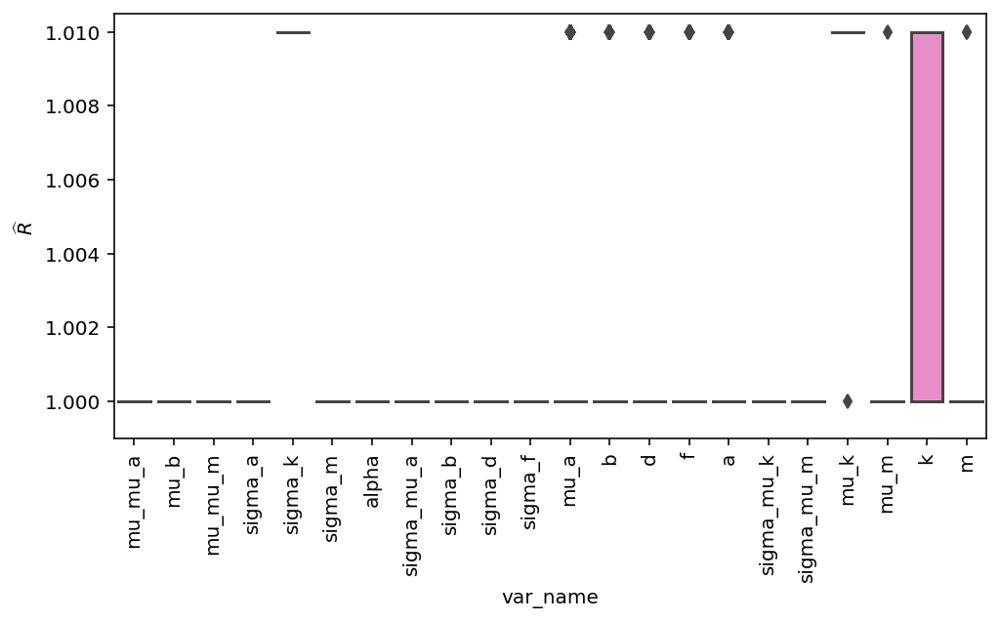

# Model Report


```python
import logging
from time import time
from typing import Optional

import arviz as az
import matplotlib.pyplot as plt

from speclet import model_configuration
from speclet.analysis.arviz_analysis import describe_mcmc, summarize_rhat
from speclet.bayesian_models import get_bayesian_model
from speclet.io import project_root
from speclet.loggers import set_console_handler_level
from speclet.managers.cache_manager import (
    get_cached_posterior,
    get_posterior_cache_name,
)
from speclet.project_configuration import get_bayesian_modeling_constants
from speclet.project_enums import ModelFitMethod
```

    WARNING (aesara.tensor.blas): Using NumPy C-API based implementation for BLAS functions.


```python
notebook_tic = time()
set_console_handler_level(logging.WARNING)
%config InlineBackend.figure_format = "retina"
HDI_PROB = get_bayesian_modeling_constants().hdi_prob
```

Parameters for papermill:

- `MODEL_NAME`: name of the model
- `FIT_METHOD`: method used to fit the model; either "ADVI" or "MCMC"
- `CONFIG_PATH`: path to configuration file
- `ROOT_CACHE_DIR`: path to the root caching directory

## Setup

### Papermill parameters


```python
CONFIG_PATH = ""
MODEL_NAME = ""
FIT_METHOD_STR = ""
ROOT_CACHE_DIR = ""
```


```python
# Parameters
MODEL_NAME = "hnb-single-lineage-prostate"
FIT_METHOD_STR = "PYMC_NUMPYRO"
CONFIG_PATH = "models/model-configs.yaml"
ROOT_CACHE_DIR = "models"
```


```python
FIT_METHOD = ModelFitMethod(FIT_METHOD_STR)
model_config = model_configuration.get_configuration_for_model(
    config_path=project_root() / CONFIG_PATH, name=MODEL_NAME
)
model = get_bayesian_model(model_config.model)(**model_config.model_kwargs)
trace = get_cached_posterior(
    get_posterior_cache_name(MODEL_NAME, FIT_METHOD),
    cache_dir=project_root() / ROOT_CACHE_DIR,
)
```

## Fit diagnostics


```python
if FIT_METHOD is ModelFitMethod.PYMC_NUMPYRO or FIT_METHOD is ModelFitMethod.PYMC_MCMC:
    print("R-HAT")
    rhat_summ = summarize_rhat(trace)
    print(rhat_summ)
    print("=" * 60)
    describe_mcmc(trace)
```

    R-HAT


    /home/jc604/.conda/envs/speclet_smk/lib/python3.10/site-packages/arviz/stats/diagnostics.py:586: RuntimeWarning: invalid value encountered in double_scalars
      (between_chain_variance / within_chain_variance + num_samples - 1) / (num_samples)


                                count      mean       std       min       25%  \
    var_name
    alpha                         1.0  1.001247       NaN  1.001247  1.001247
    b                             5.0  1.010682  0.000682  1.009700  1.010484
    cell_line_effect         355310.0  1.009757  0.001655  1.001282  1.009638
    celllines                    10.0  1.005699  0.005276  1.000317  1.000662
    celllines_chol_cov            3.0  1.003638  0.002193  1.001543  1.002498
    celllines_chol_cov_corr       3.0  1.002880  0.002156  1.000390  1.002257
    celllines_chol_cov_stds       2.0  1.005216  0.000992  1.004515  1.004865
    d                         71062.0  1.001485  0.001329  0.999109  1.000510
    delta_celllines              10.0  1.002789  0.001447  1.000865  1.001332
    delta_d                   71062.0  1.001582  0.001390  0.999158  1.000556
    delta_genes               72476.0  1.002349  0.003749  0.999083  1.000762
    eta                      355310.0  1.001356  0.001274  0.999113  1.000418
    f                             5.0  1.000717  0.000347  1.000317  1.000630
    gene_effect              355310.0  1.001352  0.001272  0.999130  1.000416
    genes                     72476.0  1.014306  0.018507  0.999163  1.000986
    genes_chol_cov               10.0  1.202901  0.145514  1.048104  1.088374
    genes_chol_cov_corr          15.0  1.136013  0.146386  0.999828  1.009846
    genes_chol_cov_stds           4.0  1.132488  0.211097  1.000853  1.001682
    h                         18119.0  1.001238  0.001205  0.999166  1.000354
    k                         18119.0  1.044946  0.007371  1.018773  1.040316
    m                         18119.0  1.001199  0.001268  0.999163  1.000337
    mu                       355310.0  1.001303  0.001245  0.999104  1.000386
    mu_d                      18119.0  1.009840  0.003353  1.000619  1.007534
    sigma_b                       1.0  1.005917       NaN  1.005917  1.005917
    sigma_d                       1.0  1.000422       NaN  1.000422  1.000422
    sigma_f                       1.0  1.004515       NaN  1.004515  1.004515
    sigma_h                       1.0  1.000853       NaN  1.000853  1.000853
    sigma_k                       1.0  1.443785       NaN  1.443785  1.443785
    sigma_m                       1.0  1.001959       NaN  1.001959  1.001959
    sigma_mu_d                    1.0  1.083354       NaN  1.083354  1.083354

                                  50%       75%       max
    var_name
    alpha                    1.001247  1.001247  1.001247
    b                        1.010586  1.011181  1.011456
    cell_line_effect         1.010094  1.011133  1.011506
    celllines                1.005487  1.010561  1.011456
    celllines_chol_cov       1.003453  1.004685  1.005917
    celllines_chol_cov_corr  1.004125  1.004125  1.004125
    celllines_chol_cov_stds  1.005216  1.005567  1.005917
    d                        1.001243  1.002187  1.016507
    delta_celllines          1.003006  1.003903  1.004649
    delta_d                  1.001331  1.002330  1.012701
    delta_genes              1.001610  1.002790  1.130139
    eta                      1.001121  1.002038  1.027940
    f                        1.000640  1.000726  1.001273
    gene_effect              1.001119  1.002032  1.028090
    genes                    1.004558  1.024169  1.239996
    genes_chol_cov           1.137019  1.318887  1.429687
    genes_chol_cov_corr      1.123200  1.203881  1.431926
    genes_chol_cov_stds      1.042657  1.173462  1.443785
    h                        1.001009  1.001875  1.009227
    k                        1.044737  1.049324  1.239996
    m                        1.000968  1.001787  1.059263
    mu                       1.001075  1.001969  1.027940
    mu_d                     1.009566  1.011812  1.071336
    sigma_b                  1.005917  1.005917  1.005917
    sigma_d                  1.000422  1.000422  1.000422
    sigma_f                  1.004515  1.004515  1.004515
    sigma_h                  1.000853  1.000853  1.000853
    sigma_k                  1.443785  1.443785  1.443785
    sigma_m                  1.001959  1.001959  1.001959
    sigma_mu_d               1.083354  1.083354  1.083354
    ============================================================
    sampled 4 chains with (unknown) tuning steps and 1,000 draws
    num. divergences: 0, 0, 0, 0
    percent divergences: 0.0, 0.0, 0.0, 0.0
    BFMI: 0.844, 0.89, 0.892, 0.899
    avg. step size: 0.01, 0.01, 0.011, 0.008


## Model predictions


```python
az.plot_ppc(trace, num_pp_samples=100, random_seed=123)
plt.tight_layout()
plt.show()
```





```python
psis_loo = az.loo(trace, pointwise=True)
psis_loo
```

    /home/jc604/.conda/envs/speclet_smk/lib/python3.10/site-packages/arviz/stats/stats.py:812: UserWarning: Estimated shape parameter of Pareto distribution is greater than 0.7 for one or more samples. You should consider using a more robust model, this is because importance sampling is less likely to work well if the marginal posterior and LOO posterior are very different. This is more likely to happen with a non-robust model and highly influential observations.
      warnings.warn(


    Computed from 4000 posterior samples and 355310 observations log-likelihood matrix.

             Estimate       SE
    elpd_loo -2201395.64   649.11
    p_loo    71257.93        -

    There has been a warning during the calculation. Please check the results.
    ------

    Pareto k diagnostic values:
                              Count   Pct.
    (-Inf, 0.5]   (good)     327375   92.1%
     (0.5, 0.7]   (ok)        23865    6.7%
       (0.7, 1]   (bad)        3731    1.1%
       (1, Inf)   (very bad)    339    0.1%


```python
az.plot_khat(psis_loo)
plt.tight_layout()
plt.show()
```


---


```python
notebook_toc = time()
print(f"execution time: {(notebook_toc - notebook_tic) / 60:.2f} minutes")
```

    execution time: 128.08 minutes


```python
%load_ext watermark
%watermark -d -u -v -iv -b -h -m
```

    Last updated: 2022-07-13

    Python implementation: CPython
    Python version       : 3.10.5
    IPython version      : 8.4.0

    Compiler    : GCC 10.3.0
    OS          : Linux
    Release     : 3.10.0-1160.66.1.el7.x86_64
    Machine     : x86_64
    Processor   : x86_64
    CPU cores   : 32
    Architecture: 64bit

    Hostname: compute-h-17-50.o2.rc.hms.harvard.edu

    Git branch: simplify

    speclet   : 0.0.9000
    arviz     : 0.12.1
    matplotlib: 3.5.2
    logging   : 0.5.1.2
