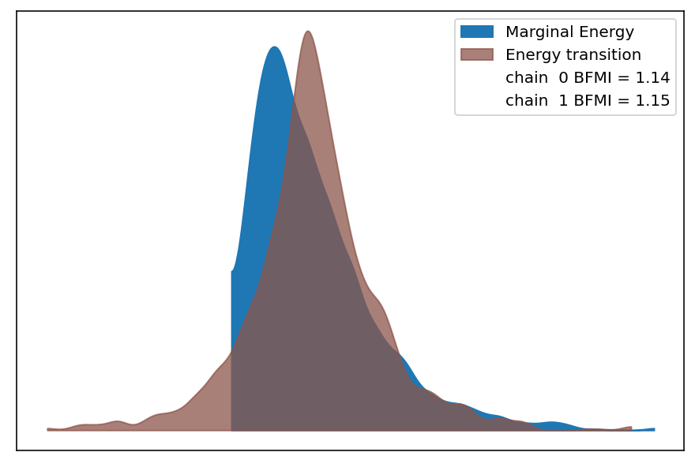
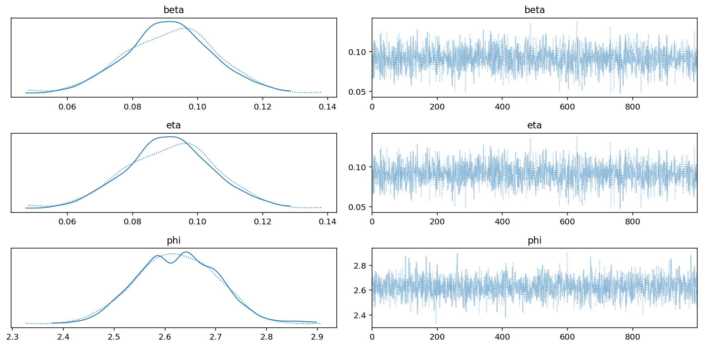
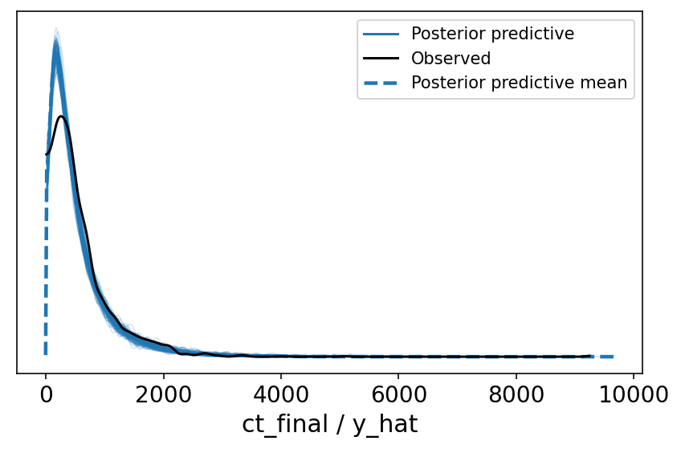
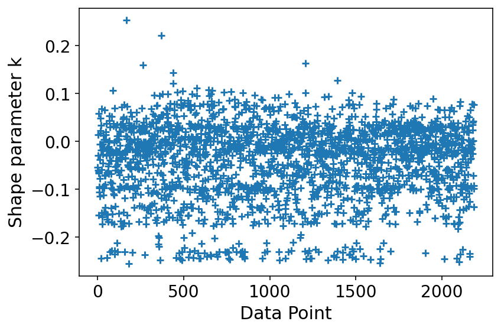

# Model Report

```python
import logging
from time import time
from typing import Optional

import arviz as az
import matplotlib.pyplot as plt

from speclet import model_configuration
from speclet.analysis.arviz_analysis import describe_mcmc
from speclet.bayesian_models import get_bayesian_model
from speclet.io import project_root
from speclet.loggers import set_console_handler_level
from speclet.managers.cache_manager import (
    get_cached_posterior,
    get_posterior_cache_name,
)
from speclet.project_configuration import get_bayesian_modeling_constants
from speclet.project_enums import ModelFitMethod
```

```python
notebook_tic = time()
set_console_handler_level(logging.WARNING)
%config InlineBackend.figure_format = "retina"
HDI_PROB = get_bayesian_modeling_constants().hdi_prob
```

Parameters for papermill:

- `MODEL_NAME`: name of the model
- `FIT_METHOD`: method used to fit the model; either "ADVI" or "MCMC"
- `CONFIG_PATH`: path to configuration file
- `ROOT_CACHE_DIR`: path to the root caching directory

## Setup

### Papermill parameters

```python
CONFIG_PATH = ""
MODEL_NAME = ""
FIT_METHOD_STR = ""
ROOT_CACHE_DIR = ""
```

```python
# Parameters
MODEL_NAME = "simple-nb"
FIT_METHOD_STR = "STAN_MCMC"
CONFIG_PATH = "models/model-configs.yaml"
ROOT_CACHE_DIR = "models"
```

```python
FIT_METHOD = ModelFitMethod(FIT_METHOD_STR)
model_config = model_configuration.get_configuration_for_model(
    config_path=project_root() / CONFIG_PATH, name=MODEL_NAME
)
model = get_bayesian_model(model_config.model)()
trace = get_cached_posterior(
    get_posterior_cache_name(MODEL_NAME, FIT_METHOD),
    cache_dir=project_root() / ROOT_CACHE_DIR,
)
```

## Fit diagnostics

```python
if "MCMC" in FIT_METHOD.value:
    print("R-HAT")
    print(az.rhat(trace))
    print("=" * 60)
    describe_mcmc(trace)
```

    R-HAT
    <xarray.Dataset>
    Dimensions:         (mu_dim_0: 2188, log_lik_dim_0: 2188, y_hat_dim_0: 2188)
    Coordinates:
      * mu_dim_0        (mu_dim_0) int64 0 1 2 3 4 5 ... 2183 2184 2185 2186 2187
      * log_lik_dim_0   (log_lik_dim_0) int64 0 1 2 3 4 ... 2183 2184 2185 2186 2187
      * y_hat_dim_0     (y_hat_dim_0) int64 0 1 2 3 4 5 ... 2183 2184 2185 2186 2187
    Data variables:
        beta            float64 1.001
        reciprocal_phi  float64 1.003
        eta             float64 1.001
        mu              (mu_dim_0) float64 1.001 1.001 1.001 ... 1.001 1.001 1.001
        phi             float64 1.003
        log_lik         (log_lik_dim_0) float64 1.002 1.0 1.003 ... 1.002 1.001
        y_hat           (y_hat_dim_0) float64 0.9992 0.9994 1.001 ... 1.001 0.9993
    ============================================================
    sampled 2 chains with (unknown) tuning steps and 1,000 draws
    num. divergences: 0, 0
    percent divergences: 0.0, 0.0
    BFMI: 1.157, 1.22
    avg. step size: 0.843, 0.868



## Model parameters

```python
var_regex = model.vars_regex(FIT_METHOD)
var_regex += ["~log_lik", "~y_hat"]
```

```python
# def _as_int(x: float) -> str:
#     return str(int(x))


# az.summary(
#     trace, var_names=var_regex, filter_vars="regex", hdi_prob=HDI_PROB
# ).style.format(formatter={"ess_bulk": _as_int, "ess_tail": _as_int}, precision=2)
```

```python
az.plot_trace(trace, var_names=var_regex, filter_vars="regex")
plt.tight_layout()
plt.show()
```

    /var/folders/r4/qpcdgl_14hbd412snp1jnv300000gn/T/ipykernel_23500/2160019948.py:2: UserWarning: This figure was using constrained_layout, but that is incompatible with subplots_adjust and/or tight_layout; disabling constrained_layout.
      plt.tight_layout()



```python
# az.plot_forest(
#     trace, var_names=var_regex, filter_vars="regex", hdi_prob=HDI_PROB, combined=True
# )
# plt.tight_layout()
# plt.show()
```

## Model predictions

```python
data_pairs: Optional[dict[str, str]] = None

# NOTE: This is a bit of a hack for now...
if FIT_METHOD is ModelFitMethod.STAN_MCMC:
    # obs_var = model.stan_idata_addons["observed_data"][0]
    # ppc_var = model.stan_idata_addons["posterior_predictive"][0]
    obs_var = list(trace.observed_data.data_vars.keys())[0]
    ppc_var = list(trace.posterior_predictive.data_vars.keys())[0]
    data_pairs = {obs_var: ppc_var}


az.plot_ppc(trace, data_pairs=data_pairs, num_pp_samples=100, random_seed=123)
plt.tight_layout()
plt.show()
```

    /var/folders/r4/qpcdgl_14hbd412snp1jnv300000gn/T/ipykernel_23500/1880208410.py:13: UserWarning: This figure was using constrained_layout, but that is incompatible with subplots_adjust and/or tight_layout; disabling constrained_layout.
      plt.tight_layout()



```python
psis_loo = az.loo(trace, pointwise=True)
psis_loo
```

    Computed from 2000 by 2188 log-likelihood matrix

             Estimate       SE
    elpd_loo -15080.61    54.60
    p_loo        4.39        -
    ------

    Pareto k diagnostic values:
                             Count   Pct.
    (-Inf, 0.5]   (good)     2188  100.0%
     (0.5, 0.7]   (ok)          0    0.0%
       (0.7, 1]   (bad)         0    0.0%
       (1, Inf)   (very bad)    0    0.0%

```python
az.plot_khat(psis_loo)
plt.tight_layout()
plt.show()
```

    /var/folders/r4/qpcdgl_14hbd412snp1jnv300000gn/T/ipykernel_23500/3910446358.py:2: UserWarning: This figure was using constrained_layout, but that is incompatible with subplots_adjust and/or tight_layout; disabling constrained_layout.
      plt.tight_layout()



---

```python
notebook_toc = time()
print(f"execution time: {(notebook_toc - notebook_tic) / 60:.2f} minutes")
```

    execution time: 0.32 minutes

```python
%load_ext watermark
%watermark -d -u -v -iv -b -h -m
```

    Last updated: 2022-01-21

    Python implementation: CPython
    Python version       : 3.9.9
    IPython version      : 8.0.1

    Compiler    : Clang 11.1.0
    OS          : Darwin
    Release     : 21.2.0
    Machine     : x86_64
    Processor   : i386
    CPU cores   : 4
    Architecture: 64bit

    Hostname: JHCookMac

    Git branch: nb-model

    logging   : 0.5.1.2
    matplotlib: 3.5.1
    arviz     : 0.11.2
    speclet   : 0.0.9000
